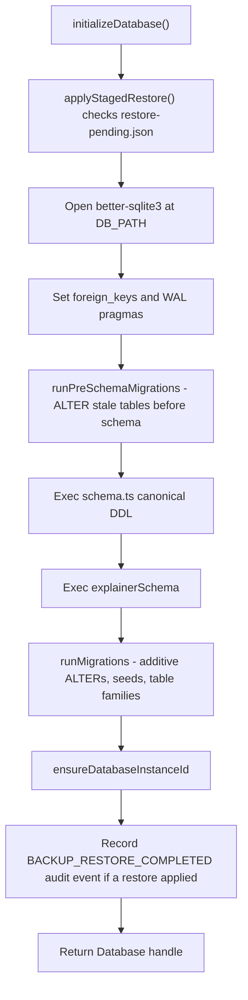
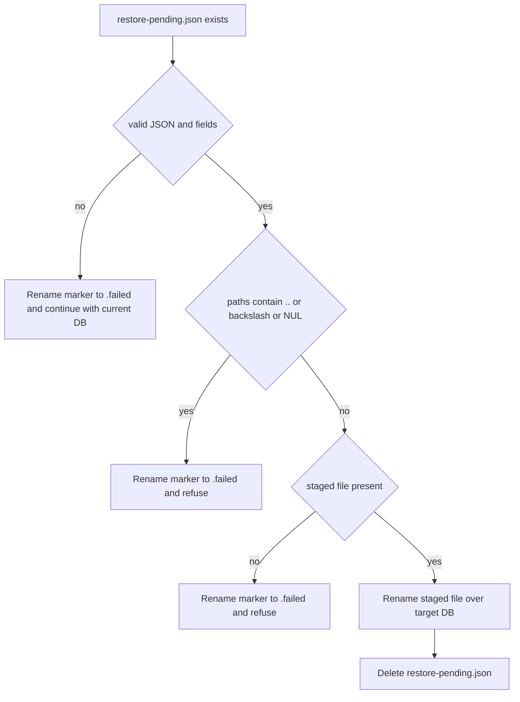
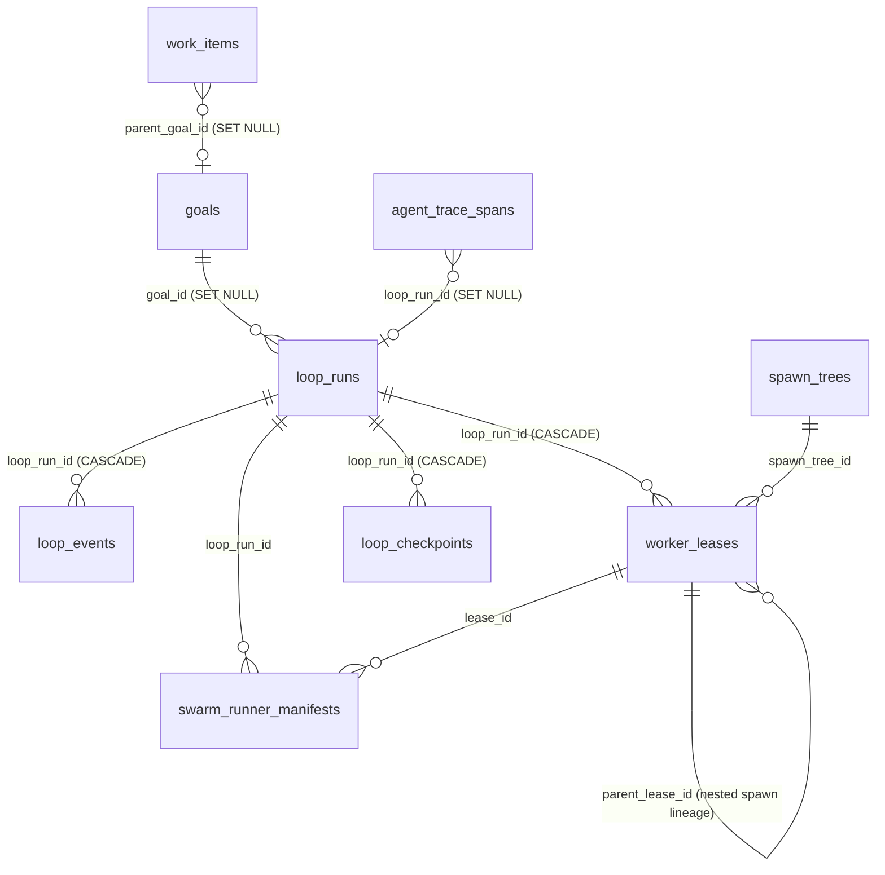

# SQLite Data Model, Migrations & Provenance

Djimitflo Server's persistence layer lives in `packages/server/src/database/`. The production-local database is a single SQLite file opened through `better-sqlite3` (synchronous, single-writer), organized as a canonical CREATE-IF-NOT-EXISTS schema plus a long tail of additive migrations that backfill columns, seed defaults, and rebuild tables whose CHECK constraints grew new statuses. This page covers the boot sequence, the schema families, migration mechanics, the staged-restore flow, and the instance provenance used by assurance checks. For how the server wires services around the database, see `/openwiki/architecture/server-runtime`; for the compliance hash chain semantics, see `/openwiki/concepts/security-model`; for operational backup/restore actions, see `/openwiki/operations/backup-restore`.

## Database file resolution and engine pragmas

`path.ts` is the single source of truth for where the database lives:

- **`resolveDbPath()`** reads `DB_PATH` (preferred) or the legacy `DJIMITFLO_DB`. Relative values are resolved against `INIT_CWD` (npm sets it to the directory where the command was invoked) before falling back to `process.cwd()`.
- Without a configured path, the default is `<monorepo-root>/.data/djimitflo.sqlite`. `monorepoRoot()` strips a trailing `/packages/server` so the `.data` directory is always at repo root regardless of whether the process was started from the server package.
- **`resolveBackupDir()`** applies the same logic to `BACKUP_DIR`, defaulting to `.data/backups`. This is where staged-restore markers land.

`packages/server/.env.example` documents the same contract ("`DB_PATH=./.data/djimitflo.sqlite`" commented out, defaulting to `<project-root>/.data/djimitflo.sqlite`).

On open, `database/index.ts` creates the resolved directory (or the parent of a custom `DB_PATH`), opens the handle with `new Database(DB_PATH, { verbose })` where `verbose` forwards SQL to stdout only when `NODE_ENV=development`, and sets two pragmas that every reader depends on:

```ts
db.pragma('foreign_keys = ON');
db.pragma('journal_mode = WAL');
```

`foreign_keys = ON` is per-connection in SQLite — setting it here is what makes the many `ON DELETE CASCADE` / `ON DELETE SET NULL` rules actually fire. `journal_mode = WAL` gives one writer with concurrent readers and is what the multi-tenancy migration file also re-asserts (`PRAGMA journal_mode = WAL;`). The export surface re-exports `DB_PATH`, `BACKUP_DIR`, and the `Database` class itself so callers can reuse the resolved location without re-deriving it.

> `database-driver.ts` also defines a `SqliteDriver`/`PostgresDriver` abstraction selected by `DATABASE_DRIVER`, but that is a dormant branch in this revision: `index.ts` does not route through it. Treat better-sqlite3 as the operational engine.

## Boot sequence: staged restore → pragmas → pre-schema → schema → migrations → provenance

`initializeDatabase()` in `database/index.ts` is the only entry point used by the server (`bootstrap/recovery.ts`), the seed script, and every maintenance script under `src/scripts/`. Its order of operations is load-bearing:



1. **Staged restore (`applyStagedRestore`)** — see next section.
2. **Pragmas** — `foreign_keys = ON` and `journal_mode = WAL`, described above.
3. **Pre-schema migrations (`runPreSchemaMigrations`)** — a deliberately tiny runner that only ALTERs `token_usage_log`, `explainer_tasks`, `explainer_jobs`, `external_events`, and `messages` to add columns the *canonical schema's indexes* reference. It exists because `CREATE TABLE IF NOT EXISTS` never alters a stale pre-existing table, so a stale table would otherwise crash when the schema's `CREATE INDEX` hits a missing column (`no such column: discussion_id`).
4. **Canonical schema & explainer schema (`db.exec(schema)` / `db.exec(explainerSchema)`)** — `schema.ts` exports the base task/agent/governance/council/audit DDL as one string, and `explainerSchema` as a second string for the repository-explainer pipeline. All statements use `IF NOT EXISTS`, so this stage is idempotent on both fresh and dirty databases.
5. **Migrations (`runMigrations`)** — the additive tail described below.
6. **Provenance (`ensureDatabaseInstanceId`)** — see the provenance section.
7. **Restore audit event** — if a staged restore was just applied, the boot sequence records a `BACKUP_RESTORE_COMPLETED` audit event against the original filename, then clears the in-flight marker state so the event is emitted at most once per boot.

The same module exposes `DB_PATH` / `BACKUP_DIR` constants so operators can see what file is in play from logs (`📦 Opening database at …`).

## Staged restore: restore-pending.json

Restores are never applied in-process. `BackupService` (called from the restore route) first extracts a selected archive into a temp dir, validates it contains `djimitflo.sqlite`, copies it to `<DB_PATH>.restore-pending`, and writes `restore-pending.json` into `BACKUP_DIR` recording the staged path, target path, safety backup name, actor, and the original archive filename (`backup-service.ts`).

On the *next* process start, `applyStagedRestore()` in `database/index.ts` inspects that marker file before the database is opened:



Guards, in order:

- Missing `stagedDbPath` / `targetDbPath` aborts and renames the marker to `restore-pending.json.failed` so it is never retried implicitly.
- NUL bytes are stripped from both paths (a path-traversal guard against embedded-null tricks).
- Any `..` or `\` in either path aborts with the same `.failed` rename — the marker is operator-authored but treated as untrusted input because it flows from request-facing routes.
- If the staged file is absent, the same `.failed` rename leaves the current database untouched.
- Only on full validation does it `renameSync(stagedDbPath, targetDbPath)` and `unlinkSync(restore-pending.json)`.

`BackupService` additionally creates a *safety backup* of the live database before staging the restore, so even a successful apply leaves a rollback point; the marker's `safetyBackupFilename` is surfaced in boot logs and the restore audit event.

## Schema families (schema.ts + migration tables)

`schema.ts` is not one blob but several logical families. Counting tables here is unhelpful — the README cites 165 audited tables, and deployment schemas may differ because services also `ensureTables()` lazily at module init (e.g. `ComplianceAuditService.ensureTables()` in `services/compliance-audit-service.ts` adds `audit_events` chain columns on demand). The important view is by domain:

### Task & agent lifecycle

The center of the row domain. `tasks` carries status, priority, risk level, execution mode, ownership columns added by Phase 55 (`created_by`, `owner_user_id`, `updated_by`), and — notably — **hash-chain columns**: `previous_hash` (default `'genesis'`), `hash`, and `chain_sequence`. `agents`, `messages` (with a partial UNIQUE index on `(from_agent_id, to_agent_id, type, idempotency_key)` for at-most-once delivery), `discussions` / `discussion_proposals` / `discussion_votes` / `discussion_turns`, `instruction_profiles`, `repositories` / `repository_scans` / `repository_health_findings` / `agents_md_files` / `agents_md_issues` / `task_repository_snapshots`, `execution_events`, `task_artifacts`, `file_changes`, `config`, and `token_usage_log` all belong here.

### Governance: approvals, policies, audit chain

`approvals` (status `pending / approved / denied / expired`, request types `tool_call / file_write / shell_command / network_request / high_risk_action`), `approval_policies` seeded by `seedDefaultPolicies()` with four deny-first defaults (allow low-risk tasks, require approval for medium+, deny critical tasks, deny `~/.ssh`/`~/.aws`/`~/.config` paths), `sandbox_policies`, `mcp_servers` / `mcp_tools` / `mcp_tool_permissions`, `risk_assessments`, `policy_violations`, `capability_tokens`, `authority_events` (Kubernetes-style `djimit.io/v1alpha1` lifecycle events with `UNIQUE(correlation_id, sequence)`), `judgments`, and `compliance_reports` round out the governance plane.

`audit_events` is the append-oriented evidence table. Its base DDL lives in `schema.ts` (actor, action, resource, risk level, before/after snapshots); `ComplianceAuditService` extends it with `outcome`, `previous_hash`, `hash`, and `chain_sequence` columns (defaulting `previous_hash` to `'genesis'` on first rows), adds `compliance_audit_log` as a compatibility view filtered to rows with a non-empty hash, and writes entries in `appendEntry()` by computing `sha256` over canonical JSON that includes the previous entry's hash. Migration: legacy rows in a `compliance_audit_log` table are copied over and that table dropped, with `DROP TRIGGER IF EXISTS compliance_audit_no_update / compliance_audit_no_delete` cleaning up the old append-only triggers. **The current code does not create SQLite triggers to enforce append-only on `audit_events`**; enforcement lives in the `ComplianceAuditService` chain hash (`cascade verification` is in `/openwiki/concepts/security-model`). Only INSTEAD OF triggers on the read-only compatibility *view* remain, redirecting inserts to `audit_events` and raising `FAIL` on update/delete of view rows — this is view indirection, not table-level enforcement.

### Loops: runs, leases, spawn trees

The agentic-loop family is created by `createAgenticLoopTables()` in `migrate.ts` and is where most CHECK-constraint churn lives:

- `goals` — objective + constraints + acceptance criteria + risk class + budget (per-mission container); status vocabulary `created / decomposed / running / blocked / completed / failed / cancelled`.
- `loop_runs` — `mode closed|open`, status checked against the constant `LOOP_RUN_STATUSES` in `migrate.ts`, whose full vocabulary is `created / planning / running / verifying / ready_for_human_merge / blocked / completed / failed / escalated / cancelled / interrupted`. `loop-types.ts` mirrors this list one-for-one as the `LoopRunStatus` union type, so the TS type and the SQLite CHECK can never silently diverge (a new status must be added to both or writes are rejected). `ensureLoopRunsReadyStatus()` and `ensureLoopRunsInterruptedStatus()` detect old CHECK lists on existing databases and rebuild `loop_runs` (plus `loop_events`, `worker_leases`, `agent_trace_spans`, `loop_checkpoints`) inside a `foreign_keys = OFF` dance, copying rows between old and new tables — this is how `ready_for_human_merge` and `interrupted` landed on pre-existing installs.
- `loop_events` — leveled run log (`debug / info / warning / error / critical`).
- `worker_leases` — worker role (`planner / maker / checker / security_checker / memory_curator / governance_guard`), runtime, status (`prepared / running / completed / failed / cancelled`), finding, worktree, `budget_json`, and the nested-spawn lineage columns (`parent_lease_id`, `spawn_tree_id`, `depth`, `spawned_by_agent_id`, `capability_id`) added by `createNestedSpawnTables()`. The free-text `metadata` column is where the daemon parks control state that never earned its own column (see *worker_lease metadata conventions* below).
- `work_items` — task candidates with risk class, value score, confidence, and status `candidate / triaged / planned / leased / blocked / done / discarded`.
- `sub_agent_spawns` — audit + budget ledger for nested spawns; `prompt_digest` is `sha256(role|prompt|capability_ids)` used for dedup and cycle guard, with `reject_reason` enumerating `depth_budget_exceeded / cycle_detected / capability_not_live / token_budget_exceeded / wall_budget_exceeded / concurrency_exceeded`.
- `spawn_trees` — cumulative budget per tree; `depth_budget` is operator-armed (`SPAWN_DEPTH_BUDGET`, default `0` = nested spawning off).
- `loop_checkpoints`, `agent_trace_spans` (span types `goal / loop / worker / tool / memory / eval / capability / checkpoint / reflection`), `loop_learning_closures`, `agent_eval_runs`, `openmythos_eval_runs` / `openmythos_case_results` / `openmythos_attestations`, `reflection_candidates`, `calibration_ratings`, `outcome_learning_assessments`, and `authority_events`.

The core loop entity graph looks like this:



*Core loop-family entities and their foreign-key ownership. All relationships through `loop_runs` and `worker_leases` cascade on delete except the `goals` link, which is `SET NULL` so a deleted goal never removes its historical runs.*

### worker_lease metadata conventions

`worker_leases.metadata` is schemaless JSON, but the loop daemon and lifecycle services treat a fixed vocabulary of keys as load-bearing control state:

- **`auto_approved_scope`** — set by the loop daemon's test-gap auto-approve path (`blockForApproval()` / `autoApproveSibling()` in `loop-daemon.ts`) before it approves a maker's pending approval. It records the single test file the approval covered. The verification gate of the same name in `loop-verification-service.ts` then fails the run unless the maker's `changed_files` is exactly that one file, so an auto-approved maker can never broaden its own scope.
- **`retry_root_maker_lease_id` / `retry_of_maker_lease_id` / `retry_attempt`** — retry lineage written by `retryLoopRun()` in `loop-lifecycle-service.ts`. `retryRootFor()` in `loop-service.ts` resolves a maker to its retry root, and the retry budget is enforced by counting maker leases that share a root (`usedRetries >= maxRetries` throws `LOOP_RETRY_BUDGET_EXHAUSTED`). The original maker is stamped `superseded_by_maker_lease_id` + `superseded_at`, which `completionBlockingLeases()` reads to exclude superseded makers from completion.
- **`evolve_sibling_of`** — set when `retryLoopRun()` is called with `sibling: true` (evolve, E13): an extra maker next to a *successful* one rather than a retry after failure, with selection decided later.
- **`bandit`** — when `LOOP_BANDIT_ENABLED` (E12) lets the daemon choose the maker species via `chooseSpecies()` in `runtime-bandit.ts`, the daemon rewrites the lease `runtime` and stores `bandit: { reason, posterior }` (plus `model` when the species fixes one) so the choice is auditable on the lease. A matching `bandit_selected` / `bandit_skipped` loop event is recorded.
- **`approval_id` / `execution_task_id`** — the daemon needs these to resume approval-blocked goals; `blockForApproval()` falls back from lease metadata to the `approvals` table by `task_id` when the checker path never copied the id onto the lease.

`WorkerLeaseRepo.updateStatus()` additionally guarantees a `failure_reason` (derived from `execution_denied_reason`, `runtime_contract_failed_at`, `timed_out`, or non-zero `exit_status`, falling back to `'unspecified: caller supplied no reason'`) before any lease may be written as `failed` — a guard added after 136 production leases failed with no stored reason.

### Worker runner manifests (`swarm_runner_manifests`)

Every worker action the loop service takes is persisted as evidence: `LoopService.recordWorkerManifest()` inserts into `swarm_runner_manifests` (one row per decision, `decision_id` UNIQUE) with the action (`plan / start / skip / fail / stop / kill / complete`), the `loop-runtime-bridge-v1` policy version, the probed `runtime_contract_json`, and capacity/budget snapshots plus `gate_refs` and `blocked_reasons`. Persistence is deliberately best-effort — a manifest failure emits a `worker_manifest_error` warning loop event rather than breaking execution, so evidence collection never makes the loop non-deterministic.

### Knowledge & memory

`memory_candidates` (typed by `store` into `episodic / procedural / semantic / working`, a G8 column added on top of the memory flywheel), `memory_access_log`, `specialist_panels` / `specialist_reviews` (with `UNIQUE(panel_id, specialist_id)`), `knowledge_claims`, `goal_hypotheses`, `strategy_nodes`, `vector_memories` (embedding-JSON store with TTL), `swarm_learning` (the older pattern-ledger), `context_cache`, `consensus_debates` / `consensus_proposals`, `proposal_clusters`, `knowledge_maintenance_runs`, `commons_proposal_reviews`, and the frontier-expert set (`expert_capability_taxonomy`, `expert_identities` with a 13-state lifecycle, `expert_affiliations`, `expert_evidence` with tiering, `expert_capabilities`, `expert_claims`, `expert_claim_relations`, `expert_versions`, `expert_lifecycle_events`, `expert_source_snapshots` — see `createFrontierExpertTables()`).

### Swarm & council

`council_sessions` (modes `fast / review / council`, statuses `diverging / reviewing / synthesizing / completed / failed / escalated`), `council_outputs` (phase `diverge / review / synthesize`), `council_evaluations`, `council_models`, `council_reliability`, and `council_aggregations` (Borda / reciprocal-rank-fusion / Condorcet / weighted variants). Swarm intelligence: `swarm_capabilities`, `swarm_claims` (claim types `observation / hypothesis / decision / memory / capability / backlog / policy`, statuses from `proposed` to `promoted` / `review_required`, plus `contradicts_ref` / `supports_ref` cross-links), `swarm_evidence_edges`, `swarm_runner_manifests` (action `plan / start / skip / fail / stop / kill / complete`), `swarm_missions` / `swarm_tasks` / `swarm_decisions` (decision types `state_transition / route / gate / quorum / split / kill / escalate / review`), `swarm_hypotheses`, `swarm_sessions`, `registry_agents`, `runtime_contract_probes`.

### Explainer pipeline, ops plumbing, and tenancy

The `explainerSchema` block plus `createExplainRepoTables()` own `explainer_tasks`, `explainer_bundles`, `explainer_sections`, `explainer_jobs`, `explainer_feedback`, `human_review_queue`, `explainer_audit_log`, `repository_scan_artifacts`, `discovered_repositories`, `repo_graph_snapshots`. Ops plumbing: `messages`, `board_handoff_claims` / `board_idempotency_keys` / `board_handoff_outbox` (statuses `pending / published / failed`), `event_outbox`, `self_improvements` and its proposal-cluster support tables (`createSelfImprovementTables()` also enforces the partial-unique fingerprint index via a delete of stale live duplicates — the comment there records a production incident where every parked proposal vanished until this was scoped to live statuses only), `provider_configs` from `migrate-phase56.ts`, `sub_agent_tool_outputs` / `sub_agent_scratch`, `agent_archives`, `runtime_contract_probes`, and `system_state` (the `key/value` store the provenance code writes into).

`applyMultiTenancyMigration()` and the `20260823-multi-tenancy-audit-trail.sql` migration introduce `organization_id` columns on `agents`, `loops`, `loop_runs`, `approvals`, and `users`, plus an `organizations` table and a tenant-scoped `audit_logs` envelope. The SQL file sets WAL and creates hash-indexed audit columns (`log_hash`); in current code, that audit shape is superseded by `audit_events` + the `ComplianceAuditService` chain — the SQL file is historical, kept in `migrations/` for reference while the TS migration applies the same columns idempotently.

## Migration runner mechanics

`runMigrations()` in `migrate.ts` is purely additive and idempotent. Its building blocks:

- `ColumnSpec` / `addMissingColumns(db, table, cols)` — each column migration is a `{ name, definition }` `ColumnSpec` entry. `addMissingColumns` reads `PRAGMA table_info`, issues `ALTER TABLE <table> ADD COLUMN <name> <definition>` only for columns not already present, and returns early when the table does not exist yet (fresh databases get the canonical CREATE from the schema string instead, so ALTERs are only ever applied to pre-existing stale tables). This means migrations interleave safely with `schema.ts` on both first boot and upgrade paths.
- `tableSql(db, table)` — selects the original DDL from `sqlite_master` to detect CHECK-constraint drift.
- `createPhaseNNTables()` families — one function per phase so an old database can skip straight to current shape.
- `seedDefaultPolicies()` — only inserts the four deny-first policies when `approval_policies` is empty.
- Rebuild path (`rebuildLoopTables`) — drops and recreates loop tables with widened CHECKs, copying rows; foreign keys are toggled OFF around the rebuild and restored afterwards.
- The multi-tenancy step replays the `20260823` SQL logic inside `applyMultiTenancyMigration()`.
- `seedMCPServers(db)` — upserts the baseline external MCP server inventory (see next section).

`migrate.ts` also exposes a `if (require.main === module)` block so `node migrate.ts` can be used as a standalone migration runner against `resolveDbPath()`. A v2 framework (`migrate-v2.ts`) defines a `schema_migrations` version table plus transactional up/down migrations, but the registered `migrations` array is empty in this revision — every production migration still flows through the additive v1 path.

## Baseline seeding: mcp_servers

`seedMCPServers()` in `seed-mcp-servers.ts` runs on every `runMigrations()` call and upserts **8 seeded external MCP servers** into `mcp_servers`: `research-agent`, `deerflow`, `context7`, `qdrant`, `searxng`, `litellm-mgmt`, `uams-read`, and `knowledge-mcp-bridge`. This is a baseline window, not a one-shot seed — it converges the inventory on every boot so a fresh database starts with the known fleet and an existing one keeps its canonical URLs and probe paths current.

The upsert mechanics are deliberate:

- The insert sets `status = 'unknown'` and empty `command`/`args`/`env`, keyed `ON CONFLICT(name)`. On conflict only `url`, `description`, `metadata`, and `updated_at` are overwritten — so the row's `id`, runtime `status`, `last_ping_at`, and `error_message` (owned by the health checker at request time) are never clobbered by a reboot reseed. The test `seed-mcp-servers.test.ts` pins this: seeding over a server in `error`/`stopped` state leaves that state alone while refreshing URL and metadata.
- **Metadata merge preserves stored keys.** Before each upsert the seed reads the existing row's `metadata`, parses it, and spreads `{ ...stored, ...seeded }`. Seed keys win for the fields the seed owns (`probe_path`, `openapi_path`, `api_url`), but operator- or runtime-added keys the seed does not know about (e.g. an `owner: 'ops'` marker) survive reseeding verbatim.
- **`known_unreachable` marker semantics**: a server can be marked `known_unreachable: true` with a `known_unreachable_reason` when the host is not routable from the deployment (production VPS vs the workstation, where the 192.168.1.28 LAN address is unreachable and only the Tailscale IP 100.81.133.48 answers). Because the merge preserves stored keys, simply *omitting* the key from the seed would leave a stale `true` in place forever; clearing requires explicitly re-seeding `known_unreachable: false` with a null reason (the seed does exactly this for `research-agent` and `uams-read` after the port came back on 2026-09-24).

## Evidence persistence: resolveEvidenceRoot

Database rows are only half the evidence plane. Worker stdout/stderr logs, per-run check output (`checks/<lease>/<script>.stdout.log`), and each run's `LOOP_STATE.md` live on the filesystem under an *evidence root*, written by `LoopService` / `LoopPersistenceService` and later read back by verification (e.g. `worktree_isolation`, `assignment_file_present`, and the proof-attestation check that asserts a stored `stdout_path` still exists).

`resolveEvidenceRoot()` in `loop-service.ts` pins that location in priority order:

1. **`LOOP_EVIDENCE_ROOT`** (absolute override), else
2. **alongside the database** — `dirname(DB_PATH)/agent-evidence/agentic-control-loop-fleet` when `DB_PATH` is set and absolute, else
3. **repo-local fallback** — `<monorepo-root>/.data/agent-evidence/agentic-control-loop-fleet` for local dev.

The DB-adjacent default exists because evidence **must outlive the container**: the 2026-09-24 production incident wrote evidence to the container image's `/.data` and it was lost on every deploy, so verification failed even though runs succeeded. `DB_PATH` lives on the persistent volume in production, so anchoring evidence next to it keeps logs available across redeploys without extra configuration; `LOOP_EVIDENCE_ROOT` remains the explicit escape hatch (and what tests use to sandbox evidence in temp dirs). `evidence-root.test.ts` locks all three branches.

## Instance provenance for assurance

`provenance.ts` is the smallest file in the directory but underpins deployment identity:

- `ensureDatabaseInstanceId(db)` — reads `system_state` key `database_instance_id`; on first boot generates a `randomUUID()` and inserts it. Every subsequent call returns the same id, so a database keeps one stable identity across restarts (covered by `__tests__/database-provenance.test.ts`).
- `getDatabaseProvenance(db)` — returns `{ instance_id, node_id, path, mode, commit_sha }` where `node_id` defaults to hostname (`DJIMITFLO_NODE_ID` overrides), `path` is `resolveDbPath()`, `mode` is `DJIMITFLO_DATA_MODE || 'live'`, and `commit_sha` is `DJIMITFLO_COMMIT_SHA` if set.

The `/api/health/deep` route (`routes/health.ts`) exposes this object to authenticated clients, and `scripts/live-identity-evidence.mjs` (invoked by `npm run assurance:live`) compares the reported `instance_id` against either `DJIMITFLO_EXPECTED_DATABASE_INSTANCE_ID` or the `database_instance_id` found in the local `system_state` table read with `sqlite3 -readonly`. A mismatch fails the check with a remediation hint; a remote target without a configured expectation returns `missing_explicit_configuration` instead of trusting whatever hostname the URL resolves to. `DJIMITFLO_DATA_MODE=live` is also part of the identity contract — anything else blocks the pass.

## Operations notes

- **Backups**: `.data/backups` holds timestamped archives; the safety backup taken before staging a restore is the rollback point documented in `/openwiki/operations/backup-restore`.
- **Seeding dev data**: `seed.ts` calls `initializeDatabase()` and inserts mock agents / tasks; production seeds are limited to `seedDefaultPolicies`, the `mcp_servers` baseline (see above), provider configs, and the frontier-expert taxonomy.
- **Failure modes**: a malformed restore marker leaves the current database untouched and the operator sees `restore-pending.json.failed` in the backups directory; a stale schema whose `CREATE INDEX` would fail is absorbed by `runPreSchemaMigrations` on every boot; and `ComplianceAuditService.ensureTables()` self-heals missing chain columns so a database that was created before the compliance chain still converges.
