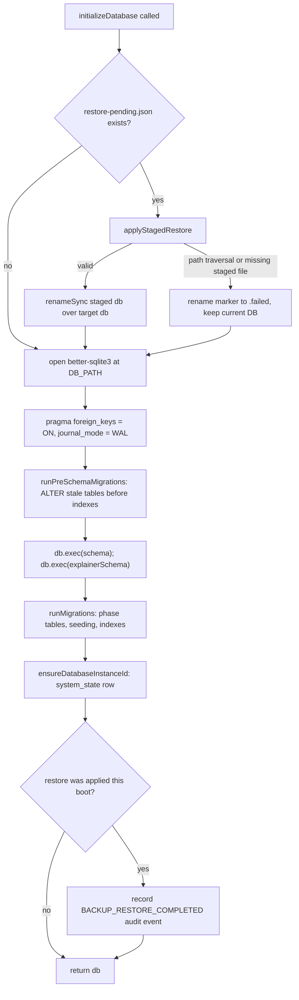

## Overview

Djimitflo persists all state in a single `better-sqlite3` database file (default `.data/djimitflo.sqlite`). Four modules in `packages/server/src/database/` own this layer:

- `path.ts` — resolves the database file path and backup directory from environment variables.
- `schema.ts` — the canonical, idempotent `CREATE TABLE`/`CREATE INDEX` SQL for the base and explainer schemas.
- `migrate.ts` (plus `migrate-v2.ts` and `migrate-phase56.ts`) — additive, layered evolution of that schema on top of `CREATE TABLE IF NOT EXISTS`.
- `provenance.ts` — a stable, random identity for the running database instance, used to detect stale or mismatched deployments.
- `index.ts` — ties these together in `initializeDatabase()`, the single entrypoint the server bootstrap calls to open and prepare the database, including applying a staged restore before the schema is touched.

The backup/restore file format and its checksum verification are implemented in `packages/server/src/services/backup-service.ts` and documented operationally in `docs/backup-restore.md`.

## Path resolution (`database/path.ts`)

- `monorepoRoot(cwd)` walks up from `packages/server` to the repository root so the default data directory is stable regardless of the process's working directory.
- `resolveDbPath(env, cwd)` returns `DB_PATH` or `DJIMITFLO_DB` if set (resolved against `INIT_CWD` when relative), otherwise `<repo>/.data/djimitflo.sqlite`.
- `resolveBackupDir(env, cwd)` returns `BACKUP_DIR` if set, otherwise `<repo>/.data/backups`.

`database/index.ts` uses these to create the data and backup directories on startup if they don't already exist, and exports `DB_PATH`/`BACKUP_DIR` for reuse by other modules (e.g. route wiring for the backup API).

## Schema layering: `schema.ts` → `migrate.ts` → `migrate-v2.ts` / `migrate-phase56.ts`

`schema.ts` exports three SQL template strings:

- `schema` — the base table set (tasks, agents, messages, repositories, `audit_events`, discussions, etc.), each table defined with `CREATE TABLE IF NOT EXISTS` plus its indexes.
- `explainerSchema` — a separate block for the repository-explainer subsystem (`explainer_tasks`, `explainer_bundles`, …).
- `fullSchema` — `schema + explainerSchema` concatenated, used by tooling that wants the whole DDL in one string.

Because SQLite's `CREATE TABLE IF NOT EXISTS` never alters an existing table, `migrate.ts` is the additive migration layer that keeps *already-created* databases in sync with the current schema shape:

- `addMissingColumns(db, table, columns)` reads `PRAGMA table_info(table)` and issues `ALTER TABLE ... ADD COLUMN` only for columns that don't yet exist; it is a no-op if the table doesn't exist yet (the subsequent `db.exec(schema)` will create it fresh with every column).
- A large set of `createPhaseNN*Tables()` functions (phase 42, 43, 44, 52, 55, 56, plus explain-repo, calibration, outcome-learning, frontier-expert, swarm-intelligence, agentic-loop, and other feature groups) each own a self-contained `CREATE TABLE IF NOT EXISTS` block for one feature area, guarded so they are idempotent across repeated startups.
- `runPreSchemaMigrations(db)` runs a small subset of `addMissingColumns` calls (`token_usage_log`, `explainer_tasks`, `explainer_jobs`, `external_events`, `messages`) *before* `db.exec(schema)` is executed, because the schema string's `CREATE INDEX` statements reference columns that must already exist on stale pre-existing tables — indexes fail to create against columns the schema string itself cannot retroactively add.
- `runMigrations(db)` is the main, ordered migration entrypoint called after the schema strings are executed. It chains together column backfills, phase table creation, MCP server seeding (`seedMCPServers`), default approval-policy seeding (`seedDefaultPolicies`), multi-tenancy migration, frontier-expert taxonomy seeding, and finally `createPerformanceIndexes(db)`.

`migrate-v2.ts` is a separate, opt-in **versioned migration framework** layered alongside the legacy additive migrations: it introduces a `schema_migrations` tracking table (`ensureMigrationTable`), `Migration` objects with `up`/`down` functions, `applyMigration` for transactional execution with automatic rollback on failure, and `getCurrentVersion`/`getAppliedMigrations` for status reporting — a Rails-style rollback-capable mechanism distinct from `migrate.ts`'s always-forward, always-idempotent `ALTER`/`CREATE IF NOT EXISTS` approach.

`migrate-phase56.ts` is one example phase module (provider configs and token usage logging) that both creates its tables and calls `addMissingColumns` on `token_usage_log` for columns that may be missing on databases that created the table before those columns existed — the same idempotent-backfill pattern used throughout `migrate.ts`.

### The 165-table audited schema

The project's README states the "audited local schema" contains 165 tables; deployment schemas may differ from this count depending on which optional feature migrations have run and what version of the schema is active. This number is produced by static/table-reachability tooling (`audit:tables`) run against a disposable local database built from `schema.ts` + `migrate.ts`, not a fixed constant enforced by the code — new `createPhaseNN*Tables()` additions grow it over time.

## `initializeDatabase()` flow (`database/index.ts`)

Server bootstrap calls the exported `initializeDatabase(): Database.Database` exactly once at startup. Its steps, in order:

1. **`applyStagedRestore()`** runs *before* the database is even opened. It looks for `restore-pending.json` in `BACKUP_DIR`. If absent, it's a normal boot. If present, it parses the marker JSON and validates it before touching any file:
   - Both `stagedDbPath` and `targetDbPath` must be present.
   - Each path is stripped of NUL bytes, then checked for path traversal: any `..` or backslash in either path causes the restore to be aborted and the marker renamed to `restore-pending.json.failed` (so the invalid marker doesn't retry on every boot). This guards against a crafted or corrupted marker file redirecting the restore outside the intended backup/data directories.
   - The staged file (`<dbPath>.restore-pending`, written by `BackupService.stageRestore`) must exist on disk.
   - If all checks pass, `renameSync` atomically swaps the staged file over the live database path, the marker is deleted, and in-memory flags (`restoreApplied`, `restoreMarkerInfo`) record that a restore just happened, for the audit step later in the same boot.
   - Any failure along this path leaves the current (pre-restore) database untouched and renames the marker to `.failed` rather than looping forever — the restore never partially applies.
2. The database is opened with `new Database(DB_PATH, ...)`, `foreign_keys = ON`, and `journal_mode = WAL` for concurrent read access.
3. `runPreSchemaMigrations(db)` backfills columns needed by index definitions on any pre-existing stale tables, then `db.exec(schema)` and `db.exec(explainerSchema)` create/confirm every table and index.
4. `runMigrations(db)` applies the full additive migration chain (phase tables, seeding, performance indexes) described above.
5. `ensureDatabaseInstanceId(db)` (from `provenance.ts`) guarantees a stable random instance id is persisted in `system_state`.
6. If a restore was applied earlier in this same boot, a `BACKUP_RESTORE_COMPLETED` audit event is recorded via `AuditService`, attributing the restore to the actor recorded in the marker (or `'system'`), and referencing the safety backup filename in its metadata. This step is best-effort: a failure to record the audit event is logged but does not block server startup, and the in-memory restore flags are cleared afterward regardless.

The module also exports `Database`, `BACKUP_DIR`, and `DB_PATH` so other modules (backup routes/services) share the exact same resolved paths as the running server.

## Database instance identity (`database/provenance.ts`)

`provenance.ts` gives each database file a durable, random identity so tooling can tell *which* database a running server (or an MCP client) is actually talking to, distinguishing "the intended production database" from a stale snapshot, a different environment, or a restored copy:

- `ensureDatabaseInstanceId(db)` reads `system_state.database_instance_id`; if absent, it generates a `randomUUID()` and inserts it once. Because it is `INSERT`-only when missing, this id is stable across restarts and across schema migrations, and only changes if the row is dropped or the database itself is replaced (e.g. via restore).
- `getDatabaseProvenance(db)` returns `{ instance_id, node_id, path, mode, commit_sha }`, where `node_id` defaults to `os.hostname()` (or `DJIMITFLO_NODE_ID`), `path` comes from `resolveDbPath()`, `mode` defaults to `'live'` (overridable via `DJIMITFLO_DATA_MODE`, e.g. for snapshots), and `commit_sha` comes from `DJIMITFLO_COMMIT_SHA` if the deployment sets it.

This provenance record is consumed in two operationally important places:

- **`GET /api/health/deep`** (`packages/server/src/routes/health.ts`) embeds `getDatabaseProvenance(db)` under `database` in its authenticated deep-health response, alongside a `buildProvenance()` block derived from build-time env vars (`DJIMITFLO_BUILD_COMMIT`, `DJIMITFLO_BUILD_SOURCE`, etc.) so operators can check whether the *running artifact*, the *runtime commit*, and the *database instance* are mutually consistent.
- **`scripts/live-identity-evidence.mjs`** (the `assurance:live` check) calls `/api/health/deep` remotely and cross-checks its `database.instance_id`/`database.commit_sha`/`database.mode` against an expected instance id — either an explicitly configured `DJIMITFLO_EXPECTED_DATABASE_INSTANCE_ID`, or (for loopback targets only) the id read directly from the local `.data/djimitflo.sqlite` via `sqlite3 ... system_state`. Identity is only considered verified when the working tree is clean, the full 40-character git commit matches the reported `health.commit`, the reported database is in `mode: 'live'`, its `commit_sha` matches, and its `instance_id` matches the expected one with a passing local `PRAGMA integrity_check`. This prevents an assurance run from mistaking a demo/staging/stale database (or a different deployment entirely) for the intended live target.
- **MCP server tooling** builds its own parallel `databaseProvenance(handle)` (`packages/mcp-server/src/db.ts`) from the same `system_state.database_instance_id` row and `DJIMITFLO_COMMIT_SHA`/`DJIMITFLO_NODE_ID` env vars. `requireLiveMode(handle)` throws `DJIMITFLO_LIVE_DATA_REQUIRED` if the handle isn't in live mode, `DJIMITFLO_DATABASE_ID_REQUIRED` if no instance id exists yet, and `DJIMITFLO_DATABASE_ID_MISMATCH:<id>` if `DJIMITFLO_EXPECTED_INSTANCE_ID` is set and disagrees with the observed id — the same "which database is this really?" guard enforced for MCP tool calls. The `djimitflo_mcp_doctor` tool (`packages/mcp-server/src/tools/governance.ts`) surfaces this provenance directly in its diagnostic output and flags a missing `instance_id` as a recommended action ("initialize a persistent database_instance_id before treating this data source as live"), and `djimitflo_get_data_provenance` reports it on demand.

## Append-only audit invariant

`audit_events` (created by `schema.ts`) and its predecessor concept, `compliance_audit_log`, form a hash-chained, append-only audit trail: each row carries `previous_hash`, `hash`, and `chain_sequence` columns so tampering with or reordering history can be detected. `ComplianceAuditService.ensureTables()` (`packages/server/src/services/compliance-audit-service.ts`) enforces this at the SQLite level, not just in application code:

- `BEFORE UPDATE`/`BEFORE DELETE` triggers on `audit_events` (`audit_events_no_update`, `audit_events_no_delete`) call `RAISE(FAIL, ...)`, making any `UPDATE`/`DELETE` against the table fail outright regardless of which code path issues it.
- For backward compatibility, `compliance_audit_log` is kept as a `CREATE VIEW` over `audit_events` (mapping older column names like `actor`/`resource`/`evidence_json`), with `INSTEAD OF INSERT` translating writes into `audit_events`, and `INSTEAD OF UPDATE`/`INSTEAD OF DELETE` triggers that likewise `RAISE(FAIL, 'compliance_audit_log is append-only: ...')`.
- A one-time migration path detects a legacy standalone `compliance_audit_log` table (rather than the view), copies its rows into `audit_events` preserving chain order, then drops the old table and its triggers before recreating the view — so upgrading an older database does not lose chain history.
- `AuditAnchoringService` (`packages/server/src/services/audit-anchoring.ts`) builds on this chain by computing a Merkle root over `compliance_audit_log.hash` values (`computeMerkleRoot()`) and exporting it to an external webhook or SIEM endpoint (`anchorToExternal`) with retry/backoff and a durable `pending`/`confirmed`/`failed`/`dead_letter` delivery state — external anchoring proves HTTP acceptance of the root, not independent WORM retention or remote Merkle verification by the receiving system.

## Backup format and checksum verification

`BackupService` (`packages/server/src/services/backup-service.ts`) implements the backup/restore file format described operationally in `docs/backup-restore.md`.

### Archive layout

Each backup is a `.tar.gz` at `<BACKUP_DIR>/backup-YYYYMMDD-HHMMSS.tar.gz`, matching the strict filename pattern `^backup-\d{8}-\d{6}\.tar\.gz$` (enforced by both `BACKUP_FILENAME_REGEX` and `validateFilename()`, which additionally rejects any filename containing `/`, `\`, `..`, or that differs from its own `basename`). It contains exactly three entries:

| Entry | Contents |
|---|---|
| `manifest.json` | `BackupManifest`: `backupVersion` ("1.0"), `appVersion`, `createdAt`, `databasePath`, per-table row counts and `totalTables`, `databaseSizeBytes`, `databaseSha256`, `createdBy`, `hostname`, `notes`, and fixed confidentiality `warnings` (password hashes/governance evidence included; secrets and repository working trees are not). |
| `djimitflo.sqlite` | A consistent snapshot produced by `better-sqlite3`'s native `db.backup(targetPath)`, not a raw file copy — safe to take while the live database is under concurrent write load. |
| `checksums.sha256` | SHA-256 hashes of `manifest.json` and `djimitflo.sqlite`, in the conventional `sha256sum -c`-compatible two-column format. |

A sidecar `<filename>.manifest.json` is also written directly into `BACKUP_DIR` alongside the archive so `listBackups()`/`getBackupMetadata()` can read metadata without extracting the `.tar.gz`.

### Creation, validation, and restore staging

- **`createBackup()`** writes all three files to a temp directory, computes the database's SHA-256 and per-table row counts (`SELECT COUNT(*) FROM "<table>"` over every non-`sqlite_%` table in `sqlite_master`), packs them into the `.tar.gz`, writes the sidecar manifest, records a `backup_created` audit event, and cleans up the temp directory even on failure.
- **`validateBackup()`** extracts the archive with `extractTarGzSafe` (which rejects symlinks/hardlinks, any entry name containing `/`, `..`, or `\`, duplicate entry names, and any name outside the fixed `EXPECTED_ENTRIES` allow-list — the archive-extraction analog of the restore-marker path guards in `database/index.ts`), then checks: `checksums.sha256` presence and match against recomputed hashes, manifest presence/size/parseability, database file presence, an app-version major-version compatibility check, the manifest's own `databaseSha256` against the extracted file, and finally opens the extracted SQLite file read-only and runs `PRAGMA integrity_check`. Any single failure marks the backup invalid but still returns the itemized list of errors.
- **`stageRestore(filename, { confirm })`** requires the literal string `"RESTORE"` in `confirm`, re-validates the target backup, and — critically — always creates a fresh **safety backup of the current database first** (audited as `backup_pre_restore_created`) before extracting the requested archive to `<dbPath>.restore-pending` and writing `restore-pending.json` (`stagedDbPath`, `targetDbPath`, `safetyBackupFilename`, actor info, `restoreFrom`) into `BACKUP_DIR`. It never modifies the live database file directly; actual replacement only happens the next time `initializeDatabase()`'s `applyStagedRestore()` runs at process startup, so restore always requires a server restart (`restartRequired: true`).

This staged design means the live database is never hot-swapped: a bad restore request fails validation before any file is touched, and even a validated restore only takes effect atomically on the next boot, with a fresh safety backup already sitting alongside it in case the restore itself needs to be undone.

## Related pages

- `/openwiki/architecture/server-bootstrap.md` — how `initializeDatabase()` fits into overall server startup.
- `/openwiki/concepts/audit-compliance-and-evidence.md` — the broader audit/evidence model built on `audit_events`/`compliance_audit_log`.
- `/openwiki/operations/backup-and-restore.md` — operator-facing backup/restore procedures and the REST API surface.
