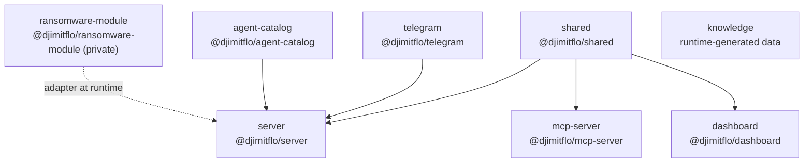

# Monorepo Layout & Package Boundaries

Djimitflo is a TypeScript **npm-workspaces** monorepo. The root `package.json` declares
`"workspaces": ["packages/*"]`, so every directory under `packages/` is a workspace. Seven of
them are real npm packages in the `@djimitflo/*` scope; the eighth, `packages/knowledge/`, has no
`package.json` and is **runtime-generated data, not source**. All seven code packages share the
version `0.5.8` and are `private: true` — nothing is published to a registry; packages are linked
to each other by the workspace protocol (`"@djimitflo/shared": "*"`).

The root is also `private: true` and requires **Node ≥ 22 and < 25**, **npm ≥ 9**.

## Package inventory

| Directory | npm name | Responsibility | Public entrypoint / bin | Exposed surface |
| --- | --- | --- | --- | --- |
| `packages/shared` | `@djimitflo/shared` | Shared types, zod schemas, role/permission constants, JWT helpers, loop catalog — the single source of truth for contracts consumed by every other package. | `dist/index.js` (`exports`: `.` and `./jwt`) | Library only — no runtime surface of its own |
| `packages/server` | `@djimitflo/server` | Main backend: Express 5 + better-sqlite3 + WebSocket gateway, all routes, services, execution engine, loops, and schedulers. | `dist/index.js` (`npm start` → `node dist/index.js`) | **REST/HTTP** on `PORT` (default 3001), **WebSocket** at `/ws`, serves the built dashboard from `DASHBOARD_PATH` |
| `packages/dashboard` | `@djimitflo/dashboard` | React 19 + Vite 8 + Tailwind frontend. Type-only consumer of `@djimitflo/shared` (aliased to `../shared/src` at build time). | `index.html` + Vite build → `dist/` (no `main`; not a library) | The browser UI; dev server proxies `/api` and `/ws` to the server |
| `packages/mcp-server` | `@djimitflo/mcp-server` | MCP server exposing loop orchestration, goals, agents, mission control, governance, and notebooks as MCP tools over stdio or HTTP. | `dist/index.js`; **bin `djimitflo-mcp`** | **MCP** — stdio (default) or HTTP on `--port` (default 3002) |
| `packages/telegram` | `@djimitflo/telegram` | Telegram bot gateway (grammy). Long-polls the Bot API and forwards `/task`, `/status`, `/cancel` into server-side ops via an injected ops object; uses a file-lease so only one host polls a given token. | `dist/index.js` (`main`, ESM) | **Telegram** bots — embedded in the server process, not standalone |
| `packages/agent-catalog` | `@djimitflo/agent-catalog` | Imports, normalizes, statically gates, evaluates, compiles, and activates agency-agents catalog profiles into runtime agents. | `dist/index.js` (`main`) | Library — consumed only by `@djimitflo/server` |
| `packages/ransomware-module` | `@djimitflo/ransomware-module` | Anti-agentic ransomware detection and response (JADEPUFFER-class): indicator service, behavioral/self-narration detectors, response orchestrator, forensic capture, plus a `DjimitfloRansomwareAdapter`. | `dist/index.js` (`main`) | Library — **private**, loosely coupled, integrates via adapter |
| `packages/knowledge` | — (none) | Runtime knowledge/skill bundle (`skills/*.md`). No `package.json`; not built, not published, not a workspace member in any dependency sense. | — | Runtime data directory (see below) |

## Dependency graph



Dependency direction flows **downward toward the leaves**: `shared` is the root of the graph and
depends on nothing else in the repo. `server` is the hub consumer — it is the only package that
depends on `telegram` and `agent-catalog`. `mcp-server` and `dashboard` each depend only on
`shared`. `ransomware-module` has **no workspace dependency edge** in either direction: it is not
imported via `@djimitflo/ransomware-module` anywhere in `server/src`; instead it is attached to the
server at runtime through its adapter (`DjimitfloRansomwareAdapter`), fed by a swarm event bus and
gated by `RANSOMWARE_MODULE_ENABLED` / `RANSOMWARE_MODULE_MODE`. `dashboard` is standalone — no
other package imports it.

## Build order and lockfile shaping

The root `build` script chains workspaces in a fixed order that mirrors the dependency graph so
that typed artifacts exist before their consumers compile:

```
shared → telegram → agent-catalog → mcp-server → ransomware-module → server → dashboard
```

`shared` builds first because everything consumes its `dist/` types; `server` builds only after
`telegram`, `agent-catalog`, and `mcp-server` exist; `dashboard` builds last (it needs `shared`
types but aliases to `../shared/src`, so it does not need `shared/dist` at dev time, only in CI
builds). `type-check` mirrors this order. The root `test` script pre-builds only `shared` and
`agent-catalog` before running the workspace suites, because those two are the ones other packages'
tests import.

The root `package-lock.json` carries a set of **`overrides`** that shape every workspace's resolved
tree: `esbuild`, `postcss`, `fast-uri`, `ip-address`, `nanoid`, `brace-expansion@1`, and `qs`.
These do not change *which* package builds first, but they pin transitive versions (notably the
esbuild/postcss chain behind Vite/Tailwind in `dashboard`, and `qs`/`brace-expansion` under
Express) so the whole graph resolves consistently before the chained `tsc -b` builds run. There
are no per-package lockfiles — `packages/*/package-lock.json` is git-ignored, so the single root
lock plus these overrides is the only place resolution is controlled.

## `packages/knowledge` — runtime data, not source

`packages/knowledge/` contains only `skills/*.md` — the knowledge/skill bundle written and read at
runtime. It is deliberately **not** an npm package: it has no `package.json`, no build, and is not
copied into the production image as source (the Dockerfile only `mkdir -p`s
`/app/packages/knowledge/skills|context|memory` as writable dirs). Server code treats
`packages/knowledge` as the **legacy** OKF location: the canonical runtime base is `OKF_BASE`
(defaulting to the repository-level `knowledge/` directory), and the knowledge-runtime gate
explicitly rejects `packages/knowledge` as `KNOWLEDGE_RUNTIME_PACKAGES_KNOWLEDGE_NOT_CANONICAL`
when it is passed as the canonical base. The content that does live there (e.g.
`loop-*-skill.md`) is read by the loop discovery service as `packages/knowledge/skills/`
context sources.

## Notes for changing the graph

- Adding a new workspace means adding its build line into the root `build`, `type-check`, and
  `test` scripts in the correct position (after everything it imports, before everything that
  imports it). The scripts are hand-ordered — npm does not topologically sort them for you.
- A package that is only ever consumed by `server` keeps the graph a tree and can stay
  `private`; cross-cutting contracts belong in `shared`, which every other package already
  depends on.
- `ransomware-module` demonstrates the adapter pattern for a package that must stay loosely
  coupled: it is built in the pipeline but wired in at runtime, not via an import edge.

See [Server Runtime](./server-runtime.md) for what `@djimitflo/server` boots,
[Runtime Profiles](./runtime-profiles.md) for how its background services are gated, and
[Exposed Surface](../integrations/exposed-surface.md) for the HTTP/WS/MCP endpoints the packages
above expose.
