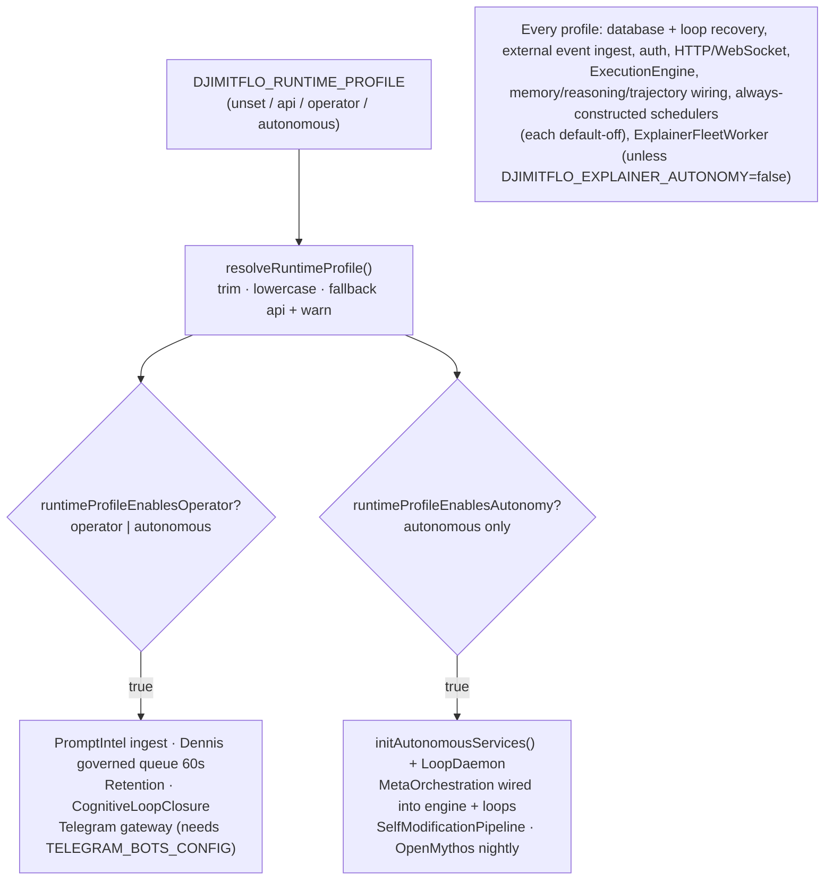

# Runtime Profiles (api / operator / autonomous)

The Djimitflo server boots the same HTTP API, WebSocket gateway, execution engine, and
learning substrate in every deployment, but gates its **background autonomy** behind a
single environment variable, `DJIMITFLO_RUNTIME_PROFILE`. The profile decides which
subsystems are constructed and started during `main()` in `packages/server/src/index.ts`
and its bootstrap modules. It is a startup-only decision: nothing in the profile changes
route registration beyond one constructor-derived flag, and no profile can be switched
without a process restart.

The gating is a documented security invariant: the README lists *"Background workers only
in operator/autonomous profile"* among its tested invariants — an `api`-profile process
never runs the Dennis queue, retention enforcement, the continuous learning loop, or any
of the autonomous janitors, even if their individual env flags are set, because those
construction blocks are simply never reached.

## Resolution

`resolveRuntimeProfile()` in `packages/server/src/config/runtime-profile.ts` reads
`DJIMITFLO_RUNTIME_PROFILE`, trims and lowercases it, and returns one of three values:

| Profile | Operator stack | Autonomy stack |
| --- | --- | --- |
| `api` (default) | no | no |
| `operator` | yes | no |
| `autonomous` | yes | yes |

Two facts matter operationally:

- **Missing or unset variable → `api`.** The default is the smallest, safest footprint.
- **Invalid values warn and fall back to `api`.** A value such as `full-send` logs
  `⚠️ Invalid DJIMITFLO_RUNTIME_PROFILE="full-send", using api` and the server continues
  as `api` rather than crashing or silently escalating capabilities. Case and surrounding
  whitespace are normalized, so `Autonomous` is valid.

Two helpers convert the profile into booleans consumed by `main()`:

- `runtimeProfileEnablesOperator(profile)` is true for `operator` **and** `autonomous`.
- `runtimeProfileEnablesAutonomy(profile)` is true **only** for `autonomous`.

The result is a cumulative model: `autonomous` is a superset of `operator`, never an
alternative to it. There is no way to get the autonomy stack without the operator stack.



*Profile resolution fans out into the operator gate, the autonomy gate (a superset), and
the always-on core stack.*

## Startup sequence and gates

`main()` resolves the profile first, then runs startup in this order:

1. **Database + loop recovery (all profiles).** `initializeDatabase()`, then a shared
   `LoopService` (`recoverySvc`) runs `recoverInterruptedRuns()` to reclaim orphaned
   runs/leases/worktrees. `SelfModelService` is constructed for confidence calibration.
2. **`initExternalEventIngest(db)` runs in every profile.** Despite living in
   `bootstrap/operator-services.ts`, this call at `index.ts` is unconditional: it
   constructs `ExternalEventIngestService`, starts it, and registers it with the
   `lifecycleManager`. It is the one service from the operator bootstrap module that is
   **not** profile-gated.
3. **Operator gate (`operatorRuntime`).** Runs `initOperatorServices(db)`, starts the
   Dennis governed queue timer, starts `RetentionService` + `CognitiveLoopClosureService`,
   and (after the fleet worker, below) starts the Telegram gateway.
4. **Autonomy gate (`autonomousRuntime`).** Runs `initAutonomousServices(db, recoverySvc)`
   and starts the `LoopDaemon`; later wires `MetaOrchestrationService` into the execution
   engine and loop service and kicks the `SelfModificationPipeline`.
5. **Core stack (all profiles).** Auth, Express app, WebSocket service,
   `RuntimeGovernanceService`, `ExecutionEngine` (plus interrupted-task reconciliation),
   memory/reasoning/vector/trajectory wiring, `MultiModelIntelligence` seeding, and the
   always-constructed `ProactiveMemoryService` / `ComplianceAuditService` side effects.
6. **Profile-independent in-process schedulers.** `ComplianceReportScheduler`,
   `SelfHealingScheduler`, `SelfImprovementAutoReviewScheduler`,
   `FrontierExpertScheduler`, `SpecialistPanelBacklogScheduler`, and
   `MemoryCandidateReviewScheduler` are constructed in every profile, but each `start()`
   returns a boolean and self-disarms unless its own env flag is set — they are
   default-off regardless of profile.
7. **Explainer fleet worker (every profile).** See below.

Because `main()` wires `operatorRuntime` into `createRoutes(...)` (consumed by the `/apex`
router), an api-profile process also differs at the HTTP layer, but all other routes are
identical across profiles.

## api profile (default)

The minimal control plane: HTTP API + authenticated WebSocket, execution engine, auth,
learning/memory substrate, external event ingest, the explainer fleet worker, and any
individually-armed default-off schedulers. No Telegram, no retention enforcement, no
Dennis queue, no continuous goals, no self-modification. This is the right profile for a
dashboard- or API-facing instance that should never act on its own.

## operator profile

Everything in `api`, plus the operator-facing automation. The gates are spread across
`bootstrap/operator-services.ts` and inline blocks in `index.ts`:

- **PromptIntel ingestion** (`initOperatorServices`): constructs `PromptIntelService`,
  registers it with the lifecycle manager, and immediately ingests from the pending
  findings file at `PROMPT_INTEL_PENDING` (defaulting to
  `$HOME/.djimit/roborev/paperclip-tasks.pending.jsonl`). Failures are non-fatal.
- **Dennis governed queue** (inline): constructs `DennisAgentService` with the WebSocket
  service, runs `processGovernedQueue()` once at boot and then every 60 s on an unref'd
  timer. The timer is cleared on SIGTERM.
- **RetentionService** (inline): centralized data-lifecycle enforcement, started under
  the same `operatorRuntime` gate as **CognitiveLoopClosureService**.
- **Telegram gateway** (inline): only when `TELEGRAM_BOTS_CONFIG` is set. The
  `@djimitflo/telegram` package is imported dynamically so the operator gate does not
  hard-depend on it at module load. Each bot config is merged with
  `TELEGRAM_ALLOWED_USERS` / `TELEGRAM_USER_MAP` parsing, the gateway dials the local API
  at `http://127.0.0.1:${PORT}/api` via `TelegramApiService`, and `startAll()` failures
  are warnings. The gateway reference is retained so SIGTERM calls `stopAll()` —
  otherwise restart sees `EEXIST` on long-poll leases and silently skips polling.

## autonomous profile

Everything in `operator`, plus the self-driving stack. `initAutonomousServices(db,
recoverySvc)` in `bootstrap/autonomous-services.ts` constructs the bulk of it; `index.ts`
adds the `LoopDaemon`, meta-orchestration wiring, self-modification, and the OpenMythos
nightly eval.

### From `initAutonomousServices`

Every service below sits inside its own try/catch **error boundary**: construction or
start failures are caught and logged as `(non-fatal)` warnings, so one broken subsystem
never blocks the rest of the autonomy stack. The single exception is the learning loop
itself (`ContinuousLearningLoop`, `SwarmIntelligenceService`, `NestedSpawnService`), which
is constructed unguarded. Every interval/timer service that starts is registered with the
`lifecycleManager` under a `serviceName` so shutdown is centralized.

Peripheral services are **default-off**: the profile gate must be open *and* the
service's own env flag must arm it. The table lists the complete bootstrap inventory in
source order.

| Service | Default in autonomous profile | Arming condition |
| --- | --- | --- |
| BoardHandoffService | on | opt-out via `DJIMITFLO_BOARD_HANDOFF_AUTONOMY=false` |
| ContinuousLearningLoop + TrajectoryStore | on | unconditional |
| AgentSocialAutopilotService | off | `SOCIAL_AUTOPILOT_RUNTIME` resolves to a runtime other than `off` |
| CommonsProposalReviewService | off | `COMMONS_PROPOSAL_REVIEW_ENABLED=true` |
| AgentRegistrySyncService | off | `registryUrl()` resolves (`AGENT_REGISTRY_URL` set) |
| EventOutboxService (+ goal bridge) | off | `EVENT_PUBLISH_ENABLED=true` |
| TestGapSourceService | off | `TEST_GAP_SOURCE_ENABLED=true` |
| EvolutionGymService | off | `EVOLUTION_GYM_ENABLED=true` |
| DreamStateService | off | `DREAM_STATE_ENABLED=true` |
| NeedsGroundingTriageService | off | `NEEDS_GROUNDING_TRIAGE_ENABLED=true` |
| DiskGuardService | off | `DISK_GUARD_ENABLED=true` |
| QueueHygieneService | off | `QUEUE_HYGIENE_ENABLED=true` |
| KnowledgeMaintenanceService | off | `KNOWLEDGE_MAINTENANCE_ENABLED=true` |
| SwarmIntelligenceService + NestedSpawnService | on | unconditional |
| NegotiationCoordinator | on | unconditional |
| CapabilityAcquisitionService | on | unconditional |
| MetaEvolutionService | on | unconditional |
| CuriosityService + AutonomousGoalGenerator (+ scheduled-proposal goal timer) | on | unconditional |
| RSI trio (RsiSafetyGuard / ServiceRefactoringAnalyzer / EmergentSpecializationService) | on | unconditional |
| ExpertSwarmOrchestrator + WorkerPool + OkfKnowledgeUpdater | on | unconditional |

What the services do, and the details that matter:

- **BoardHandoffService** — `setInterval` reconcile + outbox publish every 60 s, with a
  re-entrancy flag so overlapping ticks are skipped.
- **ContinuousLearningLoop** (+ `TrajectoryStore`) — always-on in this profile; started
  immediately with an initial `runCycle()` whose rejection is caught as non-fatal.
- **AgentSocialAutopilotService** — Commons residents heartbeat/answer/open rounds
  in-process; skipped when `autopilotConfigFromEnv()` resolves to `runtime === 'off'`
  (the default; `SOCIAL_AUTOPILOT_RUNTIME=ollama` arms it).
- **CommonsProposalReviewService** — advisory review of parked self-improvement
  proposals; the specialist panel remains the gate.
- **AgentRegistrySyncService** — pull-only agent registry sync.
- **EventOutboxService** — publishes `djimitflo.work_item/approval/goal` events onto the
  Djimit event bus, with `bridgeGoalEvents(db)` wiring the goal-event bridge; the
  unsubscribe function is folded into the lifecycle stop hook.
- **TestGapSourceService** — deterministic, fully grounded test-only proposals for
  untested services, max 2/day.
- **EvolutionGymService** — C2 gym: sandbox replay tasks drawn from our own history,
  outcomes feeding species selection; constructed with the shared `recoverySvc`;
  `EVOLUTION_GYM_MAX_PER_DAY` caps attempts (default 12).
- **DreamStateService** — outcome-driven shadow replay of failed runs, classifying their
  causes every 6 h.
- **NeedsGroundingTriageService** — reflection-triage-driven way out of
  `needs_grounding`, every 6 h, max 10 per run.
- **DiskGuardService** — one work item + bus event per day at ≥80 % / ≥90 % data-volume
  usage.
- **QueueHygieneService** — expires consumer-less work items, stale curiosity claims, and
  unvalidated drafts.
- **KnowledgeMaintenanceService** — scheduled OKF drift / wiki delta / OKF lint checks
  projected into work items.
- **SwarmIntelligenceService + NestedSpawnService** — always constructed here; the nested
  spawn service receives `controlUrl` from `DJIMITFLO_CONTROL_URL` (see below).
- **NegotiationCoordinator** — inter-agent `help_request` protocol, started against the
  shared `recoverySvc`.
- **CapabilityAcquisitionService** — autonomous capability growth.
- **MetaEvolutionService** — periodic self-evaluation + capability pruning.
- **AutonomousGoalGenerator + CuriosityService + scheduled-proposal goal timer** —
  curiosity starts and runs an initial `scanForGaps()`; the generator runs after that
  scan resolves and logs generated improvement/security goals. Additionally, an unref'd
  `setInterval` calls `generateFromSelfImprovements()` every
  `SCHEDULED_PROPOSAL_GOALS_INTERVAL_MS` (default 3 600 000 ms, i.e. hourly), registered
  with the lifecycle manager as `ScheduledProposalGoals` — panel-authorised proposals
  become goals continuously instead of waiting for the next restart; each tick is its own
  try/catch.
- **RSI engine trio** — `RsiSafetyGuard`, `ServiceRefactoringAnalyzer`, and
  `EmergentSpecializationService` are constructed for side effects (the refactor /
  safety / specialization engine).
- **ExpertSwarmOrchestrator + WorkerPool + OkfKnowledgeUpdater** — constructed;
  `WorkerPool({ concurrency: 10 })` and the OKF updater are side-effect constructions.

### From `index.ts` under `autonomousRuntime`

- **LoopDaemon** — the continuous goal queue. Critically, it is constructed with the
  *same* `recoverySvc` `LoopService` instance used for boot recovery, so the daemon and
  the API share runtime leases. Poll interval: `GOAL_QUEUE_POLL_MS` (default 5000 ms);
  each goal gets its own swarm/worktree and the AIMD controller bounds global
  concurrency.
- **MetaOrchestrationService** — the self-driving optimization layer connecting the
  learning subsystems. Started, then injected into both `executionEngine` and
  `recoverySvc` via `setMetaOrchestration(...)`, and passed into `createRoutes(...)` —
  API routes receive `undefined` for it in the api/operator profiles.
- **SelfModificationPipeline** — runs `analyze()` and `autoPlan()` once at boot inside
  the autonomy gate.
- **OpenMythosNightlyService** — fills the governance leaderboard; `start()` is
  boolean-returning and default-off, armed only in this profile.

## Profile-independent: the explainer fleet worker

`ExplainerFleetWorker` is constructed and started in **every** profile, including `api`.
The inline comment in `index.ts` records why: an earlier bootstrap-only mount left
explainer jobs idling in api/operator mode (a Codex P1 fix). The worker claims jobs from
`RepoExplainerScheduler`, generates explainer bundles, and runs a slow autonomous drift
check (stale bundles, score regressions, never-published repos) that alerts UAMS.

Two off-switches exist, at different layers:

- **Boot-time opt-out:** `DJIMITFLO_EXPLAINER_AUTONOMY=false` skips construction entirely
  (logged as an info line).
- **Runtime kill-switch:** the scheduler's paused flag is persisted in the `config` table
  under `explainer_scheduler_paused`; `tick()` and `checkDrift()` both consult
  `isPaused()`, so pausing survives restarts and works in every profile. The worker is
  also stopped explicitly in the SIGTERM handler.

## DJIMITFLO_CONTROL_URL derivation

Before `main()` runs, `index.ts` derives a default nested-spawn control URL when the
operator has not set `DJIMITFLO_CONTROL_URL`:

```
http://<dialHost>:<PORT>/api/swarms/spawns
```

where `dialHost` is `127.0.0.1` whenever `HOST` is `0.0.0.0` or `localhost`, and `HOST`
otherwise. The comment spells out the invariant: **`0.0.0.0` is a bind address, not a
dial address** — a nested-spawned runtime child on the same host must call back over the
loopback to reach `POST /api/swarms/spawns`. Operators override the variable explicitly
for topologies where loopback is wrong (e.g. Docker, where the child needs the
container's reachable address). `initAutonomousServices` passes this value into
`NestedSpawnService`, which writes it into every prepared nested lease so children
inherit it — meaning the derivation happens in all profiles even though nested spawning
itself is an autonomous-profile feature.

## Secondary gates orthogonal to the profile

The profile is a coarse gate; several subsystems require an additional, independent flag:

- **`DJIMITFLO_FRONTIER_EXPERTS_ENABLED`** gates the frontier-experts feature in three
  places: `FrontierExpertScheduler.start()` (which additionally needs
  `FRONTIER_EXPERTS_SCHEDULER_ENABLED=true`), the expert-swarm orchestrator's frontier
  expert selection, and the swarms API (409 `FRONTIER_EXPERTS_DISABLED` when off). The
  scheduler is constructed in every profile but never arms without the base flag.
- The other always-constructed schedulers (compliance reports, self-healing,
  self-improvement auto-review, specialist-panel backlog, memory-candidate review) are
  likewise default-off and individually armed, per their service headers.
- Within the autonomous stack, most peripheral services are default-off behind their own
  `*_ENABLED`-style helpers (`eventPublishEnabled`, `testGapSourceEnabled`,
  `gymEnabled`, `dreamStateEnabled`, `needsGroundingTriageEnabled`, `diskGuardEnabled`,
  `queueHygieneEnabled`, `maintenanceEnabled`), so flipping to `autonomous` enables the
  core loop/meta/RSI machinery while the peripheral janitors remain opt-in. See the
  inventory table above for the exact env var per service.

## Failure and lifecycle invariants

- **Non-fatal autonomy bootstrap.** Every block in `initAutonomousServices` and the
  autonomous blocks of `main()` wrap construction/start in try/catch and log a
  warn-and-continue line; a failed scheduler never prevents the HTTP API from coming up.
  The exceptions are the autonomy core (`ContinuousLearningLoop`,
  `SwarmIntelligenceService`, `NestedSpawnService`), which are constructed unguarded.
- **Graceful shutdown.** SIGTERM stops the fleet worker, closes WebSocket clients (with a
  5 s terminate deadline), clears the Dennis queue timer, and calls
  `telegramGateway.stopAll()` so Telegram long-poll leases are released before exit.
- **Focused tests.** `packages/server/src/__tests__/runtime-profile.test.ts` pins the
  resolution contract: default `api`, invalid-value fallback (`full-send` → `api`), and
  the exact operator/autonomy truth table for all three profiles.
