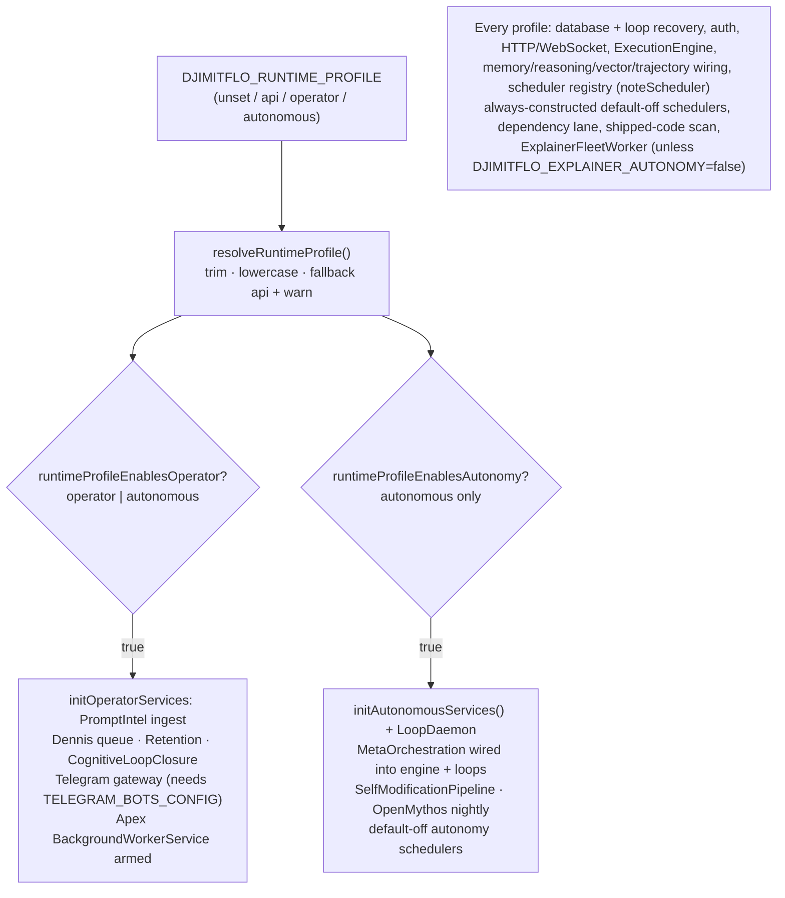

# Runtime Profiles (api / operator / autonomous)

The Djimitflo server boots the same HTTP API, WebSocket gateway, execution engine, and
learning substrate in every deployment, but gates its **background autonomy** behind a
single environment variable, `DJIMITFLO_RUNTIME_PROFILE`. The profile decides which
subsystems are constructed and started during `main()` in `packages/server/src/index.ts`
and its bootstrap modules. It is a startup-only decision: the only profile-derived value
reaching route registration is the `operatorRuntime` boolean handed to `createRoutes(...)`
(which the `/apex` router uses to decide whether its `BackgroundWorkerService` may run),
and no profile can be switched without a process restart.

## Resolution

`resolveRuntimeProfile()` in `packages/server/src/config/runtime-profile.ts` reads
`DJIMITFLO_RUNTIME_PROFILE`, trims and lowercases it, and returns one of three values:

| Profile | Operator stack | Autonomy stack |
| --- | --- | --- |
| `api` (default) | no | no |
| `operator` | yes | no |
| `autonomous` | yes | yes |

Two facts matter operationally:

- **Missing or unset variable → `api`.** The default is the smallest, safest footprint.
- **Invalid values warn and fall back to `api`.** A value such as `full-send` logs
  `⚠️ Invalid DJIMITFLO_RUNTIME_PROFILE="full-send", using api` and the server continues
  as `api` rather than crashing or silently escalating capabilities. Case and surrounding
  whitespace are normalized, so `Autonomous` is valid.

Three functions in `config/runtime-profile.ts` carry the whole enablement model:

- `resolveRuntimeProfile(env)` → one of `'api' | 'operator' | 'autonomous'`.
- `runtimeProfileEnablesOperator(profile)` → true for **`operator` and `autonomous`**.
- `runtimeProfileEnablesAutonomy(profile)` → true for **`autonomous` only**.

The result is a cumulative model: `autonomous` is a superset of `operator`, never an
alternative to it. There is no way to get the autonomy stack without the operator stack.


```mermaid
flowchart TD
    ENV["DJIMITFLO_RUNTIME_PROFILE<br/>(unset / api / operator / autonomous)"] --> RES["resolveRuntimeProfile()<br/>trim · lowercase · fallback api + warn"]
    RES --> OP{"runtimeProfileEnablesOperator?<br/>operator | autonomous"}
    RES --> AU{"runtimeProfileEnablesAutonomy?<br/>autonomous only"}
    OP -->|true| OPSVCS["initOperatorServices: PromptIntel ingest<br/>Dennis queue · Retention · CognitiveLoopClosure<br/>Telegram gateway (needs TELEGRAM_BOTS_CONFIG)<br/>Apex BackgroundWorkerService armed"]
    AU -->|true| AUSVCS["initAutonomousServices() + LoopDaemon<br/>MetaOrchestration wired into engine + loops<br/>SelfModificationPipeline · OpenMythos nightly<br/>default-off autonomy schedulers"]
    ALL["Every profile: database + loop recovery, auth, HTTP/WebSocket, ExecutionEngine,<br/>memory/reasoning/vector/trajectory wiring, scheduler registry (noteScheduler)<br/>always-constructed default-off schedulers, dependency lane, shipped-code scan,<br/>ExplainerFleetWorker (unless DJIMITFLO_EXPLAINER_AUTONOMY=false)"]
```

*Profile resolution fans out into the operator gate, the autonomy gate, and the stack that runs in every profile.*

## Startup sequence and gates

`main()` (index.ts L85) resolves the profile first (L87–L89), then starts up in this order:

1. **Database + loop recovery (all profiles).** `initializeDatabase()` (L94), then a shared
   `LoopService` (`recoverySvc`) runs `recoverInterruptedRuns()` to reclaim orphaned
   runs/leases/worktrees. `SelfModelService` is constructed for confidence calibration.
2. **`initExternalEventIngest(db)` runs in every profile** (L116). Despite living in
   `bootstrap/operator-services.ts`, this call is unconditional: it constructs
   `ExternalEventIngestService`, starts it, and registers it with the `lifecycleManager`.
   It is the one service from the operator bootstrap module that is **not** profile-gated.
3. **Operator gate (`operatorRuntime`, L117).** Runs `initOperatorServices(db)`; later in
   the boot the same flag arms the Dennis governed queue timer (L199), `RetentionService` +
   `CognitiveLoopClosureService` (L241), and the Telegram gateway (L348, also needing
   `TELEGRAM_BOTS_CONFIG`).
4. **Autonomy gate (`autonomousRuntime`, L118–L128).** Runs
   `initAutonomousServices(db, recoverySvc)` and starts the `LoopDaemon`; later wires
   `MetaOrchestrationService` into the execution engine and loop service (L258–L262),
   kicks the `SelfModificationPipeline` (L263–L265), and arms `OpenMythosNightlyService`
   when its boolean `start()` returns true (L275).
5. **Core stack (all profiles).** Auth (with `bootstrapAdmin()`), Express app, WebSocket
   service, `RuntimeGovernanceService`, `ExecutionEngine` (plus interrupted-task
   reconciliation), memory/reasoning/vector/trajectory wiring, `MultiModelIntelligence`
   seeding, and the always-constructed `ProactiveMemoryService` / `ComplianceAuditService`
   side effects (L271–L272).
6. **Profile-independent in-process schedulers (L279–L323).** `ComplianceReportScheduler`,
   `SelfHealingScheduler`, `SelfImprovementAutoReviewScheduler`,
   `FrontierExpertScheduler`, `SpecialistPanelBacklogScheduler`,
   `MemoryCandidateReviewScheduler`, plus the function-style dependency lane
   (`startDependencyLane`, `DEPENDENCY_LANE_MODE`) and shipped-code scan
   (`startShippedCodeScan`, `SHIPPED_CODE_SCAN_MODE`) are constructed in every profile,
   but each `start()`/starter returns a boolean and self-disarms unless its own env flag
   is set — they are default-off regardless of profile.
7. **Explainer fleet worker (every profile, L331–L346).** See below.

Each scheduler start is wrapped in `noteScheduler(name, flag, armed, intervalMs)`, which
records the name, arming flag, interval, and armed state in the in-memory
`services/scheduler-registry.ts` and returns the armed value unchanged. With later
`markRun(...)` ticks, this powers `GET /api/health/schedulers` (`manage:config`) and the
operator cockpit so an operator can see which schedulers are armed and whether armed ones
actually tick — without SSH. The registry is in-memory and rebuilt at every boot.

> `packages/server/src/bootstrap/core-services.ts` also references both profile flags, but
> no live entrypoint imports it — `main()` in `index.ts` is the sole production boot path.

## api profile (default)

The minimal control plane: HTTP API + authenticated WebSocket, execution engine, auth,
learning/memory substrate, external event ingest, the explainer fleet worker, and any
individually-armed default-off schedulers. No Telegram, no retention enforcement, no
Dennis queue, no continuous goals, no self-modification. This is the right profile for a
dashboard- or API-facing instance that should never act on its own.

## operator profile

Everything in `api`, plus the operator-facing automation. The gates are spread across
`bootstrap/operator-services.ts` and inline blocks in `index.ts`:

- **PromptIntel ingestion** (`initOperatorServices`): constructs `PromptIntelService`,
  registers it with the lifecycle manager, and immediately ingests from the pending
  findings file at `PROMPT_INTEL_PENDING` (defaulting to
  `$HOME/.djimit/roborev/paperclip-tasks.pending.jsonl`). Failures are non-fatal.
- **Dennis governed queue** (index.ts L199–L211): constructs `DennisAgentService` with the
  WebSocket service, runs `processGovernedQueue()` once at boot and then every 60 s on an
  unref'd timer. The timer is cleared on SIGTERM.
- **RetentionService** (L241–L246): centralized data-lifecycle enforcement, started under
  the same `operatorRuntime` gate as **CognitiveLoopClosureService**.
- **Telegram gateway** (L348–L366): only when `TELEGRAM_BOTS_CONFIG` is set. The
  `@djimitflo/telegram` package is imported dynamically so the operator gate does not
  hard-depend on it at module load. Each bot config is merged with
  `TELEGRAM_ALLOWED_USERS` / `TELEGRAM_USER_MAP` parsing, the gateway dials the local API
  at `http://127.0.0.1:${PORT}/api` via `TelegramApiService`, and `startAll()` failures
  are warnings. The gateway reference is retained so SIGTERM calls `stopAll()` —
  otherwise a restart sees `EEXIST` on long-poll leases and silently skips polling.
- **Apex background workers**: `createRoutes(...)` receives `operatorRuntime` (L326) and
  passes it to the `/apex` router as `enableBackgroundWorkers`; only then does
  `BackgroundWorkerService.startAll()` run, because in api profile its cleanup/archival
  mutations would violate the mutation-free guarantee.

## autonomous profile

Everything in `operator`, plus the self-driving stack. `initAutonomousServices(db,
recoverySvc)` in `bootstrap/autonomous-services.ts` constructs the bulk of it; `index.ts`
adds the `LoopDaemon`, meta-orchestration wiring, self-modification, and the OpenMythos
nightly eval.

### From `initAutonomousServices`

Unless noted, construction failures are caught and logged as non-fatal warnings, so one
broken subsystem never blocks the rest of the stack.

- **BoardHandoffService** (L47–L67) — `setInterval` reconcile + outbox publish every
  60 s, with a re-entrancy flag so overlapping ticks are skipped. Own opt-out:
  `DJIMITFLO_BOARD_HANDOFF_AUTONOMY=false`.
- **ContinuousLearningLoop** (+ `TrajectoryStore`, L72–L78) — always-on in this profile;
  started immediately with an initial `runCycle()`. **Unguarded**: construction is not
  wrapped in try/catch.
- **AgentSocialAutopilotService** (L82–L88) — Commons residents heartbeat/answer/open
  rounds in-process; skipped when `autopilotConfigFromEnv()` resolves to
  `runtime === 'off'`.
- **CommonsProposalReviewService** (L95) — advisory review of parked self-improvement
  proposals; default off behind `commonsReviewEnabled()`
  (`COMMONS_PROPOSAL_REVIEW_ENABLED=true`).
- **AgentRegistrySyncService** (L106) — pull-only agent registry sync; only when
  `registryUrl()` resolves (`AGENT_REGISTRY_URL`).
- **EventOutboxService** (L118) — publishes `djimitflo.work_item/approval/goal` events
  onto the Djimit event bus, with `bridgeGoalEvents(db)` wiring the goal-event bridge;
  default off behind `eventPublishEnabled()` (`EVENT_PUBLISH_ENABLED=true`).
- **SwarmIntelligenceService + NestedSpawnService** (L287–L288) — always constructed here
  and **unguarded** like the learning loop; the nested spawn service receives `controlUrl`
  from `DJIMITFLO_CONTROL_URL` (see below).
- **NegotiationCoordinator** (L290–L297) — inter-agent `help_request` protocol, started
  against the shared `recoverySvc`.
- **CapabilityAcquisitionService** (L299–L306) — autonomous capability growth.
- **MetaEvolutionService** (L308–L315) — periodic self-evaluation + capability pruning.
- **AutonomousGoalGenerator + CuriosityService** (L317–L343) — curiosity starts and runs
  an initial `scanForGaps()`; the generator runs after that scan resolves. A dedicated
  hourly interval (`SCHEDULED_PROPOSAL_GOALS_INTERVAL_MS`, default 1 h, always-on with
  autonomy) re-runs `generateFromSelfImprovements()` so panel-authorised scheduled
  proposals do not wait for a restart to become goals.
- **RSI engine trio** (L345–L355) — `RsiSafetyGuard`, `ServiceRefactoringAnalyzer`, and
  `EmergentSpecializationService` are constructed for side effects.
- **ExpertSwarmOrchestrator + WorkerPool + OkfKnowledgeUpdater** (L357–L366) —
  constructed; `WorkerPool({ concurrency: 10 })` and the OKF updater are side-effect
  constructions.

### Default-off autonomy schedulers armed only in this profile

All of the following live inside `initAutonomousServices`, so they exist only in the
`autonomous` profile — but each still requires its own env flag; flipping the profile
alone leaves them off:

| Scheduler | Flag | Cadence / behaviour |
| --- | --- | --- |
| TestGapSourceService | `TEST_GAP_SOURCE_ENABLED=true` | deterministic test-only proposals for untested services, max 2/day |
| DeadCodeSourceService | `DEAD_CODE_LANE_ENABLED=true` | removal proposals for unused files / dormant routes, max `DEAD_CODE_MAX_PER_DAY` (2)/day |
| EvolutionGymService | `EVOLUTION_GYM_ENABLED=true` | sandbox replay of history tasks, max `EVOLUTION_GYM_MAX_PER_DAY` (12)/day |
| DreamStateService | `DREAM_STATE_ENABLED=true` | shadow failure-cause replay every 6 h |
| NeedsGroundingTriageService | `NEEDS_GROUNDING_TRIAGE_ENABLED=true` | reflection-triage way out of `needs_grounding`, every 6 h, max 10/run |
| DiskGuardService | `DISK_GUARD_ENABLED=true` | one work item + bus event/day at ≥80 % / ≥90 % data-volume usage |
| QueueHygieneService | `QUEUE_HYGIENE_ENABLED=true` | expires consumer-less work items, stale curiosity claims, unvalidated drafts |
| KnowledgeMaintenanceService | `KNOWLEDGE_MAINTENANCE_ENABLED=true` | OKF drift / wiki delta / OKF lint projected into work items |
| interest feedback | `FEEDBACK_INTERESTS_ENABLED=true` | daily `djimitflo.feedback.interests` profile for fleet scouts |
| dream evolution | `DREAM_EVOLUTION_ENABLED=true` | daily maker-genome mutants judged on the frozen gym holdout (hourly tick) |
| evolution estimators | `EVOLUTION_ESTIMATORS_ENABLED=true` | nightly evolution estimates, one row per estimator/scope/UTC day |
| committee evolution | `COMMITTEE_SWARM_ENABLED=true` | committee members evolve on real-outcome skill (extinction n ≥ 30, one child/day) |
| merge survival | `MERGE_SURVIVAL_ENABLED=true` | loop draft PRs settled by merge + 14 days in main → skill outcomes, every 6 h |
| loop auto-merge | `LOOP_AUTO_MERGE_TEST_ONLY=shadow`<br/>or `=act` | earned, self-revoking auto-merge of verified test-only loop PRs, every 15 min |
| stall watch | `STALL_WATCH_ENABLED=true` | hourly log line per silent stall (detection endpoint runs regardless) |

Function-style starters (`startInterestFeedback`, `startDreamEvolution`,
`startEvolutionEstimators`, `startCommitteeEvolution`, `startMergeSurvival`,
`startLoopAutoMerge`, `startStallWatch`) return a stop callback when armed and `null`
when their flag is off; the callback is registered with the `lifecycleManager`. Each
armed state is also mirrored into the scheduler registry via `noteScheduler(...)` with
its flag name and interval, so the `/api/health/schedulers` view names the exact env var
that would arm each lane.

Every interval/timer service constructed in this bootstrap is registered with the
`lifecycleManager` under a `serviceName` so shutdown is centralized.

### From `index.ts` under `autonomousRuntime`

- **LoopDaemon** (L118–L128) — the continuous goal queue. Critically, it is constructed
  with the *same* `recoverySvc` `LoopService` instance used for boot recovery, so the
  daemon and the API share runtime leases. Poll interval: `GOAL_QUEUE_POLL_MS` (default
  5000 ms); each goal gets its own swarm/worktree and the AIMD controller bounds global
  concurrency.
- **MetaOrchestrationService** (L258–L262) — the self-driving optimization layer
  connecting the learning subsystems. Started, then injected into both `executionEngine`
  and `recoverySvc` via `setMetaOrchestration(...)`, and passed into
  `createRoutes(...)` (L326) — API routes receive `undefined` for it in the api/operator
  profiles.
- **SelfModificationPipeline** (L263–L265) — runs `analyze()` and `autoPlan()` once at
  boot inside the autonomy gate.
- **OpenMythosNightlyService** (L275) — fills the governance leaderboard; `start()` is
  boolean-returning and default-off (`OPENMYTHOS_NIGHTLY_ENABLED=true`, plus
  `OPENMYTHOS_NIGHTLY_MODELS`), armed only in this profile.

## Profile-independent: the explainer fleet worker

`ExplainerFleetWorker` is constructed and started in **every** profile, including `api`
(index.ts L331–L346). The inline comment records why: an earlier bootstrap-only mount
left explainer jobs idling in api/operator mode (a Codex P1 fix). The worker claims jobs
from `RepoExplainerScheduler`, generates explainer bundles, and runs a slow autonomous
drift check (stale bundles past `DJIMITFLO_STALENESS_DAYS`, score regressions ≥ 15
points, never-published repos) on its own timer that alerts UAMS.

Two off-switches exist, at different layers:

- **Boot-time opt-out:** `DJIMITFLO_EXPLAINER_AUTONOMY=false` skips construction entirely
  (logged as an info line).
- **Runtime kill-switch:** the scheduler's paused flag is persisted in the `config` table
  under `explainer_scheduler_paused`; `tick()` and `checkDrift()` both consult
  `isPaused()`, so pausing survives restarts and works in every profile. The worker is
  also stopped explicitly in the SIGTERM handler.

## DJIMITFLO_CONTROL_URL derivation

Before `main()` runs, `index.ts` (L75–L83) derives a default nested-spawn control URL
when the operator has not set `DJIMITFLO_CONTROL_URL`:

```
http://<dialHost>:<PORT>/api/swarms/spawns
```

where `dialHost` is `127.0.0.1` whenever `HOST` is `0.0.0.0` or `localhost`, and `HOST`
otherwise. The comment spells out the invariant: **`0.0.0.0` is a bind address, not a
dial address** — a nested-spawned runtime child on the same host must call back over the
loopback to reach `POST /api/swarms/spawns`. Operators override the variable explicitly
for topologies where loopback is wrong (e.g. Docker, where the child needs the
container's reachable address). `initAutonomousServices` (autonomous-services.ts L288)
passes this value into `NestedSpawnService`, and the service resolves
`options.controlUrl || process.env.DJIMITFLO_CONTROL_URL` in its constructor, writing it
into every prepared nested lease so children inherit it — meaning the derivation happens
in all profiles even though nested spawning itself is an autonomous-profile feature.

## Secondary gates orthogonal to the profile

The profile is a coarse gate; several subsystems require an additional, independent flag:

- **`DJIMITFLO_FRONTIER_EXPERTS_ENABLED`** gates the frontier-experts feature in three
  places: `FrontierExpertScheduler.start()` (which additionally needs
  `FRONTIER_EXPERTS_SCHEDULER_ENABLED=true`), the expert-swarm orchestrator's frontier
  expert selection (unless `expertSelection.force` is passed), and the swarms API
  (409 `FRONTIER_EXPERTS_DISABLED` when off). The scheduler is constructed in every
  profile but never arms without the base flag.
- The other always-constructed schedulers (compliance reports, self-healing,
  self-improvement auto-review, specialist-panel backlog, memory-candidate review) are
  likewise default-off and individually armed, per their service headers, as are the
  dependency lane and shipped-code scan.
- Within the autonomous stack, all fifteen peripheral schedulers listed above are
  default-off behind their own `*_ENABLED`-style helpers, so flipping to `autonomous`
  enables the core loop/meta/RSI machinery while the peripheral janitors and evolution
  lanes remain opt-in.
- Every one of these flags is legible at runtime: each arming point reports through
  `noteScheduler(...)`, so `GET /api/health/schedulers` shows name, flag, interval, and
  armed/tick status for the running process.

## Failure and lifecycle invariants

- **Non-fatal autonomy bootstrap.** Almost every block in `main()` and
  `initAutonomousServices` wraps construction/start in try/catch and logs a warning; a
  failed scheduler never prevents the HTTP API from coming up. The exceptions are the
  autonomy core (`ContinuousLearningLoop`, `SwarmIntelligenceService`,
  `NestedSpawnService`), which are constructed unguarded.
- **Graceful shutdown.** SIGTERM (index.ts L415–L435) stops the fleet worker, closes
  WebSocket clients with code 1001 (with a 5 s terminate deadline for stragglers), clears
  the Dennis queue timer, and calls `telegramGateway.stopAll()` so Telegram long-poll
  leases are released before exit. Interval services register their stop callbacks with
  the shared singleton `lifecycleManager`, which stops registered services in reverse
  initialization order when its own `initSignalHandlers` path is used.
- **Focused tests.** `packages/server/src/__tests__/runtime-profile.test.ts` pins the
  resolution contract: default `api`, invalid-value fallback (`full-send` → `api`), and
  the exact operator/autonomy truth table for all three profiles.
