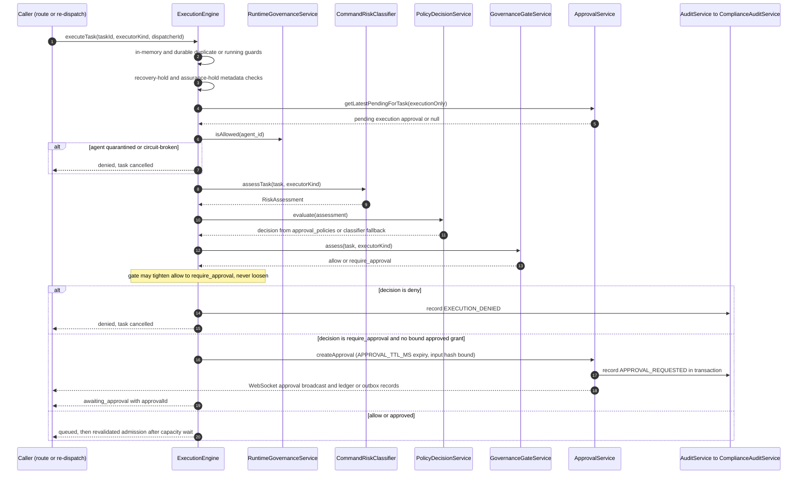

# Governance Pipeline: Policy, ToolBroker, Approvals & Audit Chain

Every task dispatch in `packages/server` passes through the same governance spine
before an executor is allowed to start. The spine runs inside
`ExecutionEngine.executeTask()`
(packages/server/src/execution/execution-engine.ts) and composes five services:

1. **CommandRiskClassifier** — turns task text or an explicit shell command into a
   `RiskAssessment` (risk level + recommended decision).
2. **PolicyDecisionService** — evaluates enabled rows of `approval_policies` against
   that assessment, honoring blocked-tool lists and ReDoS-guarded match patterns.
3. **GovernanceGateService** — an optional, env-armed layer that can only *tighten*
   an `allow` to `require_approval` when the executing agent's OpenMythos benchmark
   score is below a floor. It never loosens.
4. **ToolBroker** — per-tool-call default-deny evaluation issuing durable, scoped
   capability tokens; currently an opt-in boundary for callers that mediate tool
   calls explicitly, not something CLI executors enforce internally.
5. **ApprovalService** — the approval lifecycle (configurable TTL defaulting to 1
   hour, transaction-wrapped create/decide, data-layer self-approval ban) plus
   authority-ledger and event-outbox side records.

Every meaningful transition in the pipeline — requested, granted, denied, expired —
is appended to the hash-chained `audit_events` log through the AuditService façade
over ComplianceAuditService, and optionally anchored externally by
AuditAnchoringService.

## Preflight order in executeTask

`executeTask()` consults the pipeline in a fixed order, and the order itself is a
security property: cheap structural holds run before any policy work, and every gate
failure is persisted as an event and/or audit row before the method returns or throws.

*The decision flow every task dispatch traverses; the same pipeline re-runs verbatim
after any concurrency-capacity wait and on every fallback-executor admission.*

Concretely, inside `executeTask()`:

1. **Duplicate/running guards** — in-memory `activeSessions`/`pendingExecutions` and a
   durable `running` status check (packages/server/src/execution/execution-engine.ts#L249-L261).
2. **Recovery-hold checks** — `metadata.execution_recovery_hold === true` set by
   startup reconciliation throws `EXECUTION_RECOVERY_REQUIRED` (L270-L272), and
   `metadata.deep_agent_assurance_hold === true` throws `DEEP_AGENT_ASSURANCE_HOLD`
   (L274-L276).
3. **Pending approval check** — `approvalService.getLatestPendingForTask(taskId,
   { executionOnly: true })` throws "Task is awaiting approval" if an execution-gate
   approval is pending (L278-L281).
4. **Runtime-governance allow check** — a quarantined or circuit-breaker-tripped
   agent (`runtimeGovernance.isAllowed`) cancels the task and returns `denied`
   (L283-L294; packages/server/src/services/runtime-governance-service.ts#L138-L141).
5. **Risk classification** — `riskClassifier.assessTask(parsedTask, executorKind,
   process.cwd(), riskAssessmentText)` (L315), persisted to `risk_assessments` and
   broadcast as `RISK_DETECTED` by `persistRiskAssessment` (L1437-L1465).
6. **Policy evaluation** — `policyDecisionService.evaluate(assessment)` (L316);
   without a matching policy the classifier's `recommended_decision` is the fallback.
7. **Gate tightening** — `governanceGate.assess(...)`; on `require_approval` with a
   current `allow`, the decision is replaced and `GOVERNANCE` evidence captured
   (L319-L339).
8. **Outcomes** — `deny` cancels the task, captures POLICY_DECISION evidence,
   records `EXECUTION_DENIED`, and returns `denied` (L341-L374);
   `require_approval` without a valid grant creates the approval, moves the task to
   `awaiting_approval`, broadcasts `EXECUTION_PAUSED_FOR_APPROVAL`, and records
   `EXECUTION_PAUSED` (L376-L419); otherwise the task is queued (L422-L423).

Admission is revalidated end-to-end after the `runtimeConcurrencySemaphore` capacity
wait (L482-L513): the task input hash must be unchanged, and risk classification,
policy evaluation, and gate assessment run again — a tighter decision after the wait
aborts with `EXECUTION_POLICY_DENIED` / `EXECUTION_APPROVAL_STALE` rather than
dispatching on stale authority. `fallbackAdmitted()` (L811-L817) applies the same
classify → evaluate → approved-grant test to every fallback executor.

## Stage 1 — CommandRiskClassifier

`CommandRiskClassifier` (packages/server/src/services/command-risk-classifier.ts) is a
pure, stateless pattern-based classifier.

- `classify(command)` screens raw commands against ordered regex tiers: critical
  patterns (e.g. `~/.ssh`, `rm -rf /`, `DROP TABLE`, pipe-to-shell, crypto/ransomware
  markers) recommend `deny`; a redirect writing outside the configured workspace is
  also `deny`; high-tier mutation patterns (`rm`, `chmod`, `sudo`, `git reset
  --hard`, docker-socket curls) and medium-tier patterns recommend
  `require_approval`; low-tier read-only patterns (`pwd`, `ls`, `git status`,
  test/lint/typecheck) recommend `allow` (L9-L76).
- **Unknown commands are fail-closed:** with no pattern hit the classifier returns
  MEDIUM risk recommending `require_approval`, never `allow` (L73-L75).
- `assessTask()` starts from the task's stored risk level, bumps on sensitive
  keywords in the title/description (`delete`, `deploy`, `production`, `secret`,
  ...), treats `review_only` as low risk, raises the baseline for local opencode
  execution, and — if `task.metadata.requested_command` is present — defers entirely
  to `classify()` for that command. Any `CRITICAL` outcome forces `deny` (L78-L135).

## Stage 2 — PolicyDecisionService

`PolicyDecisionService.evaluate()`
(packages/server/src/services/policy-decision-service.ts#L25-L52) loads enabled
policies from `approval_policies` ordered by `priority DESC, created_at DESC` and
takes the **first** matching policy as the decision source. Matching checks
`action_type` (with a `tool_call` ↔ `mcp_tool_call` alias), the risk-level set, an
optional `match_pattern` compiled through `ReDoSGuard` (dangerous patterns compile to
`null` and never match), and allowed/blocked tool lists against
`assessment.metadata.tool`. A matched policy that blocks the specific tool overrides
its own decision to `deny`; with no match the result is the classifier's
`recommended_decision`.

When call-site context (`{ task, executorKind }`) is supplied, `evaluate()` also runs
its internal GovernanceGateService and folds the verdict in — again only tightening
`allow` → `require_approval` (L47-L51). The engine's own flow calls `evaluate()`
**without** context and applies the gate explicitly instead (so both paths converge
on the same semantics).

## Stage 3 — GovernanceGateService (optional, tighten-only)

`GovernanceGateService` (packages/server/src/services/governance-gate-service.ts)
is **default-off** (`GOVERNANCE_GATE_ENABLED=true` to arm) and consults
`openmythos_eval_runs` for benchmark evidence about the executing agent:

- Evidence lookup order: the task's `agent_id`, then `nightly:<model>` from
  `GOVERNANCE_GATE_MODEL_MAP` (`kind=model` pairs), then any completed run whose
  metadata `subject_model` matches (L100-L117).
- **No evidence → allow.** The gate only acts on measured behavior (L115-L117).
- If the latest of up to 3 recent completed runs scores below `floor()`, the verdict
  is `require_approval` with a human-readable reason; a trend over the last runs
  marks `improving`/`stable`/`declining`, and three consecutive below-floor declining
  runs set `flagRetirement` (evidence only — nothing is auto-retired) (L119-L141).
- The gate never turns `deny` or `require_approval` back into `allow`; consumers
  apply it exclusively as an `allow → require_approval` upgrade.

**Operational trap (documented in the service header):** `GOVERNANCE_GATE_FLOOR`
defaults to `3`, calibrated for a 0–5 score scale, while observed
`openmythos_eval_runs.overall_score` values in production span roughly 0–95. A
former clamp to ≤5 was removed because it made any realistic floor impossible to
configure; today `floor()` accepts any finite non-negative number and only falls back
to `3` on invalid input (L58-L66). **Set the floor explicitly (e.g. 30–40, based on
your own score distribution) when arming the gate** — with the default on a 0–95
distribution it catches only near-zero/degenerate runs. Behavior across these cases
is pinned by packages/server/src/__tests__/governance-gate.test.ts.

## Stage 4 — ToolBroker (per-tool capability boundary)

`ToolBroker` (packages/server/src/services/tool-broker.ts) governs individual tool
calls, independent of the task-level spine:

- `evaluateToolCall()` rate-limits per principal (sliding 60 s window of 100 plus a
  per-second burst of 10, throwing `RateLimitExceeded`), assesses per-tool risk from
  the data classification and tool-name heuristics, evaluates `mcp_tool_call`
  policies, and escalates to `require_approval` when the risk level meets or exceeds
  `require_approval_above_risk` (default HIGH) — only when the policy decision was
  `allow` (L184-L212).
- **Default-deny:** with no matching policy the broker's `default_decision: 'deny'`
  becomes the classifier recommendation, so unknown tools are refused.
- **Separation of duties** (maker–checker): by default, a principal with more than 5
  `allow` decisions on the same task within one hour can no longer self-allow
  further tool calls on it (L289-L299).
- On `allow` it issues a **capability token** (`cap-<uuid>`) scoped to
  `<category>:<tool>`, the task, and the principal, persisted in
  `tool_broker_capability_tokens` with a 15-minute default TTL. Every decision —
  allow, deny, or approval — is persisted to `tool_broker_decisions` with an
  immutable `dec-<uuid>` decision id (L301-L335, L367-L383).
- `validateCapabilityToken()` is checked at the effect boundary: tool, task, **and
  presenting principal** must match and the token must be unexpired (expired tokens
  are deleted), so a durable token cannot be used as a bearer token (L244-L257).
  `reevaluateOnParameterChange()` invalidates the original token and re-runs the full
  evaluation when call parameters change (L263-L274).

**Limitation (header-documented):** CLI executors do not mediate their internal
tools through the broker, so constructing it inside `ExecutionEngine` does not
enforce per-tool policy for executor-internal calls — callers that want the boundary
must call `evaluateToolCall()`/`validateCapabilityToken()` themselves.

## Stage 5 — ApprovalService lifecycle and invariants

`ApprovalService` (packages/server/src/services/approval-service.ts) owns the
`approvals` table lifecycle. Its invariants are the core of the pipeline:

- **Configurable expiry, fail-closed:** `createApproval()` stamps
  `expires_at = now + approvalTtlMs()` (L71–L74). `APPROVAL_TTL_MS` configures the
  TTL — default 1 hour, clamped to 5 minutes … 7 days on valid input; an expired
  approval still never executes anything (L23–L31; pinned by
  packages/server/src/__tests__/approval-ttl.test.ts). Expiry is lazy — realized on
  read or on a decision attempt (below).
- **Pending-query semantics:** `getLatestPendingForTask(taskId, { executionOnly })`
  (L52–L69) first runs an **expiry sweep** — every `pending` row whose `expires_at`
  is missing or already past is moved to `expired` (with its audit row, publish, and
  ledger record) before any read. With `executionOnly: true` it filters out
  `metadata.manual_action === true` reviews via
  `COALESCE(json_type(metadata,'$.manual_action'), 'null') != 'true'` — `json_type`
  deliberately distinguishes the server-owned boolean `true` from strings/numbers —
  applied **before** `ORDER BY created_at DESC LIMIT 1`, so a newer manual review
  cannot hide an older execution gate. The engine's pending check
  (`execution-engine.ts` L278) always passes `executionOnly: true`.
- **Transaction-wrapped create/decide:** `createApproval()` writes the approval row
  and its canonical `APPROVAL_REQUESTED` audit entry in one
  `db.transaction().immediate()`; if the audit insert fails, the approval row rolls
  back with it (L71–L123; `decideApproval` does the same for the status UPDATE and
  its `APPROVAL_GRANTED`/`APPROVAL_DENIED` audit, L144–L208 — both pinned by
  packages/server/src/__tests__/approval-atomicity.test.ts). Only after commit does
  it broadcast `APPROVAL_REQUESTED` over WebSocket and call `recordDecision()`
  (L124–L129); a failed broadcast is only `console.warn`'d, never a domain failure
  (L275–L283).
- **`decideApproval` ordering of checks:** inside its immediate transaction it
  requires a boolean `approved` (else `INVALID_APPROVAL_DECISION`, thrown before the
  transaction, L145–L147), loads the row (404), rejects an already-`expired` row with
  `APPROVAL_EXPIRED`, rejects any non-`pending` row as "Approval already processed"
  — the double-process/double-decide guard — then realizes TTL expiry: if
  `expires_at` is missing or past, `expireApprovalRecord()` persists `expired` plus
  its audit **inside the same transaction**, commits, broadcasts `APPROVAL_EXPIRED`,
  records a ledger `DENY`, and only then throws `APPROVAL_EXPIRED` — so the refusal
  is durable evidence, written exactly once (L148–L162, L209–L218; test
  "persists expired decision refusal and its audit once, outside the throwing
  transaction"). Only a still-pending, unexpired row reaches the decision UPDATE.
- **Self-approval is forbidden at the data layer:** `decideApproval` throws
  `SELF_APPROVAL_FORBIDDEN` when `decidedBy === approval.requested_by`, independent
  of any route-level permission check (L163–L168). Status transitions to `approved`
  or `denied` set `decided_at`/`decided_by`/`decision_reason` (and
  `approved_at`/`denied_at`/`denial_reason`) via a guarded
  `WHERE id = ? AND status = 'pending'` update (L169–L195).
- **Expired approvals unstick their tasks:** realizing expiry cancels a task still
  in `awaiting_approval` (guarded, so a task that moved on is untouched), with its
  own audit row — mirroring what a denial does (L235–L273).
- **`manual_action` approvals never gate execution:** approvals created via
  `POST /api/approvals` for human action review carry `metadata.manual_action: true`
  (packages/server/src/routes/approvals.ts#L31-L58). Besides the `executionOnly`
  filter above, `handleApprovalDecision` records their decision as evidence and
  returns without dispatching (execution-engine.ts L840-L849), and `hasApprovedStart`
  applies the same `json_type(...) != 'true'` exclusion (L1482–L1495).

Every lifecycle step also calls `recordDecision()` (L134–L142), which appends a
best-effort, never-blocking event to the append-only `authority_events` ledger
(sequenced per `correlationId` = task id, with a sha-256 payload digest;
packages/server/src/services/authority-ledger-service.ts) and enqueues a
`djimitflo.approval.*` domain event in `event_outbox` — the outbox insert is a no-op
unless `EVENT_PUBLISH_ENABLED=true`, and an `EventOutboxService` drain publishes
pending rows to the external bus (`DJIMIT_EVENT_BUS_URL`)
(packages/server/src/services/event-outbox-service.ts).

### Approvals are bound to the exact execution input

An approval is not a reusable grant. `ExecutionEngine.hasApprovedStart()`
(execution-engine.ts L1482-L1496) only honors an approval for the same `executorKind`
whose `expires_at` is still in the future, whose metadata is **not** a manual action,
and whose stored `executionInputHash` equals a fresh hash of the task's dispatch
relevant bytes (title, description, priority, risk, mode, agent, repository, tags,
instructive metadata; runtime output/recovery stamps excluded, L1467-L1480). Any task
edit, expiry, or executor-kind change forces a new approval — pinned by
packages/server/src/__tests__/execution-approval-binding.test.ts. An opt-in escape,
`LOOP_REVIEWER_APPROVAL_INHERIT=true`, lets read-only checker/security-checker tasks
inherit their loop run's human-approved maker approval under strict conditions
(L1498-L1528). After a granted approval, `handleApprovalDecision` resumes by
re-entering `executeTask()`, where the full preflight runs again (L909-L910).

## Two-layer audit: AuditService façade over a hash-chained canonical log

Auditing has two layers with a single physical store:

- **AuditService** (packages/server/src/services/audit-service.ts) is the façade all
  the services above call. `record()` maps the rich `AuditEventCreateInput` shape
  onto a canonical `ComplianceAuditService.appendEntry()` call, deriving `outcome`
  from the event type (`denied`/`violation` → denied, `failed`/`error` → failure,
  else success) and defaulting actor to `system` (L12-L35). Its `query()` reads the
  same `audit_events` table for the API.
- **ComplianceAuditService** (packages/server/src/services/compliance-audit-service.ts)
  is the canonical writer. `appendEntry()` chains every entry to its predecessor:
  `previousHash` is the hash of the latest entry (or `'genesis'`), `hash` is a
  sha-256 over canonical JSON with deeply sorted keys, and `chain_sequence` is
  `MAX+1` (L53-L125). SQLite triggers make the underlying `audit_events` table and
  the `compliance_audit_log` compatibility view append-only — UPDATE/DELETE raise an
  error (L551-L599). `verifyChain()` replays the chain in sequence order, checking
  both linkage and recomputed hashes (L130-L162), and `generateReport()` folds chain
  integrity, governance-certification coverage (reusing the armed gate floor),
  human-approval coverage, and runtime-governance status into NORA/SOC2/ISO27001
  reports stored in `compliance_reports`.

- **AuditAnchoringService** (packages/server/src/services/audit-anchoring.ts) is the
  optional external anchor: it computes a Merkle root over the chain's hashes and
  delivers it to a configured webhook or SIEM (Splunk/Elastic/generic payloads) with
  exponential-backoff retries and a dead-letter queue persisted in
  `audit_anchor_deliveries`. A `confirmed` status means the remote endpoint accepted
  the POST — not independent WORM retention or remote Merkle verification — and
  retry timers are process-local (header, L1-L11).

## Failure semantics at a glance

- Fail-closed defaults: unknown commands classify MEDIUM/require_approval; unknown
  tools default to `deny`; no gate evidence means allow but never loosens policy;
  expired approvals count as `DENY` in the ledger.
- Durable-before-notify: approval and audit state commit in one transaction;
  broadcasts, ledger, and outbox writes are post-commit and best-effort.
- Freshness is enforced, not assumed: approval grants are bound to an input hash and
  a 1-hour expiry, and the whole classify → policy → gate pipeline re-runs after any
  capacity wait before a provider process starts.

## Related pages

- [Roles & Permissions](/openwiki/concepts/roles-and-permissions.md) — who may call
  the approval decision routes (`approve:task`), task visibility filters, and the
  role/governance model this pipeline's checks sit on top of.
- [Approval Decision Flow](/openwiki/workflows/approval-decision-flow.md) — the
  human-facing approve/deny UX on top of `handleApprovalDecision`.
<!-- openwiki: broken internal link [/openwiki/workflows/task-execution-lifecycle.md] file "/openwiki/workflows/task-execution-lifecycle.md" does not exist. Fix the href or restore the target, then delete this comment. -->
- [Task Execution Lifecycle](/openwiki/workflows/task-execution-lifecycle.md) — what
  happens after the pipeline admits a task.
after the pipeline admits a task.
- [Approval Decision Flow](/openwiki/workflows/approval-decision-flow.md) — the
  human-facing approve/deny UX on top of `handleApprovalDecision`.
<!-- openwiki: broken internal link [/openwiki/workflows/task-execution-lifecycle.md] file "/openwiki/workflows/task-execution-lifecycle.md" does not exist. Fix the href or restore the target, then delete this comment. -->
- [Task Execution Lifecycle](/openwiki/workflows/task-execution-lifecycle.md) — what
  happens after the pipeline admits a task.
