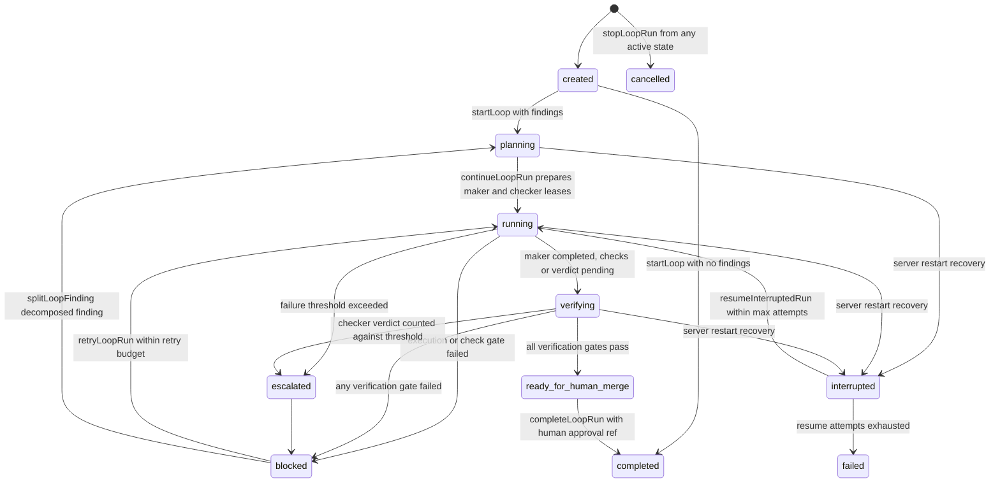
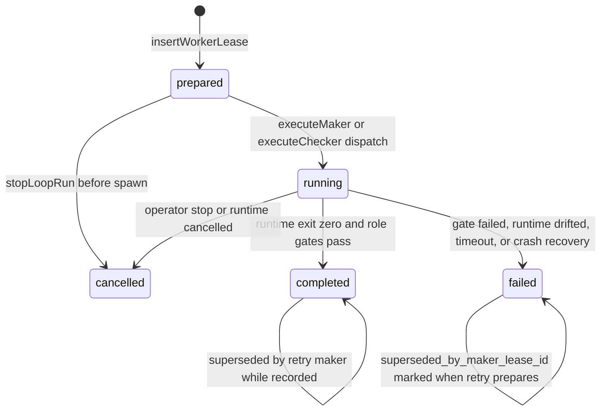

# Loop Domain Model: Runs, Leases, Worktrees & Recovery

The loop subsystem in `packages/server` runs **closed-loop maker/checker cycles**:
a loop run scans a repository (or synthesizes a finding from a goal), prepares
isolated git worktrees, leases a *maker* worker that edits code, and requires an
independent *checker* (and, for high-risk work, a *security_checker*) verdict and
passing deterministic checks before the run may complete — with a mandatory human
approval reference at completion and an explicit "no automatic merge" gate. All
durable state lives in three SQLite tables: `loop_runs` (run record, findings,
gates, plan), `worker_leases` (worker allocation and nested-spawn lineage), and
`loop_events` (append-only audit trail), plus `LOOP_STATE.md` and stdout/stderr
logs under the evidence root (`LOOP_EVIDENCE_ROOT`, default
`<monorepo>/.data/agent-evidence/agentic-control-loop-fleet`).

The public API is HTTP under `/api/loops` (`packages/server/src/routes/loops.ts`,
mounted in `packages/server/src/routes/index.ts`), and every route handler talks to
a single `LoopService` instance.

## Loop catalog and contracts

The canonical loop catalog is `LOOP_CATALOG`
(`packages/shared/src/loop-catalog.ts`): all seven loops run in `mode: 'closed'` —
they prepare work and gates, but never merge, push, or deploy themselves:

| Loop | Risk class | Distinguishing contract terms |
|---|---|---|
| `doc-drift-and-small-fix-loop` | low | stale markdown links / script references; `verification` includes `read_only_discovery`, `diff_threshold` |
| `repo-maintenance-loop` | low | hygiene findings; requires `package_scripts_exist_or_skipped` |
| `skill-quality-loop` | medium | validates governance metadata (`frontmatter_present`, `gates_present`, `escalation_present`) on loop skills |
| `mcp-connector-validation-loop` | medium | read-only MCP inventory/permission checks; `invoke_mutating_mcp_tool` forbidden |
| `security-regression-loop` | high | mandates `security_checker_verdict` + `human_approval_before_merge`; `weaken_policy`, `disable_scans` forbidden |
| `okf-synchronization-loop` | medium | drift between OKF knowledge folders and indexes; `delete_memory`, `overwrite_audit` forbidden |
| `overwatch-policy-drift-loop` | high | policy/approval drift detection only; `auto_approve_high_risk`, `bypass_gate` forbidden |

Each catalog entry is expanded into a full **LoopContract** in
`loop-service.ts` (`LOOP_CONTRACTS`, `LoopService.getLoopContract()`), adding
`risk_class`, `trigger`, `context_sources`, `actions_allowed`,
`actions_forbidden`, `verification`, `state`, `escalation`, and
`stop_conditions`. The contract is persisted into `loop_runs.metadata.contract`
at start so a run's rules survive server restarts, and its `stop_conditions` /
`escalation` terms flow into the worker assignment packet. An unknown
`loop_name` fails closed with `LOOP_NAME_UNSUPPORTED`.

## LoopService: the facade and its delegation map

`LoopService` (`packages/server/src/services/loop-service.ts`) is a ~107 KB
facade: it keeps the externally used method surface stable while delegating
substantive work to focused services constructed in its constructor. Use this
map when choosing which file to edit:

| Responsibility | Delegate (file) | Facade entrypoints |
|---|---|---|
| Continue / retry / split a run; lease preparation | `LoopLifecycleService` (loop-lifecycle-service.ts) | `continueLoopRun`, `retryLoopRun`, `splitLoopFinding` via `this.lifecycle` |
| Maker/checker process execution, per-execution gates, ExecutionEngine dispatch | `LoopWorkerExecutorService` (loop-worker-executor-service.ts) | `executeMaker`, `executeChecker`, `executeWorker` via `this.workerExecutor` |
| Completion + certification gates | `LoopVerificationService` (loop-verification-service.ts) | `verifyLoopRun`, `certifyLoopRun` via `this.verification` |
| Finding scanners per loop | `LoopDiscoveryService` (loop-discovery-service.ts) | `discoverLoopFindings` via `this.discovery` |
| Token/wall/worker/retry budgets, failure-threshold escalation, cost | `LoopBudgetService` (loop-budget-service.ts) | `getTokenBudget`, `evaluateTokenBudget`, `getMakerLeaseBudget`, `adjustConcurrency`, `computeDollarCost` via `this.budget` |
| Git worktree create/snapshot/prune, branch naming, path safety | `WorktreeManager` (worktree-manager.ts) | `createWorktree`, `branchNameFor`, `pruneOrphanedWorktrees` via `this.worktree` |
| `worker_leases` persistence and lineage reads | `WorkerLeaseRepo` (loop-worker-lease-repo.ts) | `insertWorkerLease`, `updateWorkerLeaseStatus`, `getWorkerLease`, `listWorkerLeases` via `this.workerLeases` |
| `loop_events` record/query | `LoopEventService` (loop-event-service.ts) | `recordLoopEvent`, `listLoopEvents` via `this.events` |
| `loop_runs` reads and writes | `LoopRunQueryService` / `LoopRunMutationService` (loop-run-query-service.ts, loop-run-mutation-service.ts) | `getLoopRun`, `listLoopRuns` via `this.queries`; mutations used by lifecycle/recovery |
| Crash/restart recovery and resume | `LoopRecoveryService` (loop-recovery-service.ts) | `recoverInterruptedRuns`, `resumeInterruptedRun(s)` via `this.recovery` |
| Runtime contract probing, command building, process spawn/stop | `RuntimeCommandService` (runtime-command-service.ts) | `getRuntimeContract`, `buildRuntimeCommand`, `assertRuntimeAvailable` via `this.runtimeCommand` |
| `LOOP_STATE.md`, working-tree diff, evidence dir | `LoopPersistenceService` (loop-persistence-service.ts) | `writeLoopState`, `workingTreeDiff`, `git` via `this.persistence` |

The facade still directly owns the cross-cutting policy that every sub-service
reuses: run start (`startLoop`, `startObjectiveLoop`,
`startDocDriftAndSmallFixLoop`), guard predicates (`assertOperatorNotPaused`,
`assertLoopNotEscalated`, `assertTokenBudgetAvailable`,
`assertWallClockBudgetAvailable`, `assertNoFailedGates`), completion
(`completeLoopRun`), verdict submission (`submitCheckerVerdict`,
`submitSecurityVerdict`), deterministic checks (`runDeterministicChecks`),
assignment files (`writeWorkAssignment`, `writeAssignmentPacket`,
`buildCheckerPrompt`), runtime-env allowlists (`buildRuntimeEnv`), and the
nested-spawn bridge (`prepareNestedLease`). Because the executors and lifecycle
service call back into these facade methods, LoopService is genuinely a hub:
it holds the `db` handle and passes itself to `LoopLifecycleService`,
`LoopWorkerExecutorService`, and `LoopVerificationService`.

## Loop run and worker lease lifecycle

_A loop run moves from discovery/planning into maker execution, then through
verification gates to `ready_for_human_merge`; any gate failure blocks,
repeated failures escalate, a crash interrupts, and only `completeLoopRun` with
a `human_approval_ref` marks `completed`._

The transitions are owned by specific delegates: `LoopService.startLoop`
inserts the run; `LoopLifecycleService.continueLoopRun/retryLoopRun` flip it to
`running`; `LoopWorkerExecutorService` and `runDeterministicChecks` flip it to
`verifying` or `blocked`; `LoopVerificationService.verifyLoopRun` derives
`ready_for_human_merge`/`blocked`/`verifying` from gate evaluation;
`LoopBudgetService.escalateIfFailureThresholdExceeded` moves it to
`escalated`; `LoopRecoveryService` moves it to `interrupted` and back; and
`completeLoopRun` terminates it at `completed` only after re-running
verification and demanding a human approval reference. The route layer only
requires the stronger `approve:task` permission on `/runs/:id/complete`, which
is what supplies that reference (`operator:<actor>`).

Per-finding execution is modeled through durable `worker_leases` rows rather
than in-memory handles, so state survives process restarts:

_A worker lease is inserted as `prepared`, moves to `running` only while a
runtime child process is live, and ends `completed`, `failed`, or `cancelled`.
Retries never rewrite history: they mint a fresh maker/checker pair and mark
the prior maker with `superseded_by_maker_lease_id`._

`continueLoopRun` never assigns the same finding to two makers, skips split
parents (`LOOP_FINDING_ALREADY_SPLIT`), validates explicit `model` /
`reasoningEffort`, and enforces the per-run maker budget
(`LOOP_WORKER_BUDGET_EXHAUSTED`, default 5, goal-overridable via
`budget.max_maker_workers`, hard-capped at 100). For every assigned finding it
creates **one maker lease plus a manual `checker` lease linked by
`metadata.maker_lease_id`**; when `isHighRiskRun` is true (run/goal risk class
`high`/`critical`, security-category finding, or auth/secret/policy-sounding
finding content) it also creates a `security_checker` lease with
`requires_security_review`. `retryLoopRun` follows `retry_root_maker_lease_id`
to count used retries against a `max_retries` budget (default 1, hard cap 10,
resolved goal > request > lease > default) and prepares a new maker worktree
suffixed `-retry-<attempt>` on a `branchNameFor(runId, findingId, attempt)`
branch, plus a fresh checker (and, when `isHighRiskRun`, a fresh
`security_checker`); the prior maker is not rewritten but marked
`superseded_by_maker_lease_id`. Retryability is checked by
`isRetryableMakerLease` (a non-superseded maker that either failed or drew a
`needs_revision`/`rejected`/`insufficient_evidence` checker verdict);
exceeding the budget throws `LOOP_RETRY_BUDGET_EXHAUSTED`. Passing
`input.sibling` (Evolve E13) bypasses the retryability check and retry budget
and tags the new maker `evolve_sibling_of`, so the daemon can run sibling
makers of other species on the same objective and later select a winner.

### Worker roles and nested-spawn lineage

The schema CHECK on `worker_leases.role` admits six roles — `planner`, `maker`,
`checker`, `security_checker`, `memory_curator`, `governance_guard` — but the
maker/checker cycle concretely exercises `maker`, `checker`, and
`security_checker`; the remaining roles exist for nested-spawn trees and
adjacent governance/memory flows. Leases carry durable **lineage columns**
(`parent_lease_id`, `spawn_tree_id`, `depth`, `spawned_by_agent_id`, added by
migration over the base `worker_leases` table) so a spawned child lease can
itself spawn with depth/cycle/budget gates enforced by NestedSpawnService while
the lineage stays queryable in SQL. `LoopService.prepareNestedLease` creates
the child's worktree on an `agent/nested/<tree>/d<depth>-<id>` branch, writes a
`Nested Spawn Control` block with curl instructions when the child is allowed
to self-spawn, and passes lineage straight into `WorkerLeaseRepo.insert`; the
spawn token is minted scoped to `(lease.id, spawn_tree_id)` and injected only
into the child's process env, never persisted.

## Worktree isolation and path-traversal guards

Makers never edit the primary checkout. `WorktreeManager.createWorktree`:

1. Resolves the repository root and creates `git worktree add -b
   agent/loop/<runId>-<findingId> <worktreePath> <sourceHEAD>` under
   `LOOP_WORKTREE_ROOT` (default: `<repoParent>/.djimitflo-loop-worktrees`,
   sub-foldered `<runId>/<sanitizedFindingId>`), retrying up to 3 attempts on
   git lock contention and failing closed as `WORKTREE_CREATE_FAILED`.
2. Snapshots the *source* working tree into the worker: the tracked diff
   (`git diff --binary HEAD`) is applied, and every untracked source file
   discovered via `git status --porcelain=v1 --untracked-files=all` is copied
   over, **excluding `.git/` and `node_modules/` and rejecting any relative
   path containing `..` or resolving outside either root** — the
   path-traversal guard that keeps a crafted finding id or symlink from
   writing outside the worktree. The snapshot is committed inside the worktree
   with an explicit `-c user.name=djimitflo` identity so a dirty source tree is
   reproducible for the checker.
3. Symlinks `node_modules` (root and per-workspace `packages/*/node_modules`)
   into the worktree so runtimes can execute without reinstalling, unless
   `linkDependencies` is disabled (as it is for checker worktrees, which are
   cut from the maker worktree).

`createTargetFinding` and `WorktreeManager.isPathAllowed` /
`validateWorktreeSafety` / `sanitizeFindingId` provide the matching *input* side
of the boundary: target fix paths must remain inside the repository
(`FIX_FILE_PATH_OUTSIDE_REPOSITORY`, resolved with `realpath`), repository
roots are allowlisted via `OKF_ALLOWED_ROOTS`, and `assertWithinWorktreeRoot`
refuses to spawn an autonomous runtime whose cwd is outside the worktree roots
(`RUNTIME_CWD_OUTSIDE_WORKTREE`). Orphaned worktrees are pruned by
`pruneOrphanedWorktrees` once past `LOOP_WORKTREE_MAX_AGE_HOURS` (default 24 h),
keeping any whose lease is still `prepared` or `running`.

Isolation is enforced, not just configured: the verification gate
`worktree_isolation` fails unless every non-superseded maker lease has an
existing worktree path, and `executeChecker` rejects any checker worktree whose
`realpath` equals another lease's worktree (`CHECKER_WORKTREE_NOT_INDEPENDENT`).
The maker's `package-lock.json` is restored if it changed without a
`package.json` change (install noise), and the checker runs under a read-only
contract — any worktree dirt after execution fails the
`<role>_read_only_contract` gate.

## Budgets, cost, and concurrency

`LoopBudgetService` owns all quantitative limits derived from the run's goal
budget (with meta-orchestration tuning as a fallback "meta" source), and the
facade exposes the corresponding assertions used by lifecycle and executor
paths:

- **Worker budget** — `max_maker_workers` (default 5, cap 100) enforced at
  continue time.
- **Retry budget** — `max_retries` (default 1, cap 10) enforced per retry root.
- **Failure threshold** — `max_failure_count` (default 3, cap 20), counting
  failed makers plus checker/security verdicts of `needs_revision`, `rejected`,
  or `insufficient_evidence`; exceeding it escalates the run and emits a
  `loop_escalated` event.
- **Wall-clock budget** — `max_runtime_ms`; on exhaustion
  `assertWallClockBudgetAvailable` moves the run to `blocked` and logs
  `loop_budget_exhausted` (`budget_type=wall_clock`).
- **Token budgets** — `max_tokens`, `max_tokens_per_worker`, and
  `max_tokens_per_diff_line` evaluated against `runtime_usage` parsed from
  runtime stdout; exhaustion fails the `token_budget` gate and emits
  `loop_budget_exhausted`, while exceeding a per-diff-line budget is recorded
  as a `budget_risk` on the run metadata. `extractRuntimeUsage` first
  aggregates opencode's per-step `step_finish` events (`part.tokens`), because
  opencode never emits one summary usage object, then falls back to scanning
  stdout JSON lines for a `usage`/`token_usage` object with normalized aliases.
  Usage is never guessed: absent usage data simply "skips" the gate.
- **Dollar cost** — `computeDollarCost` prices tokens per runtime
  (`codex` ≈ $2/Mtok, `opencode` $0.5, `claude` $3, `gemini` $1, `pi`/`editor`/
  `mock` $0). `computeEfficiencyMetric` reports verified artifacts per dollar,
  and `allocateDollarBudget` ranks candidate findings by
  competence-per-p50-dollar before allocating.

Concurrency is layered. At the process-spawn layer, every runtime child routes
through `RuntimeCommandService.executeRuntimeCommand`, which is bounded by the
global `runtimeConcurrencySemaphore` (`RUNTIME_MAX_CONCURRENCY`, default 4,
read fresh so operators can tune it live) and tracked in the in-memory
`RuntimeLeaseRegistry`. At the fleet layer, `LoopBudgetService.adjustConcurrency`
implements the AIMD signal (additive increase / multiplicative-style decrease
with a floor of 1) and publishes `aimd_state` on the swarm event bus; the
`LoopDaemon` consumes that signal to decide how many goals to start per tick.
`stopLoopRun` cancels prepared/running leases and stops their runtime permits
via the same registry, so a stopped lease never hangs the queue.

## Verification gates and certification

`LoopVerificationService.verifyLoopRun` evaluates eleven gates against the live
lease set (excluding superseded makers and their linked reviewers):
`run_not_cancelled`, `maker_completion`, `maker_checker_separation`,
`worktree_isolation`, `assignment_file_present` (`.djimitflo/LOOP_WORK.md` or a
historical `LOOP_WORK.md`), `diff_threshold_all_makers`, `checker_verdict`,
`tests_lint_typecheck`, `security_checker_verdict` (skipped for non-high-risk
runs), `auto_approved_scope` (J5: a maker carrying `metadata.auto_approved_scope`
may have changed only that one approved test file), and a policy
`no_automatic_merge` gate that always passes — it exists to prove the loop
never merged, pushed, or deployed. A failed gate records a structured block
reason (`block_reason=gate_failed`, failed gate evidence, recommendations) on
run metadata and flips the run to `blocked`. One deliberate exception keeps a
mid-flight run out of the blocked lane: when some makers are still `prepared`
or `running` and none has `failed`/`cancelled` (the `waitingForMakers`
condition), a failing `maker_completion` gate does not block. When all makers
complete and no gate fails, the run lands at `ready_for_human_merge`;
otherwise (makers still working, no hard block) it stays in `verifying`. A
`cancelled`/`completed` run keeps its status, and clearing the block removes
the `gate_failed` block metadata.

"Accepted" is deliberately strict. `hasAcceptedReviewEvidence` requires the
checker lease to be `completed` with `verdict=accepted` **and** either a manual
attestation naming reviewer + reason (`manual_review_attestation`) or full
runtime proof: exit status 0, no timeout or cancellation, `runtime_verdict`
accepted, `read_only_contract_passed`, `runtime_adapter` equal to the lease
runtime, an available `runtime_contract` in `ok` status, and an existing
stdout log. `certifyLoopRun` only emits a `certified` convergence event when
the run is `ready_for_human_merge`/`completed` with every gate pass (the
security gate may be skipped), and `completeLoopRun` re-verifies and refuses
`HIGH_RISK_SECURITY_CHECK_REQUIRED`, `LOOP_COMPLETION_BLOCKED:<gate>`, or
`LOOP_HUMAN_APPROVAL_REQUIRED` failures instead of trusting cached state.

## Crash recovery and start-up invariants

Because worker child processes do not survive a server restart, recovery is a
deliberate, idempotent step executed during bootstrap
(`packages/server/src/bootstrap/recovery.ts`, wired from `index.ts`; the
loop daemon is described separately in the swarm goal lifecycle page). On boot:

1. `LoopRecoveryService.recoverInterruptedRuns` fails every `worker_leases`
   row still marked `running` whose lease id is absent from the in-memory
   `RuntimeLeaseRegistry` (reason `server_restart`), then marks any active
   (`planning`/`running`/`verifying`) run with no live lease `interrupted` —
   **except** `planning` runs and runs whose goal is blocked on
   `awaiting_approval`, which are idle rather than orphaned.
2. `LoopService.recoverInterruptedRuns` additionally prunes orphaned
   worktrees, so disk state converges with the lease table.

`resumeInterruptedRun` moves an interrupted run back to `running` only while
`resume_attempts <= maxResumeAttempts` (default 3); once exhausted it marks the
run terminally `failed` (`boundedFail`). Resume replays the plan rather than
history: findings whose maker leases already completed are skipped, everything
else is requeued, and an `recovery` event is emitted on the swarm event bus.
Operator-paused runs are never auto-resumed (`LOOP_OPERATOR_PAUSED`), and a
single durable failure reason is enforced everywhere — `WorkerLeaseRepo.updateStatus`
refuses to persist `failed` without deriving one (`failure_reason`), defaulting
to `unspecified: caller supplied no reason` so post-mortems never see a
silent failure.

## Focused tests

The behavior above is anchored by a set of focused suites under
`packages/server/src/__tests__`: `loop-recovery-service.test.ts` and
`loop-recovery-awaiting-approval.test.ts` for crash recovery invariants,
`loop-budget-service.test.ts` for token/wall/failure budgets,
`loop-verification-completion.test.ts` and
`loop-verification-manual-attestation.test.ts` for gate strictness,
`loop-security-checker.test.ts` and `loop-checker-deps.test.ts` for
security-checker and independence rules, `loop-maker-lockfile.test.ts` and
`loop-working-tree-diff.test.ts` for worktree evidence handling,
`loop-runtime-stop.test.ts` for cancellation, `loop-service-facade.test.ts` for
delegation stability, and `integration-full-loop.test.ts` /
`loop-services.test.ts` for end-to-end behavior.
