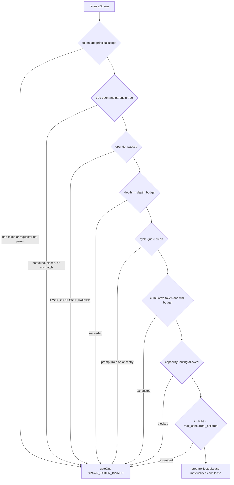

# Nested Spawn & Swarm Trees

A spawned runtime child in Djimitflo has no built-in way to create children of
its own. `NestedSpawnService`
(`packages/server/src/services/nested-spawn-service.ts`) is that path — the
gated entrypoint for nested multi-agent spawning (P1). An operator-armed swarm
**root** is created explicitly, and the root (or any depth-permitted descendant)
can then request sub-agents — either by direct same-process calls from the
orchestrator, demo, or tests, or over the HTTP control endpoint, where a real
codex/claude child shells out with `curl` (or `fetch`) carrying its scoped
spawn token.

Every spawn is gated, audited, and budget-accounted. No gate is advisory: each
rejection is recorded as a `gated_out` row in `sub_agent_spawns` with a machine
`reject_reason`, and no child lease, worktree, or budget mutation survives a
gate failure. The no-theater caveat is honest about scope: the service makes
the *spawning and audit* real, but whether the child *process* actually runs
and self-spawns depends on the runtime — `mock` echoes (no self-spawn), while
codex/claude shell out to the control endpoint. The gates are exercised
identically regardless of runtime.

## Entry points and ownership boundaries

The service owns two public operations:

- **`createRoot(input)`** — operator-armed root creation. Confirms the loop run
  exists and the operator has not paused it, resolves the tree budget envelope
  from explicit input or operator env, mints the root's spawn token, and
  materializes the root lease by delegation.
- **`requestSpawn(input, opts)`** — child spawn request. Runs the gate chain
  (below) and, on success, materializes the child lease and audit row.

Two deliberate boundaries keep the system coherent:

- **Lease materialization is delegated, not duplicated.** Actual worktree +
  lease creation is handed to `LoopService.prepareNestedLease`
  (`packages/server/src/services/loop-service.ts`), which reuses the existing
  spawn-bridge primitives (`createWorktree`, `writeWorkAssignment`,
  `writeAssignmentPacket`, `insertWorkerLease`) unchanged. A nested child is
  therefore a **real `worker_leases row** with real
  `parent_lease_id / spawn_tree_id / depth` lineage — not a parallel structure.
- **Token logic lives in a leaf module** (`packages/server/src/services/spawn-token.ts`)
  shared by `NestedSpawnService` (validates tokens over HTTP) and
  `LoopService` (mints a child's own token to inject into that child's env so
  it can self-spawn). This breaks what would otherwise be a
  `LoopService → NestedSpawnService → LoopService` cycle: `LoopService` only
  **mints**, `NestedSpawnService` only **validates**.

## Data model: spawn trees and the sub_agent_spawns ledger

Durable state is two tables plus additive lineage columns
(`packages/server/src/database/migrate.ts`):

- **`worker_leases`** gains `parent_lease_id`, `spawn_tree_id`, `depth`, and
  `spawned_by_agent_id` (additive migration; the existing role CHECK is kept).
- **`spawn_trees`** — one row per tree, keyed by the root lease id
  (`spawn_trees.id == root worker_leases.id`, a plan invariant). Holds the
  `depth_budget`, cumulative `total_token_budget` / `consumed_tokens`,
  `total_wall_budget_ms` / `consumed_wall_ms`, `max_concurrent_children`,
  `risk_class`, and `status` (`'open'` while accepting spawns).
- **`sub_agent_spawns`** — the audit and budget ledger, normalized out of lease
  metadata so the cycle guard (`prompt_digest` + ancestry) is durable and
  queryable. Each row records the spawn id, tree, parent/child/requester lease
  ids, depth, runtime, requested role, `prompt_digest`
  (`sha256(role|prompt|capability_ids)`), `status`, `reject_reason`, and the
  per-spawn `token_budget_grant` / `wall_budget_ms`. Statuses are
  `requested | gated_out | prepared | running | completed | failed | cancelled`.
  `child_lease_id` is nullable because a `gated_out` spawn created no child;
  the root itself is recorded as a depth-0 row (`parent_lease_id` NULL) so the
  ancestry walk is uniform.

`spawn_trees` also gains optional additive `context_budget` / `context_consumed`
columns (per-sub-agent context isolation, `0` = no isolation); `createRoot`
detects them with `PRAGMA table_info` and includes them only when present so
the insert stays backward-compatible.

## The gate chain (requestSpawn)

`requestSpawn` applies six gates in order. The first failure short-circuits
into `gateOut`, which writes the `gated_out` audit row, emits
`SWARM_SPAWN_GATED_OUT`, and returns without materializing anything.

*Caption: the six requestSpawn gates short-circuit to an audited `gated_out` row; only a fully-clean request reaches `prepareNestedLease`.*

1. **Token gate.** External (HTTP) callers must present a valid, unexpired
   spawn token scoped to `(requested_by_lease_id, spawn_tree_id)`; a bad or
   missing token throws `SPAWN_TOKEN_INVALID`. Same-process internal calls
   (`opts.internal = true`) bypass the token because the operator already
   authorized the tree at `createRoot` time — and the HTTP route never trusts a
   request-body `internal` flag. Separately, the spawning principal must be the
   parent: `requested_by_lease_id !== parent_lease_id` is rejected.
2. **Operator pause.** `assertOperatorNotPaused` on the parent's loop run maps
   `LOOP_OPERATOR_PAUSED` to a `gated_out` row with reason `operator_paused`
   (a soft denial, not an exception).
3. **Depth budget.** `depth > tree.depth_budget` gates out with
   `depth_budget_exceeded`. Depth budget defaults to `SPAWN_DEPTH_BUDGET` env
   or `0` — **default-deny, mirroring `RUNTIME_ALLOW_SKIP_PERMISSIONS`**: a
   missing/zeroed flag means nested spawning is off.
4. **Cycle guard.** The same `(prompt_digest, role)` must not already appear
   on the ancestry chain from the parent up to the root; a match gates out with
   `cycle_detected`.
5. **Cumulative budget gate.** The tree-wide `total_token_budget` /
   `total_wall_budget_ms` are the hard bound — when `remaining <= 0` the spawn
   gates out with `token_budget_exceeded` / `wall_budget_exceeded`. The
   per-depth grant is then a configurable ceiling (`SPAWN_PER_DEPTH_TOKEN_CAP`,
   default 50 000; `SPAWN_PER_DEPTH_WALL_CAP_MS`, default 120 000) capped by
   the remaining budget — deliberately *not* `total/(depth_budget+1)`, so one
   child cannot grab the whole tree and real swarm sizes fit many small children.
6. **Capability routing.** Every bound capability id must exist, be live
   (`status` not `disabled`/`deprecated` and `live_route_allowed`), not list
   the `${role}:${runtime}` action in `forbidden_actions`, and have a
   `risk_ceiling` at or above the tree's `risk_class`. Violations gate out with
   `capability_not_found` / `capability_not_live` /
   `capability_action_forbidden` / `capability_risk_exceeds_ceiling`.
7. **Per-tree concurrency cap (P2 limiter).** In-flight children — real child
   spawns (`depth > 0`) still `prepared` or `running`, excluding the depth-0
   root, which is the operator-armed principal rather than an in-flight child —
   must stay under `max_concurrent_children`; otherwise `concurrency_exceeded`.

Only when all gates pass does the service call
`loops.prepareNestedLease({ ..., depth, spawnedByAgentId, allowNestedSpawn })`.
A child may spawn its own children only while still above the depth floor
(`allowNestedSpawn = depth < depth_budget`), and only then is a real,
child-scoped spawn token minted. Grants are committed by incrementing
`spawn_trees.consumed_tokens` / `consumed_wall_ms`, the `prepared` audit row is
inserted, and `SWARM_SPAWN_PREPARED` is broadcast (both events flow through
`broadcastToAuthenticated` when a `WebSocketService` is wired).

## Spawn tokens: scoped, expiring, fail-closed

Because a spawned runtime child has no user session, it cannot present a Bearer
JWT. The spawn-token module issues **HMAC-scoped** credentials of shape
`base64url("leaseId|spawnTreeId|expiresAt").sig` where `sig` is
HMAC-SHA256(secret, payload). Scope is a single `(leaseId, spawnTreeId)` pair
with a short TTL (`SPAWN_TOKEN_TTL_MS` = 30 minutes, a child lease's spawn
window), so a leaked child token can only spawn children inside that one tree
within its window. Validation is constant-time on the signature and never
throws — any malformed, expired, or wrong-scope token returns `false`, which
`requestSpawn` maps to `SPAWN_TOKEN_INVALID` → HTTP 401.

The secret resolves through `resolveSpawnTokenSecret`: a dedicated
`DJIMITFLO_SPAWN_TOKEN_SECRET` wins, otherwise `JWT_SECRET` is reused;
production **fails closed** with `SPAWN_TOKEN_SECRET_REQUIRED` when neither is
set, while local/test development gets a per-process ephemeral secret (with a
one-time warning) so tokens stay scoped without a predictable value committed
in the repo.

Token flow is deliberately asymmetric: `LoopService.buildNestedSpawnEnv`
mints a fresh token at execution time for an *armed* lease
(`metadata.allow_nested_spawn === true`) and injects it into the child's
process env as `DJIMITFLO_SPAWN_TOKEN` alongside `DJIMITFLO_CONTROL_URL`,
`DJIMITFLO_LEASE_ID`, `DJIMITFLO_SPAWN_TREE_ID`, and `DJIMITFLO_DEPTH` (merged
over the static runtime env so PATH/model keys survive; both vars are on the
runtime env allowlist). The raw token is never persisted or written into the
assignment file — the `## Nested Spawn Control` block rendered by
`buildNestedSpawnControlBlock` shows `<redacted>` and instructs the runtime to
read the token from its env.

## HTTP surface and authentication

The control surface is three endpoints under `/api/swarms/spawns`
(`packages/server/src/routes/spawns.ts`), which only forward inputs and map
service errors (`mapSpawnError`) to HTTP status codes — the token gate itself
lives in `NestedSpawnService.requestSpawn`:

| Endpoint | Auth | Purpose |
|---|---|---|
| `POST /api/swarms/spawns/root` | user JWT + `write:swarm_action` | operator-armed root creation |
| `POST /api/swarms/spawns` | `X-Spawn-Token` (scoped) | child spawn request; HTTP callers never get the same-process `internal` bypass |
| `GET /api/swarms/spawns/:id/status` | `X-Spawn-Token` or JWT | a child polls its own spawn status |

Access is governed by the `requireAuthOrSpawnToken` middleware
(`packages/server/src/middleware/auth.ts`), mounted **BEFORE** the generic
`/swarms` router in the mount table (`packages/server/src/routes/index.ts`) so
the specific `/swarms/spawns` path wins over the generic `requireAuth` mount.
The middleware admits EITHER credential but treats them differently:

- `Authorization: Bearer <jwt>` → verified and sets `req.user`; a
  **malformed/expired Bearer returns 401 `AUTH_INVALID` and never falls
  through** to the spawn-token path — a malformed Bearer is an attack signal,
  not a child.
- `X-Spawn-Token: <token>` → passes through with `req.user` **unset**; real
  scope/expiry validation happens downstream in `requestSpawn`, surfacing as
  `SPAWN_TOKEN_INVALID` → 401.
- Neither header → 401 `AUTH_REQUIRED`.

Because `POST /spawns/root` sits behind `requirePermission('write:swarm_action')`,
which 401s when `req.user` is unset, a token-only child can `POST /spawns` but
can **never create roots** — only operators arm trees.

## Observability, lifecycle, and operations

Both outcomes emit swarm spawn events (`SWARM_SPAWN_PREPARED`,
`SWARM_SPAWN_GATED_OUT` in `packages/shared/src/types/websocket.ts`) carrying
the spawn id, tree, lineage, depth, runtime, role, status, and reject reason,
so a child spawning is observable end-to-end. `getSpawnStatus` (a child polls
its own lease) and `listSpawnTree` (the full ancestry ledger ordered by depth)
read back from `sub_agent_spawns`.

The default control URL is derived at server startup
(`packages/server/src/index.ts`, mirrored in
`packages/server/src/bootstrap/constants.ts`): when the server binds
`0.0.0.0`/`localhost`, children dial `127.0.0.1`, and operators override
`DJIMITFLO_CONTROL_URL` explicitly for Docker or remote children. A
control-plane outage is non-fatal for a cooperative runtime — the mock logs
`control-plane call failed`, exits 0 (echo work done), holds no runtime
semaphore permit, and creates no child.

Operator-facing configuration (all resolved with `envInt` fallbacks):

| Env | Default | Effect |
|---|---|---|
| `SPAWN_DEPTH_BUDGET` | `0` | max tree depth; 0 = nested spawning off (default-deny) |
| `SPAWN_TREE_TOKEN_BUDGET` | `200000` | cumulative per-tree token budget |
| `SPAWN_TREE_WALL_BUDGET_MS` | `600000` | cumulative per-tree wall budget |
| `SPAWN_TREE_MAX_CONCURRENT_CHILDREN` | `4` | per-tree in-flight cap |
| `SPAWN_PER_DEPTH_TOKEN_CAP` | `50000` | per-child token grant ceiling |
| `SPAWN_PER_DEPTH_WALL_CAP_MS` | `120000` | per-child wall grant ceiling |
| `SPAWN_CONTEXT_BUDGET` | `0` | per-sub-agent context isolation (0 = off) |
| `DJIMITFLO_SPAWN_TOKEN_SECRET` | falls back to `JWT_SECRET` | HMAC secret; required in production |
| `DJIMITFLO_CONTROL_URL` | derived from `HOST`/`PORT` | the callback URL children POST to |

## Focused tests

- `packages/server/src/__tests__/nested-spawn.test.ts` — the gate chain in
  isolation: default-deny depth-0 rejection, depth-2 lineage with the
  great-grandchild gated, cycle detection, token- and wall-budget exhaustion,
  the per-depth ceiling formula (and `SPAWN_PER_DEPTH_TOKEN_CAP` lowering),
  capability routing (draft → `capability_not_live`, forbidden action →
  `capability_action_forbidden`), the concurrency cap, worktree isolation, the
  token scope/expiry accept/reject paths, the production fail-closed secret,
  `getSpawnStatus`, and `listSpawnTree`.
- `packages/server/src/__tests__/nested-spawn-loop.test.ts` — L1/L3 end-to-end
  proof that the control loop is real, not structural: a mock root runs as a
  real `child_process.spawn` and does a real HTTP `POST` to the live endpoint
  to spawn a child, which does the same for a grandchild; L3 proves a
  token-only caller can `POST /spawns` but not `/spawns/root`, that a malformed
  Bearer yields `AUTH_INVALID` (no fall-through), and that a request-body
  `internal: true` does not bypass HTTP token validation; C1/C2 prove live
  capability injection into the child env and a fake `claude` runtime following
  the same control loop.
- `packages/server/src/__tests__/loop-routing-continuation.test.ts` — an
  operator pause blocks nested root creation and direct lease materialization,
  and a paused child is audited `gated_out/operator_paused` with no worktree,
  lease, or budget mutation.
- `packages/server/src/__tests__/auth.test.ts` and
  `auth-principal-chain.test.ts` — the `requireAuthOrSpawnToken` admit/deny
  matrix.

## Related pages

- [Loop Domain Model: Runs, Leases, Worktrees & Recovery](/openwiki/concepts/loop-lifecycle.md) —
  the `worker_leases` lineage, worktree isolation, and `prepareNestedLease`
  this service delegates to.
- [AuthN/AuthZ: Roles, JWT Sessions & WebSocket Auth](/openwiki/concepts/roles-and-permissions.md) —
  the auth middleware and RBAC/default-deny posture nested spawning mirrors.
- [Maker–Checker Loop Execution](/openwiki/workflows/maker-checker-loop.md) —
  the goal/daemon queue and swarm control plane the spawn routes are mounted under.
