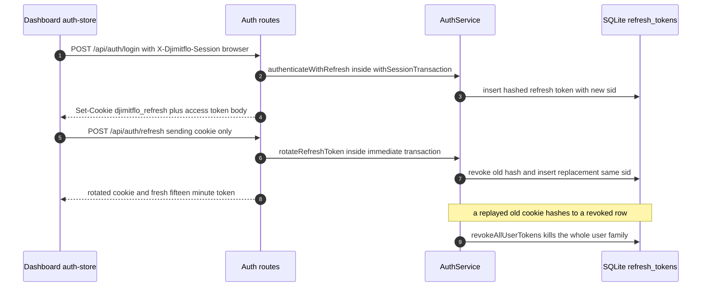
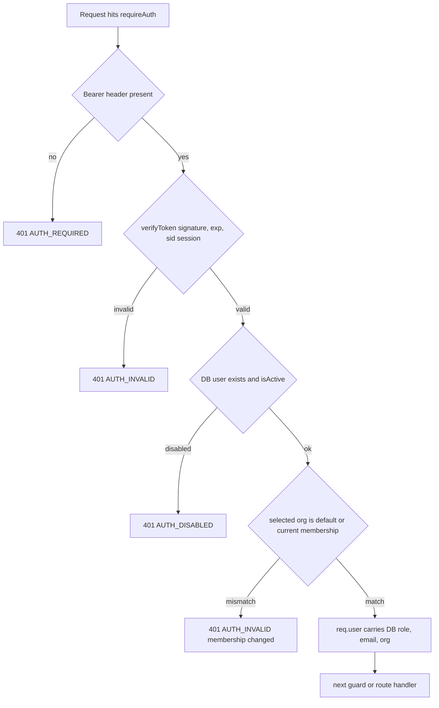

# AuthN/AuthZ: Roles, JWT Sessions & WebSocket Auth

Authentication and authorization in `packages/server` are built from four
cooperating pieces:

1. **The role model** — `UserRole` (seven roles) and the static
   `ROLE_PERMISSIONS` table in `packages/shared/src/types/auth.ts`, shared by
   the server, the dashboard, and any client of `@djimitflo/shared`.
2. **AuthService** (`packages/server/src/services/auth-service.ts`) — password
   hashing (bcrypt, 12 rounds), HS256 JWT issuance and verification, and the
   `refresh_tokens` table that makes short-lived access tokens revocable through
   a session id (`sid`) claim.
3. **The Express middleware** (`packages/server/src/middleware/auth.ts`) —
   `requireAuth`, `requirePermission`, `optionalAuth`, and
   `requireAuthOrSpawnToken`, all of which treat a valid JWT as *proof of
   identity only* and re-read the user's role, email, activity flag, and
   organization membership from SQLite per request.
4. **WebSocketService** (`packages/server/src/services/websocket-service.ts`) —
   handshakes authenticated via the `bearer.<token>` subprotocol, plus
   per-broadcast revalidation so a demoted, disabled, or logged-out principal
   stops receiving events mid-connection.

The same `AuthService` instance backs both the HTTP and WebSocket paths
(`packages/server/src/index.ts`, `packages/server/src/bootstrap/core-services.ts`),
so session revocation, role changes, and organization moves take effect on both
transports simultaneously.

## The seven roles and ROLE_PERMISSIONS

`UserRole` defines exactly seven roles, and `ROLE_PERMISSIONS` maps each to a
fixed list of capability-scoped permission strings
(packages/shared/src/types/auth.ts):

| Role | Permissions (grouped) |
|---|---|
| `admin` | Full set: read, scan, create/execute/approve/delete tasks, write evidence/claims/capabilities/swarm actions/governance, manage config, users, backups, policies, tokens, read audit |
| `platform_admin` | Operations only: `manage:config`, `manage:users`, `manage:backups`, `manage:policies`, `manage:tokens`, plus read evidence/repository/audit — no task execution or approval |
| `approver` | `approve:task`, `create:task`, read evidence/repository |
| `maker` | `create:task`, `execute:task`, `write:evidence`, `write:agents`, `write:skills`, `write:capability`, `write:claim`, `write:swarm_action`, `scan:repository`, reads |
| `checker` | Read evidence/repository, `scan:repository`, `write:evidence` |
| `auditor` | Read evidence/repository plus `read:audit` |
| `viewer` | `read:evidence`, `read:repository` only |

The table is the single authority consulted by `requirePermission`, by
`AuthService.hasPermission`, by `AuthorizationService` (per-resource checks),
and by the dashboard's `auth-store` for UI gating — so a permission change in
one enum file propagates to every enforcement and presentation surface.

### Maker–checker–approver separation

The split between `maker`, `checker`, and `approver` is the governance backbone
that the rest of the pipeline relies on (see /openwiki/concepts/governance-pipeline.md):

- `maker` can create and execute work (`create:task`, `execute:task`,
  `write:evidence`) but **cannot approve** anything — `approve:task` is absent.
- `approver` holds `approve:task` but **cannot execute** — `execute:task` is absent.
- `checker` validates (`scan:repository`, `write:evidence`) with neither.
- Only `admin` holds both `execute:task` and `approve:task`, so the
  role table alone cannot stop a self-approval by an admin. The data layer
  closes that gap: `ApprovalService.decideApproval` throws
  `SELF_APPROVAL_FORBIDDEN` when `decided_by === requested_by`
  (packages/server/src/services/approval-service.ts), and
  `AuthorizationService.canApproveForTask` denies non-privileged users from
  approving tasks they own (packages/server/src/services/authorization-service.ts).
  Approval decision endpoints (`POST /api/approvals/:id/approve`, `/deny`,
  `/cancel`, and siblings in loops/swarm-governance/work-items) all sit behind
  `requirePermission('approve:task')` (packages/server/src/routes/approvals.ts).

So an operator who builds can never be the operator who signs off, even with an
admin token, and a non-privileged approver can never sign off their own work.

## JWT issuance and verification

`AuthService` signs access tokens as HS256 JWTs with claims `sub`, `email`,
`role`, `organization_id` (defaulting to `'default'`), and — for pair-issued
tokens — `sid` (the session id):

```ts
// packages/server/src/services/auth-service.ts
generateToken(user, sessionId?) // adds sid only when sessionId is provided
verifyToken(token)              // signature + structural checks + session check
```

### Access-token lifetime and secret handling

- **Default TTL is 15 minutes** (`JWT_EXPIRES_IN || '15m'`); the
  `refresh_token`-less `expires_in` in login responses is derived from the
  freshly signed claims (`exp - iat`) so configuration and response cannot
  drift. The cookie-session contract test pins `expires_in === 900`.
- **`JWT_SECRET` is mandatory in production.** If it is missing and
  `NODE_ENV === 'production'`, the constructor logs a fatal message and calls
  `process.exit(1)`. In development it falls back to a per-process
  `randomUUID()` secret — which means every restart invalidates all outstanding
  dev tokens, a deliberate do-not-use-in-production signal.
- **Bootstrap**: `bootstrapAdmin()` creates a first admin user from
  `AUTH_BOOTSTRAP_ADMIN_EMAIL` / `AUTH_BOOTSTRAP_ADMIN_PASSWORD` /
  `AUTH_BOOTSTRAP_ADMIN_ROLE`. In production, an empty `users` table *without*
  bootstrap credentials is also fatal (`process.exit(1)`), so a production
  instance can never start in an unauthenticatable or silently-open state.

### Signature verification is hand-rolled and pinned

`verifyHs256Jwt` (packages/shared/src/jwt.ts) does not delegate to
`jsonwebtoken.verify`. It splits the token, requires the header `alg` to be
exactly `HS256` (algorithm pinning — an `alg: none` or RS256-confusion token is
rejected), recomputes the HMAC-SHA256 signature and compares it with
`timingSafeEqual`, then enforces structural claims: `sub` present, `role` a
member of the `UserRole` enum, finite and unexpired `exp`, and not-yet-valid
`nbf`. Any failure returns `null`; verification never throws.

## Sessions: making a stateless JWT revocable

Tokens produced by the pair flow (`generateTokenPair` / `issueTokenPair`) carry
a `sid` claim equal to the `session_id` column of a `refresh_tokens` row.
`AuthService.verifyToken` then enforces liveness:

```ts
// packages/server/src/services/auth-service.ts
if (payload?.sid !== undefined && !this.isSessionActive(payload.sub, payload.sid)) return null;
```

`isSessionActive` requires a `refresh_tokens` row for that
`(user_id, session_id)` that is unrevoked and unexpired. Consequences:

- Logging out (which revokes the session's rows) immediately invalidates the
  still-unexpired access JWTs bound to that session — both on HTTP and on open
  WebSockets.
- Rotation keeps the **same** `sid` across refreshes, so revoking one link of
  the chain revokes the whole family (`revokeSessionFamily`,
  `revokeAuthenticatedSession`).
- Tokens without `sid` (the legacy non-browser login path, see below) skip the
  session check entirely.

The `refresh_tokens` table (auto-created by the constructor) stores
`token_hash` (SHA-256, primary key), `user_id`, `session_id`, `issued_at`,
`expires_at`, `rotated_from`, and `revoked`, indexed by user, expiry, revoked
flag, and `(user_id, session_id)`. The raw refresh token — two concatenated
UUIDs — is never persisted; only its hash is, which the tests assert by
scanning rows and response bodies for raw-token leakage.

## Refresh-token rotation

The refresh flow is a 30-day credential (`REFRESH_TOKEN_TTL_DAYS = 30`,
mirrored by the cookie's `Max-Age=2592000`) that rotates on every use.
`rotateRefreshToken` runs inside an `.immediate()` SQLite transaction so the
write lock is held before any read:

1. Look up the presented token's hash with `revoked = 0` and future
   `expires_at`.
2. **Replay detection**: if the hash instead matches a *revoked* row, the token
   is being replayed — `revokeAllUserTokens(user_id)` revokes **all** of that
   user's refresh tokens, which (via `sid` checks) also kills every live access
   token of every session that grew from them. This is intentionally
   user-wide, not session-wide.
3. Re-read the user; validate the requested `organization_id` against current
   membership **before** consuming the token.
4. Revoke the old hash; if the user is gone or deactivated, fail — but the old
   token stays revoked (an inactive account cannot launder a credential).
5. Issue a new pair on the **same** `session_id`, recording
   `rotated_from = <old token hash>` for lineage, and copy the claim-derived
   TTL into `expires_in`.



*Browser session lifecycle: pair issuance, rotation with durable hash lineage, and replay revocation.*

`packages/server/src/__tests__/refresh-token-rotation.test.ts` pins each branch:
rotation issues a different token, the old token can't be reused, replay revokes
the replacement as well, expired/unknown tokens fail, and deactivated users
fail rotation.

## The browser cookie channel

Browser sessions (dashboard) are distinguished by the
`X-Djimitflo-Session: browser` header (packages/server/src/routes/auth.ts):

- `/api/auth/login` with the header sets a `djimitflo_refresh` cookie —
  `HttpOnly`, `SameSite=Strict`, `Path=/api/auth`, 30-day max age — and returns
  the access token in the JSON body. The cookie is `Secure` in production
  unless `AUTH_COOKIE_SECURE` explicitly overrides it (`'true'`/`'false'`).
  JS never reads the cookie; the raw refresh token never appears in a response
  body.
- `/api/auth/refresh` and `/api/auth/logout` (cookie path) require the browser
  header and return 403 without it, which — combined with explicit-origin
  credentialed CORS — stops cross-origin pages from riding ambient cookies.
  The refresh endpoint accepts the cookie only: an absent, malformed, unknown,
  or duplicated cookie is 401, and a `refresh_token` JSON body is never a
  fallback. Failure also clears the browser cookie.
- `/api/auth/logout` revokes only what was presented: the session family named
  by the cookie and, if a Bearer token is also presented, **that caller's own**
  `sid`. Body-supplied session ids are never honored, and logout is idempotent.
- Login, refresh, and dual-session logout run their token mutations **and**
  audit writes inside `withSessionTransaction`, so an audit-service failure
  rolls the session state back atomically (the tests force `audit.record` to
  throw and assert zero partial state and no `Set-Cookie`).
- Login is additionally fronted by `loginRateLimiter`: per-IP 429 with code
  `RATE_LIMITED` on too many attempts, failures recorded, counter reset on
  success; malformed bodies are rejected 400 before any credential operation.

The **legacy non-browser login** (no header) still returns a bare
`{ token, user }` JWT via `authenticate()` — no refresh row, no `sid`, and
logout explicitly does **not** claim to revoke it. The cookie-session tests pin
this compatibility contract: after legacy logout, `verifyToken` still accepts
the token. Any caller needing revocability must use the browser flow.

## Enforcing on HTTP: requireAuth and requirePermission

`createAuthMiddleware(authService)` returns the four guards
(packages/server/src/middleware/auth.ts). The core principle is
**`currentPrincipal`: a valid signature proves identity, not that the signed
role or tenant still apply.**



*requireAuth decision chain: the JWT authenticates; the database authorizes.*

- `req.user.role` and `req.user.email` are **overwritten from the DB row on
  every request**, so a role demotion takes effect on the very next call — the
  principal-chain test flips an admin to viewer in SQLite and observes
  `manage:config` immediately returning 403 while the (still valid) token keeps
  authenticating.
- Deactivated accounts fail with 401 `AUTH_DISABLED` even with an unexpired,
  well-signed token.
- The token's `organization_id` selects the tenancy context. If it is not
  `'default'` it must equal the user's *current* `organization_id`; a membership
  move invalidates the token (401 `AUTH_INVALID`). `POST /api/organizations/switch`
  and `POST /api/auth/refresh` with an `organization_id` body mint a replacement
  JWT for the new context **keeping the same `sid`**, so session revocation
  survives a switch and an invalid org rejection never consumes a valid cookie.
- `requirePermission(permission)` looks up `ROLE_PERMISSIONS[req.user.role]` —
  the DB-refreshed role, not the signed one — and 403s with `FORBIDDEN` when
  the permission is absent.
- `optionalAuth` attaches a refreshed principal when a valid Bearer is present
  and silently continues anonymous otherwise (used by logout).
- `requireAuthOrSpawnToken` guards the nested-spawn control endpoint: a Bearer
  JWT is fully verified (a malformed one is 401 and never falls through, since
  a bad Bearer is an attack signal, not a child), while an `X-Spawn-Token`
  header passes through with `req.user` unset — real scope/expiry validation
  happens downstream in NestedSpawnService. Routes that additionally need a user
  permission sit behind `requirePermission`, which 401s token-only children, so
  only operators create root spawns.

Every guard is tagged with `requiresAuth: true`. The route inventory
(`packages/server/src/utils/route-inventory.ts`) walks the Express stack via
`mountRoutes` metadata and marks each route `authenticated` when any guard in
its chain carries the tag; that same inventory renders `GET /api/openapi.json`
with `bearerAuth` security per protected path, so the published API contract and
the enforced one cannot silently diverge. The mount table itself
(`packages/server/src/routes/index.ts`) throws `AUTH_MIDDLEWARE_REQUIRED` when
constructed without an auth service, and mounts nearly every prefix behind
`requireAuth` — `/auth`, `/health`, `/version`, the Telegram webhook, and the
signed runtime callbacks are the deliberate exceptions.

## WebSocket authentication

The dashboard's `useWebSocket` hook
(packages/dashboard/src/hooks/useWebSocket.ts) opens
`new WebSocket(url, 'bearer.<token>')` — the JWT travels as a **subprotocol**,
never a query string, so it cannot leak through access logs, browser history,
or referrer headers. The server's `WebSocketServer` is constructed with a
`handleProtocols` that echoes the offered `bearer.*` protocol back
(packages/server/src/index.ts), satisfying RFC 6455 §4.2.2 with no separate
first-message auth frame. `WebSocketService.extractToken` reads the
`sec-websocket-protocol` header and picks the first `bearer.` entry; a legacy
`?token=` query fallback still exists server-side for compatibility but the
dashboard never uses it.

`authenticateConnection` then runs the same chain as HTTP: extract token
(close `4001 AUTH_REQUIRED` if absent), `verifyToken` (close `4002
AUTH_INVALID`), expiry check (close `4003 AUTH_EXPIRED`), DB user lookup with
`isActive` and organization-membership validation. The returned
`AuthenticatedClient` carries the **DB role**, email, token expiry, `sid`, and
`organizationId`.

### Live revalidation on every emit

Authentication is not a handshake-only event. Every `send` and every
`broadcast*` variant funnels through `getAuthenticatedClient`, which re-checks:

- token expiry → close `4003 AUTH_EXPIRED`,
- deactivated user, changed role, changed email, moved organization, or a
  revoked/inactive `sid` session → close `4002 AUTH_INVALID` and drop the
  client ("never emit using stale privileges").

Delivery filters then scope messages per recipient: `broadcastToAdmins` is
`UserRole.ADMIN`-only, `broadcastToUser` targets one `userId`,
`broadcastTaskEvent` applies `AuthorizationService.canReadTask`, and debate
events require a subscription. Slow consumers whose `bufferedAmount` exceeds
`WS_MAX_BUFFERED_AMOUNT_BYTES` (default 1 MiB) are skipped, not buffered. The
principal-chain tests demonstrate each delivery channel closing with 4002 when
the user is disabled mid-connection, and a revoked session cutting both HTTP
access and an open socket.

### Client behavior is driven by WS_CLOSE_CODES

`WS_CLOSE_CODES` (packages/shared/src/types/websocket.ts) — `4001
AUTH_REQUIRED`, `4002 AUTH_INVALID`, `4003 AUTH_EXPIRED`, `4004 FORBIDDEN` — are
the client's control channel. `useWebSocket` treats 4001/4002/4003 as terminal
for the current credential: it stops the 3-second reconnect loop, and for 4003
it makes **exactly one** `refreshSession` attempt (guarded by
`authRefreshUsed`) and reconnects with the rotated token; a rejected refresh
leaves the socket dead rather than spinning. The refresh itself is serialized
through `refreshSession` in `auth-store`: single-flight per tab plus a
Web Locks mutex (`djimitflo-browser-session`) across tabs, with
`sameSessionScope` (matching `sub` + `sid` + `organization_id`) detecting
cross-tab scope changes, and the current `organization_id` re-sent during
refresh so tenancy survives rotation.

## Configuration summary

| Variable | Default | Behavior |
|---|---|---|
| `JWT_SECRET` | — | Required in production (`process.exit(1)` if missing); dev generates a per-process random secret |
| `JWT_EXPIRES_IN` | `15m` | Access-token TTL; `expires_in` in responses is read back from signed claims |
| `AUTH_COOKIE_SECURE` | unset | Force/override the cookie `Secure` flag; defaults to on in production |
| `AUTH_BOOTSTRAP_ADMIN_EMAIL` / `..._PASSWORD` / `..._ROLE` | — | Create the first user; production exits if the `users` table is empty without them |
| `WS_MAX_BUFFERED_AMOUNT_BYTES` | `1048576` | Per-client buffered-amount cap for broadcasts |
| `CORS_ORIGINS` | localhost dev origins | Explicit credentialed origins; cookie mutation endpoints additionally require the `X-Djimitflo-Session: browser` header |

## Focused tests

- `packages/server/src/__tests__/refresh-token-rotation.test.ts` — rotation
  invariants: distinct replacement token, old-token rejection, replay wipes the
  whole user family, expired/unknown rejection, inactive-user failure.
- `packages/server/src/__tests__/auth-cookie-session.test.ts` — cookie
  contract: flag matrix (HttpOnly/Strict/Path/Max-Age/Secure by env), header
  and preflight rejection, no body fallback, lineage hashes, org-switch
  semantics, audit-failure rollback, legacy login compatibility without
  revocation claims.
- `packages/server/src/__tests__/auth-principal-chain.test.ts` — the
  DB-refreshed principal across HTTP (`requireAuth`/`optionalAuth`/
  `requireAuthOrSpawnToken`) **and** live sockets: role demotion and account
  disablement flip 200→403/401 mid-token, org moves invalidate old tokens, and
  session revocation closes sockets with 4002 on the next broadcast.

## Related pages

- /openwiki/architecture/server-runtime.md — where AuthService, the middleware
  bundle, and WebSocketService are wired into the process.
- /openwiki/concepts/governance-pipeline.md — the policy/approval/audit spine
  that these roles gate.
- /openwiki/concepts/security-model.md — threat model boundaries beyond identity.
