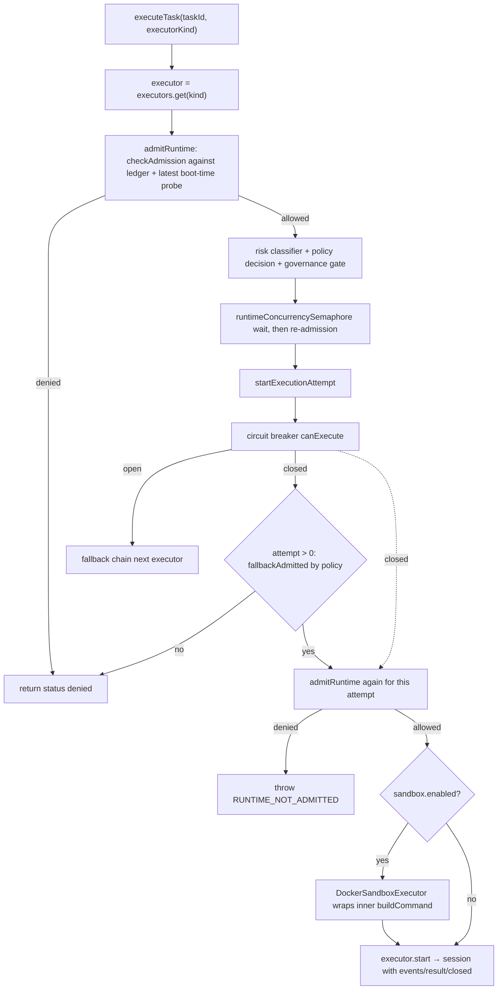

# Agent Runtimes & Executor Adapters

The server executes tasks by adapting external agent runtimes behind one uniform
contract. `packages/server/src/execution/types.ts` defines the boundary — one
`ExecutorKind` taxonomy, one `TaskExecutor` interface, one `ExecutionSession`
handle — and the `ExecutionEngine` registers, admits, selects, guards, and
supervises every implementation. Everything the rest of the system knows about a
run (events, result, failure classification, cancellation) flows through these
types, so adding a new runtime means implementing the contract, registering it,
**and adding it to the admission ledger** — not touching the orchestration spine.

Registration alone does not make a runtime usable. Before the engine hands a task
to any executor, `runtime-admission.ts` must hold a reviewed, evidence-backed
assessment for that exact `runtime@version`; before a loop worker spawns a CLI,
`RuntimeCommandService` must have re-probed the binary's interface and persisted
the probe. The admission ledger is *may we use it at all*; the contract probe is
*is the interface still there*.

## ExecutorKind taxonomy and registration

`ExecutorKind` enumerates every runtime the server can name:

```ts
export type ExecutorKind =
  'mock' | 'opencode' | 'codex' | 'claude' | 'hermes' | 'gemini' | 'editor' | 'pi'
  | 'atomic' | 'remote' | 'docker' | 'deep-agent' | 'custom';
```

The `ExecutionEngine` constructor registers ten default executors — `mock`,
`opencode`, `codex`, `claude`, `hermes`, `gemini`, `editor`, `pi`, `atomic`
(new `AtomicExecutor()`), and `remote` (new `RemoteMakerExecutor(this.db)`, the
only default built against the database) — in that order, and registers
`deep-agent` only when the operator sets `DJIMIT_DEEP_ENABLED=true`, also
creating the `DeepAgentContractIssuer` at that point (execution-engine.ts
L163–L176). `docker` is never registered standalone: it appears only as the
`kind` reported by a `DockerSandboxExecutor` that wraps another executor at
dispatch time. `custom` is the extension slot for out-of-tree implementations
registered via `registerExecutor(executor)`, which indexes by `executor.kind`.

Executors are keyed by `kind` in a `Map`, so re-registering a kind replaces the
previous adapter. Dispatchers pass the desired `executorKind` to
`executeTask()`; the engine then looks it up, runs runtime admission, checks
`executor.canExecute(task)`, and routes through the pre-execution governance
spine described in [Governance Pipeline](./governance-pipeline.md) before any
process starts.


The admission path from `executeTask` to spawn: registration is followed by two
admission checks — one before policy spend, one per attempt — with circuit
breaker, fallback, and Docker wrapping in between.

One boundary worth stating explicitly: executors are **not** mediated through
`ToolBroker`. The engine constructs a `ToolBroker` for the governance spine, but
CLI-internal tool calls never traverse it — task-level policy is enforced at
admission time (risk → policy → governance gate → approval), not per tool call
(see README and `/openwiki/concepts/governance-pipeline.md`).

## TaskExecutor, ExecutionSession, and the result/failure contract

The adapter interface is deliberately small (`types.ts`):

- `kind: ExecutorKind` — identity used for registration, circuit-breaker state,
  and metadata.
- `start(task, options?) → Promise<ExecutionSession>` — spawn/admit the run and
  return a live handle. The engine, not the executor, holds admission policy.
- `canExecute(task) → boolean` — a cheap capability probe. CLI adapters return
  `true`; `deep-agent` uses it to enforce contract binding (below).
- `buildCommand?(task, options?) → { command, args }` — the exact CLI invocation.
  This optional method is what makes Docker sandbox wrapping possible: the
  sandbox needs to re-host the command without re-implementing argument
  construction.

`ExecutionSession` is the engine's live view of a run:

- `events: AsyncIterable<ExecutionEventCreateInput>` — a streaming event source.
  The engine's `processEventStream()` persists each event to `execution_events`
  and broadcasts it over WebSocket; a stream that outlives
  `EXECUTION_EVENT_STREAM_TIMEOUT_MS` (default 5 minutes) is truncated with a
  `STREAM_TRUNCATED` event.
- `result: Promise<ExecutionResult>` — resolves once with the terminal
  status (`completed` | `failed` | `cancelled`), captured stdout/stderr, an
  optional `ExecutionFailure`, artifacts, and metrics.
- `closed?: Promise<void>` — resolves only after the owned OS child *and its
  stdio streams* close. The engine awaits `closed` before handling results,
  retries, or cancels so a "finished" task never leaves a live provider process
  behind. This is why the CLI adapters register `runtimeProcessClosed(child)`
  immediately after spawn: exit/error alone do not imply stream closure.
- `cancel()`, and optional `pause()`/`resume()` — cancellation is mandatory,
  pause/resume is advertised but not currently implemented by the built-in
  adapters.

`ExecutionResult.failure` is an `ExecutionFailure` — `code`, `message`, plus two
safety-critical booleans: `retryable` (may the engine try another provider?) and
`sideEffectsPossible` (did the failure happen after the provider might have
mutated the world?). A thrown failure is carried as `ExecutionFailureError`. When
the engine normalizes an unknown error it sets `retryable` by matching the
message against a provider-transient regex (`timeout | ECONN | 429 | 5xx | rate
limit | exit code …`) and, crucially, forces `retryable=false` whenever
`sideEffectsPossible` is true: `nextRetryExecutor()` refuses any retry if
`attempt >= maxRetries`, `!failure.retryable`, or `failure.sideEffectsPossible`.

## Runtime admission: the ledger gate before policy spend

A registered executor is not an admitted one. `execution/runtime-admission.ts`
ships a ledger (`RUNTIME_ADMISSIONS`) of `RuntimeAdmissionAssessment` records
that lives **in the repo**, so an assessment changes only through review — a
runtime never attests itself, and task metadata, runtime output, and runtime logs
are never read as evidence. Each assessment is version-bound
(`runtime_version`, with `versionMatches()` requiring the pinned semver to appear
as a whole token in the observed `--version` string) and covers:

- **Gates** — `licensing`, `reproducibility`, `interface`, `containment`,
  `lifecycle`, `evidence`, `supply_chain`, `gym_evidence`. A gate `PASS` without
  `evidence_refs` counts as `NOT_PROVEN`. `licensing`, `reproducibility`, and
  `supply_chain` are *critical*: a FAIL is an immediate `REJECT` that nothing
  else can outweigh.
- **Authority ownership** — `task`, `policy`, `approval`, `evidence`,
  `canonical_memory`, `worker_lifecycle`, `capability_registry`, `promotion` must
  all be `DJIMITFLO`: `RUNTIME` or `SHARED` ownership is a critical rejection.
- **Child agents** — `RUNTIME_INTERNAL` or `UNKNOWN` blocks full admission
  (children invisible to Djimitflo budgets/lineage are a containment hole).
- **Capability gap** — must be `PROVEN` or (for incumbents) `INCUMBENT`; `NONE`
  rejects and an unproven gap holds.

`decide()` yields `ADMIT` (clean + conditions optional → `CONDITIONAL`), `HOLD`
(unproven items), `LEGACY_ADMITTED` (unproven items but an explicit, *expiring*
legacy record naming a migration plan), or `REJECT` (critical failures). Only
`ADMIT`/`CONDITIONAL`/`LEGACY_ADMITTED` are executable. `checkAdmission()`
additionally refuses expired records (`expires_at`), refuses a non-legacy
version-bound admission when no version has been observed, and denies on runtime
drift when the probed version does not match the admitted one. The ledger holds
one record per admitted version; `runtime_health.ts` turns it into the read-only
rows exposed on `GET /health/runtimes`.

Today's ledger is deliberately asymmetric: every registered executor has an
expiring `LEGACY_ADMITTED` record (`expires_at` 2026-12-31 for the legacy set)
— `opencode@1.18.10` (incumbent maker, network egress and internal subagents not
yet contained), `atomic@0.6.5` (gym maker; plain-text interface, the diff is the
only evidence), `codex@0.146.0`, `claude@2.1.282`, unbound `remote`, `mock`,
`hermes`, `gemini`, `editor`, `pi`, `deep-agent` — plus a negative control,
`openhuman`, REJECTed on licensing/reproducibility/supply-chain FAILs with its
findings copied from `reports/openhuman-20261001/`. `runtime-admission.test.ts`
asserts both directions: every registered executor passes `checkAdmission`, and
`openhuman` never does.

Enforcement happens twice per execution (`execution-engine.ts`):

1. In `executeTask()`, right after the executor lookup (L314–L321) — a denied
   runtime returns `status: 'denied'` with `RUNTIME_NOT_ADMITTED` **before** any
   risk classification or policy evaluation spends work on it.
2. In `startExecutionAttempt()` for **every** attempt including each fallback hop
   (L624–L626: "a fallback chain is not a bypass") — throwing
   `RUNTIME_NOT_ADMITTED: <kind>`.

The observed version is Djimitflo's own: the latest `runtime_contract_probes`
row for that executor stamped at or after engine boot
(`ENGINE_BOOT_ISO`), so a probe from the previous image cannot attest a replaced
binary. Every decision — pass or fail — is persisted as a task event with the
decision and `assessmentRef` (`runtime@version#sha256prefix`), and a refused
admission is always recorded as a high-severity `runtime_admission` policy
violation via `recordPolicyViolation()`. `RUNTIME_ADMISSION_MODE=shadow` is the
operator's rollback: it records the denial (and the violation) but lets the run
proceed. Complementing admission, the shipped-code scan
(`services/shipped-code-scan.ts`, `SHIPPED_CODE_SCAN_MODE=shadow`) re-hashes the
on-disk installs of the four pinned runtimes (`@anthropic-ai/claude-code`,
`@openai/codex`, `opencode-ai` under the global node_modules root, and
`/opt/atomic-agent`), storing a content-hash row and a shadow
`shipped_code_scan` judgment whenever the bits change — a drift tripwire that
never itself changes an admission.

## The default adapters

The eight CLI adapters plus `atomic` implement `TaskExecutor` by spawning a
binary with `stdio: ['ignore','pipe','pipe']` (`atomic` pipes stdin instead of
ignoring it), parsing stdout into `ExecutionEventCreateInput`s, and deciding the
final result from exit code (with structured-event awareness where the CLI
provides it). `remote` is the exception: it spawns no local process at all —
the session polls a database-backed job queue while a compute host does the work.
They differ in binary, argument surface, and parsing strategy:

| Kind | Binary (env override) | Skip-permissions flag | Notes on CLI contract |
|---|---|---|---|
| `mock` | — (in-process) | — | Deterministic fake event stream for tests and `docker`-free development. |
| `opencode` | `opencode` (`OPENCODE_BIN_PATH`) | `--auto` | `run [--format json] [--dir] [--model] [--agent]`; NDJSON `step_start`/`tool_use`/`text`/`step_finish` with nested `part`; aggregates `step_finish` token/cost into `tokenUsage`/`costDollars` metrics (`max` per field — each step re-reports context — with a separate running `tokenSum`). An optional runway brake `OPENCODE_MAX_RUN_TOKENS` kills the child mid-run once the summed step tokens pass the cap. A run that exits 0 but contains a failed verification tool step resolves `failed` with code `VERIFICATION_FAILED` (`retryable: false`, `sideEffectsPossible: true`). |
| `codex` | `codex` (`CODEX_BIN_PATH`) | `--dangerously-bypass-approvals-and-sandbox` | `exec [--json] [--cd] [--model] [-c model_reasoning_effort=…] [--sandbox]`; accepts `thread/turn/item.*` NDJSON plus legacy `step-*`/`tool`/`text`; sums `turn.completed` `usage.input_tokens + output_tokens` into the result `tokenUsage` metric. |
| `claude` | `claude` (`CLAUDE_BIN_PATH`) | `--dangerously-skip-permissions` | `-p <prompt> --output-format json`; line-JSON then heuristic fallback. Worktree comes from spawn `cwd` (no `--cd`). |
| `hermes` | `hermes` (`HERMES_BIN_PATH`) | `--yolo` | Uses the programmatic `chat -q <prompt> --oneshot --quiet` surface instead of `hermes -z`, because `-z` bypasses approvals entirely — Djimitflo stays the approval boundary. |
| `gemini` | `gemini` (`GEMINI_BIN_PATH`) | `-y` | `-p <prompt> -o json [-m <model>]`; same line-JSON + heuristic pattern as Claude. |
| `editor` | `cline` (`CLINE_BIN_PATH`) | `--auto-approve true` | `editor` is the runtime name; the binary is `cline`. Worktree via `-c`. |
| `pi` | `pi` (`PI_BIN_PATH`) | `--no-approve` (default on via `PI_NO_APPROVE`) | `pi --mode json -p --no-session`; NDJSON `session`/`agent_start`/`tool_execution_*`/`turn_end`. Pi has no permission popups — djimitflo's policy engine is the sole boundary, so `PI_TOOLS`, `PI_OFFLINE=1`, `PI_SKIP_VERSION_CHECK=1`, `PI_TELEMETRY=0` matter for sensitive runs. |
| `atomic` | `atomic-agent` (`ATOMIC_AGENT_BIN_PATH`) | `--no-approval` | `run --cwd <dir> --max-steps <n>` (`ATOMIC_AGENT_MAX_STEPS`, default 40) with the goal on **stdin**; plain text on stdout, so no token metrics (`usage_source: 'unavailable'`) — the diff is the only evidence. Before each run it writes an idempotent `config set` (spawnSync, 15 s timeout) into a Djimitflo-owned state dir (`DJIMITFLO_ATOMIC_STATE_DIR`, default `/data/atomic-agent`), never touching the operator's `~/.atomic-agent`. The model is an OpenAI-compatible provider (default Ollama Cloud, `ATOMIC_AGENT_BASE_URL` / `ATOMIC_AGENT_MODEL`) whose key var is `OLLAMA_API_KEY` by default and overridable via `ATOMIC_AGENT_API_KEY_ENV` — that one var is passed through `buildExecutorEnv` explicitly even outside the allowlist. Without `--no-approval` it blocks on stdin at the first edit, so the flag goes on only for operator-armed `skipPermissions`. |
| `remote` | — (in-process queue) | — | `RemoteMakerExecutor` (reporting kind `remote`): no local binary. It parses `options.model` as `<host>/<species>` (e.g. `workstation/atomic@llama-router`), verifies `HEAD` is already an ancestor of `origin/main` (the host clones from GitHub), enqueues `(host, species, base_commit, prompt)` into `remote_maker_jobs`, and polls. When the host posts `done`, the returned patch (capped at 2 MiB by `MAX_PATCH_BYTES`) is applied to the local worktree with `git apply --whitespace=nowarn`, and the loop's normal gates judge the diff. An unclaimed job fails after `REMOTE_MAKER_QUEUE_TIMEOUT_MS` (default 45 min); a claimed one after `REMOTE_MAKER_TIMEOUT_MS` (default 30 min) counted **from the claim**; every cancellation stamps `remote_maker_cancelled:<reason>` into stderr so the lease's `failure_reason` carries it. Work time outranks the caller's `timeout` (`Math.max`), because a queue wait costs no local CPU and a 300–600 s maker timeout would expire before the host even looked. |

Every CLI adapter shares the same runtime-plumbing helpers:

- `runtime-process.ts` — `runtimeProcessClosed()` records the `close` promise per
  child in a `WeakMap`; `stopRuntimeProcess()` sends `SIGTERM`, escalates to
  `SIGKILL` after 5 s, and resolves only when the process actually closes (so
  cancel/timeout never leak a half-dead child).
- `executor-env.ts` — `buildExecutorEnv()` builds the child environment from an
  allowlist (`PATH`, locale, `*_API_KEY`, model vars, `*_BIN_PATH`, …) plus
  `RUNTIME_ENV_PASSTHROUGH` extras, so server secrets never reach spawned CLIs by
  default.
- `captureExecutorOutput()` — keeps a rolling 5 MiB tail of stdout/stderr for the
  final result even when events were streamed incrementally.
- `structured-runtime-event.ts` — a shared normalizer that maps
  `tool_use`/`tool_result`/error/text-shaped JSON chunks from `claude`, `gemini`,
  `editor`, `codex`, `opencode`, and `pi` into `TOOL_CALL` / `TOOL_RESULT` /
  `ERROR` / `LOG` execution events with token-usage metadata when present.

Per-executor env vars (`<RUNTIME>_EXECUTION_TIMEOUT_MS`,
`<RUNTIME>_SKIP_PERMISSIONS`, `<RUNTIME>_OUTPUT_FORMAT`, model vars such as
`DJIMITFLO_CODEX_MODEL` / `DJIMITFLO_CLAUDE_MODEL`) configure the adapter at
construction; per-call `ExecutorOptions` override them.

### Verification-aware failure (opencode)

`opencode` turns a green exit code into a red result when the run's own checks
failed. `getVerificationFailure()` classifies any `tool_use` step as a
verification when its tool is `build_check | lint | test | typecheck | type-check`
or it is a `bash` step whose command matches
`type-?check | tsc | eslint | vitest | jest | pytest | cargo test | go test | npm (run )?test`.
A verification is counted as failed when the tool state ends
`error|failed|rejected|cancelled`, or when its JSON output reports
`success === false`, a non-zero `exitCode`, `verdict === 'fail'`, or
`summary.failed_count > 0`. Metrics collection runs on **both stdout and
stderr** with line-boundary buffering (`collectMetricsFromText` keeps a partial
line in `metricsBuffer` and flushes it at `close`), and de-duplicates failures by
`(tool, reason)`. At exit 0 with any recorded failure the result resolves
`failed` with `VERIFICATION_FAILED`, `retryable: false` (the run already wrote),
`sideEffectsPossible: true`, `failureDomain: 'opencode'` — so the fallback chain
never silently re-runs a task that already mutated the worktree.

## DockerSandboxExecutor: a wrapping isolation layer

`DockerSandboxExecutor` is **not** a runtime itself — it takes an *inner*
`TaskExecutor`, asks it for its `buildCommand()` invocation, and re-hosts that
invocation inside a throwaway Docker container. The engine creates it in
`startExecutionAttempt()` when `task.metadata.sandbox.enabled === true`,
overriding image/cpu/memory/network/bind-mounts from `sandbox.*` metadata on top
of `DEFAULT_SANDBOX_CONFIG`. It reports `kind: 'docker'` regardless of the
wrapped executor, delegates `canExecute` to the inner executor, and requires the
inner to implement `buildCommand` — otherwise it fails closed with
`DOCKER_SANDBOX_INNER_COMMAND_UNAVAILABLE`.

Security invariants (all asserted by `docker-sandbox-executor.test.ts`):

- **Non-root user** — `--user 1000:1000` by default (`DOCKER_SANDBOX_USER`).
- **Drop all Linux capabilities** — `--cap-drop ALL`.
- **`no-new-privileges`** — enforced via `--security-opt no-new-privileges:true`.
- **Read-only root filesystem** + a bounded **`tmpfs` `/tmp` (64 MiB)**.
- **Network isolation by default** — `networkMode: 'none'` (`DOCKER_NETWORK_MODE`),
  with `bridge`/`host` opt-in.
- **Resource limits** — `--cpus` (`DOCKER_CPU_LIMIT`, default `1.0`) and
  `--memory` (`DOCKER_MEMORY_LIMIT`, default `512m`).
- **Digest-pinned image required** — `config.image` must contain `@sha256:`.
  `ensureImageIntegrity()` throws with remediation instructions unless the
  operator explicitly sets `DOCKER_SANDBOX_SKIP_DIGEST_CHECK=true` (logged
  warning; **not recommended for production**, since tag mutability is a
  supply-chain hole). Set `DOCKER_SANDBOX_IMAGE` to the pinned digest.
- **Automatic cleanup** — `docker run --rm` plus an explicit `docker rm -f` on
  completion/cancel; a `DOCKER_BIN_PATH` override locates the CLI.

Before starting, `start()` probes `docker --version` and fails with
`DOCKER_SANDBOX_UNAVAILABLE` if the daemon/CLI is absent. The host working
directory is bind-mounted `rw` at `/workspace` and the inner command is rebuilt
with `workingDirectory: '/workspace'`, so the inner adapter produces paths valid
inside the container. A wall-clock timeout (`DOCKER_TIMEOUT_MS`, default 10 min)
terminates the container with `SIGTERM` → `SIGKILL` after 5 s, resolving to exit
code `124`.

Deep-agent tasks refuse sandboxing outright: sandboxing for `deep-agent` is
controlled by its sovereign runtime, not by djimitflo wrapping it in Docker.

## deep-agent: the opt-in contract-gated runtime

`DeepAgentExecutor` is registered only when `DJIMIT_DEEP_ENABLED=true`. Unlike
the CLI adapters it is gated on an explicit signed contract, not on task text:

- `canExecute(task)` — true only if `task.metadata.deep_agent_contract` exists,
  its `identity.task_id` equals this task, and its capabilities specify the
  `no-tool-canary` profile. `start()` throws
  `DEEP_AGENT_CONTRACT_INVALID_FOR_TASK` otherwise. The engine adds this contract
  at admission time via `DeepAgentContractIssuer.issue(parsedTask,
  dispatcherId)` and immediately strips it from the durable task metadata so the
  contract is per-attempt provenance.
- **Two transports**:
  - *Local*: spawns `<runtimeRoot>/.venv/bin/python -m djimit_deep run-no-tool`
    under `DJIMIT_DEEP_RUNTIME_ROOT`, feeding the contract over stdin
    (Ed25519-verified via `DJIMIT_DEEP_FEDERATION_PUBLIC_KEY`, or the canary
    key).
  - *Remote*: POSTs the contract to `DJIMIT_DEEP_URL` + `/v1/execute`, but only
    if the URL is an HTTP **loopback or literal Tailscale IPv4 origin** —
    anything else throws. Responses are capped at 1 MiB.
- **Fails closed**: non-zero exit, timeout, oversized response, or an
  unparseable final status yields `status: 'failed'` with `Contract-gated Deep
  Agents canary failed closed`.
- **Never falls back and never gets fallback**: the engine refuses a fallback
  when the breaker is open on `deep-agent`, and `nextRetryExecutor()` returns
  `null` for a failed deep-agent attempt — a contract-gated run is intentionally
  terminal.

## skip-permissions: operator-armed final boundary

Individual CLI flags (`--auto`,
`--dangerously-bypass-approvals-and-sandbox`, `--yolo`, `--auto-approve true`,
`--no-approval`, `--dangerously-skip-permissions`) remove the provider's own
approval prompts. That power is guarded twice:

1. Per-executor env defaults (`OPENCODE_SKIP_PERMISSIONS`,
   `CODEX_SKIP_PERMISSIONS`, `CLAUDE_SKIP_PERMISSIONS`, `CLINE_SKIP_PERMISSIONS`,
   `GEMINI_SKIP_PERMISSIONS`).
2. **The final-boundary guard** — `resolveExecutorSkipPermissions(requested)` in
   `execution-engine.ts`:

```ts
return requested === true && process.env.RUNTIME_ALLOW_SKIP_PERMISSIONS === 'true';
```

   A task may *request* `metadata.skipPermissions = true`, but the engine only
   forwards `skipPermissions: true` to the adapter when the **operator** set
   `RUNTIME_ALLOW_SKIP_PERMISSIONS=true`. This guard lives at the executor
   boundary so direct task execution cannot accidentally enable an unsandboxed
   CLI even when task metadata asks for it — **never bypass it in new code.**

## Circuit breaker and fallback chain

Provider resilience is split across two services:

**`CircuitBreakerService`** keeps per-`ExecutorKind` state machine:
`CLOSED` → `OPEN` → `HALF_OPEN` → `CLOSED`.
- `recordFailure` opens the circuit after `CIRCUIT_BREAKER_THRESHOLD` consecutive
  failures (default 3) inside a 60 s sliding window.
- While `OPEN`, `canExecute(kind)` returns `false` until
  `CIRCUIT_BREAKER_RECOVERY_MS` (default 30 s) elapses, then one probe is allowed
  in `HALF_OPEN`.
- `recordSuccess` in `HALF_OPEN` needs 2 consecutive successes to close again.
- The engine records failures on spawn/admission errors and on `failed` results,
  and successes on `completed` results — so the breaker reflects what the
  provider did, not the final task outcome.

**`FallbackChainService`** maps each `ExecutionMode` (`fast` | `standard` |
`controlled` | `restricted`) to an ordered provider list — `standard`, for
example, tries `claude → codex → gemini`, while `restricted` is `claude` only.
`getNextAvailable()` walks the chain after the current kind, skipping breakers
that are open. Custom chains can be injected via the constructor or `setChain()`.

`maxRetries` comes from `ExecutionModePolicyService` per mode (`fast:1`,
`standard:2`, `controlled:3`, `restricted:0`), so even a retryable failure does
not chain-hop in `restricted` mode. Fallbacks are themselves re-admitted twice —
through the policy gate (`fallbackAdmitted`) and through `checkAdmission` (a
fallback chain is not a runtime-admission bypass) — before they start, and every
hop is persisted as a `Retrying with fallback executor <kind>` event carrying
`failureCode`, `failureDomain`, `retryable`, and `sideEffectsPossible`.

## Runtime contract probes in loop execution

Before any loop worker spawns a CLI, `LoopWorkerExecutorService` (executeMaker /
executeChecker) probes the binary through `LoopService.getRuntimeContract()` —
delegated to `RuntimeCommandService.getRuntimeContract()`. Three runtimes take a
conformance shortcut instead of a binary probe:

- `manual` — always `available: true, status: 'ok'` with
  `proof_class: 'static'`; the evidence says execution requires a human.
- `mock` — the deterministic in-process runtime (`proof_class: 'static'`).
- `remote` — availability mirrors the `REMOTE_MAKER_ENABLED=true` flag only;
  there is no local binary to probe, and `supports_timeout_kill: true` because a
  job can be cancelled in the queue.

Everything else goes through the `PROBES` table
(runtime-command-service.ts L161–L170) — `binEnv` names the binary override env
var, `helpArgs` the help probe, and `jsonFlag`/`cwdFlag`/`headlessFlag` the
contract requirements checked against the help output:

| Runtime | binEnv | Default bin | Help probe | json flag | cwd flag | headless flag |
|---|---|---|---|---|---|---|
| codex | `CODEX_BIN_PATH` | `codex` | `exec --help` | `--json` | `--cd` | `--json` |
| opencode | `OPENCODE_BIN_PATH` | `opencode` | `run --help` | `--format` | `--dir` | `--format` |
| claude | `CLAUDE_BIN_PATH` | `claude` | `--help` | `--output-format` | — (spawn cwd) | `-p` |
| gemini | `GEMINI_BIN_PATH` | `gemini` | `--help` | `-o` | — | `-p` |
| editor | `CLINE_BIN_PATH` | `cline` | `--help` | `--json` | `-c` | `--json` |
| pi | `PI_BIN_PATH` | `pi` | `--help` | `--mode` | — | `-p` |
| atomic | `ATOMIC_AGENT_BIN_PATH` | `atomic-agent` | `run --help` | — (plain text; empty json flag matches vacuously) | `--cwd` | `--no-approval` |

The probe runs `<bin> --version` then the help probe (both `spawnSync` bounded
by `LOOP_RUNTIME_PROBE_TIMEOUT_MS`, default 2 s, clamped to 100 ms–5 s, with a
512 KiB buffer), captures the version string plus the first 20 help lines as
evidence, and marks the contract **drifted** when a required json/cwd/headless
flag is missing from the help text (the missing categories are named in
`reason`). `withConformance()` then stamps a sha256 `contract_hash` over the
canonical `{runtime, command, version, cwd_flag, json_flag, checks}` shape with
named checks `runtime_available`, `contract_not_drifted`, `structured_events`,
`usage_accounting`, `bounded_lifecycle`; the conformance status is `pass`, `fail`,
or `manual` (`proof_class: static` for manual/mock, `runtime_probe` otherwise).
Results are cached per `runtime::command` for
`LOOP_RUNTIME_CONTRACT_CACHE_MS` (default 5 s, clamped 500 ms–60 s) and every
fresh probe is upserted into the `runtime_contract_probes` table — which is also
the observed-version source `admitRuntime()` consults, restricted to rows probed
at or after engine boot.

Both worker paths then:

1. record a `start` worker manifest (`recordWorkerManifest`, `gate_refs:
   ['runtime_contract']`) capturing the contract plus capacity/budget snapshots,
   and
2. if `!contract.available || contract.status !== 'ok'`, record a `fail`
   manifest with `blocked_reasons: ['runtime_contract_drift']`, mark the lease
   failed with `failure_reason: runtime_contract_unavailable_or_drifted`, and
   throw `RUNTIME_CONTRACT_DRIFTED` — no provider process is ever spawned
   against a drifted contract.

The `manual` runtime is always "available" but is gated before contract probing:
`executeMaker` refuses `manual` leases with `MANUAL_MAKER_REQUIRES_HUMAN` (manual
runtime requires human execution), and manual checkers can only be dispatched
with an explicit non-manual runtime. The loop daemon additionally never marks a
reviewer `remote`: a `remote` maker's reviewer runtime falls back to
`LOOP_DAEMON_MAKER_RUNTIME`, because `remote` is maker-only (it needs a
`<host>/<species>` model that reviewer dispatch does not supply).
`LoopService.getRuntimeContracts()` exposes the human-facing contract set
(`manual`, `mock`, `codex`, `opencode`, `claude`, `gemini`, `editor`, `pi`)
over `GET /loops/runtime-contracts`; `atomic` and `remote` are probeable
through `getRuntimeContract()` but enter loops via the gym/remote dispatch
paths rather than this panel. See [Loop Lifecycle](./loop-lifecycle.md) for
where these checks sit in the run state machine.

## Production worker surface and readiness

The production Dockerfile pins the three provider CLIs the worker image ships —
`npm install --global @openai/codex@0.146.0 opencode-ai@1.18.10
@anthropic-ai/claude-code@2.1.282` — and build-time-verifies all three binaries
(`git --version && codex --version && opencode --version && claude --version`)
up front (Dockerfile L93–L94: "Versions are pinned for reproducible probes").
Two more tools are pinned in adjacent layers:

- The `gh` CLI as a static `.deb` pinned via `ARG GH_CLI_VERSION=2.100.0`
  (downloaded per-arch from `github.com/cli/cli` releases, installed with
  `dpkg`, then verified with `gh --version`) because `GithubPrReviewService`
  shells out to `gh` for PR review comments and Check Runs.
- `atomic-agent` as a release tarball pinned per architecture — `ARG
  ATOMIC_AGENT_VERSION=0.6.5` with `ATOMIC_AGENT_SHA256_X64` /
  `ATOMIC_AGENT_SHA256_ARM64` checksums held in the repo, verified with
  `sha256sum -c` after download, unpacked to `/opt/atomic-agent`, symlinked into
  `/usr/local/bin`, and verified with `atomic-agent --version` (Dockerfile
  L79–L89). Holding the checksum in the repo means a later swap at the release
  origin fails the build.

The rationale for the pins is probe reproducibility: `runtime_contract` probes
hash the binary's `--version` output and admissions are version-bound, so an
unpinned `latest` install would make probe evidence, drift detection, and
admission decisions non-deterministic.

At runtime the operator-facing probe is `GET /swarms/runtime-readiness[?runtime=…]`
which:

- only treats `codex` and `opencode` as production runtimes (anything else is
  blocked with `non_mock_supported_runtime_required`),
- checks the loop runtime contracts for binary availability/version,
- verifies provider credentials (`OPENAI_API_KEY`/`CODEX_API_KEY` or a live
  `codex login status` for codex; `DJIMITFLO_OPENCODE_MODEL` plus opencode config
  for opencode), and
- reports `ready` / `blocked_reasons` per runtime without starting any worker
  (`starts_workers: false`).

For the full estate rather than just the certifiable surface, `GET
/health/runtimes` returns one read-only row per runtime (union of the admission
ledger, recent worker leases, and probe rows): admission decision and days to
expiry, admitted vs observed version with a drift flag, last probe age, 30/90-day
lease outcomes, gym species with a breaker flag, and a `readiness`
classification (`ok` | `reassess` | `retire_unused` | `keep_test_only` | `hold` |
`rejected` | `unknown_runtime`). Nothing in `runtime-health.ts` decides or
changes an admission — a runtime without a probe says `no probe`, never `ok`.

This keeps the deployable surface at or above what the
`/swarms/runtime-readiness` contract accepts: pinned, probed, admitted runtimes
rather than whatever happens to be on `PATH`.

## Related pages

- [Governance Pipeline](./governance-pipeline.md) — the policy/approval spine
  every executor start passes through.
- Security model — operator-armed skip-permissions, env allowlists, and runtime
  container isolation (see `/openwiki/concepts/security-model.md`).
- Configuration reference — the `*_BIN_PATH`, `*_EXECUTION_TIMEOUT_MS`,
  `DOCKER_*`, and `RUNTIME_*` env vars enumerated here.
- Test strategy — the executor contract tests under
  `packages/server/src/__tests__/` (`runtime-admission.test.ts`,
  `atomic-executor.test.ts`, `remote-maker.test.ts`,
  `docker-sandbox-executor.test.ts`, …).
- Task execution lifecycle — how `executeTask()` reaches
  `startExecutionAttempt()`.
