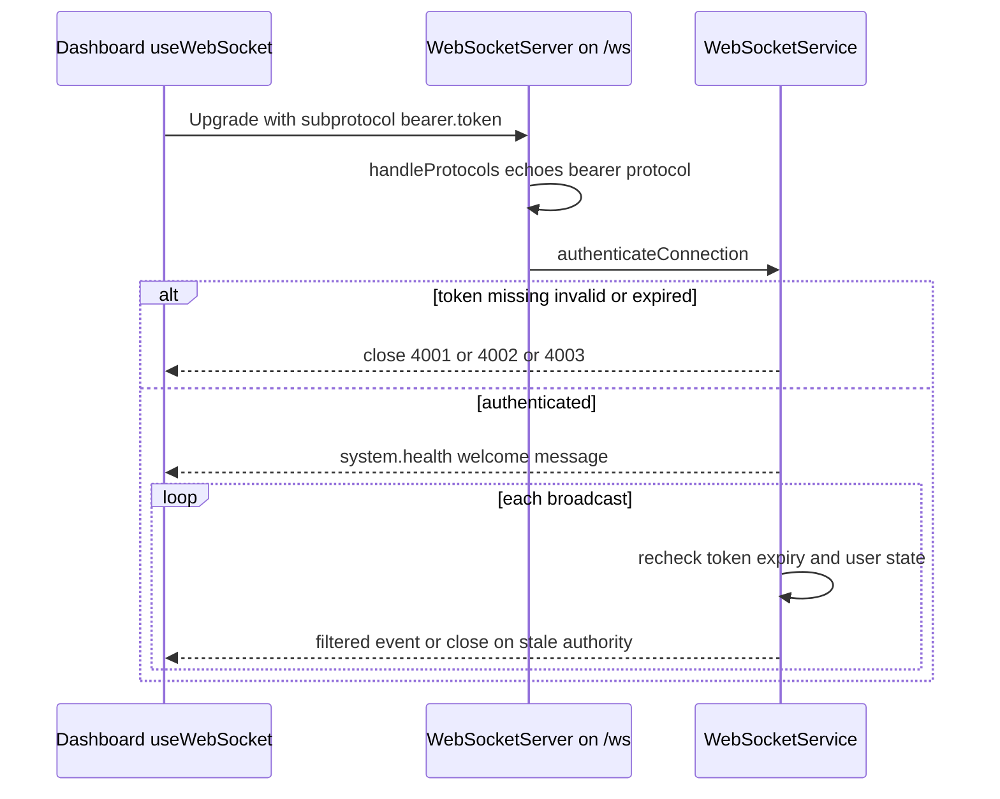

# HTTP/WebSocket API Surface & Route Inventory

This page covers the network surface the Djimitflo server actually exposes:
the `/api` route mount graph and its per-prefix authentication, the derived
OpenAPI document, the startup-mounted `/metrics` and `/health` endpoints, the
unauthenticated `/explore` explainer pages, and the authenticated WebSocket
protocol feeding the dashboard. The runtime bootstrap that wires all of these
together is covered in `/openwiki/architecture/server-runtime.md`; role and
permission semantics are covered in
`/openwiki/concepts/roles-and-permissions.md`.

## The declarative RouteMount table

`createRoutes` in `packages/server/src/routes/index.ts` builds the entire API
surface from a single declarative `mounts: RouteMount[]` array
(`{ prefix, middleware, router }` per feature prefix). After all entries are
assembled, one call to `mountRoutes(router, mounts)` registers them. This table
is the single source for **both** runtime mounting and the machine-readable
route inventory: `mountRoutes` records each layer's prefix and an
`authenticated` flag (derived from whether any mount middleware carries the
`requiresAuth: true` brand attached in
`packages/server/src/middleware/auth.ts`) in a `WeakMap` keyed by the Express
layer, because Express 5 hides mount prefixes inside matcher closures.

Order in the table is load-bearing. Express matches in registration order, so
`/swarms/spawns` (guarded by `requireAuthOrSpawnToken`) must be mounted before
the generic `/swarms` `requireAuth` mount, and the signed social-runtime
callback prefix `/swarm-v2/social-runtime` (empty middleware) likewise precedes
`/swarms` and `/swarm-v2`. The diff routes are deliberately mounted at `/` with
no mount-level guard — each diff handler authenticates itself, and a `/` guard
would also intercept later public routes such as the Telegram webhook.

`createRoutes` throws `AUTH_MIDDLEWARE_REQUIRED` at startup if `authService` or
`auth` is missing, so the API router can never be constructed without the
authentication boundary in place.

## Per-prefix authentication

Nearly every prefix mounts `requireAuth` — a Bearer-JWT check that verifies the
token, re-reads the user, refuses disabled accounts, and rebinds the principal's
role/organization from current state rather than trusting stale claims. The
exceptions are explicit:

- `/auth` mounts with empty middleware; its login/register endpoints are public
  and its protected endpoints authenticate themselves.
- `/swarms/spawns` admits either a user JWT or a scoped `X-Spawn-Token` via
  `requireAuthOrSpawnToken`, so a runtime child with no user session can POST
  spawns and poll status — but child-only callers still cannot create root
  spawns because `POST /spawns/root` requires the `write:swarm_action`
  permission inside the router.
- `/swarm-v2/social-runtime` mounts with empty middleware because it serves
  signed runtime callbacks scoped to an agent; no user JWT is accepted there.
- `/api/health` mounts with empty middleware (basic liveness is public; the
  deep and metrics variants inside that router authenticate themselves with
  `requireAuth` + `requirePermission('read:evidence')`).
- `/telegram` mounts with empty middleware so its secret webhook endpoint
  remains reachable without a user session.
- `GET /api/version` is a public direct route reporting `{ version, name: 'Djimitflo API' }`.

Within authenticated prefixes, individual handlers add
`requirePermission('<perm>')`, which is branded `requiresAuth: true` so the
inventory also counts per-route permission guards as authenticated.

## Global guards on /api

Before any route matches, the API router applies:

- **Body cap** — `limitBodySize(1_000_000)` rejects requests whose declared
  `Content-Length` exceeds 1 MB with 413 `PAYLOAD_TOO_LARGE`.
- **Security headers** — the shared `securityHeaders` middleware.
- **Global IP rate limit** — 300 requests/minute per IP via
  `express-rate-limit` (`standardHeaders: 'draft-8'`). The server sets
  `trust proxy` to 1 hop so this limiter keys on the real client IP behind the
  nginx hop; the `/traceability` prefix additionally tightens itself to
  30 requests/minute, and `/openapi.json` has its own 100-per-15-minute limiter.

## /api/openapi.json — derived, not handwritten

`GET /api/openapi.json` is `requireAuth`-guarded and lazily builds (then caches
per process) an OpenAPI 3.1 skeleton from the **live router stack**:
`collectRoutes(router)` walks mounted layers using the metadata `mountRoutes`
recorded, joining prefixes with route paths, converting Express `:param`
segments to `{param}` templates, and marking each operation with a
`bearerAuth` security requirement when it is authenticated. The spec is
deliberately paths + methods + auth flag only — no request/response schemas
(the header comment calls this state "ponytail" and names zod schemas as the
upgrade path). `collectRoutes` fails closed: it throws `Route inventory
incomplete` on any nested router that `mountRoutes` did not record, and rejects
non-string paths, so `openapi.json` can never silently omit routes.

Two sibling startup routes outside the `/api` table feed the same surface:
`GET /workstation/urls` (authenticated, enumerates the host's listening ports
via `netstat`/`ss` best-effort) and `GET /version`.

## /metrics — default-off Prometheus exposition

`GET /metrics` is mounted directly on the app in `packages/server/src/index.ts`
(outside `/api`), armed only when `METRICS_TOKEN` is set. Without the variable
it responds 404 — the endpoint is invisible, not merely forbidden. When armed,
it requires `Authorization: Bearer <METRICS_TOKEN>` compared with
`timingSafeEqual` (plain bearer, not JWT, because JWT auth does not fit
scrapers) and is rate-limited to 300 scrapes per 15 minutes per IP
(`metricsRateLimiter`, using `express-rate-limit` specifically so CodeQL's
missing-rate-limiting check recognizes it). All gauges — task/agent/loop/lease/
approval/work-item counts by status, latest OpenMythos scores per agent,
connected WebSocket clients, process uptime and RSS — are computed per scrape
directly from SQLite, so no in-process counters exist and restarts or
multi-node deploys need no extra state.

## /health and /api/health — attributable liveness

`GET /health` (app-level, public) and `GET /api/health` (in the mount table,
public) both report `status`, a timestamp, and a **build identity** drawn from
build-time environment variables: `DJIMITFLO_COMMIT_SHA` (runtime commit),
`DJIMITFLO_BUILD_COMMIT`, `DJIMITFLO_BUILD_SOURCE`, `DJIMITFLO_BUILD_TIME`,
`DJIMITFLO_INSTANCE_ID`, and a `commit_matches_build` boolean that is true only
when the running revision equals the baked build revision — making a deployed
artifact attributable only when runtime and artifact agree. `/api/health/deep`
(requires `read:evidence`) probes the database, memory pressure, active worker
leases, the knowledge runtime, and the configured LiteLLM/Ollama/Qdrant
dependencies, returning 503 when any check errors. `packages/server/src/routes/health.ts`
also implements the authenticated in-band `/api/metrics` and
`/api/metrics/json` endpoints (`read:evidence`), which are distinct from the
token-armed root `/metrics`.

## /explore — public explainer pages

`createExplorePublicRoutes` is mounted at `/explore` with no authentication and
a dedicated 120 requests/minute per-IP read limiter. It serves generated
explainer bundles: the HTML page at `/explore/:owner/:repo`, a plain-text
`llms.txt` knowledge pack, a cached `opengraph.svg` share card and `badge.svg`
README widget (both `Cache-Control: public, max-age=3600`), plus `sitemap.xml`
and `robots.txt` that advertise only published pages. Owner/repo parameters are
validated against strict patterns before any lookup, and unpublished
repositories answer 404. The `/explore/leaderboard` endpoint is default-off:
it 404s unless `OPENMYTHOS_LEADERBOARD_PUBLIC=true`, and even then emits scores
only (agent id, score, case counts, trend — no case content or prompts)
filtered to model-only governance runs. In production
`DJIMITFLO_PUBLIC_ORIGIN` is required (validated to be http/https) to build
absolute sitemap/robots URLs; its absence fails startup, not the request.

## WebSocket protocol on /ws

The `WebSocketServer` shares the HTTP server at path `/ws`. The dashboard's
`useWebSocket` hook opens the socket with the session token as a
**subprotocol** — `bearer.<token>` — rather than a query string, specifically so
tokens do not leak into access logs, browser history, or referrer headers. The
server's `handleProtocols` callback echoes the offered `bearer.*` protocol back,
satisfying RFC 6455 §4.2.2 subprotocol negotiation. `WebSocketService` then
authenticates the connection from that header (falling back to a `?token=`
query parameter): missing token → close 4001 (`AUTH_REQUIRED`), invalid token
or disabled user → 4002 (`AUTH_INVALID`), expired token → 4003
(`AUTH_EXPIRED`). On success the client receives an initial `system.health`
message.

Authentication is not a handshake-only event. Every broadcast routes through
`getAuthenticatedClient`, which closes the socket if the token has since
expired, the user was disabled or their role/email/organization changed, or
their session (`sid`) was revoked — so authority changes force clients to
rebind through a fresh connection and stale privileges are never used.

Broadcast helpers target audiences: `broadcastToAuthenticated` (everyone),
`broadcastToAdmins` (`UserRole.ADMIN`), `broadcastToUser(userId)`,
`broadcastTaskEvent` (recipients filtered by
`AuthorizationService.canReadTask`), and debate-scoped broadcasts for
subscribed clients. Slow consumers whose `bufferedAmount` exceeds
`WS_MAX_BUFFERED_AMOUNT_BYTES` (default 1 MiB) are skipped rather than
buffered. Approvals, tasks, spawns, discussions, governance feedback and loops
all consume this service (e.g. `ApprovalService` receives it via the
`wsService` route factory arguments).

On the client, `useWebSocket` reconnects after 3 s on non-auth closes only
while the session is authenticated; on an auth close code it stops
reconnecting, and on `AUTH_EXPIRED` exactly one `refreshSession` attempt is
made before giving up — so a dead session never produces a reconnect storm.
Incoming `execution.batch` envelopes are unwrapped and their inner events
dispatched individually to subscribers. During shutdown the server closes all
sockets with code 1001 and a 5-second deadline before terminating.

*WebSocket handshake and continuous re-validation: the token travels as a
subprotocol, and every send re-checks the client's authority.*

## Contract assurance

The mount table is verified end-to-end rather than trusted:

- `scripts/route-source-inventory.mjs` statically parses every
  `createXRoutes` factory (literal `router.<method>` calls only), expands the
  mount graph from `index:createRoutes` at base `/api` (detecting cyclic
  mounts), and fingerprints all route/auth sources via SHA-256.
- `packages/server/src/__tests__/route-inventory.test.ts` instantiates the real
  aggregator, compares `collectRoutes` output against the source declaration
  (`compareRuntimeRoutes` must show zero drift), probes **every** authenticated
  route over HTTP and requires a 401 for each anonymous probe, and asserts the
  `/api/openapi.json` operation count equals the inventory size. When
  `RUNTIME_ROUTE_INVENTORY_PATH` is set, the test writes the runtime inventory
  artifact for CI.
- `scripts/contract-inventory.mjs` (npm script `assurance:contracts`, also
  `assurance:route-contracts`) cross-references source declarations against
  test files, flags `critical_unclassified` routes in security-sensitive
  modules (auth, approvals, swarms, spawns, …), validates the runtime artifact's
  source fingerprint as anti-staleness, exits nonzero on drift or unclassified
  critical routes, and inventories the dashboard client's `api.ts` calls
  against registered paths.

Together these make the OpenAPI contract tests a CI gate: adding a route
without test evidence, mounting a router outside the recorded table, or letting
the runtime inventory go stale all fail the assurance run.

## Where this surface is mounted

`packages/server/src/index.ts` mounts, in order: the GitHub webhook
connector (raw-signature, before the JSON parser), the JSON parser and request
logger, `GET /health`, the `/ws` WebSocket server, `GET /metrics`,
`app.use('/api', createRoutes(...))`, `app.use('/explore', ...)`, the static
dashboard bundle with an SPA fallback that yields to `/api`, `/ws`, and
`/health` paths, and finally the error handler.
