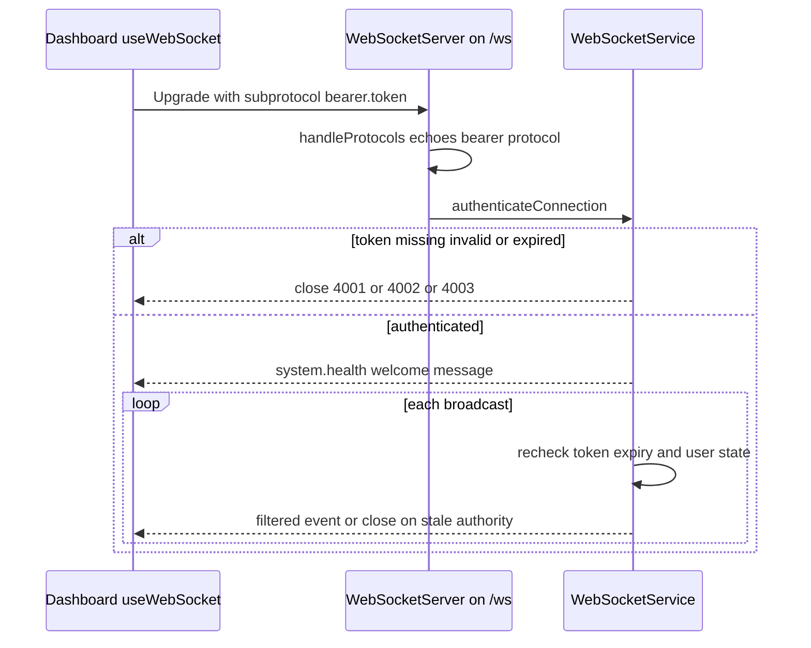

# HTTP/WebSocket API Surface & Route Inventory

This page covers the network surface the Djimitflo server actually exposes:
the `/api` route mount graph and its per-prefix authentication, the derived
OpenAPI document, the startup-mounted `/metrics` and `/health` endpoints, the
unauthenticated `/explore` explainer pages, and the authenticated WebSocket
protocol feeding the dashboard. The runtime bootstrap that wires all of these
together is covered in `/openwiki/architecture/server-runtime.md`; role and
permission semantics are covered in
`/openwiki/concepts/roles-and-permissions.md`.

## The declarative RouteMount table

`createRoutes` in `packages/server/src/routes/index.ts` builds the entire API
surface from a single declarative `mounts: RouteMount[]` array
(`{ prefix, middleware, router }` per feature prefix). After all entries are
assembled, one call to `mountRoutes(router, mounts)` registers them. This table
is the single source for **both** runtime mounting and the machine-readable
route inventory: `mountRoutes` records each layer's prefix and an
`authenticated` flag (derived from whether any mount middleware carries the
`requiresAuth: true` brand attached in
`packages/server/src/middleware/auth.ts`) in a `WeakMap` keyed by the Express
layer, because Express 5 hides mount prefixes inside matcher closures.

Order in the table is load-bearing. Express matches in registration order, so
`/swarms/spawns` (guarded by `requireAuthOrSpawnToken`) must be mounted before
the generic `/swarms` `requireAuth` mount, and the signed social-runtime
callback prefix `/swarm-v2/social-runtime` (empty middleware) likewise precedes
`/swarms` and `/swarm-v2`. The diff routes are deliberately mounted at `/` with
no mount-level guard — each diff handler authenticates itself, and a `/` guard
would also intercept later public routes such as the Telegram webhook.

`createRoutes` throws `AUTH_MIDDLEWARE_REQUIRED` at startup if `authService` or
`auth` is missing, so the API router can never be constructed without the
authentication boundary in place.

Two direct routes sit outside the mount table but inside the same `/api`
router: `GET /api/version` (public) and `GET /api/openapi.json`
(rate-limited + `requireAuth`), both registered before `mountRoutes` runs so
they appear in `collectRoutes` output as top-level paths.

## Per-prefix authentication

Nearly every prefix mounts `requireAuth` — a Bearer-JWT check that verifies the
token, re-reads the user, refuses disabled accounts, and rebinds the principal's
role/organization from current state rather than trusting stale claims. The
exceptions are explicit, and each is safe for a specific reason:

- `/auth` mounts with empty middleware; its login/register endpoints are public
  (they are the credential entry point) and its protected endpoints (e.g.
  `GET /auth/me`) authenticate themselves.
- `/swarms/spawns` admits either a user JWT or a scoped `X-Spawn-Token` via
  `requireAuthOrSpawnToken`, so a runtime child with no user session can POST
  spawns and poll status — but `POST /spawns/root` still requires the
  `write:swarm_action` permission inside the router, and `requireAuthOrSpawnToken`
  leaves `req.user` unset on the token path, so `requirePermission` 401s a
  token-only child that tries to create roots. Only operators create roots.
- `/swarm-v2/social-runtime` mounts with empty middleware because it is a
  least-privilege pull surface for signed agent-runtime pollers; each handler
  authenticates with a host-scoped HMAC token (`X-Agent-Social-Token`, scope
  `social-runtime`) validated against the spawn-token secret, and no user JWT
  is accepted there.
- `/gym-worker` mounts with empty middleware because remote compute hosts pull
  evolution-gym and maker work; claim/result/committee/kb handlers authenticate
  themselves with a host-scoped HMAC token (`X-Gym-Host` + `X-Gym-Worker-Token`,
  scope `gym-worker`). Only the operator-facing `POST /gym-worker/tokens` mint
  endpoint uses `requireAuth` + `manage:tokens`.
- `/host-agent` mounts with empty middleware for the same pull reason: fleet
  hosts heartbeat and pull commands/shadow-judgment jobs and authenticate per
  request with a host-scoped HMAC token (`X-Host` + `X-Host-Token`, scope
  `host-agent`); rejected tokens 401 and are recorded as policy violations.
  Token minting (`POST /host-agent/tokens`) stays behind `requireAuth` +
  `manage:tokens`.
- `/api/health` mounts with empty middleware (basic liveness is public; the
  deep, stalls, cockpit, and metrics variants inside that router authenticate
  themselves with `requireAuth` + `requirePermission('read:evidence')`).
- `/telegram` mounts with empty middleware so its webhook endpoint remains
  reachable without a user session; the webhook itself is authenticated by the
  `X-Telegram-Bot-Api-Secret-Token` shared secret (503 when unset, 401 on
  mismatch).
- `GET /api/version` is a public direct route reporting
  `{ version, name: 'Djimitflo API' }`.

Within authenticated prefixes, individual handlers add
`requirePermission('<perm>')`, which is branded `requiresAuth: true` so the
inventory counts per-route permission guards as authenticated even on prefixes
whose mount middleware is empty.

## Global guards on /api

Before any route matches, the API router applies:

- **Body cap** — `limitBodySize(1_000_000)` rejects requests whose declared
  `Content-Length` exceeds 1 MB with 413 `PAYLOAD_TOO_LARGE`.
- **Security headers** — the shared `securityHeaders` middleware.
- **Global IP rate limit** — 300 requests/minute per IP via
  `express-rate-limit` (`standardHeaders: 'draft-8'`). The server sets
  `trust proxy` to 1 hop so this limiter keys on the real client IP behind the
  nginx hop; the `/traceability` prefix additionally tightens itself to
  30 requests/minute, the `/api/health` router adds its own 600/minute
  per-router limiter, and `/openapi.json` has its own 100-per-15-minute
  limiter.

## Usage telemetry on /api

The router also mounts `UsageTelemetry.middleware()` before the mount table,
which counts every matched route pattern (method + status class) into a
`usage_counts` SQLite table buffered in memory and flushed once a minute —
counts only, no user ids, query strings, or bodies, so dormant surface can be
measured before consolidation. Two authenticated operator endpoints sit beside
it: `GET /api/telemetry/usage` (summarizes the last N days, clamped to 1–90)
and `POST /api/telemetry/pageview` (records a dashboard page path after
normalizing ids to `:id` and validating the shape).

## /api/openapi.json — derived, not handwritten

`GET /api/openapi.json` is `requireAuth`-guarded (behind the dedicated
100-per-15-minute `openApiRateLimiter`) and lazily builds (then caches per
process via `openApiSpec ??=`) an OpenAPI 3.1 skeleton from the **live router
stack**: `collectRoutes(router)` walks mounted layers using the metadata
`mountRoutes` recorded, joining prefixes with route paths, converting Express
`:param` segments to `{param}` templates, and marking each operation with a
`bearerAuth` security requirement when it is authenticated. The spec is
deliberately paths + methods + auth flag only — no request/response schemas
(the header comment calls this state "ponytail" and names zod schemas as the
upgrade path). `collectRoutes` fails closed: it throws `Route inventory
incomplete: unrecorded nested router` on any nested router that `mountRoutes`
did not record, and rejects non-string paths, so `openapi.json` can never
silently omit routes.

The companion test (`createRoutes exposes the platform surface through
/openapi.json`) invokes the `/openapi.json` layer handler directly and asserts
the spec exposes more than 100 paths, spot-checking well-known endpoints
across mounts (`/api/tasks/{id}`, `/api/openmythos/score/{agentId}`,
`/api/apex/llm/route`, `/api/version`, `/api/openapi.json`,
`/api/health/services`, `/api/swarms/scheduler/tick`) and the `bearerAuth`
security marker on an authenticated operation. The old container-local port
scan `GET /api/workstation/urls` was replaced by the service map at
`GET /api/health/services`; the inventory test pins a 404 regression for the
removed route.

## /metrics — default-off Prometheus exposition

`GET /metrics` is mounted directly on the app in `packages/server/src/index.ts`
(outside `/api`), armed only when `METRICS_TOKEN` is set. Without the variable
it responds 404 — the endpoint is invisible, not merely forbidden. When armed,
it requires `Authorization: Bearer <METRICS_TOKEN>` compared with
`timingSafeEqual` (plain bearer, not JWT, because JWT auth does not fit
scrapers) and is rate-limited to 300 requests per 15 minutes per IP
(`metricsRateLimiter`, using `express-rate-limit` specifically so CodeQL's
missing-rate-limiting check recognizes it). All gauges — task/agent/loop/lease/
approval/work-item counts by status, latest OpenMythos scores per agent,
connected WebSocket clients, process uptime and RSS — are computed per scrape
directly from SQLite, so no in-process counters exist and restarts or
multi-node deploys need no extra state.

## /health and /api/health — attributable liveness

`GET /health` (app-level, public) and `GET /api/health` (in the mount table,
public) both report `status`, a timestamp, and a **build identity** drawn from
build-time environment variables: `DJIMITFLO_COMMIT_SHA` (runtime commit),
`DJIMITFLO_BUILD_COMMIT`, `DJIMITFLO_BUILD_SOURCE`, `DJIMITFLO_BUILD_TIME`,
`DJIMITFLO_INSTANCE_ID`, and a `commit_matches_build` boolean that is true only
when the running revision equals the baked build revision — making a deployed
artifact attributable only when runtime and artifact agree. The `/api/health`
router also installs its own per-router limiter (600 requests/minute, visible
to CodeQL) on top of the global `/api` 300/minute cap.

`/api/health/deep` (requires `read:evidence`) probes the database, memory
pressure, active worker leases, the knowledge runtime, and the configured
LiteLLM/Ollama/Qdrant dependencies, returning 503 (`degraded`) when any check
errors and including the database provenance block (`getDatabaseProvenance(db)`)
in its response. The same router hosts the operator observability windows:
`/api/health/stalls` (silent-stall detector status per subsystem), `/api/health/cockpit`,
`/api/health/schedulers` (`manage:config`), `/api/health/services`
(the reachability service map that replaced `/api/workstation/urls`), and
several other read-only views. `packages/server/src/routes/health.ts` also
implements the authenticated in-band `/api/metrics` and `/api/metrics/json`
endpoints (`read:evidence`), which are distinct from the token-armed root
`/metrics`.

## /explore — public explainer pages

`createExplorePublicRoutes` is mounted at `/explore` with no authentication and
a dedicated 120 requests/minute per-IP read limiter. It serves generated
explainer bundles: the HTML page at `/explore/:owner/:repo`, a plain-text
`llms.txt` knowledge pack, a cached `opengraph.svg` share card and `badge.svg`
README widget (both `Cache-Control: public, max-age=3600`), plus `sitemap.xml`
and `robots.txt` that advertise only published pages. Owner/repo parameters are
validated against strict patterns before any lookup, and unpublished
repositories answer 404. The `/explore/leaderboard` endpoint is default-off:
it 404s unless `OPENMYTHOS_LEADERBOARD_PUBLIC=true`, and even then emits scores
only (agent id, score, case counts, trend — no case content or prompts)
filtered to model-only governance runs. In production
`DJIMITFLO_PUBLIC_ORIGIN` is required (validated to be http/https) to build
absolute sitemap/robots URLs; its absence fails startup, not the request.

## WebSocket protocol on /ws

The `WebSocketServer` shares the HTTP server at path `/ws`. The dashboard's
`useWebSocket` hook opens the socket with the session token as a
**subprotocol** — `bearer.<token>` — rather than a query string, specifically so
tokens do not leak into access logs, browser history, or referrer headers. The
server's `handleProtocols` callback echoes the offered `bearer.*` protocol back,
satisfying RFC 6455 §4.2.2 subprotocol negotiation. `WebSocketService` then
authenticates the connection from that header (falling back to a `?token=`
query parameter): missing token → close 4001 (`AUTH_REQUIRED`), invalid token
or disabled user → 4002 (`AUTH_INVALID`), expired token → 4003
(`AUTH_EXPIRED`). On success the client receives an initial `system.health`
message.

Authentication is not a handshake-only event. Every broadcast routes through
`getAuthenticatedClient`, which closes the socket if the token has since
expired, the user was disabled or their role/email/organization changed, or
their session (`sid`) was revoked — so authority changes force clients to
rebind through a fresh connection and stale privileges are never used.

Broadcast helpers target audiences: `broadcastToAuthenticated` (everyone),
`broadcastToAdmins` (`UserRole.ADMIN`), `broadcastToUser(userId)`,
`broadcastTaskEvent` (recipients filtered by
`AuthorizationService.canReadTask`), and debate-scoped broadcasts for
subscribed clients. Slow consumers whose `bufferedAmount` exceeds
`WS_MAX_BUFFERED_AMOUNT_BYTES` (default 1 MiB) are skipped rather than
buffered. Approvals, tasks, spawns, discussions, governance feedback and loops
all consume this service (e.g. `ApprovalService` receives it via the
`wsService` route factory arguments).

On the client, `useWebSocket` reconnects after 3 s on non-auth closes only
while the session is authenticated; on an auth close code it stops
reconnecting, and on `AUTH_EXPIRED` exactly one `refreshSession` attempt is
made before giving up — so a dead session never produces a reconnect storm.
Incoming `execution.batch` envelopes are unwrapped and their inner events
dispatched individually to subscribers. During shutdown the server closes all
sockets with code 1001 and a 5-second deadline before terminating.

```mermaid
sequenceDiagram
    participant DB as Dashboard useWebSocket
    participant WSS as WebSocketServer on /ws
    participant SVC as WebSocketService
    DB->>WSS: Upgrade with subprotocol bearer.token
    WSS->>WSS: handleProtocols echoes bearer protocol
    WSS->>SVC: authenticateConnection
    alt token missing invalid or expired
        SVC-->>DB: close 4001 or 4002 or 4003
    else authenticated
        SVC-->>DB: system.health welcome message
        loop each broadcast
            SVC->>SVC: recheck token expiry and user state
            SVC-->>DB: filtered event or close on stale authority
        end
    end
```

*WebSocket handshake and continuous re-validation: the token travels as a
subprotocol, and every send re-checks the client's authority.*

## Contract assurance

The mount table is verified end-to-end rather than trusted:

- `scripts/route-source-inventory.mjs` statically parses every
  `createXRoutes` factory (literal `router.<method>` calls only), expands the
  mount graph from `index:createRoutes` at base `/api` (detecting cyclic
  mounts), and fingerprints all route sources plus `route-inventory.ts` and
  `middleware/auth.ts` via SHA-256.
- `packages/server/src/__tests__/route-inventory.test.ts` runs an aggregate
  sweep against the **real** aggregator: it builds the API router with
  `createRoutes(db, undefined, service, auth, …)` on a test database, compares
  `collectRoutes(router)` output against `inventoryRouteSource(root)` via
  `compareRuntimeRoutes` (which must show zero drift in both directions), then
  HTTP-probes **every** route marked `authenticated` with an anonymous request
  and requires a 401 for each. To keep real `express-rate-limit` burst windows
  intact (this is an auth-boundary sweep, not a rate-limit load test) it
  rebuilds a fresh `createRoutes` router every 100 probes and re-asserts the
  fresh router's inventory equals the first; route params are replaced with a
  fixture id. The sweep also asserts `/api/version` and `/api/health` are 200
  anonymously, pins the `/api/workstation/urls` → 404 regression note
  (replaced by `/api/health/services`), mocks `fetch` to fail if any provider
  registration path is hit during the anonymous proof, and asserts the
  authenticated `GET /api/openapi.json` operation count equals the inventory
  size. When `RUNTIME_ROUTE_INVENTORY_PATH` is set, the test writes the runtime
  inventory artifact (routes, comparison, per-route probe outcomes, and summary
  counters) for CI. A companion test (`createRoutes exposes the platform
  surface through /openapi.json`) invokes the `/openapi.json` layer handler
  directly and asserts the spec exposes more than 100 paths with bearer
  security on authenticated operations.
- `scripts/contract-inventory.mjs` (npm script `assurance:contracts`, also
  `assurance:route-contracts`) cross-references source declarations against
  test files, flags `critical_unclassified` routes in security-sensitive
  modules (auth, approvals, swarms, spawns, …), validates the runtime artifact's
  source fingerprint as anti-staleness, exits nonzero on drift or unclassified
  critical routes, and inventories the dashboard client's `api.ts` calls
  against registered paths.

Together these make the OpenAPI contract tests a CI gate: adding a route
without test evidence, mounting a router outside the recorded table, or letting
the runtime inventory go stale all fail the assurance run.

## Where this surface is mounted

`packages/server/src/index.ts` mounts, in order: `securityHeaders` and CORS,
the GitHub webhook connector (raw-signature, before the JSON parser), the JSON
parser and request logger, `GET /health`, the `/ws` WebSocket server,
`GET /metrics`, `app.use('/api', createRoutes(...))`, `app.use('/explore', ...)`,
the static dashboard bundle with an SPA fallback that yields to `/api`, `/ws`,
and `/health` paths, and finally the error handler.
