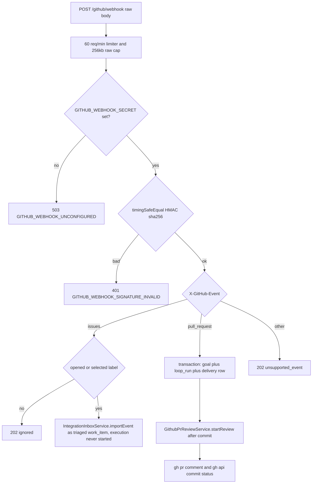

# GitHub Integration: Webhooks & PR Review

This page covers the GitHub connector in both directions. Inbound, the
`POST /github/webhook` endpoint implemented by `createGitHubWebhookRoutes` in
`packages/server/src/routes/github-webhooks.ts` has two event branches
(`issues` and `pull_request`), with `IntegrationInboxService` intake for
issues and the `GithubPrReviewService` turning pull_request deliveries into
reviewed `loop_run`s posted back to GitHub via the `gh` CLI. Outbound,
`LoopDraftPrService` ships certified loop runs as draft PRs (G4, default
off). The repository path allowlist guards everything that touches a local
checkout. Outbound Telegram, MCP drift, and other inlets share the inbox
service but are documented separately; the broader route inventory lives in
`/openwiki/integrations/exposed-surface.md`, and the goal/loop state machine
used by both PR flows in `/openwiki/workflows/maker-checker-loop.md`.

## Mounting order is load-bearing: raw bytes before JSON

In `packages/server/src/index.ts` the router is mounted at `/github/webhook`
**before** `app.use(express.json())`, with an inline comment spelling out
why: the `X-Hub-Signature-256` HMAC authenticates the exact wire bytes, so
the body must never be reserialized JSON. The same comment re-affirms the
second half of the ordering invariant: **this connector imports work items
only; it never starts goals/loops/workers** (that holds for the issues
intake at the HTTP boundary; the pull_request branch's internal,
non-LLM-interpretation review pipeline is the documented exception described
below). The router itself layers, in order:

1. an `express-rate-limit` limiter of **60 requests per minute** (draft-8
   standard headers);
2. `express.raw({ type: 'application/json', limit: '256kb', inflate: false })`,
   so `req.body` arrives as a `Buffer`.

The handler hard-fails with `400 GITHUB_WEBHOOK_RAW_BODY_REQUIRED` if the body
is not a `Buffer`, defending against any future remounting behind a JSON
parser. If `GITHUB_WEBHOOK_SECRET` is unset or blank, every POST returns
`503 GITHUB_WEBHOOK_UNCONFIGURED`. When a secret is set, the signature must
match `^sha256=[a-f0-9]{64}$` and is compared against an HMAC-sha256 of the
raw body with `crypto.timingSafeEqual`, so verification is constant-time and
never leaks prefix information.

## Repository allowlist: GITHUB_REPOSITORY_PATHS

`repository.full_name` from the payload (validated by zod as
`owner/repo`-shaped) is resolved through `configuredRepository()`, which
parses the `GITHUB_REPOSITORY_PATHS` environment variable as a JSON object
mapping repo names to local directories. A mapping is only accepted when the
value is an **absolute** path that currently exists as a directory; the stored
result is `realpathSync`-resolved, so symlink tricks cannot escape the
allowlist. Unknown repos, malformed JSON, relative paths, and missing
directories all yield `422 GITHUB_WEBHOOK_REPOSITORY_UNCONFIGURED`. This is
the same class of operator-controlled path allowlist used elsewhere on the
exposed surface, and it is complemented by the authenticated
`/repositories` scan routes (`packages/server/src/routes/repositories.ts`),
which sanitize repository paths for non-admin readers — the webhook allowlist
and the scanned-repository registry are separate mechanisms.

## Issues branch: intake only, never execution

For `X-GitHub-Event: issues`, only actions `opened` and `labeled` are accepted
(zod schema `issuePayload`); every other event type is acknowledged with
`202 { status: 'ignored' }`. A `labeled` event is itself ignored (`202`,
`label_not_selected`) unless the applied label equals
`GITHUB_LOOP_LABEL` (default `djimitflo`).

A valid delivery produces exactly one triaged work item via
`IntegrationInboxService.importEvent` with `source: 'github_issue'` and
`recommended_loop: 'repo-maintenance-loop'`:

- The issue title/body/URL are wrapped in a
  `BEGIN_EXTERNAL_CONTENT source=github_issue trust=untrusted … END_EXTERNAL_CONTENT`
  fence, because arbitrary issue text is a prompt-injection vector for any
  eventual maker run that later reads the description.
- A `risk_class` is derived from labels: `critical`/`sev1`/`p0` → critical,
  `high`/`sev2`/`p1` → high, `medium`/`p2` → medium, otherwise low.
- The response is `202 { status: 'imported', work_item_id, created,
  execution_started: false, operator_review_required: true }` — the connector
  **imports work items only and never starts goals, loops, or workers** for
  issues. A compliance audit entry (`github_issue_imported`,
  `authentication: 'github_hmac_sha256'`, `execution_started: false`) records
  that boundary decision.

Re-delivery of the same issue under a new delivery ID routes through
`WorkItemService.upsertBySourceRef`, which refreshes title, description, and
metadata but preserves operator-owned scheduling state (`status`,
`assigned_runtime`, `assigned_agent_id`, `parent_goal_id`,
`recommended_loop`) and only raises, never lowers, the risk class.

## pull_request branch: synchronous goal + loop_run, then gh-backed review

`pull_request` events with actions `opened`, `synchronize`, or `reopened`
(zod schema `pullRequestPayload`, including a 40-hex `head.sha`) take a
deliberately different path from issues. Inside one immediate SQLite
transaction the handler:

1. creates a goal whose objective is the PR title/URL wrapped in the same
   `BEGIN_EXTERNAL_CONTENT … trust=untrusted` fence, with acceptance criteria
   "Post an automated review comment and Check Run for this pull request";
2. starts a `repo-maintenance-loop` run with a single `target_finding` whose
   `file_path` is a **stable anchor file** — the first of `package.json`,
   `README.md`, `AGENTS.md` present in the repository (`422
   GITHUB_WEBHOOK_NO_ANCHOR_FILE` if none exists), giving the loop's
   bookkeeping finding a real file to point at;
3. records the delivery, then commits.

Only after the transaction commits does the handler call
`GithubPrReviewService.startReview(...)` — the code carries an explicit
comment that shelling out to `gh` must never happen inside the transaction —
and answers `202 { status: 'accepted', loop_run_id, review }`. The route
comment justifies auto-starting here versus operator review for issues: the
review is expected to behave like a CI check, and Phase 1 interprets no
untrusted content with an LLM; Phase 2 must keep the external-content
wrapping when a real LLM reads PR data.

*Webhook request flow: shared verification, then the divergent issues
(import-only) and pull_request (auto review) branches.*

## Delivery dedupe: github_webhook_deliveries

Both branches persist every processed delivery in
`github_webhook_deliveries (id, event, source_ref, result_json,
payload_sha256, created_at)` — the table is created on router construction
and `payload_sha256` is backfilled with an `ALTER TABLE` when missing.
Dedupe is keyed on the `X-GitHub-Delivery` header (restricted to
`[A-Za-z0-9-]{1,128}`) and runs inside the same transaction as the import:

- Same delivery ID **and** identical event, source_ref, and payload sha256 →
  the stored response is replayed verbatim with `200 { status: 'duplicate' }`,
  and no second review or `gh` invocation happens.
- Same delivery ID but different hash, source ref, event, or a missing stored
  result → `409 GITHUB_WEBHOOK_DELIVERY_CONFLICT`, because a delivery ID
  rebound to different content is an integrity violation, not a retry.

## GithubPrReviewService: a checker-only loop run posted back to GitHub

`GithubPrReviewService` (`packages/server/src/services/github-pr-review-service.ts`)
owns the table `github_pull_request_reviews` with a unique index on
`(owner, repo, pr_number, head_sha)` and status
`pending | commented | completed | failed`. Its docstring frames it as
Djimitflo's own replacement for the retired Kilo Code Bot, with two phases:

### Phase 1 (default, no LLM)

`runCheckerVerdict` synthesizes the maker/checker pair through the real
`LoopService` state machine: because the PR's commits already *are* the
patch, a `manual` maker lease is inserted and immediately completed with a
note that no isolated worktree exists, then a `manual` checker lease submits
the verdict via `submitCheckerVerdict` with a `manual_attestation`
(`roborev-webhook`). The verdict itself is an explicitly labeled rule-based
stub over stats fetched with `gh pr view --json title,url,additions,
deletions,changedFiles,files`:

- more than **40 changed files** or **1500 added+deleted lines** →
  `needs_revision` ("please split or request manual review");
- any path matching `/\.env|secret|credential/i` → `needs_revision`;
- otherwise `accepted`.

The loop_run legitimately settles as `blocked` (worktree/diff verification
gates fail on a worktree-less synthetic lease), which the service comment
calls expected: the verdict posted to GitHub is computed independently from
the PR's own diff stats, not from the loop outcome.

### Phase 2 (opt-in real LLM checker)

Setting `GITHUB_PR_REVIEW_RUNTIME` to one of `codex`, `opencode`, `claude`,
`gemini`, `editor`, `mock` switches `startReview` to return `pending`
immediately and run `runLlmReview` asynchronously. That path fetches
`pull/<n>/head` from origin, materializes a real worktree on a
`djimitflo/pr-review-<n>-<id>` branch, hard-resets it to the PR head SHA,
writes the `gh pr diff` output into `.djimitflo/PR_REVIEW_PACKET.md` wrapped
as untrusted external content (the first point a real LLM reads PR data),
completes the maker lease with that assignment packet, and drives a real
checker through `LoopService.executeChecker()` with a 480s timeout. It is off
by default precisely because auto-spawning a paid LLM call on every PR push
is the runaway-cost failure mode that retired the bot this replaces.

### Never-throw failure semantics and the comment body

Both phases converge on `postToGithub`: the markdown body (verdict line,
changed-file/line counts, the loop run ID, optional LLM notes, and a
"Static findings (roborev)" section when `RoborevFindingsService.readPending`
has findings matching `owner/repo` at the head SHA) is written to a temp file
and posted with `gh pr comment --body-file`. Status reporting then uses
`gh api repos/{owner}/{repo}/statuses/{head_sha}` with context
`djimitflo-review` and state `success | failure | pending` — a comment in the
code explains the Checks API rejects personal-access-token auth with a hard
403, so the older Commit Status API renders the green/red dot instead.
`startReview` never throws: any `gh`/GitHub failure is recorded as
`status: 'failed'` on the review row with the error in metadata, a
`github_pr_review_failed` audit entry is written, and the webhook still
answers 202, keeping Djimitflo's own database authoritative over a transient
GitHub outage. Every `git`/`gh` subprocess call in both phases carries a
**15s timeout** (`GH_TIMEOUT_MS`); only the Phase 2 checker LLM runs longer
(480s).

## LoopDraftPrService: certified runs leave the VPS as draft PRs (G4)

The outbound counterpart of the review flow lives entirely outside the
webhook. When the loop daemon's verification pass finds all gates passing
(step 9b of `packages/server/src/services/loop-daemon.ts`), it calls
`LoopDraftPrService.openForRun(run.id)` inside a try/catch whose comment
promises a PR failure will **never fail the daemon**. The service
(`packages/server/src/services/loop-draft-pr-service.ts`) is gated on
`LOOP_AUTO_DRAFT_PR_ENABLED === 'true'` — its docstring explains the
rationale: a certified run used to sit in a VPS worktree until it was
harvested by hand (#357, #363), but publishing to GitHub must stay opt-in,
and the merge stays human because the PR is opened as a **draft** hand-off.

`openForRun` then requires `GITHUB_REPOSITORY` (`owner/repo`) and
`GITHUB_TOKEN`; any missing precondition is not thrown but recorded as a
`draft_pr_failed` warning loop event with a null return. Only runs in
`ready_for_human_merge` or `completed` qualify, and a run whose metadata
already carries `pr_url` returns it unchanged — at most one PR per run.

The publication itself is deliberately hygienic:

- From the latest non-superseded **completed** maker lease it takes the
  worktree and branch, then commits only the maker's real files: tracked
  diffs plus untracked files, excluding anything under `node_modules`,
  lockfile install noise (a `package-lock.json` whose sibling
  `package.json` was not itself touched), and symlinks. An empty change set
  fails with `no changes in the maker worktree` instead of pushing noise.
- The push authenticates with the token passed as a one-off
  `http.extraheader` basic-auth header, so the token is never written into
  the remote URL or `.git/config` (a test asserts the absence), and any
  error message is scrubbed of `basic …` credentials before it lands in the
  `draft_pr_failed` event.
- The PR is opened over the REST API (`POST /repos/{repo}/pulls`, bearer
  token) with `draft: true`, a title prefixed `loop:` taken from the linked
  self-improvement proposal when the goal has one, base
  `LOOP_DRAFT_PR_BASE` (default `main`), remote `LOOP_DRAFT_PR_REMOTE`
  (default `origin`), and a body listing the recorded checker and
  security_checker verdicts plus the file list.
- On success the PR URL is persisted into `loop_runs.metadata.pr_url` and a
  `draft_pr_opened` event is recorded; on any failure the run is untouched
  and only the `draft_pr_failed` event remains.

## Production dependency: the pinned gh CLI in the Dockerfile

Because the review phases shell out to `gh` and the draft-PR flow shells out
to `git`, the production image (`Dockerfile`, runner stage) provisions both.
The apt layer (`L61`–`L64`) installs
`ca-certificates git python3-minimal curl procps` with
`--no-install-recommends` after a full `apt-get upgrade`; a comment over the
`gh` block (`L66`–`L68`) names `GithubPrReviewService` as the consumer of the
CLI for PR comments and Check Runs. The CLI itself is installed from a
**statically fetched, pinned `.deb`** — `ARG GH_CLI_VERSION=2.100.0`,
downloading `gh_${GH_CLI_VERSION}_linux_${ARCH}.deb` from
`github.com/cli/cli/releases` with `curl -fsSL`, installing via `dpkg -i`,
and probed with `gh --version` so a broken install fails the build — rather
than adding a third-party apt repository. The `git`, `curl`, and
`ca-certificates` packages in the same layer are what Phase 2's
fetch/reset worktree commands and the draft-PR push rely on.

## Configuration summary

| Variable | Role |
| --- | --- |
| `GITHUB_WEBHOOK_SECRET` | HMAC key for `X-Hub-Signature-256`; unset → 503 |
| `GITHUB_REPOSITORY_PATHS` | JSON map of `owner/repo` to absolute local directory (realpath-resolved) |
| `GITHUB_LOOP_LABEL` | Label selectivity for `issues/labeled` events (default `djimitflo`) |
| `GITHUB_PR_REVIEW_RUNTIME` | Opt-in Phase 2 LLM checker runtime; unset → Phase 1 stub |
| `ROBOREV_PENDING_PATH` | Location of pending roborev findings folded into the comment |
| `LOOP_WORKTREE_ROOT` | Worktree root used by the Phase 2 path |
| `LOOP_AUTO_DRAFT_PR_ENABLED` | Master switch for the G4 draft-PR hand-off (default off) |
| `GITHUB_REPOSITORY` / `GITHUB_TOKEN` | Target repo and bearer token for the draft-PR push and REST call |
| `LOOP_DRAFT_PR_BASE` / `LOOP_DRAFT_PR_REMOTE` | Draft PR base branch (default `main`) and push remote (default `origin`) |

Operator-facing defaults and environment setup are cross-referenced in
`/openwiki/operations/configuration-reference.md`.

## Focused tests

- `packages/server/src/__tests__/github-webhooks.test.ts` — the issues
  branch end-to-end: signed `opened` delivery imports a work item whose
  description contains the prompt-injection body inside the
  `BEGIN_EXTERNAL_CONTENT` fence, zero goals/loop_runs are created, a repeat
  delivery replays with 200, and a new delivery refreshes content without
  rewinding operator-set `status`/`assigned_runtime`.
- `packages/server/src/__tests__/github-pr-review-webhook.test.ts` — the
  Phase 1 PR branch with mocked `gh`: small PR → accepted with a
  `github_pull_request_reviews` row and completed maker+checker leases; large
  PRs (>40 files / >1500 lines) and sensitive paths (`.env.production`) →
  `needs_revision`; a failing `gh pr comment` records `failed` without
  crashing the webhook; duplicate deliveries re-POST with no further `gh`
  calls; roborev findings are folded into or omitted from the comment body.
- `packages/server/src/__tests__/github-pr-review-llm.test.ts` — Phase 2
  with only `gh` faked: a real `git` origin exposes `refs/pull/9/head`, the
  worktree is materialized and reset to the PR SHA, the mock checker runs
  for real, and the review settles as `commented` with both leases completed
  and the worktree containing the PR's commit.
- `packages/server/src/__tests__/loop-draft-pr-service.test.ts` — the G4
  hand-off with a real bare git remote and mocked fetch: disabled flag and
  refused GitHub responses both no-op (`draft_pr_failed` recorded, nothing
  thrown); the pushed branch contains only the maker's files (lockfile noise
  and the `node_modules` symlink excluded); the token never lands in
  `.git/config`; a second call for the same run returns the stored URL
  without re-opening the PR.
