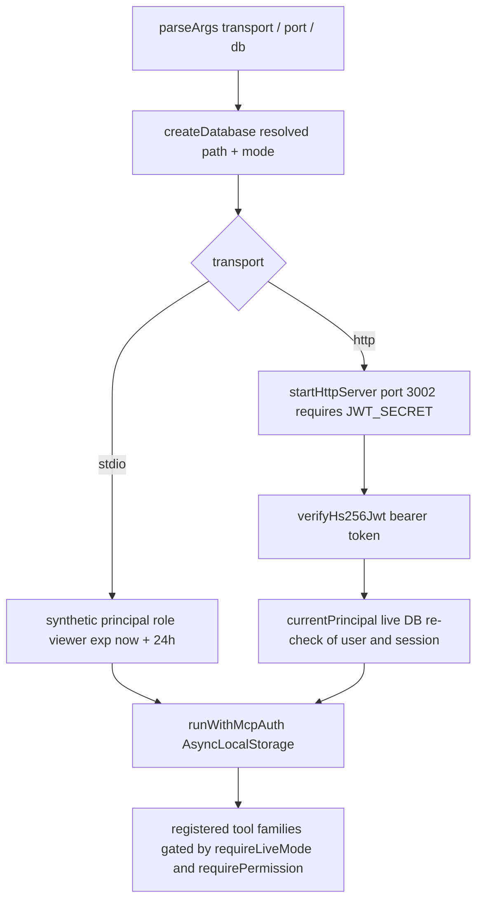

# MCP Server Package

`@djimitflo/mcp-server` (`packages/mcp-server`) is the
[Model Context Protocol](https://modelcontextprotocol.io) bridge between Djimitflo
and IDE/agent clients such as Claude Code, Cursor, or VS Code. It ships a
`djimitflo-mcp` binary that starts an `McpServer` (`name: "djimitflo"`) and
registers twelve tool families covering loops, goals, agents, mission control,
orchestration, governance, and knowledge packs. Unlike dashboard/API clients, most
tools query Djimitflo's SQLite database **directly via `better-sqlite3` rather
than through the REST API**; only a handful of tools (council, approvals, exports,
explainer pipeline runs) deliberately cross the authenticated API boundary.

```text
djimitflo-mcp --transport stdio            # default, for IDE-managed processes
djimitflo-mcp --transport http --port 3002 # remote fleet access
djimitflo-mcp --db /path/to/djimitflo.sqlite
```

## Transports and principal context



*Startup wiring: one database handle is opened first, then either a synthetic stdio
principal or per-request JWT verification establishes the AsyncLocalStorage auth
context that all tool handlers read.*

The entrypoint `src/index.ts` parses `--transport`, `--port` (default `3002`), and
`--db`, opens the database once via `createDatabase`, and builds a `createServer`
factory that registers all tool families on each new `McpServer` instance.

**stdio (default).** A host IDE launches the binary as a child process; the server
connects to `StdioServerTransport` inside `runWithMcpAuth` with a synthetic
principal: `sub` comes from `DJIMITFLO_MCP_STDIO_PRINCIPAL` or falls back to
`stdio:<uid>`, `token` comes from `DJIMITFLO_MCP_TOKEN` (or empty), and the role is
**hardwired to `UserRole.VIEWER`** with a 24-hour expiry. This means a default
stdio session can only read; every tool guarded by a permission such as
`write:swarm_action`, `write:evidence`, `create:task`, or `read:audit` throws
`MCP_PERMISSION_DENIED` because the viewer role carries none of them. Tools that do
no `requirePermission` check (the plain read loops/goals/agents/mission-control
tools, OKF, notebook bridge calls, the extractive explainer fallback) still work.

**HTTP.** `startHttpServer` in `src/transports/http.ts` refuses to start without
`JWT_SECRET` (`JWT_SECRET is required for MCP HTTP transport`). It serves the
legacy SSE protocol at `/mcp`: `GET /mcp` opens a session stream, `POST /mcp`
delivers client messages to the per-session `SSEServerTransport`, and `/health`
answers an unauthenticated liveness probe. Every request requires a Bearer token
verified with `verifyHs256Jwt` (`@djimitflo/shared/jwt`), which rejects non-HS256
algorithms, bad signatures, unknown roles, missing `sub`, and expired tokens.

### Session authority re-validation

Signed claims are not trusted at face value. `currentPrincipal` re-reads the
**current** user row when the server runs against a live authority database: the
user must be active and hold a known role, `organization_id` must match the stored
assignment, and any browser-session token (`sid`) must have a non-revoked,
unexpired `refresh_tokens` row for the same user. On success the principal's role
and email are rebound from the database, so revoking a session or demoting a user
takes effect immediately — the `http-auth` test demonstrates a tool call failing
mid-session after `refresh_tokens` revocation. Two boundary behaviors matter:

- With a **snapshot or missing authority** the verifier falls back to legacy
  behavior: tokens *with* an `sid` are rejected (a static signature check cannot
  prove a session family is still alive), while sid-less tokens pass on signature.
  A failing live lookup is a refusal, never a fallback to signature-only trust.
- Each session records a principal key `(sub, role, organization_id, sid)` at
  stream setup, and every POST's token must produce the same key — preventing a
  different (or modified) token from reusing an existing MCP session (403 on
  mismatch).

## Database access, path resolution, and snapshot/live gating

`src/db.ts` resolves the database in priority order: the `--db` flag or
`DJIMITFLO_DB`/`DB_PATH` env (relative paths resolved against `INIT_CWD`, then
cwd), otherwise the first existing candidate among `<monorepo>/.data/djimitflo.sqlite`,
`<cwd>/.data/djimitflo.sqlite`, and `<cwd>/djimitflo.sqlite`. Startup throws when no
path can be resolved or the file does not exist, and the handle always opens with
`foreign_keys = ON`. The monorepo root is derived by stripping the
`/packages/<name>` suffix from cwd, so the binary can be launched from any
workspace.

The handle carries `mode: 'snapshot' | 'live'`, taken from
`DJIMITFLO_DATA_MODE` — **any value other than exactly `'live'` yields snapshot**.
Snapshot is the default and the safety boundary for a read-mostly client: every
mutating tool calls `requireLiveMode(handle)` first and fails closed with
`DJIMITFLO_LIVE_DATA_REQUIRED` on a snapshot. Live mode additionally requires the
database to carry a persistent identity: `requireLiveMode` reads
`system_state['database_instance_id']` and throws
`DJIMITFLO_DATABASE_ID_REQUIRED` when absent, and when
`DJIMITFLO_EXPECTED_INSTANCE_ID` is set a mismatch raises
`DJIMITFLO_DATABASE_ID_MISMATCH:<actual>` so a misconfigured `DJIMITFLO_DB` cannot
silently mutate the wrong database. `databaseProvenance` (exposed by tools such as
`djimitflo_get_mission_control` and `djimitflo_get_data_provenance`) reports the
instance id, node id (`DJIMITFLO_NODE_ID` or hostname), resolved path, mode, and
`DJIMITFLO_COMMIT_SHA` so operators can verify exactly which data a session is
attached to. Do not weaken this gating: it is what makes pointing the same binary
at a copied snapshot safe.

## Auth context and permission checks

`src/auth-context.ts` stores `{ payload, token }` in `AsyncLocalStorage`
(`runWithMcpAuth`/`currentMcpAuth`); `currentMcpAuth` throws
`MCP_AUTH_CONTEXT_REQUIRED` when a handler runs outside it, which makes anonymous
mutation impossible regardless of transport. Orchestration and authority tools add
a `requirePermission` helper that checks the principal's role against
`ROLE_PERMISSIONS` from `@djimitflo/shared` and throws
`MCP_PERMISSION_DENIED: <permission>`. The platform tools (`council`, exports) and
orchestration `approve_action` forward `currentMcpAuth().token` as a Bearer header
to `DJIMITFLO_API_URL` (default `http://127.0.0.1:3001/api`), so the API re-applies
its own authorization to those calls.

## Tool family map

`registerTools` exported from `src/index.ts` mounts the twelve families below;
each tool name is listed with its mutating posture. A second registrar,
`src/register-tools.ts`, additionally mounts an `experts` family
(`djimitflo_expert_search`, `djimitflo_expert_get`,
`djimitflo_expert_capabilities`, `djimitflo_expert_claims` — read-only provenance
views over the `expert_*` tables) but is not imported by the binary's `main`, so
those tools only appear where that module is wired in explicitly.

| Family | Tools | Posture |
| --- | --- | --- |
| loops | `djimitflo_list_loop_runs`, `djimitflo_get_loop_status`, `djimitflo_get_loop_catalog` | Read-only SQL over `loop_runs`/`worker_leases`/`loop_events`; loop starts happen elsewhere |
| goals | `djimitflo_list_goals`, `djimitflo_get_goal` | Read-only over `goals` plus linked runs |
| agents | `djimitflo_list_agents`, `djimitflo_get_agent_status` | Read-only over `agents` and active leases |
| mission-control | `djimitflo_get_mission_control`, `djimitflo_get_system_health` | Read-only aggregate counts, table stats, recent errors, always including database provenance |
| orchestration | `djimitflo_spawn_agent`, `djimitflo_handoff_agent`, `djimitflo_approve_action` (mutating), `djimitflo_list_orchestration_agents` (read) | All three mutators require live mode; spawn/handoff need `write:swarm_action`, approve needs `create:task` and POSTs `/approvals` through the API |
| okf | `okf_search`, `okf_get`, `okf_related`, `okf_validate`, `okf_status` | Read-only over the file-based OKF bundle, no database involved |
| openmythos | `djimitflo_openmythos_leaderboard`, `djimitflo_openmythos_score` | Read-only over `openmythos_eval_runs`; evals are started via the REST API, not MCP |
| governance | `djimitflo_get_data_provenance`, `djimitflo_mcp_doctor`, `djimitflo_list_mcp_servers`, `djimitflo_list_mcp_tools`, `djimitflo_get_mcp_permissions`, `djimitflo_get_cost_summary`, `djimitflo_get_evidence_chain`, `djimitflo_list_openmythos_runs`, `djimitflo_list_skill_outcomes` (read) and `djimitflo_sync_mcp_catalog`, `djimitflo_sync_http_sidecar_catalog`, `djimitflo_probe_mcp_sidecars` (mutating with `apply=true`) | The three sync/probe tools default to `apply=false` dry-run previews and gate the write path behind `requireLiveMode` |
| notebooks | `notebook_list`, `notebook_create`, `notebook_delete`, `notebook_add_source`, `notebook_ask`, `notebook_generate`, `notebook_research`, `notebook_notes`, `notebook_download` | No Djimitflo DB access; all shell out to a NotebookLM bridge subprocess (see below) — create/delete/add/notes mutate the external service |
| explainer | `explainer_create_task`, `explainer_run_task` (write queue rows), `explainer_list_tasks`, `explainer_get_task`, `explainer_list_bundles`, `explainer_ask`, `explainer_search_repo`, `explainer_get_fact`, `explainer_compare_repos` (read) | Not gated by `requireLiveMode`; `explainer_ask`/`explainer_run_task` delegate to `EXPLAINER_SERVER_URL` when set, otherwise fall back to local chunk search / job enqueue |
| authority | `djimitflo_authority_trace`, `djimitflo_authority_stats` (`read:audit`), `djimitflo_authority_emit` (mutating, `write:evidence` + live mode) | `authority_emit` refuses `policyDecision: 'ALLOW'` — actionable authority requires the external producer — and stamps the authenticated principal as actor |
| platform | `djimitflo_council_ask`, `djimitflo_generate_export` (API-forwarded), `djimitflo_memory_search` (read-only SQL over `memory_candidates`) | Council/export calls carry the session Bearer token so the API's own auth applies |

Three deliberate "no-op by design" behaviors are worth knowing before extending
these tools: orchestration `djimitflo_spawn_agent` inserts a **registration-only**
idle `agents` row — its metadata records `registration_only: true` and
`context_budget_enforced: false`, and it never creates a task, worker lease, or
execution (covered by the orchestration-registration test); `djimitflo_approve_action`
creates a *pending* approval record and explicitly does not execute the action; and
`djimitflo_handoff_agent` writes a pending `fleet_handoffs` control-plane row rather
than transferring a live process.

The governance sync tools classify discovered tools with simple heuristics — tool
names matching `approve|spawn|handoff` become `requires_approval/high`, and HTTP
GET/HEAD/OPTIONS operations become `allowed/low` while other methods become
`requires_approval/medium` — so freshly synced permissions start conservative.

## External integrations

**NotebookLM bridge.** The notebooks family shells out via `execFile` to
`NOTEBOOKLM_PYTHON` (default `~/.venvs/notebooklm/bin/python3`) running
`NOTEBOOKLM_BRIDGE_PATH` (default `~/workspace/notebooklm-mcp/bridge.py`) with a
120-second timeout and 10 MB stdout buffer, expecting JSON on stdout. Failures
surface as explicit `isError` tool results including the bridge's `recovery` hint
rather than throwing — the tools work from a snapshot server because they never
touch Djimitflo state.

**OKF bundle.** `okf_*` tools resolve the knowledge bundle from `OKF_BASE` or by
probing `djimitflo-knowledge/okf` relative to the module and cwd, and walk the
markdown tree per call to build an in-memory graph of frontmatter and `[[links]]`.
`okf_validate` enforces the required frontmatter fields (`type`, `title`,
`description`, `timestamp`, `tags`) and reports broken links. A missing bundle
raises `OKF bundle not found` and is returned as an error result. See
`/openwiki/operations/knowledge-runtime.md` for how this bundle is produced.

**Explainer server.** Without `EXPLAINER_SERVER_URL`, `explainer_ask` refuses to
fabricate answers: it returns extractive citations from published knowledge chunks
or a `NOT_ENOUGH_EVIDENCE` refusal, and `explainer_create_task`/`explainer_run_task`
guarantee a pending `explainer_jobs` row so the server's `ExplainerFleetWorker`
later picks the task up. With the URL set, both delegate over HTTP (optionally with
`DJIMITFLO_API_TOKEN`).

## Testing

Focused contracts live in `src/__tests__/`:

- `db.test.ts` — path resolution against `INIT_CWD`, monorepo `.data` preference,
  snapshot default, and the database-instance-id requirement for live mutations.
- `http-auth.test.ts` — rejection matrix for live-session tokens (`revoked`,
  `expired`, `wrong-user`, `disabled`, `stale-organization`, snapshot authority),
  role rebinding from the live DB, mid-call revocation, and cross-principal session
  reuse (403).
- `orchestration-registration.test.ts` — spawn registers only an idle agent (no
  tasks/leases), and the anonymous/unauthorized/snapshot writes all fail closed.
- `mcp-server.test.ts` — registration of the full tool inventory, read-only tool
  execution in one pass, `DJIMITFLO_LIVE_DATA_REQUIRED` for every mutating apply
  path on a snapshot handle, and exact API URL forwarding for council/export tools.
- `authority-tools.test.ts` — emit/trace/stats round-trip with sequence numbering
  and payload digests, `ALLOW`-forgery refusal for every role, and snapshot/anonymous
  write rejection.

## Configuration summary

| Variable | Effect |
| --- | --- |
| `DJIMITFLO_DB` / `DB_PATH` / `--db` | SQLite path; relative values resolve against `INIT_CWD` |
| `DJIMITFLO_DATA_MODE` | `live` enables mutating tools against the operational database; anything else is the snapshot default |
| `DJIMITFLO_EXPECTED_INSTANCE_ID` | Optional pin; live mutations fail with `DJIMITFLO_DATABASE_ID_MISMATCH` when the DB's `database_instance_id` differs |
| `DJIMITFLO_NODE_ID`, `DJIMITFLO_COMMIT_SHA` | Provenance labels reported by mission-control/governance tools |
| `DJIMITFLO_MCP_STDIO_PRINCIPAL`, `DJIMITFLO_MCP_TOKEN` | stdio principal id and the token forwarded to API-calling tools |
| `JWT_SECRET` | Required for `--transport http`; verifies Bearer JWTs |
| `DJIMITFLO_API_URL` | Base URL for council/approval/export forwarding (default `http://127.0.0.1:3001/api`) |
| `OKF_BASE`, `NOTEBOOKLM_PYTHON`, `NOTEBOOKLM_BRIDGE_PATH`, `EXPLAINER_SERVER_URL`, `DJIMITFLO_API_TOKEN`, `MCP_STATUS_TTL_MS` | Knowledge-bundle, NotebookLM bridge, explainer delegation, and stale-server classification tuning |

See `/openwiki/operations/configuration-reference.md` for the fleet-wide view of
these variables and `/openwiki/architecture/monorepo-layout.md` for where this
package sits in the workspace build order (`@djimitflo/shared` must build first).

## Invariants

- Snapshot is the default; only `DJIMITFLO_DATA_MODE=live` unlocks mutations, and
  only against an identified operational database (`requireLiveMode`).
- The stdio principal is always `viewer`-role; privilege comes only from real JWTs
  on the HTTP transport, where user state, organization, and session family are
  re-validated against live data on every request.
- Mutating tools fail closed: missing auth context, insufficient role, or snapshot
  mode each throw distinct errors (`MCP_AUTH_CONTEXT_REQUIRED`,
  `MCP_PERMISSION_DENIED`, `DJIMITFLO_LIVE_DATA_REQUIRED`) before any write occurs.
- Control-plane records ≠ execution: spawn, handoff, and approval tools persist
  intent only; task/loop services and the dashboard own dispatch and decisions.
- The MCP server is a **direct SQLite peer** of the server runtime, not an API
  client — both must therefore agree on schema and on the provenance/instance-id
  contract.
