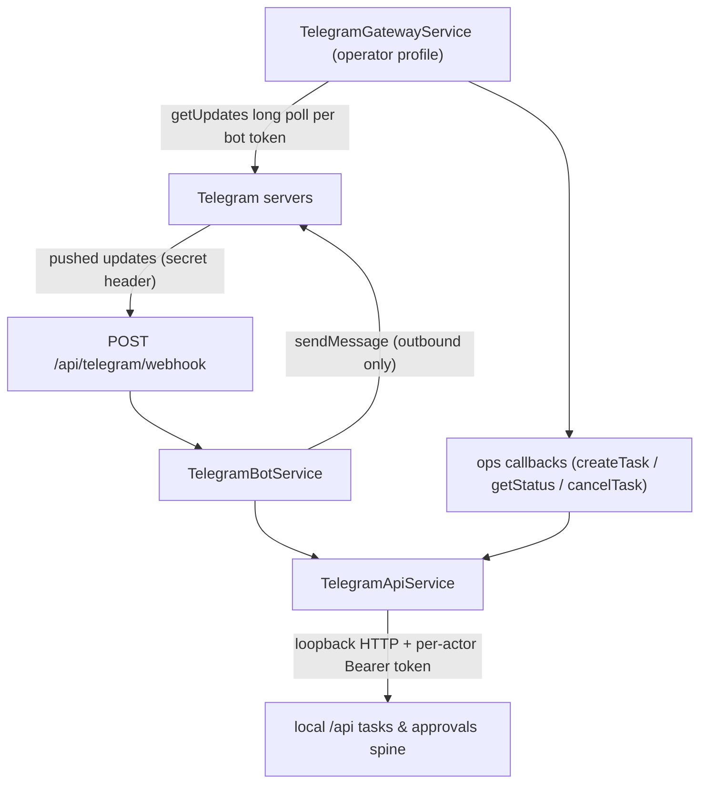

# Telegram Bot Gateway & Webhook Route

Djimitflo exposes **two independent Telegram surfaces** that share configuration
conventions but never share transport code:

1. **The long-polling gateway** (`packages/telegram`, package
   `@djimitflo/telegram`): a multi-bot grammY long poller started in-process by
   the server in operator-capable runtime profiles, guarded by filesystem
   leases so only one process polls a given bot token.
2. **The webhook route** (`packages/server/src/routes/telegram.ts`): a
   single-bot HTTP webhook mounted at `/api/telegram`, where Telegram pushes
   updates to a public URL (`TELEGRAM_WEBHOOK_URL`) authenticated by a shared
   secret header.

Both surfaces resolve Telegram senders to DjimFlo users through an explicit
allowlist + user map, and both reach the task API exclusively through
`TelegramApiService`, whose own header comment states the architecture:
*Telegram is an authenticated API client, not another task/approval writer.*
Neither surface writes tasks, approvals, or telemetry directly — every
mutation is a loopback HTTP call carrying a freshly minted per-actor Bearer
token into the ordinary `/api` task and approval routes, so ownership, audit
events, and separation-of-duties rules apply unchanged (see
[Approval Decision Flow](/openwiki/workflows/approval-decision-flow.md)).

## The polling gateway (`@djimitflo/telegram`)

`TelegramGatewayService` (`packages/telegram/src/index.ts`) is a standalone
workspace package whose only runtime dependency is grammY, dynamically imported
inside `startAll()` so merely importing the module loads nothing. It is
constructed with an array of `TelegramBotConfig` entries — `{token, machineId,
agentType, hostIp, name, allowedUsers?, userMap?}` — plus an `ops` object of
three async callbacks: `createTask(prompt, machineId, actorUserRef)`,
`getStatus(machineId, actorUserRef)`, and the optional `cancelTask(taskId,
actorUserRef)`.

### Server wiring

In `packages/server/src/index.ts` (L325–L343) the gateway starts **only when
`runtimeProfileEnablesOperator()` is true** — i.e. the `operator` or
`autonomous` profile, never the default `api` profile
(`packages/server/src/config/runtime-profile.ts`) — and only when
`TELEGRAM_BOTS_CONFIG` is set; otherwise a log line notes the gateway is
disabled. The env value is parsed as a JSON array, each entry's `allowedUsers`
and `userMap` falling back to the `TELEGRAM_ALLOWED_USERS` /
`TELEGRAM_USER_MAP` parsers shared with the webhook route, and
`TelegramGatewayService` is dynamically imported and constructed with a
`TelegramApiService` pointed at the loopback base
`http://127.0.0.1:${PORT}/api`. The instance is retained so the SIGTERM
handler can `stopAll()` it — without that, a restart sees `EEXIST` on the
lease files and skips polling (see
[Server Runtime](/openwiki/architecture/server-runtime.md)). Init and `startAll()`
failures are logged and swallowed: a broken Telegram setup never blocks boot.

### Lease protocol

Each config acquires a per-token lease file before polling:

- The lease path is `<leaseDir>/<sha256(token).hex[0:16]>.lock`, so the raw
  bot token never touches the filesystem. `leaseDir` defaults to
  `DJIMIT_TELEGRAM_LEASE_DIR` or `os.tmpdir()/djimit-telegram-leases`.
- Acquisition uses `fs.openSync(path, 'wx')` — atomic create-or-fail. The
  payload records `machineId`, `name`, a host id (sha256 of `os.hostname()`,
  12 hex chars), pid, and start timestamp.
- A 30-second unref'd heartbeat `utimesSync`s all held leases; the TTL is 2
  minutes, so a live owner never looks expired while a crashed owner's lease
  becomes reclaimable after at most two minutes.
- On `EEXIST`, takeover is two-tiered: (1) **host-qualified dead-pid probe** —
  if the recorded host matches this host and the recorded pid is dead
  (`process.kill(pid, 0)` → `ESRCH`; `EPERM` still counts as alive), the lease
  is unlinked and re-acquired — cross-host pid probes are meaningless in
  separate pid namespaces, so no pid check runs there; (2) **TTL expiry** — a
  lease whose mtime is older than the TTL is reclaimed regardless of host or
  payload readability, so a truncated lease written by a crashed writer can
  never wedge polling forever. An `ENOENT` between `EEXIST` and `statSync` is
  treated as a release and immediately retried.
- If acquisition still fails, `startAll()` retries with backoff
  (2 s, 5 s, 15 s, 30 s, 60 s) to ride out an overlapping restart, then warns
  and skips that bot.
- Per-bot init failure removes that bot's lease file so one bad token doesn't
  strand a lease; `stopAll()` clears the heartbeat, `Promise.allSettled`s every
  `bot.stop()`, and unlinks all leases.

### Authorization and commands

A grammY middleware runs before every command handler and enforces the
whole contract in one place: the sender id must be present, must be in
`allowedUsers`, **and** must map through `userMap` to a non-blank actor string
— anything else gets '⛔ Telegram user is not authorized and linked to a
DjimFlo account.' and is dropped. The comment at the middleware states the
invariant: *a bot token identifies the transport, never the requesting user.*
Commands are deliberately narrow — `/start`, `/status`, `/task
<beschrijving>`, `/cancel <task_id>` — where `/task` forwards the prompt and
the config's `machineId` to `ops.createTask`, binding the task to that bot's
machine; `/cancel` without a wired `cancelTask` op surfaces
`TASK_CANCELLATION_UNAVAILABLE`. Because a polling bot owns the update stream,
Telegram's 409 "another getUpdates consumer" conflict is handled as
first-class: both `bot.catch` and the `bot.start()` rejection log a warning
and keep the process alive rather than crashing.

## The webhook route (`/api/telegram`)

`createTelegramRoutes(db, auth?, _wsService?, api?)` mounts at `/telegram`
under `/api` with **no mount-level middleware** — the webhook authenticates
itself, and any blanket guard at `/` or `/telegram` would break Telegram's
calls (the mount table deliberately leaves this prefix open; see
[HTTP/WebSocket API Surface](/openwiki/integrations/exposed-surface.md)). The
mount also constructs its own `TelegramApiService` against the loopback base
so the webhook surface works even when the polling gateway is not running.

### Env parsing and readiness

Three exported pure functions define the configuration contract:

- `parseTelegramAllowedUsers(value)` — comma-separated numeric ids; blanks and
  non-numeric entries are dropped (`Number.isFinite` filter).
- `parseTelegramUserMap(value)` — a JSON object of Telegram-id → user ref.
  Non-object/array JSON and any entry whose key is not an all-digit string or
  whose value is a blank/non-string is discarded; parse failure yields `{}`.
- `telegramConfigStatus(env, configured)` — reports `{configured, ready,
  allowed_user_count, webhook_configured, linked_identity_count,
  missing_env}`. `ready` requires **all five** of `TELEGRAM_BOT_TOKEN`,
  a non-empty allowed-user list, `TELEGRAM_WEBHOOK_URL`,
  `TELEGRAM_WEBHOOK_SECRET`, and a non-empty user map. The report is
  count-and-name only — token, URL, secret, and mapped user refs are never
  included in the payload, so the status endpoint cannot leak credentials.

On router creation, `TelegramBotService.configure()` runs only when
`TELEGRAM_BOT_TOKEN` is present.

### Endpoints

**`POST /api/telegram/webhook`** fails closed at three gates before any body
handling:

1. bot not configured → `503`;
2. `TELEGRAM_WEBHOOK_SECRET` unset → `503` (a public webhook with no secret
   must never process updates);
3. `X-Telegram-Bot-Api-Secret-Token` header ≠ secret → `401`.

Only then is the body passed to `bot.handleWebhook()`, which returns `{ok:
true}` on success and `500` on internal error.

**`GET /api/telegram/status`** requires auth (or passes through when no auth
middleware was supplied, as in tests) and returns `telegramConfigStatus()`.

### `TelegramBotService` behavior

`handleWebhook()` validates the payload shape (safe-integer chat/from ids,
string text) and then applies the four-step identity ladder **before** any
command runs:

1. sender id ∈ `allowedUsers`, else '⛔ You are not authorized';
2. sender linked via `userMap` to a user ref resolved at `configure()` time
   against `users.id` *or* `users.email`, else '⛔ Telegram identity is not
   linked to a DjimFlo user';
3. the linked DjimFlo account is still `is_active`, else '⛔ DjimFlo account
   is disabled or no longer linked'.

Commands (`/start`, `/status`, `/loops`, `/agents`, `/dennis`, `/dennis_task`,
`/mission`, `/help`, `/approve`, `/reject`, `/task`, `/cancel`; the
`@botname` suffix is stripped during parsing) split into two kinds:

- **Read-only DB summaries** (`/status`, `/loops`, `/agents`, `/mission`,
  `/dennis`) query SQLite directly — loop/agent/worker counts, Dennis
  readiness snapshot — and cannot mutate anything (loop start/stop is
  explicitly not exposed).
- **Mutations** go through the optional `TelegramApiService`: `/task` posts a
  `local`-mode pending task with machine `telegram-webhook`; `/cancel` calls
  the task cancel route; `/approve` and `/reject` (the latter maps to
  `/approvals/:id/deny`) hit the approval routes, and a
  `SELF_APPROVAL_FORBIDDEN` response is translated to the Dutch 'Je kunt je
  eigen aanvraag niet goedkeuren.' — separation of duties survives Telegram.
  `/dennis_task` additionally permission-checks `create:task`, ensures the
  `dennis-agent` row exists, and creates a `dry_run`-only task pinned to
  Dennis with approval-gated metadata. If no `api` was injected, every
  mutation answers `TELEGRAM_API_UNAVAILABLE`.

Outbound delivery is one-way and fire-and-forget: `sendMessage()` POSTs
MarkdownV2 to `api.telegram.org/bot<token>/sendMessage` with a 15 s timeout,
pre-escaping MarkdownV2 metacharacters, and `broadcastAlert()` /
`requestApproval()` fan text out to the allowlist. Because the request URL
embeds the credential, **all fetch errors are collapsed to
`TELEGRAM_DELIVERY_FAILED`** — raw errors could smuggle the token into logs —
and secrets handling here stays aligned with the secret-patterns service, as
verified by the delivery-rejection tests.

## `TelegramApiService` — the authenticated chain

The constructor enforces `TELEGRAM_API_MUST_BE_LOCAL`: the base URL must be
`http:` on `127.0.0.1`/`localhost`/`[::1]` with no embedded credentials, so a
mapped user's Bearer token can never be forwarded to a remote origin.
`requireActor(ref, permission?)` resolves the actor by id or email, rejects
disabled/unlinked accounts (`AUTH_DISABLED_OR_UNLINKED`), and enforces RBAC
(`FORBIDDEN`). `request()` mints a fresh JWT per call
(`auth.generateToken(user)`) and fetches with `redirect: 'error'` and a 15 s
timeout; non-2xx responses surface the server's error code. The `createTask`,
`getStatus`, and `cancelTask` fields are exactly the `ops` shape the polling
gateway consumes, so the same chain test exercises both surfaces.

The net effect, proven end-to-end in `telegram-api-chain.test.ts`: wrong
webhook secret → 401; unknown/unlinked/unpermitted sender → zero tasks; an
allowed `/task` creates a pending task owned by the mapped user with a
`task.created` audit event and WebSocket broadcast; the owner cannot self-
approve; an approver-role user approves and the mock execution completes; a
viewer gets `FORBIDDEN`; only the owner can cancel a running task; a disabled
account stops creating tasks immediately.

## Failure semantics and operational notes

- **Duplicate pollers** are prevented by the lease file, not by Telegram
  409s: a second process (or a restart before SIGTERM cleanup) sees `EEXIST`,
  retries with backoff, then skips that bot with a warning. Reclaim paths are
  same-host dead-pid takeover and 2-minute TTL expiry; the 30 s heartbeat
  keeps a healthy owner fresh.
- **Gateway or webhook misconfiguration never blocks the server.** Missing
  `TELEGRAM_BOTS_CONFIG` logs and continues; gateway init failures warn;
  the webhook 503s until configured; per-bot init failure is contained to
  that bot and cleans up its lease.
- **Restart correctness depends on SIGTERM** calling `stopAll()` (heartbeat
  cleared, bots stopped, leases unlinked) — wired in
  `packages/server/src/index.ts` L403–L405. Without it the next boot must
  wait out retries or the TTL.
- All Telegram variables (`TELEGRAM_BOTS_CONFIG`, `TELEGRAM_BOT_TOKEN`,
  `TELEGRAM_ALLOWED_USERS`, `TELEGRAM_USER_MAP`, `TELEGRAM_WEBHOOK_URL`,
  `TELEGRAM_WEBHOOK_SECRET`, `DJIMIT_TELEGRAM_LEASE_DIR`) are tabulated in the
  [Configuration Reference](/openwiki/operations/configuration-reference.md)
  with defaults and danger ratings.

## Focused tests

- `packages/telegram/src/index.test.ts` — lease lifecycle in a temp
  `leaseDir`: duplicate-token `EEXIST` skip, same-host dead-pid takeover,
  live-pid non-takeover, TTL-expiry takeover regardless of host, truncated
  lease reclaimed after TTL but not while fresh, heartbeat armed by
  `startHeartbeat()` and cleared by `stopAll()`.
- `packages/telegram/src/transport.test.ts` — real grammY update handling:
  unknown and unlinked senders never reach `ops`; `/task@fixture_bot` and
  `/status` forward `(text, machineId, actor)` exactly.
- `packages/server/src/__tests__/telegram-api-chain.test.ts` — the full
  webhook → loopback API → owned task → independent approval → mock execution
  chain; loopback-only base URL enforcement; Telegram delivery rejections
  surfaced without credentials; secret-gated webhook reachable through the
  full router without making diff/status routes public.
- `packages/server/src/__tests__/public-boundaries.test.ts` — missing
  `TELEGRAM_WEBHOOK_SECRET` fails closed with 503.
- `packages/server/src/__tests__/live-canvas.test.ts` (Telegram section) —
  env parsing, readiness output excludes secrets, disabled-account and
  role-downgrade behavior, Dennis dry-run task creation.
