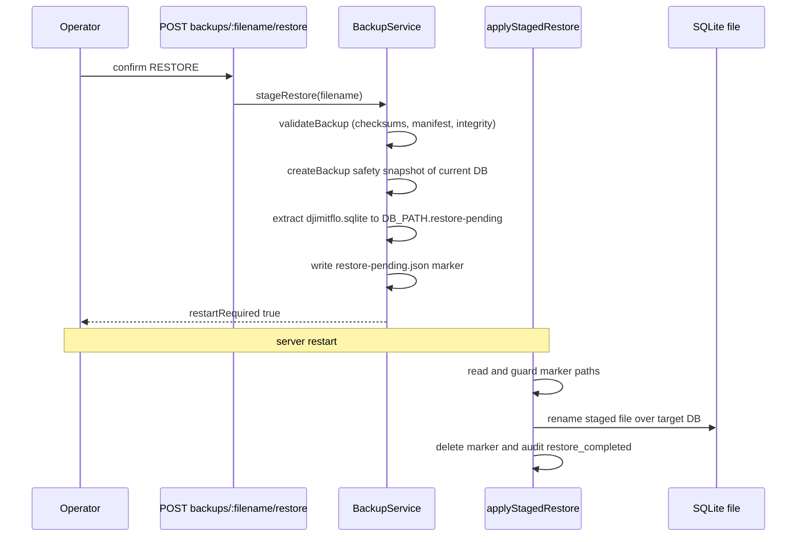

# Backup, Restore & Data Retention

This runbook covers the data-lifecycle surface of the Djimitflo control plane: how
`BackupService` produces tamper-evident `tar.gz` snapshots of the SQLite database,
how restores are staged and applied as a two-phase operation across a restart, which
scheduled services keep the data volume from filling up, and what the archives do —
and deliberately do not — contain. For the schema and migrations of the database
being snapshotted, see [SQLite Data Model, Migrations & Provenance](/openwiki/architecture/data-model.md);
for profile-gated service startup, see [Server Runtime & Startup Composition](/openwiki/architecture/server-runtime.md).

## Components and wiring

Four pieces collaborate:

- **`BackupService`** (`packages/server/src/services/backup-service.ts`) — creates,
  lists, validates, downloads, and stages restores of backup archives. Constructed
  per-request-surface with the live `better-sqlite3` handle, the resolved backup
  directory, and an `AuditService` so every lifecycle step lands in the audit chain.
- **HTTP routes** (`packages/server/src/routes/backup.ts`) — `createBackupRoutes(db, auth)`
  mounts all endpoints under `/api/backups` behind `requireAuth` plus the
  `manage:backups` permission (`auth.requirePermission`).
- **`applyStagedRestore()`** (`packages/server/src/database/index.ts`) — startup-side
  half of the restore protocol; runs as the very first step of
  `initializeDatabase()`, before the database handle is opened.
- **`RetentionService` and `DiskGuardService`** — scheduled lifecycle/capacity
  guards described in the second half of this page.

The backup directory resolves through `resolveBackupDir()`
(`packages/server/src/database/path.ts`): `BACKUP_DIR` when set (relative values
anchored at `INIT_CWD`), otherwise `<monorepo-root>/.data/backups`. The routes file
derives the same default from `DB_PATH`'s parent directory when `BACKUP_DIR` is
unset. Both the database module and `BackupService`'s constructor create the
directory if missing, and `database/index.ts` re-exports the resolved `BACKUP_DIR`
and `DB_PATH` for callers that must not re-derive paths.

## Backup artifact contract

A backup is a gzipped tar named `backup-<YYYYMMDD>-<HHmmss>.tar.gz` (local server
time). The name is not cosmetic — every read path enforces it:

- **Filename regex:** `validateFilename()` requires an exact match of
  `/^backup-\d{8}-\d{6}\.tar\.gz$/` and additionally rejects any name containing
  `/`, `\`, or `..`, or differing from its own `basename()`. This blocks path
  traversal on validate, download, metadata, and restore endpoints.
- **Expected entries — exactly three files:**
  - `manifest.json` — descriptor and integrity record (schema below).
  - `djimitflo.sqlite` — a consistent copy of the live database produced by
    better-sqlite3's online backup API (`db.backup(targetPath)`), so the snapshot
    is transactionally coherent even under WAL mode with concurrent readers.
  - `checksums.sha256` — two lines of `<sha256>  <name>` covering
    `manifest.json` and `djimitflo.sqlite`, in the classic `sha256sum` format.
- **Sidecar manifest:** alongside the archive, the service writes
  `<filename>.manifest.json` — a plaintext copy of the manifest used by
  `listBackups()`, `getBackupMetadata()`, and `downloadBackup()` so listing never
  has to untar anything. `listBackups()` only returns names matching the regex,
  so working files like `restore-pending.json` never surface as backups.

The manifest (`BackupManifest`, `backupVersion: '1.0'`) records `appVersion`
(from `getAppVersion()`), `createdAt`, the source `databasePath`, per-table row
`tableCounts` (all non-`sqlite_%` tables), `databaseSizeBytes`, a
`databaseSha256` of the copied file, `createdBy` (actor email/id or `system`),
`hostname`, operator `notes`, and a fixed `warnings` array. A manifest larger than
**64 KiB** (`MAX_MANIFEST_SIZE`) is rejected at validation time.

The warnings are part of the contract and read:

1. *"This backup contains password hashes and governance evidence. Treat as confidential."*
2. *"Environment secrets (JWT_SECRET, etc.) are NOT included. Store separately."*
3. *"Repository working trees are NOT included."*

In other words: an archive is confidential — anyone holding it can offline-attack
password hashes and read all governance/audit evidence — but it is **not
self-sufficient**: after a bare-metal restore you must re-provision every env
secret (`JWT_SECRET`, provider keys, …) and re-clone repository working trees.
Protect the backup directory accordingly; `BackupService` performs no encryption.

## Validation pipeline

`validateBackup(filename)` is both a standalone endpoint
(`POST /api/backups/:filename/validate`) and a mandatory precondition of staging
a restore. It extracts the archive into a throwaway `.validate-<uuid>` directory
and accumulates `errors`; the backup is valid only when the list is empty.

Extraction is hostile-archive-hardened (`extractTarGzSafe`): symlink/hardlink
entries are skipped, entry names starting with `/` or containing `..` or `\` are
skipped, duplicates are skipped, and anything outside the three expected names is
skipped — writes always land at `join(targetDir, basename(name))`.

Checks performed:

1. Filename passes `validateFilename()` and the file exists in the backup dir.
2. `checksums.sha256` present; both listed hashes match the freshly computed
   SHA-256 of the extracted files.
3. `manifest.json` present, ≤ 64 KiB, and parseable; the embedded
   `databaseSha256` matches the extracted database's actual hash.
4. **Major-version gate:** the backup's `appVersion` major digit must equal the
   running app's major digit, otherwise validation fails with an
   `App version mismatch` error.
5. **SQLite integrity:** the extracted database is opened read-only and
   `PRAGMA integrity_check` must return exactly `ok`.

The result (`ValidationResult`) carries `valid`, `errors`, the parsed `manifest`,
and `integrityCheck: 'ok' | 'failed'`; every call records a `backup.validated`
audit event with the outcome.

## Two-phase restore

Restore never mutates the running database. It is split across a staging call and
the next process start:

*Staging copies the snapshot beside the live database and writes a marker; the
swap itself only happens at the next startup, before the handle opens.*

**Phase 1 — staging** (`POST /api/backups/:filename/restore` → `stageRestore`):

1. Requires the body `{ "confirm": "RESTORE" }` verbatim; anything else is a 400.
2. Re-validates the archive with the full pipeline above — a backup that passed
   validation earlier is re-checked at restore time.
3. Creates a **safety backup of the current database** first (notes:
   *"Pre-restore safety backup"*), giving an automatic rollback target. This is
   audited as `backup.pre_restore_created` at `HIGH` risk.
4. Extracts `djimitflo.sqlite` and copies it to `<DB_PATH>.restore-pending`.
5. Writes `restore-pending.json` into the backup directory, recording
   `stagedDbPath`, `targetDbPath`, `safetyBackupFilename`, `timestamp`,
   `actorId`/`actorEmail`, and `restoreFrom`. Staging is audited as
   `backup.restore_started` (HIGH risk) and the response returns
   `restartRequired: true` — the active database is untouched, as the test
   suite asserts.

**Phase 2 — startup apply** (`applyStagedRestore()`): `initializeDatabase()`
calls it before opening the database. If `restore-pending.json` exists it:

- rejects markers missing `stagedDbPath`/`targetDbPath`;
- strips NUL bytes and refuses any staged or target path containing `..` or `\`
  (a marker is only writable by the server, but the guards treat it as
  untrusted input);
- verifies the staged file actually exists;

then atomically `renameSync`s the staged file over `targetDbPath`, deletes the
marker, and logs the safety-backup name. After schema and migrations run on the
restored file, a `backup.restore_completed` audit event is recorded with the
marker metadata. **Any failure — bad marker, missing staged file, rename error —
renames the marker to `restore-pending.json.failed` and keeps the current
database**, so a botched restore leaves the server bootable.

Operational note: because the swap targets the `DB_PATH` baked into
`database/index.ts` at module load, the marker produced by `stageRestore` (which
uses the connected database's own path) and the startup resolver agree as long as
`DB_PATH` is consistent between the request and the restart — keep it fixed in
the environment across the restart.

## HTTP API summary

All routes sit under `/api/backups`, require an authenticated user with the
`manage:backups` permission, and emit audit events per call:

| Endpoint | Behavior |
|---|---|
| `POST /api/backups` | create backup, optional `notes`; 201 with `{ filename, manifest, sizeBytes }`; audits `backup.created` |
| `GET /api/backups` | list backups (newest first) via sidecar manifests |
| `GET /api/backups/:filename` | metadata for one backup (404 if unknown) |
| `GET /api/backups/:filename/download` | streams the archive as `application/gzip`; audits `backup.downloaded` |
| `POST /api/backups/:filename/validate` | full validation pipeline; audits `backup.validated` |
| `POST /api/backups/:filename/restore` | stages restore; body must be `{ "confirm": "RESTORE" }`; audits `backup.pre_restore_created` + `backup.restore_started` |

Because archives contain password hashes and governance evidence, download access
is equivalent to handing out the credentials database — treat `manage:backups`
grants accordingly.

## Retention, compliance, and disk guard

**`RetentionService`** (`packages/server/src/services/retention-service.ts`) is the
scheduled counterpart to backups: it deletes old rows so the database — and with
it the backups — stays bounded. Started only in operator/autonomous runtime
profiles (in `index.ts` `main()`, inside the `operatorRuntime` branch) and, where
the lifecycle manager is wired, registered for a clean `stop()`. Configuration:

| Env | Default | Meaning |
|---|---|---|
| `RETENTION_ENABLED` | `true` | master switch; `false` disables start and makes `purge()` a no-op |
| `RETENTION_DAYS` | `90` | global cutoff for most tables |
| `RETENTION_RUN_ON_STARTUP` | `true` | run one purge immediately at boot |
| `RETENTION_INTERVAL_HOURS` | `24` | recurring interval via `setInterval` |

Each `purge()` computes an ISO cutoff and deletes older rows from
`experience_embeddings`, `trajectory_steps`, `vector_memories` (only rows with
`ttl IS NULL` — explicit TTLs own their own lifecycle), `cognitive_episodes`,
and `cognitive_patterns`; three hot metric tables (`llm_provider_metrics`,
`model_routing_decisions`, `model_execution_outcomes`) use a fixed **30-day**
cutoff instead. Deletion is table-name-constant (no injection surface), failures
on a missing table are swallowed as `0` deletions, and `getStats()` reports
`lastRun`, cumulative `totalPurged`, and the computed `nextRun`. Purges are
best-effort — intervals swallow rejections — and the service never touches backup
archives; archive cleanup on disk is an operator responsibility.

**`ComplianceAuditService`** adds retention *policy* on top of raw purging:
its "Retention Policies — automated data retention with legal hold" capability
(together with the classification rules in `data-classification.ts`, e.g.
`audit_evidence` at 2555 days) defines how long evidence classes must survive.
Treat compliance/legal-hold policy as an upper bound that RetentionService's
schedule must not undercut when configuring retention windows. It is constructed
as a startup side-effect in every profile.

**`DiskGuardService`** (`packages/server/src/services/disk-guard-service.ts`)
watches the capacity backups and the database share. It exists because of a real
incident (2026-09-21: the VPS disk hit 100%, SQLite failed with
`SQLITE_IOERR_SHMSIZE`, and the deploy rollback crash-looped). Default **off**;
enable with `DISK_GUARD_ENABLED=true`. Every 10 minutes (first check 30 s after
start, timer unref'd) it `statfs`s `DISK_GUARD_PATH` (default `/data`) and
classifies usage: `warn` ≥ `DISK_GUARD_WARN_PCT` (default 80%), `critical` ≥
`DISK_GUARD_CRITICAL_PCT` (default 90%). On a non-ok level it upserts **one work
item per day and level** (`source: 'disk_guard'`, `source_ref: '<day>:<level>'`,
risk class `medium`/`high`) describing remediation — prune old images and runtime
clones, check `/srv/backups` and loop worktrees — and enqueues one
`djimitflo.alert.disk` bus event per new work item. It is strictly **read-only**:
it never deletes anything itself. Started from `initAutonomousServices`
(`packages/server/src/bootstrap/autonomous-services.ts`), which `index.ts`
invokes only in the autonomous profile — so disk alerting requires the
`autonomous` runtime profile *and* `DISK_GUARD_ENABLED=true`. It is registered
with the lifecycle manager; failures to start are logged and non-fatal.

## Failure modes and operational checklist

- **Validation fails at restore time** → the restore is aborted before anything
  is staged; inspect `errors` (checksum mismatch → corrupted or tampered archive;
  version mismatch → restore on a matching major version instead).
- **Marker validation fails at startup** → the marker becomes
  `restore-pending.json.failed`, the old database boots, and you can investigate
  without downtime. The `.failed` file and any dangling `<DB_PATH>.restore-pending`
  are safe to remove once reviewed.
- **Interrupted staging** → leftover `.tmp-*`, `.validate-*`, or `.restore-*`
  directories under the backup dir are cleaned on a best-effort basis in
  `finally` blocks; stale ones are safe to delete (they never match the backup
  filename regex and never appear in listings).
- **Disk pressure** → DiskGuard gives at most one alert per day per level; if
  `warn`/`critical` items appear, free space in the backup directory first
  (old archives plus their `.manifest.json` sidecars) — RetentionService shrinks
  future growth but never deletes archives.
- **Full rebuild from a backup** → the archive alone is insufficient: also
  restore env secrets (`JWT_SECRET` etc.) and re-clone repository working trees.
  Without the original `JWT_SECRET`, all existing tokens are invalid after
  restore.

## Verification (focused tests)

`packages/server/src/__tests__/backup.test.ts` pins the contract end to end on a
real temporary SQLite database: the artifact name/regex and manifest shape
(including the confidentiality warning), table counts excluding `sqlite_%`
internals, `backup.created`/`backup.validated` audit events, filename traversal
rejection (slashes, `..`, backslashes, arbitrary names), the mandatory
`confirm: 'RESTORE'` gate, creation of the safety backup and the
`restore-pending.json` marker with staged/target paths, `restartRequired: true`,
the `backup.restore_started`/`backup.pre_restore_created` events, and that the
live database file is not overwritten by staging. `disk-guard.test.ts` covers the
80/90 thresholds, the once-per-day-and-level dedup, and the outbox event;
`loop-services.test.ts` covers the retention cutoff semantics (100-day-old rows
purged, recent kept), the `RETENTION_ENABLED=false` no-op, default stats
(90 days / 24 h), and scheduler start/stop.

## Related pages

- [SQLite Data Model, Migrations & Provenance](/openwiki/architecture/data-model.md) — the database being backed up, its boot order, and the startup-side restore details.
- [Server Runtime & Startup Composition](/openwiki/architecture/server-runtime.md) — profile gating for RetentionService and autonomous services.
- [Roles & Permissions](/openwiki/concepts/roles-and-permissions.md) — the `manage:backups` permission model.
- `/openwiki/operations/configuration-reference` — env var reference (planned).
- `/openwiki/operations/local-development` — local data-dir layout (planned).
