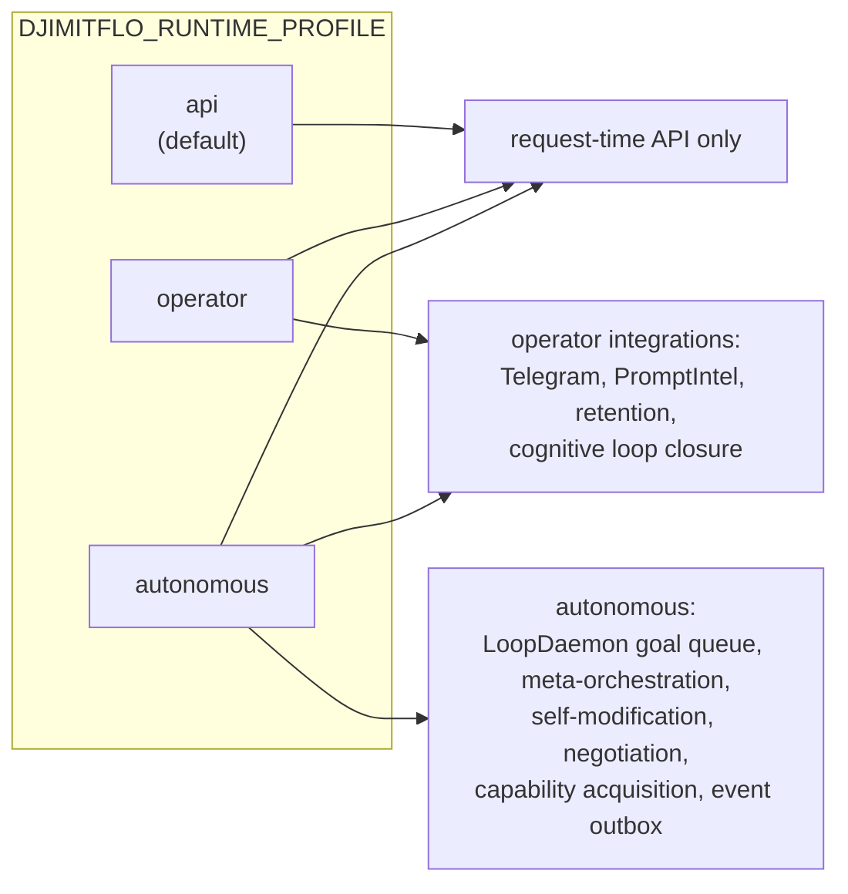

# Configuration & Environment Variable Reference

This page is the consolidated operator reference for DjimFlo's environment-variable
surface. It groups variables by the subsystem that reads them, states the default that
applies when the variable is unset, and flags the knobs that are dangerous or
destructive when armed.

Two template files ship in the repo:

- `packages/server/.env.example` — the near-complete server reference, including the
  loop-runtime, runtime-security, and nested-spawn sections.
- `.env.docker.example` — the Docker-flavored subset consumed by `docker-compose.yml`
  via `env_file: .env.docker`, plus host-port and event-bus values.

Conventions used on this page:

- **Default-off** means the feature is inert unless the variable is explicitly set
  (usually to the literal string `true`). Most autonomous/scheduler features in
  DjimFlo are default-off.
- **Default-on** means the behavior applies unless the variable explicitly disables
  it (usually `!= 'false'` semantics).
- **Danger** levels: `critical` (credential/sandbox bypass or destructive data
  behavior), `high` (bypasses an approval or integrity gate), `medium` (widens blast
  radius or spend), `low` (operational/tuning).

## Runtime profile — the master arming switch

`DJIMITFLO_RUNTIME_PROFILE` (`api` | `operator` | `autonomous`, default `api`,
invalid values warn and fall back to `api`) is the coarsest control in the system.
It decides which background services even exist:



| Variable | Default | Purpose | Danger |
|---|---|---|---|
| `DJIMITFLO_RUNTIME_PROFILE` | `api` | Selects which background services start. `operator` adds operator integrations and maintenance loops; `autonomous` adds autonomous spawning, loop daemon, and self-modification. | high (operator/autonomous enable background agents) |

Individual default-on exceptions inside the profiles:

- `DJIMITFLO_BOARD_HANDOFF_AUTONOMY` — board-handoff reconcile/publish loop runs in
  `autonomous` unless explicitly `false` (default-on once the profile is autonomous).
- `DJIMITFLO_EXPLAINER_AUTONOMY` — the explainer fleet worker runs in **every**
  profile; set `false` to disable it. It still honors the kill-switch.
- `DASHBOARD_SERVE_ENABLED` — static dashboard serving is default-on; set `false` for
  an API-only workstation node.

## Server / API

Read by `packages/server/src/index.ts`, `bootstrap/constants.ts`, and `config/env.ts`.

| Variable | Default | Purpose | Danger |
|---|---|---|---|
| `PORT` | `3001` | HTTP listen port. | low |
| `HOST` | `0.0.0.0` | HTTP listen address. `0.0.0.0`/`localhost` also drive the derived value of `DJIMITFLO_CONTROL_URL` (dial host becomes `127.0.0.1`). | low |
| `NODE_ENV` | `development` | `production` turns several warnings into fatal errors (see `JWT_SECRET`, `DJIMITFLO_PUBLIC_ORIGIN`) and gates verbose traces. | low |
| `CORS_ORIGINS` | `http://localhost:5173,http://127.0.0.1:5173` | Comma-separated allowed origins for credentialed CORS. Set to your real domain in Docker. | medium |
| `DB_PATH` | `./data/djimitflo.sqlite` (server), `/data/djimitflo.sqlite` (Docker) | SQLite database path. When unset, the server also creates the parent directory. | medium (pointing at a second file splits state) |
| `DATABASE_DRIVER` + `PGHOST`/`PGPORT`/`PGDATABASE`/`PGUSER`/`PGPASSWORD`/`PGSSL`/`PG_POOL_SIZE`/`PGSCHEMA` | `sqlite`; PG defaults localhost:5432/djimitflo | Selects SQLite vs PostgreSQL in the database driver. Note: README marks PostgreSQL as not production-ready in this repo. | medium |
| `DASHBOARD_PATH` | `packages/dashboard/dist` beside the server build (Docker: `/app/packages/dashboard/dist`) | Static dashboard assets root. | low |
| `DASHBOARD_SERVE_ENABLED` | `true` | Set `false` to run API-only (workstation execution node behind a remote cockpit). | low |
| `BACKUP_DIR` | `<project-root>/.data/backups` (Docker: `/data/backups`) | Backup artifact directory; also recorded in the backup manifest. | medium |
| `DJIMITFLO_PUBLIC_ORIGIN` | `http://localhost:$PORT` | Canonical public base URL used on explore/explainer pages. **Required in production** — the explore routes throw at request time without it; must be http(s). | low |
| `METRICS_TOKEN` | (unset → `/metrics` returns 404) | Arms the Prometheus exposition endpoint; scrapers authenticate with `Authorization: Bearer <METRICS_TOKEN>` (not JWT). | medium |
| `DJIMITFLO_HOST_PORT` | `3001` | Docker host port mapping in `docker-compose.yml`. | low |
| `RANSOMWARE_MODULE_ENABLED` | `true` | Anti-ransomware module is default-on; set `false` to disable. | medium |
| `RANSOMWARE_MODULE_MODE` | `detect` | Module mode (detect vs enforce). | medium |

## Authentication

Implemented in `services/auth-service.ts` and `config/env.ts`.

| Variable | Default | Purpose | Danger |
|---|---|---|---|
| `JWT_SECRET` | **required in production**; in dev a random per-process secret is generated with a warning | HMAC signing key for access tokens. Production startup refuses to run without it (`process.exit(1)` in `AuthService` and the entrypoint; `validateEnv()` also exits). Also the fallback secret for spawn tokens. | critical |
| `JWT_EXPIRES_IN` | `15m` | Access-token lifetime. Browser sessions rotate via an HttpOnly refresh cookie (30-day refresh TTL), so this can stay short. | medium (long-lived access tokens weaken revocation) |
| `AUTH_COOKIE_SECURE` | `true` in production, `false` otherwise | `Secure` flag on the refresh cookie. Only override `false` for a deliberately HTTP-only local deployment. | high |
| `AUTH_BOOTSTRAP_ADMIN_EMAIL` + `AUTH_BOOTSTRAP_ADMIN_PASSWORD` | (unset) | Bootstrap admin created **only on first startup when no users exist**; both must be set for bootstrap to occur. | critical |
| `AUTH_BOOTSTRAP_ADMIN_ROLE` | `admin` | Role granted to the bootstrap admin. | critical |

## Execution & sandbox

Executor configuration lives in `execution/executors/*` and the shared env allowlist
in `execution/executors/executor-env.ts`. A key invariant: **the server's environment
is never blanket-copied into spawned CLI children** — only an explicit allowlist
(`PATH`/`HOME`, the `*_BIN_PATH` values, the `DJIMITFLO_*_MODEL` values,
`DJIMITFLO_CONTROL_URL`/`DJIMITFLO_SPAWN_TOKEN`, and provider API keys) plus whatever
you add via `RUNTIME_ENV_PASSTHROUGH`.

| Variable | Default | Purpose | Danger |
|---|---|---|---|
| `RUNTIME_ALLOW_SKIP_PERMISSIONS` | `false` | **Master gate** for approval/sandbox bypass on the loop path. A maker/checker may *request* `skip_permissions` per task, but it is honored only when this is the literal string `true`. Arm only on an isolated execution node after the policy engine pre-approves work. | **critical** |
| `OPENCODE_SKIP_PERMISSIONS` | `false` | Bypasses OpenCode's own permission prompts. Emits a `SECURITY OVERRIDE` audit event on every such execution. Only enable when policy has pre-approved. | **critical** |
| `CODEX_SKIP_PERMISSIONS` | `false` | Codex equivalent of the above. | **critical** |
| `OPENCODE_BIN_PATH` / `CODEX_BIN_PATH` / `CLAUDE_BIN_PATH` / `GEMINI_BIN_PATH` / `CLINE_BIN_PATH` | bare CLI name on `PATH` (e.g. `opencode`, `claude`) | Pin an absolute binary path. OpenCode is not installed in the Docker image by default; mount it or bake a derived image. | medium |
| `OPENCODE_EXECUTION_TIMEOUT_MS` / `CODEX_EXECUTION_TIMEOUT_MS` | `600000` (10 min) | Per-execution timeout. | low |
| `OPENCODE_OUTPUT_FORMAT` / `CODEX_OUTPUT_FORMAT` | `json` | Changing to `default` disables structured event parsing and falls back to heuristic line parsing. | low |
| `DJIMITFLO_OPENCODE_MODEL` / `DJIMITFLO_CLAUDE_MODEL` / `DJIMITFLO_GEMINI_MODEL` / `DJIMITFLO_CLINE_MODEL` | CLI default | Per-runtime model overrides injected as `--model`/`-m` at spawn. | low |
| `DJIMITFLO_CLINE_THINKING` | `medium` | cline thinking effort. | low |
| `DJIMITFLO_CODEX_MODEL` | CLI default | Codex model (e.g. `gpt-6-astra`); task metadata `model` overrides it. | low |
| `DJIMITFLO_CODEX_REASONING_EFFORT` | CLI default | Codex low/medium/high/xhigh/max; task metadata `reasoningEffort` overrides it. | low |
| `RUNTIME_ENV_PASSTHROUGH` | (empty) | Comma-separated extra env names forwarded to runtime children beyond the built-in allowlist. Server secrets are never blanket-forwarded. | high (can leak secrets into child processes if misused) |
| `RUNTIME_MAX_CONCURRENCY` | `4` | Max live codex/opencode child processes across the server; extra leases queue at the semaphore. `loop-budget-service` independently consults `Number(...) || 5`. | medium |
| `LOOP_WORKTREE_ROOT` | `<repo-parent>/.djimitflo-loop-worktrees` | Directory holding per-run git worktrees; runtime cwds are boundary-checked against it (plus system tmpdir for tests). | medium |
| `DOCKER_SANDBOX_IMAGE` | `djimitflo-runner:latest` | Sandbox image. Must be digest-pinned (`@sha256:`) or startup of a sandboxed task throws. | medium |
| `DOCKER_SANDBOX_SKIP_DIGEST_CHECK` | `false` | Skips the `@sha256:` digest-pinning requirement, allowing tag-mutable images (supply-chain risk). | **critical** |
| `DOCKER_BIN_PATH` | `docker` | Docker CLI path. | low |
| `DOCKER_CPU_LIMIT` / `DOCKER_MEMORY_LIMIT` | `1.0` / `512m` | Sandbox resource limits. | low |
| `DOCKER_NETWORK_MODE` | `none` | Sandbox network. `bridge`/`host` widen egress from sandboxed code. | high |
| `DOCKER_TIMEOUT_MS` | `600000` | Sandbox wall-clock timeout (SIGTERM then SIGKILL after 5 s). | low |
| `DOCKER_SANDBOX_USER` | `1000:1000` | UID:GID inside the sandbox. | low |
| `DJIMIT_DEEP_ENABLED` | `false` | Arms the opt-in Deep Agents executor (`deep` runtime) and its contract issuer in `ExecutionEngine`. | medium |

Sandbox invariants enforced by `DockerSandboxExecutor` (not env-tunable): non-root
user, `--cap-drop ALL`, `no-new-privileges`, read-only root with tmpfs `/tmp` (64 m),
automatic `--rm` cleanup, and digest pinning unless the critical skip flag above is
set. Env vars forwarded into the sandbox are scrubbed of any key starting with `__`.

## Loop engine, daemon & budgets

The always-on goal queue is `LoopDaemon` (`services/loop-daemon.ts`), started only in
the `autonomous` profile. Each tick it loads pending goals, sorts by
`(risk_class desc, created_at asc)`, and starts as many as fit in the available slots;
the AIMD-controlled runtime-leave semaphore is the global concurrency gate across all
goals.

| Variable | Default | Purpose | Danger |
|---|---|---|---|
| `GOAL_QUEUE_POLL_MS` | `5000` | Goal-queue poll interval for the loop daemon. | low |
| `GOAL_MAX_CONCURRENT` | `4` | Max concurrent goals (separate from per-runtime leases; effectively `min(this, dynamicLimit)`). | medium |
| `LOOP_MAKER_TIMEOUT_MS` | `300000` (clamped `[1000, 600000]`) | Maker execution timeout on non-mutation lanes. The **mutation lane is not tunable**: a mutation-gap maker (npm ci + two Stryker runs) is always granted the executor maximum `600000` regardless of this var. | low |
| `LOOP_REVIEWER_TIMEOUT_MS` | `300000` (clamped `[1000, 900000]`) | Checker/security reviewer timeout. Raised because production reviews took 45–119 s against the old fixed 120 s. | low |
| `LOOP_DAEMON_CHECK_SCRIPTS` | (empty → repo default check set) | Comma-separated deterministic check scripts run per daemon cycle, e.g. `test:changed,lint,type-check`. The full `test` script cannot finish in the default timeout, so hosts scope this down. Add `test:mutation:grounded` when the mutation lane is armed; that script is a no-op for other lanes (no `MUTATE_FILE`). | medium |
| `LOOP_DAEMON_CHECK_TIMEOUT_MS` | `120000` (clamped `[1000, 600000]`) | Per-check-script timeout. | low |
| `LOOP_DAEMON_REPOSITORY_PATH` | (unset → `process.cwd()`) | Absolute path of a real git checkout for **objective-mode** runs (the production image's cwd is `/app`, not a repository, so worktree creation fails without it; deploy mounts it at `/workspace/djimitflo`, chowned `1001:1001`). Also the default repo scanned by the test-gap/mutation-gap sources and commons grounding. Objective mode only — doc-drift runs ignore it. | medium |
| `LOOP_DAEMON_MAKER_RUNTIME` | (unset → **no auto maker**: leases stay `manual` and goals die with `MANUAL_MAKER_REQUIRES_HUMAN`) | Operator's explicit maker runtime (`codex`, `opencode`, `claude`, `gemini`, `pi`, `editor`, `mock`) for objective-mode goals. A maker runtime is never inferred from planner recommendations; when set it also beats the bandit's choice. | medium |
| `LOOP_BANDIT_ENABLED` / `LOOP_BANDIT_SPECIES` / `LOOP_BANDIT_MAX_SHARE` | `false` / (required, `runtime[@model]` list, first = incumbent) / `0.1` | E12 outcome-driven maker selection: Thompson sampling over each species' verified/failed runs in `skill_outcomes` chooses the maker species per loop. A challenger with fewer than 20 outcomes is capped at `LOOP_BANDIT_MAX_SHARE` of runs. Never overrides `LOOP_DAEMON_MAKER_RUNTIME`. | medium (unproven runtime/model picks a live maker) |
| `LOOP_EVOLVE_ENABLED` / `LOOP_EVOLVE_SPECIES` | `false` / (list of up to 2 extra species) | E13 multi-maker evolution: eligible goals (test-gap/mutation-gap proposals, or goal `metadata.evolve = true`) get sibling makers of the other species on the same objective; deterministic fitness (checks, diff budget, mutation score, tokens) selects the winner and supersedes the losers before the reviewers run. | medium (multiplies maker spend per goal) |
| `LOOP_DAEMON_AUTOMATED_CHECKER_ENABLED` | `false` | Dispatches the checker automatically using **the same runtime as the maker** (self-review, not an independent reviewer) with the `LOOP_REVIEWER_TIMEOUT_MS` budget. Off by default because it removes human code review from verification — an explicit autonomy expansion, not a bug fix. | high (removes human review gate; enables loop closure/learning) |
| `LOOP_DAEMON_AUTOMATED_SECURITY_CHECKER_ENABLED` | `false` | Same dispatch for the `security_checker` lease; a deliberately separate, higher flag because it removes human *security* review. Inert unless the base checker flag is also on. | high (removes human security-review gate) |
| `AUTONOMY_SHADOW_ENABLED` | `false` | Records a `auto_approve_shadow` judgment (decision + reason) for every human approval a loop run waits for, so agreement with the operator's real decision can be measured first. Conservative rule: "yes" only for test-only, non-high-risk, non-security changes whose class already has ≥3 verified outcomes and no regression. **Approves nothing** — measurement only (inserts into `judgments` and never blocks the loop). | low (read/record only) |
| `LOOP_AUTO_APPROVE_TEST_GAP` / `LOOP_AUTO_APPROVE_MUTATION_GAP` | `false` / `false` | J5/M2 first real auto-approves, one lane each. `LOOP_AUTO_APPROVE_TEST_GAP` lets a maker approval auto-pass when the goal comes from the test-gap source and its artifact is a single new `packages/server/src/__tests__/*.test.ts` file; `LOOP_AUTO_APPROVE_MUTATION_GAP` applies the same one-test-file scope to mutation-gap goals but only after the lane already has ≥1 verified, human-approved run. The returned file becomes the enforced `auto_approved_scope` (the only path the maker may touch); checker, deterministic checks and a human merge stay. | **critical** (first unsupervised auto-approval of maker execution) |
| `TEST_GAP_SOURCE_ENABLED` / `TEST_GAP_MAX_PER_DAY` / `TEST_GAP_MAX_IN_FLIGHT` / `TEST_GAP_REPO_PATH` | `false` / `2` / `2` / (defaults to `LOOP_DAEMON_REPOSITORY_PATH`) | Deterministic proposal source (autonomous profile): server services no test imports become fully grounded test-only proposals (target, runtime command, artifact, budget). A file that ever had a test-gap proposal is never proposed again automatically. `TEST_GAP_EXPORTS_ENABLED` additionally covers untested exports of tested services. | low (creates proposals, not changes) |
| `MUTATION_GAP_ENABLED` / `MUTATION_GAP_MAX_PER_DAY` | `false` / `2` (1 in flight) | M2 mutation-gap lane: tested, non-sensitive services (30–400 lines) get "strengthen the test" proposals whose fitness is measured in code by the mutation-gain check below. | medium (spins two Stryker runs per check) |
| `MUTATE_FILE` / `MUTATE_TEST` / `MUTATE_MIN_GAIN` | (unset / unset → check **no-ops**) / `10` | Inputs to `npm run test:mutation:grounded` (`scripts/mutation-gain.mjs`): Stryker runs the committed and the working-tree test against `MUTATE_FILE` and passes when the score gains ≥ `MUTATE_MIN_GAIN` points or reaches 90. Without `MUTATE_FILE`/`MUTATE_TEST` the script exits 0 immediately, so `test:mutation:grounded` is safe to keep in `LOOP_DAEMON_CHECK_SCRIPTS` for all lanes. The daemon injects both from the goal's grounding automatically (`mutationCheckEnv`). | low |
| `LOOP_EVIDENCE_ROOT` | (empty → `<dirname(absolute DB_PATH)>/agent-evidence/agentic-control-loop-fleet`; else `<repo>/.data/…` for local dev) | Where worker stdout/stderr evidence is written. Verification checks this evidence exists, so it must outlive the container: prod 2026-09-24 wrote it into the image's `/app/.data` and lost it on every deploy — point it at (or leave it next to) the persistent volume. | medium (wrong placement = evidence silently lost on deploy) |
| `LOOP_SKILL_CARDS_ENABLED` / `LOOP_MEMORY_RULES_ENABLED` | `false` | K1/K2 assignment-context enrichment: accepted loop-written tests of the same lane, resp. up to 3 recently promoted memory rules, are injected into maker assignment packets. | low |
| `LOOP_REVIEWER_APPROVAL_INHERIT` | `false` | One human approval per loop run: the reviewer inherits the maker's approval instead of asking a second time. | high (halves approval prompts per run) |
| `SELF_IMPROVEMENT_OBJECTIVE_LOOP_ENABLED` | `false` | Allows a qualifying goal to drive a **real objective-mode maker/checker cycle** instead of the safe doc-drift no-op. First path where free-text goals reach a real code-writing maker unsupervised. | high |
| `SELF_IMPROVEMENT_OBJECTIVE_LOOP_MAX_PER_TICK` | `1` (hard ceiling `3`) | Per-tick cap on objective-mode dispatches; a qualifying goal that loses the cap waits for the next tick instead of falling through to the no-op. | medium |
| `AUTHORITY_GATE` | `off` | `on` = observe (emit a DENY authority event), `enforce` = fail-closed: a goal without an ALLOW approval record in `authority_events` is refused by the daemon. | high when `enforce` (blocks all goal execution if the table is absent) |

Budget exhaustion is a first-class failure mode on the loop path — these are the
codes routes surface as HTTP 409: `LOOP_WORKER_BUDGET_EXHAUSTED`,
`LOOP_TOKEN_BUDGET_EXHAUSTED`, `LOOP_WALL_CLOCK_BUDGET_EXHAUSTED`, and
`LOOP_RETRY_BUDGET_EXHAUSTED`. Per-tree spawn budgets are the related nested-spawn
controls (see *Spawn control* below).

## Governance gates & schedulers

All in-process schedulers share one pattern: `start()` returns `false` (no-op) unless
the corresponding `*_ENABLED` var is the literal string `true`, and each arms a
`setInterval(...).unref()` plus an immediate catch-up tick on boot. Every one of
these is **default-off**. They are wired in `index.ts` (and are further restricted to
the `autonomous` profile where noted).

| Variable | Default | Purpose | Danger |
|---|---|---|---|
| `GOVERNANCE_GATE_ENABLED` | `false` | Arms the governance gate in the task-execution path: if the executing agent/model's latest OpenMythos score is below the floor, the policy decision is **tightened** (`allow → require_approval`). It never loosens a deny. No evidence → allow. | high (approval gate on measured behavior) |
| `GOVERNANCE_GATE_FLOOR` | `3` | Score floor. The default 3 was written for a 0–5 scale, but observed production scores run ~0–95 — set explicitly (e.g. 30–40) or the gate only catches near-zero runs. (Former clamp bug fixed; any finite non-negative number is honored.) | medium (a too-low floor is security theater) |
| `GOVERNANCE_GATE_MODEL_MAP` | (empty) | `executor=subject-model` pairs for tasks whose agent has no eval history, e.g. `claude=claude-sonnet-4,pi=qwen2.5:14b-instruct-q4_K_M`. Evidence lookup order: agent_id → `nightly:<model>` → metadata.subject_model. | low |
| `DJIMITFLO_FRONTIER_EXPERTS_ENABLED` | `false` | Base flag for frontier-expert discovery/council routes (409 `FRONTIER_EXPERTS_DISABLED` when off). Governance wall I06 stands regardless: checker != approver. | medium |
| `FRONTIER_EXPERTS_SCHEDULER_ENABLED` | `false` | Arms the frontier-expert scheduler (discovery, enrichment, peer review). No-op unless the base flag is also on; deliberately stops before the human-only APPROVED/ACTIVE transitions. Autonomy is intentionally limited. | medium |
| `FRONTIER_EXPERTS_SCHEDULER_INTERVAL_MINUTES` | `60` | Scheduler interval; matches pacing ingestion's built-in 1-request/hour ceiling. | low |
| `FRONTIER_EXPERTS_RUNTIME` | (scheduler default) | Runtime used for scheduler-driven review calls. | low |
| `OPENMYTHOS_NIGHTLY_ENABLED` | `false` | Arms the nightly OpenMythos eval that fills the governance leaderboard. `autonomous` profile only. | medium |
| `OPENMYTHOS_NIGHTLY_MODELS` | (required to arm) | Comma-separated models the nightly run evaluates; enabled-but-empty logs a warning and does not arm. | low |
| `OPENMYTHOS_NIGHTLY_HOUR` | `3` | Server-local hour the nightly run fires. | low |
| `COMPLIANCE_REPORT_SCHEDULER_ENABLED` | `false` | In-process periodic `ComplianceAuditService.generateReport` — exists because the only other trigger requires an ADMIN-scoped `POST /api/compliance/reports/generate`. | low |
| `COMPLIANCE_REPORT_TYPE` | `custom` | `nora` / `soc2` / `iso27001` / `custom`. | low |
| `COMPLIANCE_REPORT_INTERVAL_HOURS` | `24` | Report interval; deduped — no new report if one of the same type exists within the interval. | low |
| `SELF_HEALING_SCHEDULER_ENABLED` | `false` | Periodic `SelfHealingService.heal()` (stale worker leases, orphaned worktrees, DB/memory pressure). Caveat: a scheduler-owned incident log is in-memory and not visible on `/api/intelligence/incidents`; the underlying repairs are real DB writes. | medium |
| `SELF_HEALING_INTERVAL_MINUTES` | `30` | Heal interval; the stale-lease check itself uses a 1 h threshold, so this runs a few times per window. | low |
| `SELF_IMPROVEMENT_AUTO_REVIEW_ENABLED` | `false` | Closes the proposal → specialist-review → authorized-as-goal loop without a human. LLM-backed; the specialist panel remains the gate for `goal` outcomes. | high |
| `SELF_IMPROVEMENT_AUTO_REVIEW_INTERVAL_MINUTES` | `15` | Interval (LLM calls are slower than a DB query). | low |
| `SELF_IMPROVEMENT_REFINEMENT_ENABLED` | `false` | Independently toggled refinement pass: parked proposals' specialist dissent becomes one refined follow-up instead of being discarded. | medium |
| `SELF_IMPROVEMENT_REFINEMENT_MAX_PER_TICK` | `3` (hard ceiling `10`) | Cap on LLM refinement calls per tick so arming against an existing parked backlog doesn't fire hundreds of calls at once. | low |
| `SPECIALIST_PANEL_BACKLOG_ENABLED` | `false` | Projects `consensus_ready` **general** panels into backlog work items; deliberately excludes self-improvement and memory-candidate panels (those own dedicated pipelines). | medium |
| `SPECIALIST_PANEL_BACKLOG_INTERVAL_MINUTES` | `15` | Interval. | low |
| `MEMORY_CANDIDATE_REVIEW_ENABLED` | `false` | Replaces the structurally-unsatisfiable auto-promotion score gate with real specialist-panel analysis for memory candidates, plus an evolution loop on the criteria after 5 dissents. | medium |
| `MEMORY_CANDIDATE_REVIEW_INTERVAL_MINUTES` | `15` | Interval. | low |
| `COMMONS_PROPOSAL_REVIEW_ENABLED` | `false` | Agent-Commons advisory review of parked self-improvement proposals (`autonomous` profile). | low |
| `EVENT_PUBLISH_ENABLED` | `false` | Publishes DjimFlo work-item/approval/goal domain events onto the event bus via the outbox (`autonomous` profile). | medium |

## Memory sinks — Qdrant / Ollama / UAMS / OKF

`MemorySyncService.onTaskCompleted` fans out to three sinks with
`Promise.allSettled`, so **no single sink failure fails the task**: UAMS (structured
memory entry), Qdrant (vector upsert), and an OKF markdown concept file. Qdrant
writes are idempotent (task ids map to stable derived point ids) and **never destroy
populated data at a different embedding dimension** — only an empty mismatched
collection is recreated.

| Variable | Default | Purpose | Danger |
|---|---|---|---|
| `UAMS_URL` | `http://192.168.1.28:8000` | UAMS base URL for memory entries. | low |
| `UAMS_API_KEY` | (unset) | Bearer token for UAMS; 401/403 responses log and skip. | medium |
| `QDRANT_URL` | `http://192.168.1.28:6333` | Qdrant read/query base URL. | low |
| `QDRANT_API_KEY` | (unset) | `api-key` header for Qdrant. | medium |
| `QDRANT_WRITE_URL` / `QDRANT_WRITE_API_KEY` | falls back to the read pair | Writes may target a different Qdrant than reads (e.g. a read-only credential is intentional while writes go to the service store). | medium |
| `DJIMITFLO_EMBED_MODEL` / `OLLAMA_EMBED_MODEL` | `snowflake-arctic-embed:s` | Embedding model. Missing/unavailable model degrades the Qdrant leg only; UAMS/OKF are unaffected. | low |
| `EMBEDDING_TIMEOUT_MS` | `10000` | Embedding call timeout. | low |
| `OLLAMA_URL` / `OLLAMA_HOST` | `http://127.0.0.1:11434` (memory path), `http://192.168.1.28:11434` in `config/env.ts` defaults | Ollama endpoint used for embeddings, council/explainer calls, and `/api/health/deep` dependency probes. | low |
| `OKF_BASE` | repository `knowledge` directory | Canonical OKF data bundle for runtime health, capability sync, MCP tools, and the per-task concept write. Must be absolute/operator-controlled; the legacy `packages/knowledge` path is rejected as non-canonical and sync apply is blocked when validation fails. | medium |
| `OKF_VALIDATOR_PATH` | `tools/validate_okf.py` beside the bundle | Absolute path to the trusted operator-managed Python validator. Read-only run, `OKF_BASE` forwarded, no bytecode, 10 s limit. Missing/failed validation blocks capability-sync apply. Structural acceptance is **not** certification. | medium |
| `LITELLM_URL` / `LITELLM_BASE_URL` | (unset) | LiteLLM endpoint; probed by `/api/health/deep`. | low |

## Telegram

Two independent surfaces read Telegram configuration:

1. **Webhook/service routes** (`routes/telegram.ts`) read single-bot env vars.
2. **Polling gateway** (`packages/telegram` via `TelegramGatewayService`, started in
   the `operator` profile only when `TELEGRAM_BOTS_CONFIG` is set) reads a JSON array.

| Variable | Default | Purpose | Danger |
|---|---|---|---|
| `TELEGRAM_BOTS_CONFIG` | (unset → gateway disabled, logged) | JSON array of `{token, machineId, agentType, hostIp, name, allowedUsers?, userMap?}` for multi-bot polling. `allowedUsers`/`userMap` fall back to the two vars below. | high |
| `TELEGRAM_BOT_TOKEN` | (unset → bot not configured; webhook 503s) | Single-bot token for the webhook path. | high |
| `TELEGRAM_ALLOWED_USERS` | (empty) | Comma-separated numeric Telegram user ids allowed to interact. | high |
| `TELEGRAM_USER_MAP` | (empty) | JSON object mapping Telegram user id → DjimFlo user id (keys must be digit strings). | high |
| `TELEGRAM_WEBHOOK_URL` | (unset) | Public URL Telegram posts to; part of the `ready` check. | low |
| `TELEGRAM_WEBHOOK_SECRET` | (unset → webhook 503s) | Validated against Telegram's `X-Telegram-Bot-Api-Secret-Token` header (401 on mismatch). | high |
| `DJIMIT_TELEGRAM_LEASE_DIR` | `<os.tmpdir>/djimit-telegram-leases` | Filesystem lease directory so only one process polls a given bot token; heartbeat every 30 s, 2 min TTL, host-qualified dead-pid takeover. SIGTERM must call `stopAll()` or a restart sees EEXIST and skips polling. | medium |

## Spawn control (nested multi-agent spawning)

`NestedSpawnService` is the gated entrypoint for a runtime child spawning its own
sub-agents (a real child shells out over HTTP to the control endpoint with a scoped
token). **Defaults are default-deny.** Every spawn is audited and budget-accounted;
there is also a cycle guard (same prompt digest + role on the ancestry chain is
rejected) and capability routing (bound capabilities must be
`live_route_allowed`).

| Variable | Default | Purpose | Danger |
|---|---|---|---|
| `SPAWN_DEPTH_BUDGET` | `0` (**OFF**) | Depth budget for a spawn tree. `0` means roots cannot spawn children until an operator arms the tree; any value `> 0` enables nested spawning. | **critical** |
| `SPAWN_TREE_TOKEN_BUDGET` | `200000` | Cumulative per-tree token budget (hard bound across the whole tree). | medium |
| `SPAWN_TREE_WALL_BUDGET_MS` | `600000` | Cumulative per-tree wall-clock budget. | medium |
| `SPAWN_TREE_MAX_CONCURRENT_CHILDREN` | `4` | Per-tree in-flight children cap (P2 limiter). | medium |
| `SPAWN_PER_DEPTH_TOKEN_CAP` | `50000` | Per-child grant ceiling: a child gets `min(remaining, ceiling)` so one child can't take the whole tree. | low |
| `SPAWN_PER_DEPTH_WALL_CAP_MS` | `120000` | Per-child wall-clock grant ceiling. | low |
| `SPAWN_CONTEXT_BUDGET` | `0` (no isolation) | Per-sub-agent context-token budget. | low |
| `DJIMITFLO_CONTROL_URL` | auto-derived at startup: `http://<dialHost>:<PORT>/api/swarms/spawns`, where `dialHost` is `127.0.0.1` when `HOST` is `0.0.0.0`/`localhost` | Where a child calls back to spawn. Set explicitly for Docker, where `127.0.0.1` may not reach the container. | medium |
| `DJIMITFLO_SPAWN_TOKEN_SECRET` | falls back to `JWT_SECRET`; if neither set, production throws `SPAWN_TOKEN_SECRET_REQUIRED` and dev/test uses a per-process ephemeral key | HMAC secret for scoped spawn tokens. Tokens are `leaseId|spawnTreeId|expiresAt`, 30 min TTL, constant-time validated, and scoped to a single (lease, tree) pair. Set a dedicated 32+ char secret in production. | critical |

## Deployment identity & provenance

DjimFlo separates **runtime-reported** identity from **build-baked** identity so a
stale or duplicated runtime env cannot silently misattribute a deployment. The Docker
build bakes `DJIMITFLO_BUILD_*` from `ARG VCS_REF/BUILD_TIME/BUILD_SOURCE` into the
image; the runtime supplies `DJIMITFLO_COMMIT_SHA` and `DJIMITFLO_INSTANCE_ID` from
its environment.

Both `/health` and `/api/health` expose the same `build` block so either liveness
endpoint is attributable:

```json
{
  "commit": "<DJIMITFLO_COMMIT_SHA or null>",
  "build": {
    "commit": "<DJIMITFLO_COMMIT_SHA or null>",
    "built_commit": "<DJIMITFLO_BUILD_COMMIT or null>",
    "build_source": "<DJIMITFLO_BUILD_SOURCE or null>",
    "build_time": "<DJIMITFLO_BUILD_TIME or null>",
    "instance_id": "<DJIMITFLO_INSTANCE_ID or null>",
    "commit_matches_build": true
  }
}
```

`commit_matches_build` is true only when both commits are present **and equal** — a
deployed artifact is considered attributable only when the running revision and the
baked build revision agree.

| Variable | Default | Purpose | Danger |
|---|---|---|---|
| `DJIMITFLO_COMMIT_SHA` | (unset → `null`) | Running revision, reported as `commit`/`build.commit` on `/health` and `/api/health`. Baked into the Docker image from `VCS_REF`. | low |
| `DJIMITFLO_BUILD_COMMIT` | (unset / `unknown` → `null`) | Build-baked revision from the image build args; compared against `DJIMITFLO_COMMIT_SHA` for `commit_matches_build`. | low |
| `DJIMITFLO_BUILD_SOURCE` / `DJIMITFLO_BUILD_TIME` | (unset / `unknown` → `null`) | Build provenance (source system, timestamp) baked at build time. | low |
| `DJIMITFLO_INSTANCE_ID` | (unset → `null`) | Stable runtime identifier reported on `/health`, `/api/health`, and by MCP doctor. | low |
| `DJIMITFLO_NODE_ID` | OS hostname | Node identity reported by MCP provenance (`databaseProvenance`). | low |
| `DJIMITFLO_RUNTIME_HOST` | OS hostname | Explicit runtime host reported by MCP doctor. | low |
| `DJIMITFLO_DB` | auto-detected | MCP SQLite database path (falls back to `DB_PATH`, then well-known `.data/` locations). | medium |
| `DJIMITFLO_DATA_MODE` | `snapshot` in the MCP server (the server-side provenance reporter defaults to `live`) | **Set `live` only when MCP points at the operational database.** Mutating MCP tools call `requireLiveMode()` and throw `DJIMITFLO_LIVE_DATA_REQUIRED` against a snapshot handle. | **critical** when `live` (MCP mutations hit the operational DB) |
| `DJIMITFLO_EXPECTED_INSTANCE_ID` | (unset → no check) | Expected DB identity guard for MCP live mode: `requireLiveMode()` throws `DJIMITFLO_DATABASE_ID_MISMATCH:<actual>` when the DB's `system_state.database_instance_id` differs, and `DJIMITFLO_DATABASE_ID_REQUIRED` when the DB has none. Prevents mutating the wrong database. | medium (a wrong value blocks live MCP) |
| `DJIMITFLO_API_URL` | `http://127.0.0.1:3001/api` | Base URL MCP server/explainer tools use to reach the DjimFlo API. | low |
| `DJIMITFLO_API_TOKEN` | (unset) | Bearer token for MCP-server→API calls (e.g. explainer tools). | high |
| `DJIMITFLO_MCP_TOKEN` | (unset) | Token for MCP HTTP transport auth. | high |
| `DJIMITFLO_MCP_STDIO_PRINCIPAL` | `stdio:<uid>` | Principal label used for stdio-transport MCP sessions. | low |
| `DJIMITFLO_FEDERATION_ENABLED` | (unset = fully no-op) | Discovery-only reading of external agent commons via gateway discovery; no hardcoded endpoints. Leaving it empty disables federation entirely. | low |
| `DJIMITFLO_BOARD_HANDOFF_AUTONOMY` | `true` (in autonomous profile) | Default-on board-handoff reconcile loop; set `false` to disable. | medium |

## Auto-deploy (VPS systemd timer)

`scripts/auto-deploy.sh` runs **on the VPS** (systemd timer) and self-deploys `main`
only when every precondition holds: `main` differs from the commit recorded in
`compose.yml`, every CI check-run on that commit completed green
(`success`/`skipped`/`neutral`), the commit is at least `AUTO_DEPLOY_SETTLE_MIN`
minutes old (a merge train collapses into one deploy), zero loop workers are running
(running `worker_leases` plus `loop-worker-%` tasks — an approved maker resumes
in-engine while its lease still says `prepared`), and no kill-switch file exists. The
deploy itself re-downloads `scripts/deploy-vps.sh` **of the commit being deployed**
and runs it `--local` with its health wait + rollback. Pre-deploy disk hygiene and
chown-to-1001 of the checkout (needed for objective-mode git worktrees) live in
`deploy-vps.sh`, whose own overrides are `DEPLOY_HOST` / `DEPLOY_PORT` /
`DEPLOY_KEY` / `DEPLOY_ROOT` / `DEPLOY_REPO_URL`.

| Variable / file | Default | Purpose | Danger |
|---|---|---|---|
| `AUTO_DEPLOY_SETTLE_MIN` | `20` | Minimum age of `main` before a deploy fires, so a commit train settles into a single deploy. | low |
| `AUTO_DEPLOY_REPO` | `djimit/djimitflo` | GitHub `owner/repo` slug for `git ls-remote`, the check-runs API, and the raw-script download. | low |
| `DEPLOY_ROOT` | `/srv/djimitflo` | On-host deploy root holding `compose.yml`, `runtime-source-*` checkouts, and the kill switch. | medium |
| `/srv/djimitflo/AUTO_DEPLOY_DISABLED` (file) | absent | Kill switch: when the file exists the timer run logs "disabled by kill switch" and exits 0. `touch` it to stop all auto-deploys. | medium (when deleted accidentally, deploys resume) |
| `AD_MAIN_SHA` / `AD_CURRENT_SHA` / `AD_CHECKS` / `AD_COMMIT` / `AD_LEASES` / `AD_DEPLOY` | (unset) | Per-probe overrides: when an `AD_<NAME>` var is non-empty it is **evaluated as shell** instead of the real probe command, making the decision logic testable without a VPS (`auto-deploy.test.ts`). Dangerous to leave set on a real host. | high (a spoofed probe lies about CI/leases and deploys anyway) |

Operational note on MCP identity: `database_instance_id` is created once per database
(`ensureDatabaseInstanceId` inserts a random UUID into `system_state` on first use)
and is what `DJIMITFLO_EXPECTED_INSTANCE_ID` guards against.

## Quick reference — dangerous knobs

Arm these only when you understand the bypass they create:

| Knob | What it bypasses / enables |
|---|---|
| `RUNTIME_ALLOW_SKIP_PERMISSIONS=true` | Master gate letting a per-task `skip_permissions` request actually skip approvals/sandbox. |
| `OPENCODE_SKIP_PERMISSIONS=true` / `CODEX_SKIP_PERMISSIONS=true` | The runtime CLI's own permission prompts. |
| `DOCKER_SANDBOX_SKIP_DIGEST_CHECK=true` | Sandbox-image digest pinning (supply-chain protection). |
| `LOOP_DAEMON_AUTOMATED_CHECKER_ENABLED=true` (+ `…_SECURITY_CHECKER_ENABLED`) | Human code (resp. security) review of maker output — self-review by the maker's own runtime instead. |
| `LOOP_AUTO_APPROVE_TEST_GAP` / `LOOP_AUTO_APPROVE_MUTATION_GAP=true` | The human approval step for maker execution in the test-gap / mutation-gap lanes (still scope-enforced, checked, and human-merged). |
| `DOCKER_NETWORK_MODE=bridge|host` | Sandbox network isolation (`none` is the safe default). |
| `SPAWN_DEPTH_BUDGET>0` | Nested spawning entirely (default `0` = off, default-deny). |
| `DJIMITFLO_DATA_MODE=live` (MCP) | Read-only MCP snapshot protection — mutating tools now hit the operational DB. Pair with `DJIMITFLO_EXPECTED_INSTANCE_ID`. |
| `AUTHORITY_GATE=enforce` | Fail-closed goal gating; halts the daemon's goal execution if `authority_events` is absent. |
| `JWT_SECRET` unset in production | Nothing to arm — the server **refuses to start**; never work around this. |
