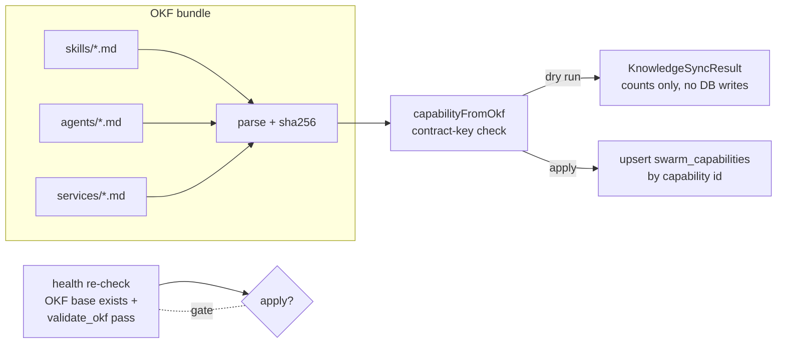

# Knowledge Runtime & OKF Bundle Operations

DjimFlo keeps durable, human-reviewable knowledge — skills, specialist-agent
profiles, services — on disk in the **Open Knowledge Format (OKF)**: markdown
files with YAML-ish frontmatter organised into fixed folders. The
`KnowledgeRuntimeService` (`packages/server/src/services/knowledge-runtime-service.ts`)
is the single server-side owner of that bundle: it resolves which directory is
the canonical OKF base, runs an operator-managed Python validator against it,
projects the markdown files into the `swarm_capabilities` registry, and reports
health and drift. This page covers the bundle layout, path invariants, the
sync pipeline, the health report, scheduled maintenance, and the MCP `okf_*`
tools. For the learning closure that *produces* knowledge from completed
loops, see the
[learning-closure section](/openwiki/workflows/maker-checker-loop.md#run-completion-draft-pr-hand-off-and-learning-closure)
of the maker–checker workflow and the
[Loop Domain Model](/openwiki/concepts/loop-lifecycle.md); for the MCP server
itself, see [MCP Server Integration](/openwiki/integrations/mcp-server.md).

## OKF bundle layout

An OKF bundle is a directory of six fixed folders
(`OKF_FOLDERS` in the service):

| Folder | Contents | Sync projection |
|--------|----------|-----------------|
| `skills/` | Executable procedure skills (e.g. `packages/knowledge/skills/python-fix.md`) | `skill:<slug>` capability |
| `agents/` | Specialist-agent profiles | `specialist:<slug>` capability + specialist panel profiles |
| `services/` | Service descriptors | `service:<slug>` capability |
| `memory/` | Memory sources | counted only |
| `repos/` | Repo knowledge | counted only |
| `models/` | Model cards | counted only |

Each file is markdown with a `---` frontmatter block; the service parses a small
scalar/list subset (no nested YAML). Every file is hashed with SHA-256 of the
raw bytes; the first 12 hex chars become the projected capability **version**,
so any edit to a skill file is detected as drift. Files named `index.md` are
skipped when enumerating a folder.

## Canonical path resolution and the packages/knowledge guard

`KnowledgeRuntimeService.resolveCanonicalOkfBase()` decides the OKF base:

1. If the `OKF_BASE` env var is set, it is resolved to an absolute path and
   used as-is. Otherwise the base defaults to `<repo-root>/knowledge`
   (`CANONICAL_OKF_PATH`) — the repo-level `knowledge` directory, which on
   developer machines is typically a symlink to an external data bundle (the
   test suite notes it is "absent in CI", and smoke tests are skipped when the
   symlink does not resolve). The health report exposes the symlink target of
   the canonical path when it is one.
2. **Legacy guard:** `packages/knowledge` (`LEGACY_PACKAGES_KNOWLEDGE`) — the
   directory the README labels "Knowledge storage (runtime-generated)" — is a
   legitimate seed of checked-in skill files, but it is *not* the canonical
   runtime base. If the resolved candidate realpath equals the
   `packages/knowledge` realpath, resolution throws
   `KNOWLEDGE_RUNTIME_PACKAGES_KNOWLEDGE_NOT_CANONICAL`.
3. Unless called with `allowMissing` (used by read-only consumers like the
   specialist-profile reader and `OkfKnowledgeUpdater`), a missing candidate
   throws `KNOWLEDGE_RUNTIME_OKF_BASE_MISSING`.

Two additional path rules police the boundary: `isWithinOkfRoot()` realpaths a
candidate and requires it to be at or under the canonical root, and
`validateOkfPath()` throws `KNOWLEDGE_RUNTIME_OKF_PATH_ESCAPE` for anything
outside — so request-supplied paths can never address files outside the bundle.

## The validate_okf gate

Nothing in the server trusts OKF content structurally. Before any sync *apply*,
the bundle must pass an **operator-managed trusted validator**:

- `OKF_VALIDATOR_PATH` may point at an absolute path to a trusted Python
  validator script. A *relative* value is rejected outright (fail status, no
  command executed). If unset, the service falls back to
  `tools/validate_okf.py` in the directory **next to the bundle** (i.e. the
  validator is tooling that lives beside the data; data bundles need not
  carry it).
- If the script does not exist, validation fails with status `fail` and a
  `blocked_reasons` entry — there is no silent downgrade to "skipped".
- The validator runs as `python3 -B <script>` via `execFileSync` (no shell),
  with `OKF_BASE` set to the **realpath of the actual bundle**,
  `PYTHONDONTWRITEBYTECODE=1`, a 10-second timeout, and `SIGKILL` on timeout,
  in a working directory derived from the script's grandparent. A non-zero
  exit, timeout, or spawn error yields `fail` with captured stdout/stderr.
- **Missing or failed validation blocks sync apply** (`syncCapabilities`
  throws `KNOWLEDGE_RUNTIME_OKF_VALIDATION_FAILED` unless it is a dry run —
  and `'skipped'` is not good enough: apply requires an explicit `pass`).
  Dry-run previews remain available so operators can see what a sync *would*
  do while the validator is broken.
- Passing validation means the bundle is structurally accepted by the trusted
  checker; it is **not certification** of the knowledge itself (per the README
  environment-variable contract and the service's own comments, e.g. around
  `bindImprovementEvaluation` where "structural evaluation … never implies
  applied … outcomes, nor promotion or merge authority").

## Capability sync: OKF markdown → `swarm_capabilities`

`syncCapabilities({ dry_run?, apply? })` projects the bundle into the database.
`apply: true` forces a real run; otherwise `dry_run` defaults to true.

For each parsed file the service derives a capability row:

- **Identity:** `id` is `skill:<slug>`, `specialist:<slug>`, or
  `service:<slug>`; `kind` maps by folder (`skill` / `specialist_agent` /
  `memory_source`); `version` is the content hash prefix, so upserts are keyed
  on content, not timestamps.
- **Contract keys** — the six frontmatter fields every capability must carry:
  `allowed_actions`, `forbidden_actions`, `required_evidence`, `risk_ceiling`,
  `eval_threshold`, `removal_strategy` (`CONTRACT_KEYS`). Each missing key adds
  a `missing_<key>` entry to the capability's `blocked_reasons`, which is also
  stored in metadata and counted in the sync result.
- **Status discipline:** a file with a complete contract syncs as
  `status: 'validated'` with `eval_score: 0.8`; an incomplete file syncs as
  `status: 'candidate'` with `eval_score: 0.2` and conservative fallbacks
  (`allowed_actions: ['advisory_only']`, `forbidden_actions: ['route_live_workers']`,
  `required_evidence: ['contract_completion_required']`). Incomplete
  capabilities are still registered — they exist, but visibly blocked, with a
  default removal strategy of "Disable capability until OKF contract is
  completed."
- **Normalization:** `risk_ceiling` must be one of `low|medium|high|critical`
  (anything else counts as missing and defaults to `low`); `eval_threshold`
  is clamped to `[0, 1]`, default `0.75`; list fields accept either
  `[a, b]` frontmatter lists or comma-separated strings.
- **Traceability:** metadata records `okf_path`, the full `okf_hash`,
  `okf_folder`, `source: 'okf'`, a `body_excerpt` (first 240 chars), and — when
  present — `agent_skill_id` / `agent_skill_version` /
  `agent_skill_content_hash` / `agent_skill_manifest_hash`, linking the
  capability to an installed runtime skill. `latest_validation_report` points
  back at the file's bundle-relative path.
- **Idempotent upsert:** apply inserts or replaces all columns
  `ON CONFLICT(id)` in `swarm_capabilities`; a second dry run after apply
  reports everything `unchanged` because versions match.

The sync loop reads only `skills`, `agents`, and `services`; `memory`, `repos`,
and `models` folders contribute to health counts but are not projected.

The focused test `knowledge-capability-sync.test.ts` pins this contract: a
dry run creates zero DB rows; apply upserts complete files as `validated` and
incomplete files as `candidate` with the right `blocked_reasons`; a failing
validator leaves the registry empty even when the dry run reported creations.

## Health and drift report

`health()` is read-only (the smoke test asserts the canonical symlink's mtime
does not change) and folds everything an operator needs into one
`KnowledgeRuntimeHealth` payload:

- `okf_base`, `canonical_candidate` (always `<repo-root>/knowledge`),
  `symlink_target`, `exists`.
- `validate_okf`: `status` (`pass | fail | skipped`), the exact `command`
  template executed, and captured `stdout`/`stderr`.
- `counts`: per-folder file counts plus `total`.
- `drift` — the reconciliation between disk and registry:
  - `okf_skill_count` vs `registered_skill_capability_count` (rows with
    `kind = 'skill'` in `swarm_capabilities`);
  - `missing_registry_entries`: OKF skill slugs with no registered capability
    (matched via metadata `okf_path` basename or the `skill:` id prefix);
  - `stale_registry_entries`: registered skills whose stored version no longer
    equals the current file hash prefix;
  - `packages_knowledge_is_canonical`: true when the resolved base realpaths
    to `packages/knowledge` — always a configuration error;
  - `projection_status`: currently reported as `'unknown'` (the
    `'fresh' | 'stale'` grading is reserved).
- `valid`: `exists && validate_okf.status === 'pass' && no blocked reasons`.
- `blocked_reasons` (deduplicated) and action-oriented `next_safe_actions`:

| Condition | blocked_reason | next_safe_actions |
|-----------|----------------|-------------------|
| `OKF_BASE` missing / unresolved | `KNOWLEDGE_RUNTIME_OKF_BASE_MISSING` | Set OKF_BASE or restore repo knowledge symlink |
| Validator missing/failed/relative | `KNOWLEDGE_RUNTIME_OKF_VALIDATION_FAILED` | Fix OKF validation before applying capability sync |
| Resolved base is `packages/knowledge` | `KNOWLEDGE_RUNTIME_PACKAGES_KNOWLEDGE_NOT_CANONICAL` | (fix base, then validate) |
| Registry missing skills | `KNOWLEDGE_RUNTIME_CAPABILITY_SYNC_REQUIRED` | Run capability sync dry-run → apply after review |
| Healthy, in sync | — | Close completed loops through learning closure; promote approved memory candidates; reindex projections dry-run |

### HTTP surface

Knowledge routes are decomposed into `packages/server/src/routes/swarm-knowledge.ts`,
mounted inside the swarm router (tested at `/swarms/...`, under `/api/swarms`
in the composed app):

- `GET /knowledge/runtime` (`read:evidence`) — the health payload above.
- `POST /knowledge/sync` (`write:swarm_action`) — `syncCapabilities(body)`;
  dry-run by default, `{ apply: true }` to write.
- `GET /runtime-readiness` (`read:evidence`) — agent-runtime contracts, not OKF.

Service errors are mapped to HTTP codes: missing base → 404, legacy path →
409, validation failure → 422, missing loop id → 400. The platform deep-health
aggregator `GET /health/deep` (`routes/health.ts`) folds the runtime in as the
`knowledgeRuntime` check: `exists === false` or validation not `pass` marks it
`error` and flips the overall response to 503; a passing-but-drifting runtime
reports `ok` with the blocked reasons as the message.

There is no HTTP route that *requires* a sync: `KnowledgeMaintenanceService`
(`packages/server/src/services/knowledge-maintenance-service.ts`) replaces the
old agent-spawning drift routines with plain scheduled checks when
`KNOWLEDGE_MAINTENANCE_ENABLED === 'true'` (default interval
`KNOWLEDGE_MAINTENANCE_INTERVAL_MS` or 15 min, with a ledger keyed on UTC
day/ISO week so restarts never repeat jobs). Its daily `okf_sync_drift` job
runs a **dry-run** `syncCapabilities` and turns `created + updated > 0` into a
labelled work item ("OKF drift: N capability file(s) out of sync with the
registry") for human review; the weekly `okf_lint` job walks the resolved base
flagging empty or frontmatter-less markdown. Findings become work items; only
fixes to knowledge need a maker and human approval.

## MCP `okf_*` tools

Separately from the server runtime, `packages/mcp-server/src/tools/okf.ts`
registers five **read-only** tools for file-based knowledge-graph traversal
inside MCP clients (`registerOkfTools`, wired in both `mcp-server/src/index.ts`
and `register-tools.ts`):

- `okf_search` — keyword search over title/content/type with an optional type
  filter (`Agent, Service, Skill, Model, Repo, Concept, Memory, Run`),
  limit ≤ 50.
- `okf_get` — fetch one concept by bundle-relative path, with parsed
  frontmatter and `[[wiki-style]]` links.
- `okf_related` — BFS traversal of `[[...]]` markdown links up to depth 3.
- `okf_validate` — standalone conformance check: required frontmatter fields
  (`type, title, description, timestamp, tags`) and broken-link detection;
  reports `PASS`/`FAIL`. This is independent of the server-side
  `validate_okf` gate.
- `okf_status` — file counts, frontmatter coverage, link totals.

**Path resolution differs from the server.** The MCP `resolveOkfBase()` honours
`OKF_BASE`, then searches upward for a sibling `djimitflo-knowledge/okf/`
directory relative to the compiled module or `cwd`, and throws if no candidate
exists — it has no `packages/knowledge` legacy guard and never validates with
Python. Treat the MCP tools as a read-only browsing surface over whatever
bundle they resolve to; the governance-bearing operations (sync apply, health
gating) live only in the server. Note also their loader walks the *entire*
bundle tree, whereas the server enumerates only the six known folders.

## Adjacent producers and consumers

- **`OkfKnowledgeUpdater`** (`packages/server/src/services/okf-knowledge-updater.ts`)
  is the best-effort write path: after a swarm judge verdict that is neither
  `contradicted` nor `unverifiable`, it creates or appends to
  `concepts/<slug>.md` under the canonical base (resolved with `allowMissing`)
  and logs the action in an `okf_knowledge_updates` ledger table. Any failure
  returns `false` silently — concept authoring never blocks the pipeline.
- **`readOkfSpecialistProfiles()`** projects `agents/` files with the stricter
  profile contract (`profile_id`, `required_evidence`, `forbidden_claims`,
  `output_schema` all present) into specialist-panel profiles.
- **`closeLoop()`** (`POST .../evolution/close-loop`, `write:governance`)
  closes loop learning: it revalidates terminal status, maker completion,
  accepted checker/security-checker evidence, gates, and trace/checkpoint/
  manifest evidence counts before baselining a `loop-learning` eval, writing a
  reflection and memory candidate, and opening regression-repair or
  skill-promotion work items. The full lifecycle of the loop run it closes —
  and the `LoopDaemon` queue that feeds runs into closure — is documented in
  [Maker–Checker Loop Execution](/openwiki/workflows/maker-checker-loop.md) and
  the [Loop Domain Model](/openwiki/concepts/loop-lifecycle.md); operationally,
  "Close completed loops through learning closure" is the health report's
  steady-state next action.

## Operator checklist

1. Point `OKF_BASE` at the actual bundle (or restore the repo-root `knowledge`
   symlink). Never repoint it at `packages/knowledge` — the runtime refuses it
   by design, and `packages_knowledge_is_canonical` in the drift report makes
   the misconfiguration visible.
2. Ensure a trusted `validate_okf.py` sits beside the bundle in `tools/`, or
   set `OKF_VALIDATOR_PATH` to an **absolute** path. Plan for absence: with no
   validator, health reports `fail` and apply syncs are blocked until fixed.
3. `POST /knowledge/sync` with default (dry-run) body; review
   `created/updated/blocked`; apply with `{ apply: true }`. A healthy steady
   state is `blocked: 0` and empty `missing_registry_entries`.
4. Watch `GET /knowledge/runtime` (or platform readiness) for
   `KNOWLEDGE_RUNTIME_CAPABILITY_SYNC_REQUIRED` and the maintenance work items
   from `okf_sync_drift` / `okf_lint`.
5. Remember: validator pass = structural acceptance only. Certification of the
   knowledge a capability grants comes from evals, checker evidence, and
   governance — not from sync succeeding.
