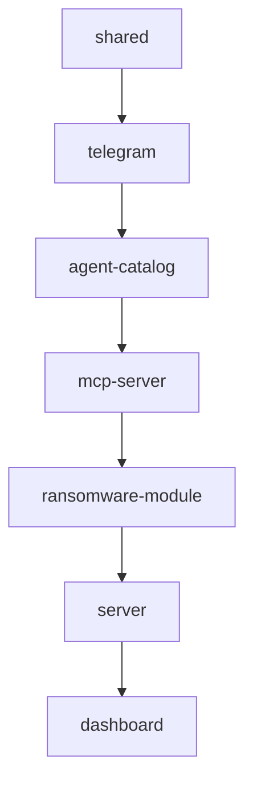

# Local Development, Build & Test Commands

DjimFlo is an npm-workspaces TypeScript monorepo (`packages/*`) with an
Express + SQLite backend, a React + Vite dashboard, and satellite packages
(MCP server, Telegram gateway, agent catalog, ransomware module). This page is
the runbook for getting a working local checkout, running and testing it, and
operating the container build.

## Prerequisites

| Requirement | Version | Notes |
|-------------|---------|-------|
| Node.js | `>=22.0.0 <25.0.0` | Enforced via root `engines`; the Dockerfile uses `node:22-bookworm-slim` |
| npm | `>=9.0.0` | Enforced via root `engines` |
| Python 3 + `make` + `g++` | any recent | Required when `better-sqlite3` has no prebuilt binary and must compile its native addon during `npm install` |
| Docker | any recent | Only needed for sandboxed execution and the container workflow |

`.npmrc` sets `legacy-peer-deps=true`, so installs already account for legacy
peer-dependency behavior.

```bash
git clone <repo>
cd djimitflo
npm install
```

`npm install` at the root installs all workspace dependencies in one pass.

## Repository Layout

```
packages/
├── shared/             # Shared types, roles, auth (built first)
├── server/             # Express + better-sqlite3 backend (main package)
├── dashboard/          # React 19 + Vite 8 + Tailwind CSS 4 frontend
├── mcp-server/         # MCP server (stdio + HTTP transports)
├── telegram/           # Telegram bot gateway (grammy)
├── agent-catalog/      # Agent profile import/normalize/compile
├── ransomware-module/  # Anti-ransomware detection module
└── knowledge/          # Knowledge storage (runtime-generated, not an npm workspace target of build/test)
```

## Running in Development

```bash
npm run dev            # server + dashboard in parallel (npm-run-all --parallel)
npm run dev:server     # backend only
npm run dev:dashboard  # frontend only
```

- `dev:server` runs `tsx watch src/index.ts` in `@djimitflo/server`, so the
  backend restarts on file changes. Dev defaults: `HOST=localhost`,
  `PORT=3001`, CORS origin `http://localhost:5173`.
- `dev:dashboard` runs `vite` on port `5173` and proxies `/api` (HTTP) and
  `/ws` (WebSocket) to `http://localhost:3001`, so the dashboard works against
  the local backend without extra config.

Server configuration lives in `packages/server/.env.example` (copy to `.env`
and adjust). Key dev-time variables: `DB_PATH` (defaults to
`<repo>/.data/djimitflo.sqlite`, resolved by `resolveDbPath`),
`JWT_SECRET` (dev falls back to a built-in secret with a warning; production
refuses to start without it), `AUTH_BOOTSTRAP_ADMIN_EMAIL` /
`AUTH_BOOTSTRAP_ADMIN_PASSWORD` (first-run admin bootstrap, only when the
users table is empty), and `DJIMITFLO_RUNTIME_PROFILE` (`api` default;
`operator` and `autonomous` additionally enable maintenance loops, the loop
daemon, and self-modification services).

## Building

```bash
npm run build          # full monorepo build in dependency order
npm run build:server   # @djimitflo/server only
npm run build:dashboard
npm run clean          # remove dist, node_modules, and stray compiled files
```

The root `build` script is an explicit `&&` chain, not a topological auto-order:
`shared → telegram → agent-catalog → mcp-server → ransomware-module → server →
dashboard`. Any step failing aborts the rest. The build order matters because
downstream packages compile against the `dist/` of their workspace
dependencies — workspace packages are consumed through their built entrypoints
(e.g. `@djimitflo/shared` exports `./dist/index.js` and its type declarations;
the only exception is the dashboard's Vite config, which aliases
`@djimitflo/shared` to the shared package's `src/`).



*Root `npm run build` workspace order (explicit chained script in the root `package.json`).*

For production serving, `npm run start --workspace=@djimitflo/server` (alias
`npm run build:server` then run) executes `node dist/index.js`; the server then
serves the built dashboard from `DASHBOARD_PATH` instead of the Vite dev
server.

## Testing

```bash
npm run test                # full pipeline, see below
npm run test:changed        # server vitest --changed
npm run test --workspace=@djimitflo/server -- <file>   # single server test file
npx vitest run              # inside any one workspace: that workspace's suite
```

The root `npm run test` is broader than "run vitest everywhere". Its exact
pipeline is:

1. `bash scripts/deploy-vps.selftest.sh` — pure-function checks of the VPS
   deployer (compose rewrite must swap image/commit/mounts, refuse no-op
   rewrites, `chown` before recreate, rollback present).
2. `bash scripts/wiki-delta-emitter.selftest.sh` — throwaway-git-repo check
   that the wiki delta emitter baselines on first run, stays silent when
   unchanged, honors `--dry-run`, and publishes one `wiki.page.changed` event
   listing only changed `.md` pages.
3. `python3 scripts/paperclip-archive-export.py --selftest` and
   `python3 scripts/paperclip-readonly-monitor.py --selftest` — the Paperclip
   exporter parses pg_dump `COPY` blocks for an allowlist of work-history
   tables (never secrets/credentials tables) into JSONL with a sha256
   `MANIFEST.json`.
4. `node scripts/live-identity-evidence.test.mjs` — identity/provenance
   verification logic used by `assurance:live` (commit, instance ID, loopback
   vs configured database identity).
5. `node scripts/integration-probes.test.mjs` — stubbed-`fetch` tests of the
   external integration probes (e.g. Context7 MCP discovery
   contract/version checks).
6. `npm run build --workspace=@djimitflo/shared && npm run build --workspace=@djimitflo/agent-catalog`
   — prerequisites compiled before workspace tests run.
   `tsx`-executed server code is type-stripped at runtime, so these built
   `dist/` outputs are what the test imports actually resolve.
7. `npm run test --workspaces --if-present` — vitest per workspace.

Vitest configuration: the root `vitest.config.mts` selects the `jsdom`
environment with no setup files (tests stub `localStorage`/`fetch`
themselves); the dashboard's `vite.config.ts` also sets `jsdom` + `globals`.
Dashboard and shared use `vitest run --passWithNoTests`.

### Type-check and lint

```bash
npm run type-check
npm run lint
```

- `type-check` first builds `shared`, `agent-catalog`, `mcp-server`, and
  `ransomware-module` (their `dist/*.d.ts` are the type resolution targets for
  downstream workspaces), then runs `type-check` (usually `tsc --noEmit`)
  across all workspaces with `--if-present`.
- `lint` runs `eslint .` per workspace with `--if-present`.

Both follow the CONTRIBUTING gate: `npm run type-check && npm run lint && npm
test` must be clean before a PR.

## Database: Migrate & Seed

Both run through `tsx` against the live TypeScript sources — no build step
needed, but `@djimitflo/shared` types are imported by the seed script, so run a
build (or at least `npm run build --workspace=@djimitflo/shared`) first in a
fresh checkout.

```bash
npm run db:migrate --workspace=@djimitflo/server   # tsx src/database/migrate.ts
npm run db:seed --workspace=@djimitflo/server      # tsx src/database/seed.ts
```

- `db:migrate` executes `runMigrations` directly against
  `resolveDbPath()` (`DB_PATH`, else `DJIMITFLO_DB`, else
  `<repo>/.data/djimitflo.sqlite`). Migrations are additive
  `CREATE TABLE IF NOT EXISTS` / column-add operations plus MCP-server seeding,
  safe to re-run. Normal server startup calls `initializeDatabase()` which
  applies the same schema — the script exists for standing up a database
  without booting the API.
- `db:seed` populates the empty database with mock agents (CodeReviewer,
  TestRunner, DeploymentBot, …) and related rows for local UI/API testing.

Neither command is required before `npm run dev` in the default profile: the
server initializes the schema on boot and the bootstrap admin covers login.

## Docker Operation

The `Dockerfile` is a two-stage build:

- **Builder** (`node:22-bookworm-slim`): installs `python3`/`make`/`g++` so
  `better-sqlite3` can compile its native addon when no prebuilt binary exists,
  copies all package manifests first for layer caching, runs
  `npm install` (with devDependencies), copies sources, then runs the same
  `npm run build` chain used locally.
- **Runner** (`node:22-bookworm-slim`): production-only `npm install
  --omit=dev`, the compiled `better-sqlite3` is smoke-tested with an
  in-memory open before the build toolchain is purged; pins global agent CLIs
  (`@openai/codex`, `opencode-ai`) and the `gh` CLI; bakes build provenance
  (`DJIMITFLO_BUILD_COMMIT`, `DJIMITFLO_BUILD_TIME`, `DJIMITFLO_BUILD_SOURCE`
  from `VCS_REF`/`BUILD_TIME`/`BUILD_SOURCE` build args) so `/health` reports
  the built revision rather than a mutable runtime env; creates the non-root
  `djimitflo` user (UID 1001), `VOLUME /data`, healthcheck against `/health`,
  `ENTRYPOINT ["./docker-entrypoint.sh"]`, `CMD ["node",
  "packages/server/dist/index.js"]`.

`docker-entrypoint.sh` behavior: prints version/port/host/db/dashboard info,
creates `/data` and `${BACKUP_DIR:-/data/backups}` if missing, hard-fails when
`NODE_ENV=production` and `JWT_SECRET` is unset, then `exec "$@"` (the
`CMD`, replacing the shell with the node process so signals reach it).

```bash
cp .env.docker.example .env.docker    # edit: JWT_SECRET, bootstrap admin, CORS, event bus
docker compose up -d --build
```

`docker-compose.yml` declares a single `djimitflo` service: builds from
`Dockerfile`, publishes `${DJIMITFLO_HOST_PORT:-3001}:3001`, loads env from
`.env.docker`, mounts the named volume `djimitflo-data` at `/data` (SQLite
database at `/data/djimitflo.sqlite`, backups at `/data/backups`), restarts
unless stopped, and healthchecks `http://localhost:3001/health` every 30s with
a 10s start period. Without compose:

```bash
docker build -t djimitflo:latest .
docker run -p 3001:3001 -v djimitflo-data:/data djimitflo:latest
```

The `/data` volume is the persistence contract: the database, backups, and the
knowledge directories created at image build survive container replacement
only because they live on the volume (or under `/app/packages/knowledge`,
which the image pre-creates and chowns to the non-root user).

### Configuration template

`.env.docker.example` is the authoritative container config template. Beyond
the dev variables it adds container-specific values: `DB_PATH=/data/djimitflo.sqlite`,
`DASHBOARD_PATH=/app/packages/dashboard/dist`, `BACKUP_DIR=/data/backups`,
`DJIMITFLO_HOST_PORT`, EventBus ingest (`DJIMIT_EVENT_BUS_URL`,
`DJIMIT_EVENT_STREAM`), and a mandatory `JWT_SECRET` (the entrypoint enforces
it in production). It also documents that OpenCode is **not** installed in the
image by default — mount the binary or derive a custom image to enable that
executor.

## Failure Modes & Gotchas

- **Wrong Node version** — `engines` rejects anything outside 22–24 at install
  time with strict engines (and `better-sqlite3` prebuilds are pinned to the
  image's Node 22 ABI in Docker).
- **Missing native toolchain** — `npm install` fails on `better-sqlite3`
  compilation without `python3`/`make`/`g++`; the Dockerfile installs and then
  purges them for exactly this reason.
- **Stale `dist/` in watch mode / tests** — `tsx watch` type-strips at runtime,
  so edits to `@djimitflo/shared` do not propagate to the server's imports
  until `shared` is rebuilt; root `test` and `type-check` rebuild the
  prerequisite packages themselves for this reason.
- **Production container without `JWT_SECRET`** — `docker-entrypoint.sh`
  exits 1 before node starts.
- **Root `npm run test` requires Python 3 and bash** even for pure Node work,
  because the Paperclip selftests and the bash script selftests run before any
  vitest suite.
