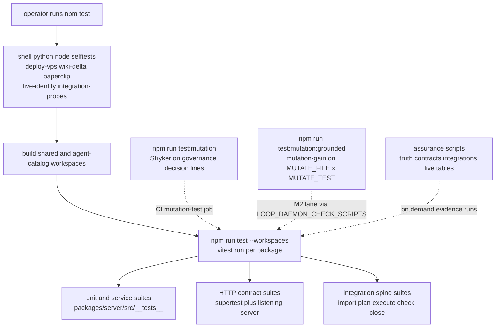

# Test Strategy, Assurance Scripts & Mutation Gate

DjimFlo treats verification as a layered pipeline, not a single test suite. At
the bottom sit hundreds of workspace unit/service suites and HTTP contract
suites under `packages/server/src/__tests__/`; on top of them sit
root-level selftest scripts that guard `npm test` itself; beside them sit a
targeted Stryker mutation gate on the highest-risk decision code and, since the
baseline window, a second mutation lane (`test:mutation:grounded`) that scores
one service against one test file in the working tree; and above all of it sit
the `assurance:*` audit scripts, which produce signed evidence about what was
actually verified, against what source state, with which limitations. The
README states the governing discipline explicitly: "Claims are falsifiable via
the test suite. Green tests are necessary but not sufficient for production
assurance." Every layer below exists to make a specific claim falsifiable
while honestly declaring its own limits.



The layers of `npm test`: selftests guard the harness, builds place workspace
dependencies, then per-workspace vitest suites run unit, HTTP-contract, and
spine tests; the mutation gate, the mutation-gain lane, and assurance runs
stand beside the main gate.

## Layer 1 — Workspace Vitest Suites

The server package owns the bulk of the suite count. Running
`npm run test --workspace=@djimitflo/server` executes `vitest run` under
`packages/server/vitest.config.mts`, which enables globals, uses the `node`
environment, includes `src/**/*.test.ts`, sets `NODE_ENV=test`, and raises
both `testTimeout` and `hookTimeout` to 30 s — the config comment explains
that integration tests exercising the loop (git worktree add, working-tree
diff application, multiple runtime spawns) legitimately exceed the 5 s
default. The suite directory holds hundreds of files categorized by concern:

- **Service/unit suites** — one suite per service or subsystem
  (`loop-service.test.ts`, `approval-atomicity.test.ts`,
  `execution-engine.test.ts`, `codex-executor.test.ts`, …), testing domain
  logic directly against in-memory or temp-file SQLite databases.
- **HTTP contract suites** — suites named `*-http.test.ts`, `*-routes.test.ts`
  or `critical-*.test.ts` that stand up a real Express app and assert status
  codes, error codes, and response shapes over HTTP rather than calling
  handlers directly. Most use `supertest` against an in-process app;
  `critical-http-contracts.test.ts` instead binds an ephemeral listening
  server (`app.listen(0)`) and drives it with `fetch`, covering auth login,
  approvals (404 for unknown ids, 410/`APPROVAL_EXPIRED` for expired records,
  400 for coerced non-boolean decisions, 409 against cancelling a terminal
  approval), backups (create/list/download/validate plus restore refusal
  without confirmation), runtime governance, MCP, spawn, swarm, SBOM, and
  repository-index surfaces.
- **Security-invariant suites** — `security-invariants.test.ts` and peers
  (`fase2-security.test.ts`, `refresh-token-rotation.test.ts`, …) assert
  named invariants like "ToolBroker denies unknown tools by default",
  "restricted data classification escalates to approval even under an
  allow-all policy", and "capability tokens survive broker restart but stay
  bound to tool, task, and principal".
- **Fail-closed mutation-route suites** — `mutation-validation.test.ts`
  proves mutating endpoints return structured 400/404 errors instead of
  leaking SQLite 500s, and that rejected writes leave zero rows behind.

Two families deserve special mention because they guard the harness rather
than a feature:

- **Route inventory** (`route-inventory.test.ts`) — the production mount
  table in `packages/server/src/routes/index.ts` is registered exclusively
  through `mountRoutes` (`utils/route-inventory.ts`), which records each
  prefix and auth flag on the actual Express layers. `collectRoutes` walks
  those layers and *throws* on any nested router it cannot attribute
  ("unrecorded nested router"), so a manually re-mounted router cannot
  silently vanish from the inventory. The full-aggregator test then
  instantiates the real `createRoutes` router, compares it against a static
  TypeScript-AST inventory from `scripts/route-source-inventory.mjs`
  (requiring both `declared_not_registered` and `registered_not_declared` to
  be empty), probes *every* auth-marked route over real HTTP with supertest
  and requires all of them to answer 401 anonymously, and asserts the
  `/openapi.json` spec renders exactly one operation per registered route.
- **Permission contract** (`route-permission-contract.test.ts`) — scans the
  route sources for literal `requirePermission('…')` calls and rejects any
  permission name not present in `ROLE_PERMISSIONS` from `@djimitflo/shared`,
  requiring more than 100 guarded calls so the check cannot pass on an empty
  scan.

### Baseline-window suites: the autonomous-improvement loop's own tests

The recent window added a cluster of suites that pin the behaviour of the
self-improvement / maker-checker machinery itself. They run in the same vitest
workspace but deserve to be named, because each guards a specific operational
invariant of the autonomous pipeline:

- **`loop-daemon-check-options.test.ts`** — pins the deterministic-check
  knobs the daemon hands to every maker run: `daemonCheckOptions` defaults to
  a 120 s timeout, scopes scripts via `LOOP_DAEMON_CHECK_SCRIPTS`, and clamps
  `LOOP_DAEMON_CHECK_TIMEOUT_MS` to 600 s; `daemonReviewerTimeoutMs` defaults
  to 300 s and clamps to 900 s; `daemonMakerTimeoutMs` returns 600 s for the
  mutation lane and a clamped `LOOP_MAKER_TIMEOUT_MS` (default 300 s)
  otherwise. Its A3 test proves `runOutcomeOnFailure` returns `infra_failed`
  (not `regressed`) for a maker that timed out or exited non-zero before its
  change could be evaluated.
- **`j5-test-gap-auto-approve.test.ts`** — the J5 auto-approve lane.
  `testGapAutoApproveScope` returns the single artifact path only when
  `LOOP_AUTO_APPROVE_TEST_GAP=true`, the goal comes from the test-gap source,
  and its grounding artifact is one new file under
  `packages/server/src/__tests__/`; the M2 mutation-gap variant additionally
  requires `LOOP_AUTO_APPROVE_MUTATION_GAP=true` and at least one already
  `verified` mutation-gap run before it returns a scope. The daemon test shows
  the auto-approval is recorded with `auto_approved_scope` pinned on the lease
  and a `goal_auto_approved` loop event.
- **`loop-daemon-checker-dispatch.test.ts`** — regression coverage for the
  2026-09-20/21 root cause: `LoopDaemon.executeGoal` created a checker lease
  but never dispatched it, so `verifyLoopRun`'s `checker_verdict` gate could
  never pass. Automated dispatch is gated behind
  `LOOP_DAEMON_AUTOMATED_CHECKER_ENABLED` (default off) and reuses whichever
  maker lease actually ran.
- **`evolve-selection.test.ts`** — the E13 evolve loop: `evolveSpecies` only
  returns extra makers when `LOOP_EVOLVE_ENABLED=true` (at most two),
  `evolveEligible` limits the pilot to test-gap / mutation-gap goals (or goals
  flagged `metadata.evolve`), and `selectEvolveWinner` keeps the fittest maker
  as the only non-superseded one, cancelling the losers' reviewer leases and
  emitting an `evolve_selected` / `evolve_no_winner` loop event.
- **`runtime-bandit.test.ts`** — the `runtime-bandit` species chooser: off
  unless `LOOP_BANDIT_ENABLED=true`, the first species is the incumbent, a
  strong challenger with too few outcomes is capped to its traffic share
  ("challenger capped: not enough outcomes yet"), and a challenger that has
  proven itself over `PROMOTE_AFTER` outcomes is promoted.
- **`dream-state.test.ts`** — the `DreamStateService` failure classifier:
  `pendingFailures` collects only failed/blocked runs (with failed gates,
  worker verdicts and dispatch events as evidence), shows a failed worker its
  own redacted stderr tail (secrets stripped, ≤ 600 chars), skips runs that
  never had a worker, and classifies each failed run only once — off by
  default, shadow-classifying when `TYPESAFE_FAILURE_CAUSE_MODE=shadow`.
- **`commons-grounding.test.ts`** — the grounding helper that turns a parked
  `needs_grounding` proposal into a placed one: `candidateFiles` finds
  candidate source files by distinctive words (never tests or sensitive
  paths), `parseGrounding` reads the last `TARGET`/`TEST` lines, and
  `validateGrounding` rejects a missing target, a sensitive path
  (`middleware/auth.ts`), a path escape (`../../etc/passwd`), and a non-test
  `TEST` target.
- **`improvement-funnel.test.ts`** — `ImprovementFunnelService` aggregates
  proposal conversion per source, reports TypeSafe judgment agreement with
  final outcomes (skipping open outcomes, `uncertain`, and pre-#334 checker
  rows), and survives an empty database.
- **`social-learning-campaign-service.test.ts`** — builds a
  `SocialLearningCampaignService` worldlab evidence object whose
  `evidence_hash` is a canonical sha256 over the campaign core, then replays
  threaded question/response/learning messages against it.
- **`approval-ttl.test.ts`** — `approvalTtlMs` is 1 h by default, honours
  `APPROVAL_TTL_MS`, and is clamped to 5 min … 7 days (a prod-anchored guard
  against approvals expiring overnight).
- **`worktree-repair.test.ts`** — `WorktreeManager.repairWorktree`
  re-registers a worktree whose runtime clone was replaced by a deploy,
  keeping its files and its branch, and reports `false` once healthy.
- **`zombie-reaper.test.ts` / `phase3-queue-hygiene.test.ts`** — the
  `QueueHygieneService` sweeps: reaping stale `running` goals that have no
  live run, cancelling old `blocked` goals without a wait reason (never ones
  awaiting approval), closing stale interrupted/planning runs, and expiring
  only consumer-less work items past their TTL, stale curiosity claims via
  `valid_until`, and stale meta-evolution drafts — all idempotent.
- **`mcp-openapi-catalog.test.ts`** — `syncOpenApiCatalog` resolves the spec
  URL from `openapi_url`/`openapi_path`, imports operations (reads allowed,
  writes need approval) idempotently, and refuses to bulk-mirror a huge admin
  API (`> MAX_OPERATIONS`, e.g. LiteLLM's 528), returning the reason string
  instead of throwing.
- **`opencode-token-usage.test.ts`** — `LoopService.extractRuntimeUsage` sums
  opencode `step_finish` token events (a prod fix: `tokens_used` was always
  0) while leaving other runtimes' usage parsing unchanged.
- **`autonomous-goal-generator-security.test.ts`** — security findings route
  through the reviewed self-improvement pipeline: `generateFromSecurityFindings`
  now creates a reviewed `security` proposal instead of an unreviewed
  `risk_class:'high'` goal, so the highest-risk category no longer skips
  specialist-panel review.
- **`auto-deploy.test.ts`** — the auto-deploy selftest as a vitest suite: it
  drives `scripts/auto-deploy.sh` with every probe simulated (`AD_MAIN_SHA`,
  `AD_CURRENT_SHA`, `AD_CHECKS`, `AD_COMMIT`, `AD_LEASES`) and proves the
  deploy fires only when CI is green, `main` has settled, and no loop worker
  is running; that it holds (saying why) for up-to-date / in-progress /
  failed CI, an unsettled commit, or active workers; and that the
  `AUTO_DEPLOY_DISABLED` kill-switch file stops everything.

The dashboard workspace runs `vitest run --passWithNoTests`, and the root
`vitest.config.mts` configures `jsdom` for any tests executed from repo root.

## Layer 2 — Integration Spine Suites

The `integration-spine-*.test.ts` suites tie the full operational loop
together over real HTTP and a real (temporary) git repository. Each spins up
an Express app with in-memory SQLite (schema plus migrations), mounts
`createWorkItemRoutes` and `createSwarmRoutes`, points `LOOP_WORKTREE_ROOT`
at a temp directory, and pushes one imported integration event
(`POST /work-items/integrations/import`) through worker dispatch, checker,
and learning closure — proving that intake, planning, execution, gating, and
closure compose rather than merely each passing in isolation.
`integration-spine-service.test.ts` pins the same inbox at the permission
layer (recording exactly which permissions `requirePermission` was called
with) and at the preview layer (normalized dry-run import with no writes).
`integration-spine-real-runtime-smoke.test.ts` is gated behind
`RUN_REAL_RUNTIME_SMOKE=1` plus a selectable `REAL_RUNTIME` and certifies a
real agent runtime end to end; when the flag is absent it runs a default-only
variant instead, so the certification claim is never silently substituted.

## Layer 3 — Root `npm test` Selftests First

The root `test` script runs shell/Python/Node selftests **before** any
workspace test, so harness breakage fails the gate before a single vitest
assertion runs:

```bash
bash scripts/deploy-vps.selftest.sh            # compose rewrite + chown-before-up + rollback shape
bash scripts/wiki-delta-emitter.selftest.sh    # throwaway git repo + fake curl: baseline, dedupe, advance
python3 scripts/paperclip-archive-export.py --selftest   # allowlist export, manifest hashing, secret table excluded
python3 scripts/paperclip-readonly-monitor.py --selftest # log-scan quiet-window arithmetic
node scripts/live-identity-evidence.test.mjs   # verifyIdentity rejects dirty/mismatched provenance
node scripts/integration-probes.test.mjs       # Context7 MCP discovery contract validation
npm run build --workspace=@djimitflo/shared    # workspace dependency order
npm run build --workspace=@djimitflo/agent-catalog
npm run test --workspaces --if-present         # finally, the vitest suites
```

Two operational rules follow. First, **any edit to those operational scripts
must keep the corresponding selftest meaningful** — they are the only proof
that the deploy rewrite, the wiki emitter, the exporters, and the evidence
collectors still behave. Second, the selftests test *control flow and
purity*, not live infrastructure: `deploy-vps.selftest.sh` sources
`deploy-vps.sh` and verifies `rewrite_compose` against a fixture compose file
(including that a no-op rewrite reports failure), and inspects the generated
remote script to assert `chown -R 1001:1001` precedes the first
`docker compose up` and that a rollback path exists.

### The agent-social-poller selftest discipline

`scripts/agent-social-poller.py` runs one bounded Commons peer-learning poll
for a real runtime. It has its own Python unittest suite,
`scripts/test_agent_social_poller.py`, run in CI (and by hand) via:

```bash
python3 -m unittest discover -s scripts -p 'test_agent_social_poller.py'
```

Because the poller hands untrusted peer data to a real CLI, the suite is
security- and containment-focused rather than feature-focused:

- **Provider-error hygiene** — a provider error event only ever exposes the
  numeric HTTP status (`opencode provider HTTP 401`); a non-numeric status
  collapses to a generic message so a secret-laden provider body is never
  forwarded.
- **Environment allowlist** — `runtime_env` never lets `DJIMITFLO_SOCIAL_TOKEN`,
  `NODE_OPTIONS`, or `OPENCODE_CONFIG_CONTENT` escape into a child runtime, and
  a provider credential (e.g. `ANTHROPIC_API_KEY`) reaches only its own
  runtime, not the others.
- **No-tools confinement** — each CLI runs in a fresh temporary working
  directory with tools disabled (Claude `--safe-mode`/empty tools, Gemini
  deny-all admin policy with hooks off, OpenCode `--pure` with
  `permission:{'*':'deny'}`, Pi `--no-tools`/`--no-extensions`).
- **Isolated, secret-scoped custom provider** — an OpenCode provider config is
  written mode-600 into the temp dir, scoped to a dedicated provider key, and
  deleted after the run; unsafe provider URLs (public IP, embedded
  credentials, `file:` scheme, `{env:…}` substitution) are rejected.
- **Untrusted-reply hardening** — nested or unexpected reply fields cannot
  replace the answer or spoof `runtime`/`model_id`/`runtime_run_id`/
  `delivery_lease_token`/`usage`/`approved`/`agent_id` before the server
  validates evidence and leases.
- **Bounded execution** — `bounded_process` runs the CLI in a new session with
  a wall-clock limit; a SIGTERM stops the detached runtime *and* its worker,
  and a timeout kills the process group.

This is the selftest discipline applied to a runtime connector: the suite
proves containment properties, not that any real provider call succeeded.

CI (`.github/workflows/ci.yml`) mirrors this: type-check → lint → build →
`npm run test --reporter=verbose` → Python poller unittests (`python3 -m
unittest discover -s scripts -p 'test_*poller.py'`) → `npm run audit:ci`, all
on a Node 22/24 matrix, followed by Trivy filesystem and container scans.

## Layer 4 — Stryker Targeted Mutation Gate

`npm run test:mutation` runs `stryker run` against `stryker.config.js`, which
deliberately mutates only narrow line ranges in the highest-consequence
decision code rather than the whole tree:

| Target | Line ranges | What is gated |
|--------|-------------|---------------|
| `services/approval-service.ts` | 122:4–145:7 | Decision input validation, status/expiry checks, self-approval guard, transaction refactor |
| `services/tool-broker.ts` | 243:4–269:43 | Capability-token validation (principal-bound, durable, expiry deletion) and re-evaluation invalidation |
| `execution/executors/docker-sandbox-executor.ts` | 108:2–113:3 | Inner-command availability guard and `/workspace` working-directory enforcement |
| `routes/runtime-governance.ts` | 20:0–22:1, 53:4–63:5 | Baseline score bounds (0–10) and no-write validation boundary |

The gate uses the vitest runner with `coverageAnalysis: 'perTest'`,
concurrency 4, thresholds **high 85 / low 75 / break 70** (break = the run
fails below 70 % mutation score), excludes `StringLiteral` and
`ObjectLiteral` mutators, and runs the focused suite list in
`vitest.mutation.config.ts` (node environment, 30 s timeout:
`docker-sandbox-executor`, `live-canvas`, `critical-http-contracts`,
`manual-approvals`, `security-invariants`,
`runtime-governance-release-http`). The CI `mutation-test` job builds
`@djimitflo/shared` and then runs this gate on every push and PR.
**Any change inside those five line ranges must keep
`npm run test:mutation` green**; if a behavior-preserving refactor moves the
lines, the ranges in `stryker.config.js` must move with the code in the same
change.

## Layer 4b — The M2 Mutation-Gain Lane (`test:mutation:grounded`)

The baseline window added a second, complementary mutation lane. Where the
layer-4 gate pins five *fixed* code ranges, the M2 lane measures whether a
*working-tree* test file kills more mutants of a *single* service than the
committed version of that test did. It is wired from three small pieces:

- **`vitest.service-mutation.config.ts`** — a one-line vitest config whose
  only `include` is `process.env.MUTATE_TEST ?? 'none'`, node environment, 30 s
  timeout. With no `MUTATE_TEST` it runs nothing.
- **`stryker.service.config.mjs`** — a Stryker config that mutates exactly
  `process.env.MUTATE_FILE`, uses the vitest runner pointed at
  `vitest.service-mutation.config.ts`, `coverageAnalysis: 'perTest'`,
  concurrency 2, excludes `StringLiteral`/`ObjectLiteral`, and writes a JSON
  report to `process.env.MUTATE_REPORT` (default a tmp file). With no
  `MUTATE_FILE` the `mutate` list is empty.
- **`scripts/mutation-gain.mjs`** (the orchestrator, aliased
  `npm run test:mutation:grounded`) — reads `MUTATE_FILE`/`MUTATE_TEST`;
  without both it is a no-op exit 0 so hosts can list it unconditionally in
  `LOOP_DAEMON_CHECK_SCRIPTS`. It runs Stryker twice: once against
  `HEAD:<test>` written to a temporary `*.mutation-baseline.test.ts` (score
  `before`, 0 for a brand-new test) and once against the working-tree test
  (`after`), then passes when `after >= before + MUTATE_MIN_GAIN`
  (default **10 points**) **or `after >= 90`**. It prints a single
  `{"mutation_gain":{before,after,gain,min_gain,pass}}` JSON line and exits
  non-zero on a failed working-tree run.

The mutation score counts `Killed`+`Timeout` mutants as detected over the
valid set (`+ Survived + NoCoverage`). `evolve-selection.ts:mutationScoreOf`
reads the `after` value back out of that JSON line from the check's captured
stdout, which is what gives the mutation lane a continuous fitness signal for
the E13 evolve loop.

### How the lane is reached from the loop daemon

`TestGapSourceService.runMutationGaps` (behind `MUTATION_GAP_ENABLED=true`,
default off, `MUTATION_GAP_MAX_PER_DAY` default 2, at most one in flight)
discovers tested, mid-sized, non-sensitive services and creates a grounded
self-improvement proposal whose runtime command is literally
`MUTATE_FILE=<service> MUTATE_TEST=<test> npm run test:mutation:grounded`.
`mutationCheckEnv(db, goalId)` returns those two variables for a
mutation-gap goal; the loop daemon treats a goal with a non-empty
`mutationCheckEnv` as the **mutation lane** and gives its maker 600 s and a
400-line diff budget (vs. 300 s / 200 lines elsewhere). The deterministic
check is dispatched through the normal `daemonCheckOptions` mechanism, so a
host opts the daemon into the lane by adding `test:mutation:grounded` to
`LOOP_DAEMON_CHECK_SCRIPTS`. Test coverage: `test-gap-source.test.ts` pins
discovery, the one-at-a-time/daily-cap gating, and the `MUTATE_*` env
wiring; `loop-daemon-check-options.test.ts` pins the 600 s maker timeout and
the `infra_failed` outcome that keeps a timed-out mutation maker from being
recorded as a regression.

## Layer 5 — `assurance:*` Audit Scripts

The assurance scripts are the evidence producers invoked by operators (and
composed by `assurance-truth`), separate from `npm test`:

| Script | npm alias | Verifies |
|--------|-----------|----------|
| `scripts/ci-audit.mjs` | `audit:ci` | `npm audit --omit=dev` fails on high/critical production advisories outside a commented allowlist, and propagates blocks through transitive chains |
| `scripts/contract-inventory.mjs` | `assurance:contracts`, `assurance:route-contracts` | Static route + MCP-tool inventory cross-referenced with test sources; critical modules (`auth`, `approvals`, `backup`, `exports`, `council`, `openmythos`, `mcp`, `runtime-governance`, `swarms`, `spawns`) must be `source_referenced` or carry a written exemption, and runtime-vs-declared registration diff (when `RUNTIME_ROUTE_INVENTORY_PATH` is supplied and fingerprint-fresh) must be empty — non-zero exit otherwise |
| `scripts/integration-probes.mjs` | `assurance:integrations` | Read-only HTTP/contract probes of the live dependency graph: djimitflo `/health`, event bus stream, Paperclip, UAMS, Ollama, Qdrant, LiteLLM, Context7 MCP discovery, plus `codex`/`opencode` binary availability; required probes failing means `fail`, unreachable means `blocked` |
| `scripts/live-identity-evidence.mjs` | `assurance:live` | Proves the deployment under test is the intended machine: clean git state, `/health` commit equals `git rev-parse HEAD`, authenticated `/api/health/deep` provenance reports `mode: 'live'` with matching `commit_sha` and `database.instance_id` (configured via `DJIMITFLO_EXPECTED_DATABASE_INSTANCE_ID` for remote targets, else loopback-only local DB identity plus `PRAGMA integrity_check`) |
| `scripts/table-reachability.mjs` | `audit:tables` | Maps every SQLite table to static writers/readers/routes/tests to surface unreachable tables — its own header notes regex references are not runtime execution proof |
| `scripts/openmythos-evidence.mjs` | `assurance:openmythos` | Validates the external benchmark corpus manifest (count + sha256) before accepting its evaluation gates |
| `scripts/assurance-truth.mjs` | `assurance:truth` | The composer: asserts a supported Node (≥22 <25), runs `audit`, contract inventory, OpenMythos evidence, integration probes, live identity, and `git diff --check` (plus npm test/type-check/lint/build under `--full`), redacts credentials from captured output, hashes the dirty source state, and writes a single `evidence.json` whose aggregate status is `pass`/`blocked`/`fail` |

Each script declares its limits in-line or in its report
(`evidence_limits: "source_referenced means a static source-code match only;
it is not proof a test ran…"`, `table-reachability`'s "Static SQL regex
references, not runtime execution proof."). And the scripts are themselves
tested: `assurance-truth.test.mjs` proves redaction removes bearer
tokens/passwords and that `sourceState` fails closed on a missing repository
rather than substituting a clean identity; `live-identity-evidence.test.mjs`
proves `verifyIdentity` rejects dirty trees, commit mismatches, unconfigured
remote identity, and `mode !== 'live'`. This is what the README discipline
means in practice: the suite alone cannot prove deployment identity, contract
coverage, or dependency posture — only the combination of green tests,
passing mutation gate, and current assurance evidence approaches that claim.
