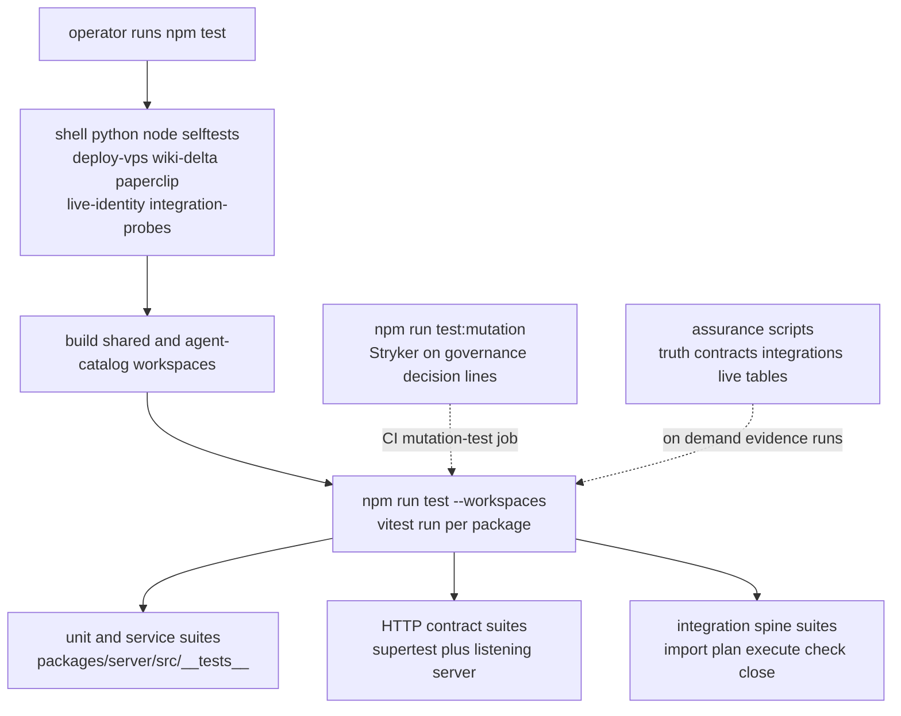

# Test Strategy, Assurance Scripts & Mutation Gate

DjimFlo treats verification as a layered pipeline, not a single test suite. At
the bottom sit hundreds of workspace unit/service suites and HTTP contract
suites under `packages/server/src/__tests__/`; on top of them sit
root-level selftest scripts that guard `npm test` itself; beside them sit a
targeted Stryker mutation gate on the highest-risk decision code; and above
all of it sit the `assurance:*` audit scripts, which produce signed evidence
about what was actually verified, against what source state, with which
limitations. The README states the governing discipline explicitly: "Claims
are falsifiable via the test suite. Green tests are necessary but not
sufficient for production assurance." Every layer below exists to make a
specific claim falsifiable while honestly declaring its own limits.



The layers of `npm test`: selftests guard the harness, builds place workspace
dependencies, then per-workspace vitest suites run unit, HTTP-contract, and
spine tests; mutation and assurance runs stand beside the main gate.

## Layer 1 — Workspace Vitest Suites

The server package owns the bulk of the suite count. Running
`npm run test --workspace=@djimitflo/server` executes `vitest run` under
`packages/server/vitest.config.mts`, which enables globals, uses the `node`
environment, includes `src/**/*.test.ts`, sets `NODE_ENV=test`, and raises
both `testTimeout` and `hookTimeout` to 30 s — the config comment explains
that integration tests exercising the loop (git worktree add, working-tree
diff application, multiple runtime spawns) legitimately exceed the 5 s
default. The suite directory holds hundreds of files categorized by concern:

- **Service/unit suites** — one suite per service or subsystem
  (`loop-service.test.ts`, `approval-atomicity.test.ts`,
  `execution-engine.test.ts`, `codex-executor.test.ts`, …), testing domain
  logic directly against in-memory or temp-file SQLite databases.
- **HTTP contract suites** — suites named `*-http.test.ts`, `*-routes.test.ts`
  or `critical-*.test.ts` that stand up a real Express app and assert status
  codes, error codes, and response shapes over HTTP rather than calling
  handlers directly. Most use `supertest` against an in-process app;
  `critical-http-contracts.test.ts` instead binds an ephemeral listening
  server (`app.listen(0)`) and drives it with `fetch`, covering auth login,
  approvals (404 for unknown ids, 410/`APPROVAL_EXPIRED` for expired records,
  400 for coerced non-boolean decisions, 409 against cancelling a terminal
  approval), backups (create/list/download/validate plus restore refusal
  without confirmation), runtime governance, MCP, spawn, swarm, SBOM, and
  repository-index surfaces.
- **Security-invariant suites** — `security-invariants.test.ts` and peers
  (`fase2-security.test.ts`, `refresh-token-rotation.test.ts`, …) assert
  named invariants like "ToolBroker denies unknown tools by default",
  "restricted data classification escalates to approval even under an
  allow-all policy", and "capability tokens survive broker restart but stay
  bound to tool, task, and principal".
- **Fail-closed mutation-route suites** — `mutation-validation.test.ts`
  proves mutating endpoints return structured 400/404 errors instead of
  leaking SQLite 500s, and that rejected writes leave zero rows behind.

Two families deserve special mention because they guard the harness rather
than a feature:

- **Route inventory** (`route-inventory.test.ts`) — the production mount
  table in `packages/server/src/routes/index.ts` is registered exclusively
  through `mountRoutes` (`utils/route-inventory.ts`), which records each
  prefix and auth flag on the actual Express layers. `collectRoutes` walks
  those layers and *throws* on any nested router it cannot attribute
  ("unrecorded nested router"), so a manually re-mounted router cannot
  silently vanish from the inventory. The full-aggregator test then
  instantiates the real `createRoutes` router, compares it against a static
  TypeScript-AST inventory from `scripts/route-source-inventory.mjs`
  (requiring both `declared_not_registered` and `registered_not_declared` to
  be empty), probes *every* auth-marked route over real HTTP with supertest
  and requires all of them to answer 401 anonymously, and asserts the
  `/openapi.json` spec renders exactly one operation per registered route.
- **Permission contract** (`route-permission-contract.test.ts`) — scans the
  route sources for literal `requirePermission('…')` calls and rejects any
  permission name not present in `ROLE_PERMISSIONS` from `@djimitflo/shared`,
  requiring more than 100 guarded calls so the check cannot pass on an empty
  scan.

The dashboard workspace runs `vitest run --passWithNoTests`, and the root
`vitest.config.mts` configures `jsdom` for any tests executed from repo root.

## Layer 2 — Integration Spine Suites

The `integration-spine-*.test.ts` suites tie the full operational loop
together over real HTTP and a real (temporary) git repository. Each spins up
an Express app with in-memory SQLite (schema plus migrations), mounts
`createWorkItemRoutes` and `createSwarmRoutes`, points `LOOP_WORKTREE_ROOT`
at a temp directory, and pushes one imported integration event
(`POST /work-items/integrations/import`) through worker dispatch, checker,
and learning closure — proving that intake, planning, execution, gating, and
closure compose rather than merely each passing in isolation.
`integration-spine-service.test.ts` pins the same inbox at the permission
layer (recording exactly which permissions `requirePermission` was called
with) and at the preview layer (normalized dry-run import with no writes).
`integration-spine-real-runtime-smoke.test.ts` is gated behind
`RUN_REAL_RUNTIME_SMOKE=1` plus a selectable `REAL_RUNTIME` and certifies a
real agent runtime end to end; when the flag is absent it runs a default-only
variant instead, so the certification claim is never silently substituted.

## Layer 3 — Root `npm test` Selftests First

The root `test` script runs shell/Python/Node selftests **before** any
workspace test, so harness breakage fails the gate before a single vitest
assertion runs:

```bash
bash scripts/deploy-vps.selftest.sh            # compose rewrite + chown-before-up + rollback shape
bash scripts/wiki-delta-emitter.selftest.sh    # throwaway git repo + fake curl: baseline, dedupe, advance
python3 scripts/paperclip-archive-export.py --selftest   # allowlist export, manifest hashing, secret table excluded
python3 scripts/paperclip-readonly-monitor.py --selftest # log-scan quiet-window arithmetic
node scripts/live-identity-evidence.test.mjs   # verifyIdentity rejects dirty/mismatched provenance
node scripts/integration-probes.test.mjs       # Context7 MCP discovery contract validation
npm run build --workspace=@djimitflo/shared    # workspace dependency order
npm run build --workspace=@djimitflo/agent-catalog
npm run test --workspaces --if-present         # finally, the vitest suites
```

Two operational rules follow. First, **any edit to those operational scripts
must keep the corresponding selftest meaningful** — they are the only proof
that the deploy rewrite, the wiki emitter, the exporters, and the evidence
collectors still behave. Second, the selftests test *control flow and
purity*, not live infrastructure: `deploy-vps.selftest.sh` sources
`deploy-vps.sh` and verifies `rewrite_compose` against a fixture compose file
(including that a no-op rewrite reports failure), and inspects the generated
remote script to assert `chown -R 1001:1001` precedes the first
`docker compose up` and that a rollback path exists.

CI (`.github/workflows/ci.yml`) mirrors this: type-check → lint → build →
`npm run test --reporter=verbose → Python poller unittests → `npm run
audit:ci`, all on a Node 22/24 matrix, followed by Trivy filesystem and
container scans.

## Layer 4 — Stryker Targeted Mutation Gate

`npm run test:mutation` runs `stryker run` against `stryker.config.js`, which
deliberately mutates only narrow line ranges in the highest-consequence
decision code rather than the whole tree:

| Target | Line ranges | What is gated |
|--------|-------------|---------------|
| `services/approval-service.ts` | 122:4–145:7 | Decision input validation, status/expiry checks, self-approval guard, transaction refactor |
| `services/tool-broker.ts` | 243:4–269:43 | Capability-token validation (principal-bound, durable, expiry deletion) and re-evaluation invalidation |
| `execution/executors/docker-sandbox-executor.ts` | 108:2–113:3 | Inner-command availability guard and `/workspace` working-directory enforcement |
| `routes/runtime-governance.ts` | 20:0–22:1, 53:4–63:5 | Baseline score bounds (0–10) and no-write validation boundary |

The gate uses the vitest runner with `coverageAnalysis: 'perTest'`,
concurrency 4, thresholds **high 85 / low 75 / break 70** (break = the run
fails below 70 % mutation score), excludes `StringLiteral` and
`ObjectLiteral` mutators, and runs the focused suite list in
`vitest.mutation.config.ts` (node environment, 30 s timeout:
`docker-sandbox-executor`, `live-canvas`, `critical-http-contracts`,
`manual-approvals`, `security-invariants`,
`runtime-governance-release-http`). The CI `mutation-test` job builds
`@djimitflo/shared` and then runs this gate on every push and PR.
**Any change inside those five line ranges must keep
`npm run test:mutation` green**; if a behavior-preserving refactor moves the
lines, the ranges in `stryker.config.js` must move with the code in the same
change.

## Layer 5 — `assurance:*` Audit Scripts

The assurance scripts are the evidence producers invoked by operators (and
composed by `assurance-truth`), separate from `npm test`:

| Script | npm alias | Verifies |
|--------|-----------|----------|
| `scripts/ci-audit.mjs` | `audit:ci` | `npm audit --omit=dev` fails on high/critical production advisories outside a commented allowlist, and propagates blocks through transitive chains |
| `scripts/contract-inventory.mjs` | `assurance:contracts`, `assurance:route-contracts` | Static route + MCP-tool inventory cross-referenced with test sources; critical modules (`auth`, `approvals`, `backup`, `exports`, `council`, `openmythos`, `mcp`, `runtime-governance`, `swarms`, `spawns`) must be `source_referenced` or carry a written exemption, and runtime-vs-declared registration diff (when `RUNTIME_ROUTE_INVENTORY_PATH` is supplied and fingerprint-fresh) must be empty — non-zero exit otherwise |
| `scripts/integration-probes.mjs` | `assurance:integrations` | Read-only HTTP/contract probes of the live dependency graph: djimitflo `/health`, event bus stream, Paperclip, UAMS, Ollama, Qdrant, LiteLLM, Context7 MCP discovery, plus `codex`/`opencode` binary availability; required probes failing means `fail`, unreachable means `blocked` |
| `scripts/live-identity-evidence.mjs` | `assurance:live` | Proves the deployment under test is the intended machine: clean git state, `/health` commit equals `git rev-parse HEAD`, authenticated `/api/health/deep` provenance reports `mode: 'live'` with matching `commit_sha` and `database.instance_id` (configured via `DJIMITFLO_EXPECTED_DATABASE_INSTANCE_ID` for remote targets, else loopback-only local DB identity plus `PRAGMA integrity_check`) |
| `scripts/table-reachability.mjs` | `audit:tables` | Maps every SQLite table to static writers/readers/routes/tests to surface unreachable tables — its own header notes regex references are not runtime execution proof |
| `scripts/openmythos-evidence.mjs` | `assurance:openmythos` | Validates the external benchmark corpus manifest (count + sha256) before accepting its evaluation gates |
| `scripts/assurance-truth.mjs` | `assurance:truth` | The composer: asserts a supported Node (≥22 <25), runs `audit`, contract inventory, OpenMythos evidence, integration probes, live identity, and `git diff --check` (plus npm test/type-check/lint/build under `--full`), redacts credentials from captured output, hashes the dirty source state, and writes a single `evidence.json` whose aggregate status is `pass`/`blocked`/`fail` |

Each script declares its limits in-line or in its report
(`evidence_limits: "source_referenced means a static source-code match only;
it is not proof a test ran…"`, `table-reachability`'s "Static SQL regex
references, not runtime execution proof."). And the scripts are themselves
tested: `assurance-truth.test.mjs` proves redaction removes bearer
tokens/passwords and that `sourceState` fails closed on a missing repository
rather than substituting a clean identity; `live-identity-evidence.test.mjs`
proves `verifyIdentity` rejects dirty trees, commit mismatches, unconfigured
remote identity, and `mode !== 'live'`. This is what the README discipline
means in practice: the suite alone cannot prove deployment identity, contract
coverage, or dependency posture — only the combination of green tests,
passing mutation gate, and current assurance evidence approaches that claim.
