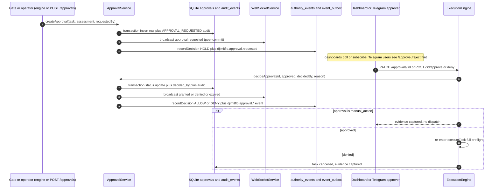

# Approval Request & Decision Flow

An approval is a durable row in the `approvals` table (schema in
packages/server/src/database/schema.ts#L266-L293) that moves through exactly one
lifecycle: `pending` → `approved` | `denied` | `expired` (`ApprovalStatus` in
packages/shared/src/types/common.ts#L80-L86). `ApprovalService`
(packages/server/src/services/approval-service.ts) owns that table and every
transition; routes, the dashboard, and Telegram are just three operator surfaces
that read the rows and call `ExecutionEngine.handleApprovalDecision()`. The
pipeline context that *creates* most requests is documented in
[Governance Pipeline](/openwiki/concepts/governance-pipeline.md); this page
covers the request → decide → record chain that operators see.

## Where requests come from

A request enters the table through `createApproval()` from three directions:

1. **Execution gates** — `ExecutionEngine.executeTask()` hits a
   `require_approval` policy verdict, calls `createApproval()` with the risk
   assessment, policy id, and an `executionInputHash` in metadata, then moves
   the task to `awaiting_approval` and broadcasts
   `EXECUTION_PAUSED_FOR_APPROVAL` (execution-engine.ts L386-L419). These
   approvals authorize resuming a paused dispatch.
2. **Manual action reviews** — `POST /api/approvals` (mounted with
   `requireAuth` at packages/server/src/routes/index.ts#L150, handled in
   routes/approvals.ts L33-L59) lets an operator with `create:task` attach a
   human-review request to an existing task they can modify. These carry
   `metadata.manual_action: true` and **never gate execution**: a decision only
   records evidence (execution-engine.ts L840-L849) and cannot dispatch a task.
3. **Other services** — the governance feedback loop and the Dennis agent call
   the same `createApproval()` for their own gated proposals.

Every request gets a hard-coded 1-hour expiry (`expires_at = now + 60 min`,
approval-service.ts L61-L64) and a `requested_by` maker (the dispatcher, or the
JWT subject for manual reviews).

## Creation is transactional; decisions are atomic

`createApproval()` runs the row insert **and** its canonical `APPROVAL_REQUESTED`
audit record inside one `db.transaction().immediate()` (L66-L113); if the audit
insert fails, the approval rolls back with it. Only after the commit does it
broadcast `approval.requested` over the WebSocket and call `recordDecision()`
with a `HOLD` verdict (L114-L121).

`decideApproval(id, approved, decidedBy, reason)` enforces the non-negotiables
(L134-L212), wrapped in the same kind of immediate transaction:

- **Validation & status guard** — `approved` must be a boolean
  (`INVALID_APPROVAL_DECISION`); a missing row throws `Approval not found`; a
  non-pending row throws `APPROVAL_EXPIRED` or `Approval already processed`.
- **Expiry check first** — if `expires_at` is missing/unparseable or already
  past, the service persists the expired record **inside** that decision
  transaction and throws `APPROVAL_EXPIRED` only after the commit
  (L149-L152, L199-L208).
- **Self-approval is forbidden at the data layer** — `decidedBy ===
  approval.requested_by` throws `SELF_APPROVAL_FORBIDDEN` regardless of what
  any route-level permission allowed (L153-L158). This closes the maker/admin
  gap left by the role table; see
  [Roles & Permissions](/openwiki/concepts/roles-and-permissions.md).
- **The status transition is compare-and-swap** — the UPDATE carries
  `WHERE id = ? AND status = 'pending'`, so two simultaneous deciders cannot
  both win; the loser sees `Approval already processed` (L162-L185).
- **`decided_by` is persisted** — the row records `decided_by`,
  `decided_at`, `decision_reason`, plus the legacy `approved_by`/`denied_at`
  fields, and the matching `APPROVAL_GRANTED`/`APPROVAL_DENIED` audit entry is
  written in the same transaction (L159-L197).

After the commit, and only then, the service broadcasts the corresponding
`approval.granted` / `approval.denied` / `approval.expired` event and calls
`recordDecision()` with `ALLOW` or `DENY`. A broadcast failure is logged, never
a domain failure (L265-L273). The atomicity suite
(packages/server/src/__tests__/approval-atomicity.test.ts) pins exactly one
`approval_expired` audit row and one publish, even when a decision attempt
itself realizes the expiry.

## Expiry is lazy, and it unsticks tasks

There is no sweeper cron. Expiry is **realized on demand**:

- `getLatestPendingForTask()` expires every stale `pending` row for the task
  before answering the caller, each through `expireApproval()` → broadcast +
  `DENY` ledger record (L42-L59). When `executionOnly: true` is passed it
  filters out `manual_action` reviews via a JSON predicate **before** `LIMIT`,
  so a newer manual review cannot hide an older execution gate (L53-L57).
- `decideApproval()` turns a decision attempt against a stale row into the
  persisted expiry described above (L149-L152).

`expireApprovalRecord()` does one more thing that matters operationally: while
cancelling an expired approval it also moves its task out of
`awaiting_approval` to `cancelled` — guarded so a task that already moved on is
untouched — and writes a `task_cancelled_after_approval_expiry` audit row
(L225-L262). This fixes the "task stuck in awaiting_approval forever" bug the
code comment documents, because the ApprovalCard only renders decision buttons
for `pending` rows.

## Every step lands in the authority ledger and the outbox

`recordDecision()` (L124-L132) is best-effort — it never blocks the approval
it is describing — and writes two records per lifecycle step:

1. **`authority_events`** via `recordAuthorityEvent()` — an append-only ledger
   of "who authorised what". Rows are sequenced per `correlation_id` (the task
   id), carry a sha-256 payload digest, and classify the actor as `human`,
   `agent`, or `service` using `actor !== 'system'` and the `agent:` prefix
   rule (approval-service.ts L126-131, authority-ledger-service.ts L24-L41).
   The service emits `HOLD` on request, `ALLOW`/`DENY` on decision, and `DENY`
   with state `EXECUTION_APPROVAL_EXPIRED` on expiry. Recording silently
   returns `null` if the `authority_events` table has not been provisioned.
2. **`event_outbox`** via `enqueueEvent()` — a `djimitflo.approval.*` domain
   event (`requested`, `approved`, `denied`, `expired`) so the rest of the
   ecosystem can follow the decision without a second work ledger. The insert
   is a no-op unless `EVENT_PUBLISH_ENABLED=true`; a `EventOutboxService`
   drain then publishes pending rows to `DJIMIT_EVENT_BUS_URL` with optional
   bearer token, retrying failed rows up to 10 attempts
   (event-outbox-service.ts L12-L68).

The atomicity suite proves the ordering invariant: publishes happen only after
their transaction commits, and a failed post-commit notification never undoes
the decision (approval-atomicity.test.ts L98-L123).

## Operator surfaces

*The full create → decide chain; ledger/outbox writes and the WebSocket
broadcast are strictly post-commit.*

### REST

The router (packages/server/src/routes/approvals.ts) exposes:

- `GET /api/approvals` and `GET /api/approvals/:id` — list/detail. Non-privileged
  users are filtered through `AuthorizationService.getApprovalTaskVisibilityWhere`
  and `canAccessApprovalTask`, so `checker`/`viewer` roles get an empty queue and
  a 404 on a row they cannot read (L96-L152; HTTP-verified in
  approvals-http.test.ts L73-L82).
- `POST /api/approvals` — manual-action review creation (`create:task`,
  L33-L59, noted above).
- `PATCH /api/approvals/:id`, `POST /api/approvals/:id/approve`,
  `POST /api/approvals/:id/deny` — decision endpoints gated by
  `requirePermission('approve:task')`. All three forward to
  `ExecutionEngine.handleApprovalDecision`, taking `decidedBy` from the JWT
  subject. Domain errors are mapped: `INVALID_APPROVAL_DECISION` → 400,
  `SELF_APPROVAL_FORBIDDEN` → 409, `APPROVAL_EXPIRED` → 410 (L154-L252,
  L70-L82).
- `POST /api/approvals/:id/cancel` — a direct `pending → expired` write (no
  engine involvement), returning 409 when the row is already decided
  (L254-L277).

The role/visibility matrix is pinned by
packages/server/src/__tests__/approvals-http.test.ts: every role can list, but
only admin/approver-style roles clear `approve:task`, and a viewer cannot even
*read* another task's approval. Responses are enriched with
`approvalContext()` — goal, proposal, worker runtime, and a prompt preview when
the task belongs to an autonomous loop run (approval-context.ts L20-L43) — so a
loop-worker approval no longer looks identical to any other task.

### Dashboard

Two React surfaces sit on the same REST API:

- **`usePendingApprovals`** (packages/dashboard/src/hooks/usePendingApprovals.ts)
  powers the app-shell badge, banner, and tab title. It polls
  `getAllApprovals('pending')` every 30 s, filters out rows whose
  `expires_at` is already past client-side, and refreshes immediately whenever
  any card fires the `APPROVALS_CHANGED` window event. `Layout` renders
  `PendingApprovalsBanner` (with an "expires in N min" urgency switch at 15
  minutes) on every page except `/approvals` itself.
- **`ApprovalQueuePage`** (packages/dashboard/src/pages/ApprovalQueuePage.tsx)
  is the queue itself: status tabs (pending/approved/denied/all), a request-id
  guard so a slower tab response cannot clobber a newer one, and subscriptions
  to all four approval WebSocket events (`approval.requested`, `.granted`,
  `.denied`, `.expired`) that re-run the current tab's query. Each row renders
  an `ApprovalCard`, which shows risk/status, the `approval.context` block, an
  expiry countdown, Approve/Deny buttons for `pending` only (deny requires a
  reason), and dispatches `APPROVALS_CHANGED` after a decision.

### Telegram

Telegram is an authenticated API client, not another task/approval writer
(`TelegramApiService` header, packages/server/src/services/telegram-api-service.ts).
In the wired deployment it posts decisions against the same internal API:

- `TelegramApiService.request()` resolves the mapped DjimFlo user, mints a
  short-lived JWT for that user, and calls `http://127.0.0.1/localhost`-scoped
  internal endpoints — the constructor throws `TELEGRAM_API_MUST_BE_LOCAL` for
  any remote URL (telegram-api-service.ts L5-L30). `requireActor()` refuses
  disabled/unlinked users and enforce permissions like `create:task`
  server-side.
- `TelegramBotService.handleApprove/handleReject()` call
  `POST /approvals/:id/approve` and `/deny` through that service; a
  `SELF_APPROVAL_FORBIDDEN` reply is rendered as "you cannot approve your own
  request" (telegram-bot-service.ts L354-L387). The webhook route validates
  `X-Telegram-Bot-Api-Secret-Token` before touching the bot
  (routes/telegram.ts L62-L83).

The end-to-end chain is exercised by
packages/server/src/__tests__/telegram-api-chain.test.ts: webhook →
authenticated local API → task create → engine `executeTask` →
`awaiting_approval` → Telegram `/approve` persists `decided_by` and the task
runs to completion, while a self-`/approve` from the maker and an `/approve`
from a `viewer` are both refused. The standalone gateway
(packages/telegram/src/index.ts) polls grammY bots with file-leases for
/status /task /cancel but delegates all state mutation back through the same
ops interface; it never writes approvals directly.

## Invariants and failure semantics

- **Atomic create/decide.** Status, audit, and (on expiry) the task cancel live
  or roll back together; a competing decider on another connection sees either
  `database is locked` during the write or the already-committed result
  (approval-atomicity.test.ts L135-L160).
- **No self-approval, ever.** `requested_by` vs `decided_by` is enforced in the
  service, so a permission-table oversight or a stolen admin token still cannot
  make the maker the approver.
- **Expiry is a denial.** Both realizations write `APPROVAL_EXPIRED` audit,
  broadcast `approval.expired`, and record `EXECUTION_APPROVAL_EXPIRED` +
  `DENY` in the ledger — and the task does not linger in `awaiting_approval`.
- **Broadcast is best-effort; records are canonical.** The committed row +
  audit chain are the authority; a disconnected socket only costs a log line.
- **Mutation-tested.** The `decideApproval` guard block
  (approval-service.ts L122-L145) and ToolBroker's
  `validateCapabilityToken`/`reevaluateOnParameterChange`
  (tool-broker.ts L243-L274) are Stryker targets in stryker.config.js L5-L13,
  alongside the runtime-governance score bounds — see
  [Test Strategy](/openwiki/testing/test-strategy.md). The atomicity suite and
  `manual-approvals.test.ts` keep the expiry and manual-action semantics honest.

## Related pages

- [Governance Pipeline](/openwiki/concepts/governance-pipeline.md) — how
  risk/policy/gate evaluation decides *that* an approval is required and how a
  granted start is rebound to the input hash.
- [Roles & Permissions](/openwiki/concepts/roles-and-permissions.md) — the
  `approve:task` gate and task-visibility filters every surface above relies on.
- [Test Strategy](/openwiki/testing/test-strategy.md) — where the atomicity,
  HTTP contract, and mutation-gate suites fit in `npm test`.
