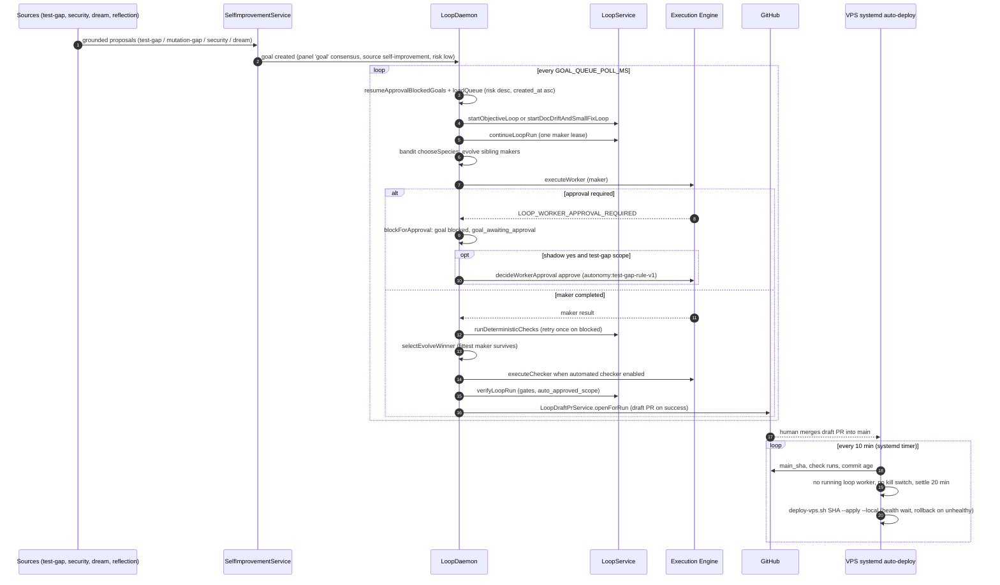

# Autonomous Goal → Daemon → Earned-Autonomy Pipeline

The `ParallelLoopDaemon` (`LoopDaemon`, packages/server/src/services/loop-daemon.ts) is the
always-on engine at the center of the baseline window's autonomy program. It polls a goal
queue, decomposes and dispatches goals through the maker–checker loop machinery, parks goals
that are waiting on human approval, chooses maker runtimes by measured outcome (bandit and
evolve lanes), records the run's result back into the learning layer, and hands certified work
to a human as a draft pull request. A systemd-timed `scripts/auto-deploy.sh` on the VPS then
deploys a merged, CI-green `main` once it has settled and no loop worker is running.

The whole pipeline is *earned autonomy*: every expansion is gated behind an off-by-default
flag and a measured track record (shadow rule → proven lane → auto-approve). The pieces are
wired together in `bootstrap/autonomous-services.ts` and `index.ts`, which start the daemon,
the test-gap source, the dream-state source, the self-improvement auto-review scheduler and
the Commons proposal review service when the runtime profile enables autonomy
(packages/server/src/index.ts#L105-L114, packages/server/src/bootstrap/autonomous-services.ts#L119-L141).

## Goal sources: the improvement funnel feeds the queue

Goals the daemon picks up are created by an improvement funnel, not typed in by a human.
Proposals (`self_improvements` rows, status `proposed → scheduled → executing →
verified/regressed/…`) are generated by several deterministic or learned sources
(packages/server/src/services/self-improvement-service.ts):

- **Test-gap source** (`TestGapSourceService`, packages/server/src/services/test-gap-source-service.ts):
  scans `packages/server/src/services` for live services no test imports (`discoverTestGaps`),
  exported functions no test names (`discoverExportGaps`, lane J3), and services whose
  same-named test lets Stryker mutants survive (`discoverMutationGaps`, lane M2). Each found
  gap becomes a fully grounded proposal (target file, acceptance command, artifact path,
  budget) via `generateFromGroundedGap`, capped per day and in flight. Default off:
  `TEST_GAP_SOURCE_ENABLED` / `TEST_GAP_EXPORTS_ENABLED` / `MUTATION_GAP_ENABLED`
  (packages/server/src/services/test-gap-source-service.ts#L44-L209).
- **Reflection** (`generateFromReflection`), **build errors** (`generateFromBuildErrors`),
  **gap analysis** (`generateFromGaps`, from `CuriosityService.scanForGaps`) and **dream
  state** (`generateFromDreamCause`): the dream state replays recent failed loop runs,
  classifies each failure cause once (shadow judgment), consolidates recurring causes into
  engineering-rule memory candidates and grounded fix proposals
  (packages/server/src/services/dream-state-service.ts#L131-L202).
- **Security scanning** (`AutonomousGoalGenerator.generateFromSecurityFindings` →
  `generateFromSecurityFindings`): high/critical scan findings are routed through the same
  specialist-panel review gate as every other proposal instead of bypassing it.

Every proposal is reviewed by a specialist panel; when the panel reaches a `goal` consensus,
`SelfImprovementAutoReviewScheduler` (or a human `approveImprovement`) authorizes it
(`agentApproveIfReady`), and `AutonomousGoalGenerator.generateImprovement` inserts a goal row
linked by `improvement_id` with `metadata.source = 'self-improvement'`
(packages/server/src/services/self-improvement-auto-review-scheduler.ts#L153-L168,
packages/server/src/services/autonomous-goal-generator.ts#L34-L69). Risk class comes from the
proposal *type* (`security → high`, everything else `low`), not from priority — a deliberate
fix after the test-gap lane's own success pushed its proposals out of the objective-mode gate
(autonomous-goal-generator.ts#L57-L60). `ImprovementFunnelService.compute()` aggregates the
whole chain (per-source conversion, judgment agreement, panel calibration, cost per verified
change) so "where does it leak" is one read-only call
(packages/server/src/services/improvement-funnel-service.ts).

## The tick: queue → authority gate → objective-mode dispatch

`tick()` runs every `GOAL_QUEUE_POLL_MS` (default 5000 ms)
(packages/server/src/services/loop-daemon.ts#L151-L259):

1. `pruneWorktrees()` and `resumeApprovalBlockedGoals()` (see below).
2. `loadQueue()` selects goals in `created`/`decomposed` status, ordered by risk class
   descending (`critical > high > medium > low`) then `created_at` ascending
   (loop-daemon.ts#L345-L365).
3. Up to `getAvailableSlots()` goals are started concurrently
   (`GOAL_MAX_CONCURRENT`, default 4; active goals persist in `system_state` across restarts).
4. Each goal passes the **authority gate** (`authorityGateForGoal`): fail-closed in
   `AUTHORITY_GATE=enforce` mode, observe-only in `on`, default `off` — a goal without a
   PLAN_APPROVED/DEPLOYED ALLOW row is denied (and a DENY event emitted)
   (packages/server/src/services/authority-gate.ts#L23-L109).
5. **Objective-mode dispatch decision** — the gate between a goal's own objective driving a
   real maker/checker cycle and the safe doc-drift no-op
   (packages/server/src/services/objective-loop-gate.ts):
   - `SELF_IMPROVEMENT_OBJECTIVE_LOOP_ENABLED=true` (default off);
   - the goal qualifies: `metadata.source === 'self-improvement'` *and* `risk_class === 'low'`;
   - per-tick cap `SELF_IMPROVEMENT_OBJECTIVE_LOOP_MAX_PER_TICK` (default 1, ceiling 3) not
     reached. A qualifying goal that only loses the cap is *deferred to the next tick*, not
     dropped into the no-op — a wrong `no_change` lesson that used to be learned this way.
   Every self-improvement goal's decision is emitted as a `convergence` bus event
   (`objective_mode_decision`) so the blind spot that let 10/10 goals silently no-op cannot
   recur (loop-daemon.ts#L208-L238).

`executeGoal` then runs the goal end-to-end (loop-daemon.ts#L373-L736):

- `created` goals are scheduled (`ResourceScheduler.canSchedule`, defers with
  `waiting_for_resources`) and decomposed (`GoalDecomposer.decomposeGoalToDAG`).
- The loop is started: `startObjectiveLoop({ goal_id, repository_path })` for objective mode
  (a real git checkout — `LOOP_DAEMON_REPOSITORY_PATH`, since the container's cwd is not a
  repository), `startDocDriftAndSmallFixLoop({ goal_id })` otherwise; a goal resumed after
  approval instead re-opens its existing run (`getLoopRun(resume_run_id)`)
  (loop-service.ts#L415-L429).
- With no findings the goal completes immediately ("nothing to fix"); otherwise
  `continueLoopRun(run.id, { max_assignments: 1, max_maker_workers: 1, runtime? })` creates one
  prepared maker lease (+ manual checker lease). `LOOP_DAEMON_MAKER_RUNTIME` is the operator's
  explicit maker-runtime choice, objective mode only — without it a maker lease used to be
  created `manual` and every daemon goal died with `MANUAL_MAKER_REQUIRES_HUMAN`
  (loop-daemon.ts#L441-L448).

## Maker species selection: bandit (E12) and evolve siblings (E13)

Before the maker runs, two complementary selection mechanisms can rewrite *which* runtime
fills the lease — both by measured outcome, never by config alone:

**Bandit (E12, `runtime-bandit.ts`).** When `LOOP_BANDIT_ENABLED=true` and no explicit
`LOOP_DAEMON_MAKER_RUNTIME` is set, `chooseSpecies` Thompson-samples over `skill_outcomes` for
`loop-maker:<loopName>:<runtime>` (one row per run). The first `LOOP_BANDIT_SPECIES` entry is
the incumbent; a challenger with fewer than `PROMOTE_AFTER` (20) outcomes gets at most
`LOOP_BANDIT_MAX_SHARE` (default 10 %) of runs, so a weak newcomer costs little and a strong
one earns full traffic. The choice is recorded on the lease metadata (`bandit`) and a
`bandit_selected` event; an unavailable runtime degrades to `bandit_skipped`
(packages/server/src/services/runtime-bandit.ts#L14-L42, loop-daemon.ts#L460-L474).

**Evolve (E13, `evolve-selection.ts`).** When `LOOP_EVOLVE_ENABLED=true` and the goal is
eligible — a test-gap or mutation-gap proposal, or goal metadata `evolve: true` — up to two
extra species from `LOOP_EVOLVE_SPECIES` are run as sibling makers on the same objective: each
a `retryLoopRun(run.id, { sibling: true, runtime })` lease that supersedes the first maker,
executed and checked the same way. `selectEvolveWinner` ranks all contenders in code
(`evolve-fitness-service.ts`): hard gates first (exit 0, deterministic checks pass, diff
within budget), then mutation score, then smaller diff, then fewer tokens. The winner stays
the only non-superseded maker and goes on to the reviewers; losers are superseded, their
reviewer leases cancelled, and each loss recorded as a `skill_outcomes` row (`success: 0`) so
the bandit sees the full head-to-head (N7). With no eligible maker the run fails exactly like
a single-maker run (`evolve_no_winner` event)
(packages/server/src/services/evolve-selection.ts#L15-L102,
packages/server/src/services/evolve-fitness-service.ts#L20-L41).

A sibling maker, being a maker, needs its own approval — in an auto-approved lane (J5) it is
auto-approved with the same one-file scope via `autoApproveSibling` (N6)
(loop-daemon.ts#L296-L308).

## Execute, check, retry

The maker executes with a timeout and diff cap tuned per lane (`daemonMakerTimeoutMs`): the
mutation lane — detected by `mutationCheckEnv` returning `MUTATE_FILE`/`MUTATE_TEST` — gets the
600 s executor maximum and 400 diff lines (strengthening a thin test legitimately grows it);
other lanes `LOOP_MAKER_TIMEOUT_MS` (default 300 s, cap 600 s) and 200 lines
(loop-daemon.ts#L30-L34, L477-L486). Deterministic checks (`runDeterministicChecks` with
`daemonCheckOptions`) run a scoped script set (`LOOP_DAEMON_CHECK_SCRIPTS`, e.g.
`test:changed,lint,type-check`; `LOOP_DAEMON_CHECK_TIMEOUT_MS`, default 120 s, cap 600 s); for
a mutation-gap run the `test:mutation:grounded` check runs `scripts/mutation-gain.mjs`, which
passes when the working-tree test gains ≥ 10 mutation-score points (or reaches 90) over the
committed test. A `blocked` result retries the maker once via `retryLoopRun`; checks are
best-effort for the daemon (loop-daemon.ts#L489-L514).

## Approval parking and resume (and the J5 auto-approve)

The execution engine asks a human before a worker runs. For the daemon that is a *wait*, not a
failure — previously goals were failed and their approvals expired unseen
(loop-daemon.ts#L261-L293):

- `LOOP_WORKER_APPROVAL_REQUIRED` from `executeWorker` (maker or evolve sibling) or
  `executeChecker` (checker/security_checker) routes to `blockForApproval`: the goal is set to
  `status='blocked'` with `metadata.awaiting_approval = {approval_id, run_id, lease_id,
  since}`, and a `goal_awaiting_approval` loop event is recorded.
- Every blocked approval gets a **shadow decision** (plan E3):
  `recordAutoApproveShadow` writes one `auto_approve_shadow` judgment per approval — "yes" only
  when the change is test-only, not high-risk/security, and its class (loop × test-only ×
  risk) already has ≥ 3 verified outcomes and no regression — so agreement with the operator's
  real decision is measurable in the funnel before anything is ever auto-approved. Shadow
  bookkeeping is fail-open and never affects the loop
  (packages/server/src/services/autonomy-shadow-service.ts#L15-L42).
- **J5 (`LOOP_AUTO_APPROVE_TEST_GAP`)**: when the shadow rule says yes *and*
  `testGapAutoApproveScope` returns a scope — the goal comes from the test-gap source and its
  artifact is a single new file under `packages/server/src/__tests__/` — the scope is pinned
  onto the lease (`metadata.auto_approved_scope`) *before* approving, then
  `decideWorkerApproval(approvalId, true, 'autonomy:test-gap-rule-v1', reason)` decides the
  approval through the engine that paused it. The M2 lane (`LOOP_AUTO_APPROVE_MUTATION_GAP`)
  shares the one-test-file scope but additionally requires ≥ 1 verified, human-approved run in
  the mutation lane first. Checker, deterministic checks and the human merge stay; the
  `auto_approved_scope` verification gate hard-fails the run if the maker touched anything but
  that file (autonomy-shadow-service.ts#L50-L63,
  packages/server/src/services/loop-verification-service.ts#L119-L124).

`resumeApprovalBlockedGoals()` runs at the top of every tick (loop-daemon.ts#L311-L335):

- approval still `pending` → keep waiting;
- `approved` → wait until the approval's task reaches a terminal state (`completed`/`failed`/
  `cancelled` — the engine resumes the task on approval), then requeue the goal as
  `decomposed` with `metadata.resume_run_id` so the next dispatch continues the *same* run
  with its already-prepared maker lease instead of starting a new one;
- `denied`/`expired` → mark the goal `failed`, record a `goal_failed` event with reason
  `approval <status>`, feed the outcome to `CommonsProposalReviewService.recordGoalOutcome`,
  and emit a failed `loop_completed` bus event so the cognitive layer sees the episode.

## Verify, learn, hand off

After reviewers finish (a still-`running` checker/security checker defers verification to the
pass that finishes it — verifying early would record a false `regressed`), `verifyLoopRun`
evaluates the deterministic gates (`maker_completion`, `diff_threshold_all_makers`,
`checker_verdict`, `tests_lint_typecheck`, `security_checker_verdict` for high risk,
`auto_approved_scope`, …) and `allGatesPass` decides the outcome (loop-daemon.ts#L591-L603,
loop-verification-service.ts#L81-L142).

**Automated reviewers are a deliberate, flag-gated autonomy expansion.** Checker leases are
created with `runtime: 'manual'` — code review is human by design. With
`LOOP_DAEMON_AUTOMATED_CHECKER_ENABLED=true`, the daemon dispatches the prepared checker with
the *same runtime the maker attempt used* (self-review, not an independent reviewer), and with
`LOOP_DAEMON_AUTOMATED_SECURITY_CHECKER_ENABLED=true` the security checker likewise; both use
`daemonReviewerTimeoutMs` (default 300 s, cap 900 s), and a dispatch error is recorded as
`checker_dispatch_failed` rather than swallowed (loop-daemon.ts#L563-L589).

Every executed run then feeds the learning layer, success or fail (loop-daemon.ts#L601-L736):

- a `loop_completed` bus event per run (the cognitive layer learns only from these;
  `recordEpisode` dedupes on `loopRunId`);
- `SelfImprovementService.recordOutcome` on the linked proposal: `verified` when all gates
  pass, else `runOutcomeOnFailure` — `infra_failed` when the maker timed out or hit
  `maker_runtime_exit_zero`/`runtime_contract` (the run never produced an evaluable change,
  so the proposal keeps no verdict), `regressed` otherwise. `verified` also overrides an
  earlier `regressed` — a later passing verification of the same work is the truer outcome
  (loop-daemon.ts#L40-L44, self-improvement-service.ts#L414-L425);
- one `skill_outcomes` row per run keyed `loop-maker:<loopName>:<runtime>` with success,
  tokens, duration and failing-gate evidence refs — the heritability signal (E10) the bandit
  and the skill-evolution engine select on (loop-daemon.ts#L626-L644);
- `CommonsProposalReviewService.recordGoalOutcome(goalId, 'completed'|'failed', detail)`
  un-sticks the proposal (a bounded infra-failure retry re-schedules it) and writes memory
  candidates;
- on success, `LoopDraftPrService.openForRun` (G4, `LOOP_AUTO_DRAFT_PR_ENABLED`) commits the
  winner's worktree changes (never `node_modules` symlinks or lockfile install noise), pushes
  to the maker branch and opens a **draft** PR with the reviewer verdicts in the body — the
  merge stays human (packages/server/src/services/loop-draft-pr-service.ts#L15-L66);
- `KnowledgeRuntimeService.closeLoop` attempts the learning closure; a blocked closure
  records a `learning_closure_blocked` event instead of being silently discarded.

The goal is then marked `completed`/`failed` and the run `completed`/`blocked`. Any
unrecovered error fails the goal, records `goal_failed`, emits a failed `loop_completed`, and
reports via `recordGoalOutcome` (loop-daemon.ts#L646-L736).

## The deploy half: CI-gated systemd auto-deploy

Merged improvements reach production through `scripts/auto-deploy.sh`, run on the VPS by the
systemd units `scripts/systemd/djimitflo-auto-deploy.{service,timer}` (a oneshot service under
an `flock` lock, fired every 10 minutes, 5 minutes after boot). The script deploys `main` only
when **all** probes hold (scripts/auto-deploy.sh):

1. **Kill switch**: `$DEPLOY_ROOT/AUTO_DEPLOY_DISABLED` (`touch /srv/djimitflo/AUTO_DEPLOY_DISABLED`) → exit.
2. **MAIN_SHA ≠ CURRENT_SHA**: `git ls-remote` of `refs/heads/main` against the
   `DJIMITFLO_COMMIT_SHA` recorded in the live `compose.yml`.
3. **CI green**: every check run on that commit via the GitHub API is `completed` with
   conclusion `success`/`skipped`/`neutral`, and at least one check exists — in-progress,
   failing or empty check lists hold the deploy.
4. **Settle**: the commit's committer date is at least `AUTO_DEPLOY_SETTLE_MIN` (default 20)
   minutes old, so a merge train becomes one deploy.
5. **No running loop worker**: a read-only SQLite query inside the running container counts
   `worker_leases status='running'` *plus* `tasks status='running' AND id LIKE 'loop-worker-%'`
   (an approved maker resumes inside the engine while its lease still says `prepared`, so the
   task count closes that blind spot).

Every probe (`MAIN_SHA`, `CURRENT_SHA`, `CHECKS`, `COMMIT`, `LEASES`, `DEPLOY`) is overridable
via an evaluated `AD_<NAME>` env var, which is what makes the decision logic testable without a
VPS (`auto-deploy.test.ts`). The deploy itself is `deploy_commit`: fetch `scripts/deploy-vps.sh`
**of the commit being deployed** (not whatever sits on the host) and run it with
`<SHA> --apply --local`.

`deploy-vps.sh --local` (scripts/deploy-vps.sh#L42-L85) then: prunes old builds and refuses to
build without ≥ 6 GB free disk; clones `runtime-source-<short>` at that SHA, builds
`djimitflo:main-<short>` and `chown -R 1001:1001`s the checkout (the container user needs a
writable `.git` for objective-mode worktrees); backs up `compose.yml` and rewrites image,
`DJIMITFLO_COMMIT_SHA` and the runtime-source mount to the new commit; `docker compose up -d
--force-recreate djimitflo`; and polls the container health for 60 s — **on unhealthy it
restores the compose backup and recreates the previous container** (rollback-on-unhealthy, exit
1). The script is single-host with no blue/green: a failed health check means ~20 s of downtime
before rollback, an accepted trade-off documented in the header.

## Pipeline at a glance

The tick-to-deploy pipeline: sources feed proposals, the daemon runs goal → maker → checker → verification → draft PR, and a CI-gated systemd timer deploys a settled, worker-free main.

## Operational levers and failure semantics

| Flag | Default | Effect |
| --- | --- | --- |
| `GOAL_QUEUE_POLL_MS` / `GOAL_MAX_CONCURRENT` | 5000 / 4 | Daemon poll interval and concurrent-goal cap |
| `SELF_IMPROVEMENT_OBJECTIVE_LOOP_ENABLED` / `_MAX_PER_TICK` | off / 1 (≤ 3) | Objective-mode dispatch of low-risk self-improvement goals |
| `LOOP_DAEMON_MAKER_RUNTIME` | unset | Explicit maker runtime for objective mode; beats the bandit |
| `LOOP_BANDIT_ENABLED` / `LOOP_BANDIT_SPECIES` / `LOOP_BANDIT_MAX_SHARE` | off / — / 0.1 | Thompson species selection over `skill_outcomes` |
| `LOOP_EVOLVE_ENABLED` / `LOOP_EVOLVE_SPECIES` | off / ≤ 2 extra makers | Evolve siblings on test-gap/mutation-gap goals |
| `AUTONOMY_SHADOW_ENABLED` | off | Record the shadow auto-approve judgment per approval |
| `LOOP_AUTO_APPROVE_TEST_GAP` / `LOOP_AUTO_APPROVE_MUTATION_GAP` | off | J5/M2 one-test-file auto-approval |
| `LOOP_DAEMON_AUTOMATED_CHECKER_ENABLED` / `..._SECURITY_CHECKER_ENABLED` | off | Maker-runtime self-review by the checker / security checker |
| `LOOP_AUTO_DRAFT_PR_ENABLED` (+ `GITHUB_REPOSITORY`/`GITHUB_TOKEN`) | off | G4 draft-PR handoff of certified runs |
| `LOOP_DAEMON_CHECK_SCRIPTS` / `LOOP_DAEMON_CHECK_TIMEOUT_MS` | all / 120 s (≤ 600 s) | Scoped deterministic checks |
| `LOOP_MAKER_TIMEOUT_MS` / `LOOP_REVIEWER_TIMEOUT_MS` | 300 s / 300 s (≤ 600/900 s) | Maker and reviewer timeouts (mutation lane fixed at 600 s) |
| `TEST_GAP_SOURCE_ENABLED` / `TEST_GAP_EXPORTS_ENABLED` / `MUTATION_GAP_ENABLED` | off | Deterministic proposal lanes |
| `AUTO_DEPLOY_SETTLE_MIN`, kill switch `/srv/djimitflo/AUTO_DEPLOY_DISABLED` | 20 / absent | Deploy settle window and emergency stop |

Failure semantics the operator can rely on:

- **`infra_failed` vs `regressed`** (A3): a maker that timed out or never produced an
  evaluable change counts `infra_failed` — the proposal gets no verdict and the guardrail does
  not count it against the lane; only an evaluated-and-rejected change is `regressed`
  (loop-daemon.ts#L36-L44).
- **Approval is a wait**: pending → blocked goal; denied/expired → failed goal and recorded
  outcome; approved+terminal task → resume on the same run, never a duplicate maker.
- **Fail-closed authority gate**, **fail-open learning**: shadow judgments, skill outcomes,
  funnel records and learning closures are all best-effort — none may break the daemon — while
  capability gating (authority gate, objective-mode gate, J5 scope) denies by default.
- **No automatic merge or deploy**: the loop only ever prepares reviewed worktrees and a draft
  PR; the merge is human, and the deploy is CI-gated, settled, worker-free and
  rollback-on-unhealthy.

## Focused tests

- `packages/server/src/__tests__/loop-daemon-objective-mode.test.ts` — dispatch branching:
  objective mode gated on flag + source + risk, per-tick cap defers rather than no-ops,
  `LOOP_DAEMON_REPOSITORY_PATH` and `LOOP_DAEMON_MAKER_RUNTIME` plumbing.
- `packages/server/src/__tests__/loop-daemon-approval-wait.test.ts` — parking/resume: blocked
  (not failed) with `awaiting_approval` + `goal_awaiting_approval`; still-pending waits;
  approved+terminal resumes the same run; denied/expired fails with reason.
- `packages/server/src/__tests__/j5-test-gap-auto-approve.test.ts` — J5 scope gating, daemon
  auto-approves with pinned `auto_approved_scope`, mutation-gap lane requires its own flag and
  a verified human-approved run first.
- `packages/server/src/__tests__/autonomy-shadow.test.ts` — shadow rule (≥ 3 verified, no
  regression, test-only, not high-risk/security), recorded once per approval, funnel agreement
  with the operator's decision.
- `packages/server/src/__tests__/runtime-bandit.test.ts` and `evolve-selection.test.ts` /
  `evolve-fitness.test.ts` — challenger capping/promotion, eligibility (test-gap/mutation-gap
  or `evolve: true`), winner selection (hard gates → mutation score → diff → tokens), loser
  lineage and reviewer cancellation.
- `packages/server/src/__tests__/loop-daemon-checker-dispatch.test.ts`,
  `loop-daemon-check-options.test.ts`, `loop-daemon-failure-logging.test.ts` — automated
  checker/security dispatch and approval waits, check scoping/timeouts and
  `runOutcomeOnFailure`, failure event recording.
- `packages/server/src/__tests__/auto-deploy.test.ts` — every probe overridden: deploys only
  when CI green + settled + no worker + no kill switch; holds with a reason for each unsafe
  condition.
- `packages/server/src/__tests__/improvement-funnel.test.ts` — funnel aggregation: per-source
  conversion, judgment agreement, panel calibration, cost per verified change.

## Related pages

- [Loop lifecycle: runs, leases, worktrees & recovery](../concepts/loop-lifecycle.md) — the loop domain model and verification gates this daemon drives
- [Maker–checker loop execution](./maker-checker-loop.md) — the per-run machinery (worktrees, diff caps, verdicts, learning closure)
- [Approval request & decision flow](./approval-decision-flow.md) — the operator-facing approval lifecycle the daemon parks on
- [Configuration reference](../operations/configuration-reference.md) — environment flags in the wider operations context
- [Test strategy](../testing/test-strategy.md) — how the deterministic checks fit the repo's test pyramid
