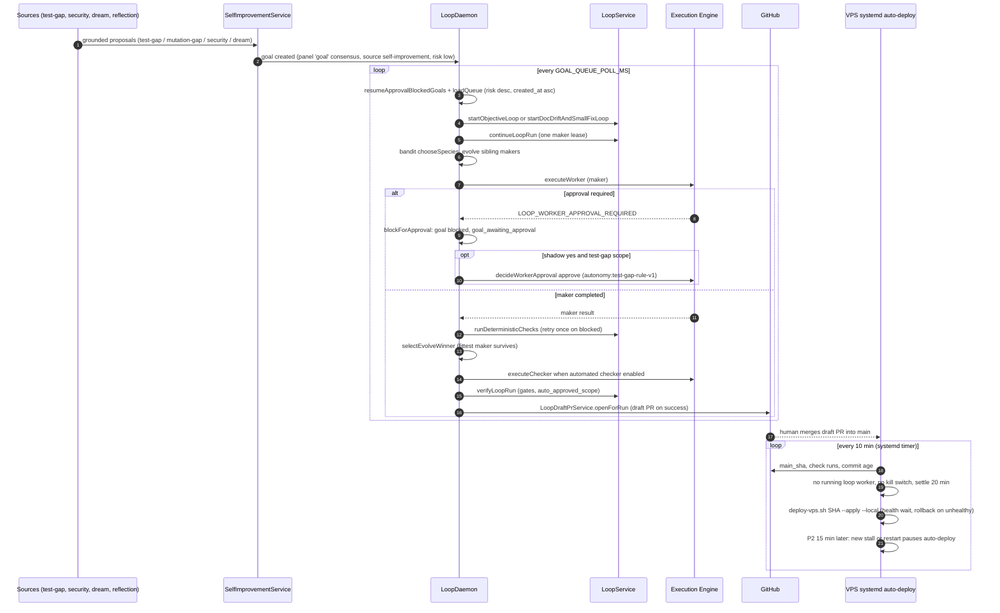

# Autonomous Goal → Daemon → Earned-Autonomy Pipeline

The `ParallelLoopDaemon` (`LoopDaemon`, packages/server/src/services/loop-daemon.ts) is the
always-on engine at the center of the baseline window's autonomy program. It polls a goal
queue, decomposes and dispatches goals through the maker–checker loop machinery, parks goals
that are waiting on human approval, chooses maker runtimes by measured outcome (bandit and
evolve lanes), records the run's result back into the learning layer, and hands certified work
to a human as a draft pull request. A systemd-timed `scripts/auto-deploy.sh` on the VPS then
deploys a merged, CI-green `main` once it has settled and no loop worker is running.

The whole pipeline is *earned autonomy*: every expansion is gated behind an off-by-default
flag and a measured track record (shadow rule → proven lane → auto-approve). The pieces are
wired together in `bootstrap/autonomous-services.ts` and `index.ts`, which start the daemon,
the test-gap source, the dream-state source, the self-improvement auto-review scheduler and
the Commons proposal review service when the runtime profile enables autonomy
(packages/server/src/index.ts#L105-L114, packages/server/src/bootstrap/autonomous-services.ts#L119-L141).

The boundary the pipeline keeps (README): **humans merge; gates, auth and deploy are never
evolved by the loop.** The loop can choose which maker species writes code and which reviewer
variant reads it, but the verification gates, the authority/approval machinery and the deploy
script are outside anything the loop selects over.

## Goal sources: the improvement funnel feeds the queue

Goals the daemon picks up are created by an improvement funnel, not typed in by a human.
Proposals (`self_improvements` rows, status `proposed → scheduled → executing →
verified/regressed/…`) are generated by several deterministic or learned sources
(packages/server/src/services/self-improvement-service.ts):

- **Test-gap source** (`TestGapSourceService`, packages/server/src/services/test-gap-source-service.ts):
  scans `packages/server/src/services` for live services no test imports (`discoverTestGaps`),
  exported functions no test names (`discoverExportGaps`, lane J3), the same contract in the
  other Node workspaces (`discoverPackageGaps`, M1, `TEST_GAP_PACKAGES_ENABLED`), and services
  whose same-named test lets Stryker mutants survive (`discoverMutationGaps`, lane M2,
  sensitive names like auth/secrets/deploy/token excluded). All lanes skip services that no
  production file imports (`importedServices`, N12a) — a test of dead code guards nothing.
  Each found gap becomes a fully grounded proposal (target file, acceptance command, artifact
  path, budget) via `generateFromGroundedGap`, capped per day and in flight; a file that ever
  had a test-gap proposal of its kind is never proposed again automatically
  (packages/server/src/services/test-gap-source-service.ts#L44-L231). The source ticks 6-hourly
  (first run 90 s after boot) and is default off: `TEST_GAP_SOURCE_ENABLED` /
  `TEST_GAP_EXPORTS_ENABLED` / `MUTATION_GAP_ENABLED` (test-gap-source-service.ts#L13-L20,
  L166-L178). `mutationCheckEnv` is also the daemon's lane detector: a goal whose proposal
  carries a `mutation-gap:` evidence ref yields `MUTATE_FILE`/`MUTATE_TEST` for the
  `test:mutation:grounded` check (test-gap-source-service.ts#L157-L164).
- **Reflection** (`generateFromReflection`), **build errors** (`generateFromBuildErrors`),
  **gap analysis** (`generateFromGaps`, from `CuriosityService.scanForGaps`), **dead-code
  removal** (`DEAD_CODE_LANE_ENABLED` — the daemon gives that lane a 2 000-line diff cap,
  loop-daemon.ts#L550-L552) and **dream state** (`generateFromDreamCause`): the dream state
  replays recent failed loop runs, classifies each failure cause once (shadow judgment), and
  consolidates a cause recurring ≥ MIN_RECURRENCE times in 7 days into an engineering-rule
  memory candidate and — when mostly platform-faulted — a grounded fix proposal
  (packages/server/src/services/dream-state-service.ts#L132-L203).
- **Security scanning** (`AutonomousGoalGenerator.generateFromSecurityFindings` →
  `generateFromSecurityFindings`): high/critical scan findings are routed through the same
  specialist-panel review gate as every other proposal instead of bypassing it.

Every proposal is reviewed by a specialist panel; when the panel reaches a `goal` consensus,
`SelfImprovementAutoReviewScheduler` (or a human `approveImprovement`) authorizes it
(`agentApproveIfReady`), and with `SELF_IMPROVEMENT_GOAL_ON_APPROVE=true` the
`AutonomousGoalGenerator.generateImprovement` creates the goal immediately instead of waiting
for the hourly cycle (packages/server/src/services/self-improvement-auto-review-scheduler.ts#L166-L181).
`generateImprovement` inserts a goal row linked by `improvement_id` with `metadata.source =
'self-improvement'`, records the panel's authorization as the `PLAN_APPROVED` ALLOW the
authority gate looks for, and enqueues the `djimitflo.goal.created` outbox event
(packages/server/src/services/autonomous-goal-generator.ts#L34-L75). Risk class comes from the
proposal *type* (`security → high`, everything else `low`), not from priority — a deliberate
fix after the test-gap lane's own success pushed its proposals out of the objective-mode gate
(autonomous-goal-generator.ts#L63-L66). `ImprovementFunnelService.compute()` aggregates the
whole chain (per-source conversion, judgment agreement, panel calibration, a 7-day KPI window
with cost per verified change) so "where does it leak" is one read-only call
(packages/server/src/services/improvement-funnel-service.ts#L106-L180).

## The tick: queue → authority gate → objective-mode dispatch

`tick()` runs every `GOAL_QUEUE_POLL_MS` (default 5000 ms)
(packages/server/src/services/loop-daemon.ts#L177-L288):

1. `pruneWorktrees()` and `resumeApprovalBlockedGoals()` (see below).
2. `loadQueue()` selects goals in `created`/`decomposed` status, ordered by risk class
   descending (`critical > high > medium > low`) then `created_at` ascending
   (loop-daemon.ts#L393-L413).
3. Up to `getAvailableSlots()` goals are started concurrently
   (`GOAL_MAX_CONCURRENT`, default 4; active goals persist in `system_state` across restarts).
   A goal with an `executeGoal` already in flight in this process is filtered out first
   (`this.executing`) — a goal resumed after an approval is `decomposed` while it runs, so
   every tick used to dispatch it again until the second pass failed it with
   `LOOP_WORKER_EXECUTION_IN_PROGRESS` (prod 2026-10-01, loop-daemon.ts#L191-L193).
4. Each goal passes the **authority gate** (`authorityGateForGoal`): fail-closed in
   `AUTHORITY_GATE=enforce` mode, observe-only in `on`, default `off` — a goal without a
   PLAN_APPROVED/DEPLOYED ALLOW row is denied (and a DENY event emitted)
   (packages/server/src/services/authority-gate.ts#L23-L109).
5. **Objective-mode dispatch decision** — the gate between a goal's own objective driving a
   real maker/checker cycle and the safe doc-drift no-op
   (packages/server/src/services/objective-loop-gate.ts):
   - `SELF_IMPROVEMENT_OBJECTIVE_LOOP_ENABLED=true` (default off);
   - the goal qualifies: `metadata.source === 'self-improvement'` *and* `risk_class === 'low'`;
   - per-tick cap `SELF_IMPROVEMENT_OBJECTIVE_LOOP_MAX_PER_TICK` (default 1, ceiling 3) not
     reached. A qualifying goal that only loses the cap is *deferred to the next tick*, not
     dropped into the no-op — a wrong `no_change` lesson that used to be learned this way.
   Every self-improvement goal's decision is emitted as a `convergence` bus event
   (`objective_mode_decision`) so the blind spot that let 10/10 goals silently no-op cannot
   recur (loop-daemon.ts#L222-L266).

`executeGoal` then runs the goal end-to-end (loop-daemon.ts#L421-L902):

- `created` goals are scheduled (`ResourceScheduler.canSchedule`, defers with
  `goal_deferred`) and decomposed (`GoalDecomposer.decomposeGoalToDAG`).
- The loop is started: `startObjectiveLoop({ goal_id, repository_path })` for objective mode
  (a real git checkout — `LOOP_DAEMON_REPOSITORY_PATH`, since the container's cwd is not a
  repository), `startDocDriftAndSmallFixLoop({ goal_id })` otherwise; a goal resumed after
  approval instead re-opens its existing run (`getLoopRun(resume_run_id)`)
  (loop-service.ts#L415-L429).
- With no findings the goal completes immediately ("nothing to fix"); otherwise
  `continueLoopRun(run.id, { max_assignments: 1, max_maker_workers: 1, runtime? })` creates one
  prepared maker lease (+ manual checker lease). `LOOP_DAEMON_MAKER_RUNTIME` is the operator's
  explicit maker-runtime choice, objective mode only — without it a maker lease used to be
  created `manual` and every daemon goal died with `MANUAL_MAKER_REQUIRES_HUMAN`
  (loop-daemon.ts#L483-L496).
- On a **resumed** run the prepared leases are listed instead (loop-daemon.ts#L490-L491): an
  approved evolve sibling comes first (its `prepared` maker runs even when the first maker
  already completed, Y0b), then an already-completed maker is taken as-is (never run twice),
  then the prepared first maker (loop-daemon.ts#L498-L509).

## Maker species selection: bandit (E12) and evolve siblings (E13)

Before the maker runs, two complementary selection mechanisms can rewrite *which* runtime
fills the lease — both by measured outcome, never by config alone:

**Bandit (E12, `runtime-bandit.ts`).** `chooseSpecies` Thompson-samples over `skill_outcomes`
for `loop-maker:<loopName>:<runtime>` (one row per run, challenger model matched), excluding
failures attributed to the reviewer or the environment when outcome attribution is on. The
first `LOOP_BANDIT_SPECIES` entry is the incumbent; a challenger with fewer than
`PROMOTE_AFTER` (20) outcomes gets at most `LOOP_BANDIT_MAX_SHARE` (default 10 %) of runs, so
a weak newcomer costs little and a strong one earns full traffic
(packages/server/src/services/runtime-bandit.ts#L13-L45). Since Y1 (operator 2026-10-01) the
daemon consults the bandit whenever there is *no explicit maker runtime* **or** the bandit
flag is on — with both set, `LOOP_DAEMON_MAKER_RUNTIME` prepared the lease and stays on it as
the fallback when the bandit makes no choice (`chooseSpecies` returns null under 2 species);
an unavailable chosen runtime degrades to `bandit_skipped` rather than rewriting the lease.
The bandit never rewrites a resumed maker (a completed maker is taken as-is) or an evolve
sibling: its species is the point of the sibling (prod 2026-10-01: the bandit rewrote
remote@workstation siblings to opencode, which then ran the task twice and drifted into
README/CONTRIBUTING edits) (loop-daemon.ts#L511-L533). The choice is recorded on the lease
metadata (`bandit`) and a `bandit_selected` event carrying the challenger share for propensity
reconstruction (RX-15).

**Evolve (E13, `evolve-selection.ts`).** When `LOOP_EVOLVE_ENABLED=true` and the goal is
eligible — a test-gap or mutation-gap proposal, or goal metadata `evolve: true` — up to two
extra species from `LOOP_EVOLVE_SPECIES` are run as sibling makers on the same objective: each
a `retryLoopRun(run.id, { maker_lease_id, sibling: true, runtime, model? })` lease that
supersedes the first maker, executed and checked the same way. Species identical (runtime and
model) to the first maker the bandit chose are dropped — a sibling would run the same work
twice (Y1) — and the effort controllers can thin or shadow the sibling set
(`EFFORT_SIBLING_RANDOMISE` arm `off` removes it, X1; `EFFORT_CONTROLLER_MODE=shadow` only
records what it would pick) (loop-daemon.ts#L595-L609). `selectEvolveWinner` ranks all
contenders in code (`evolve-fitness-service.ts`): hard gates first (exit 0, deterministic
checks pass, diff within budget *and the goal's artifact among the changed files* — prod
2026-10-01: a sibling that edited README.md/CONTRIBUTING.md beat the maker that wrote the
requested test), then higher mutation score, then smaller diff, then fewer tokens, then the
earliest finisher (evolve-selection.ts#L47-L78,
packages/server/src/services/evolve-fitness-service.ts#L20-L41). On top, an optional graded
contest (`GRADED_CONTEST_MODE`: `shadow` logs, `act` decides) lets the highest SI-A graded
kill share win among gate-passers (evolve-selection.ts#L86-L101). The winner stays the only
non-superseded maker and goes on to the reviewers; losers are superseded, their prepared
reviewer leases cancelled, leftover never-started makers cancelled with them (prod 2026-10-09:
an unprepared retry maker broke `maker_completion` next to the winner), and each loss recorded
as a `skill_outcomes` row (`success: 0`; a gate-passer that lost a graded contest counts a
success tagged `contest:passed_lost`, SI-B) so the bandit sees the full head-to-head (N7
lineage, evolve-selection.ts#L102-L148). With no eligible maker the run fails exactly like a
single-maker run (`evolve_no_winner` event).

A sibling maker, being a maker, needs its own approval — in an auto-approved lane (J5) it is
auto-approved with the same one-file scope via `autoApproveSibling` (N6), otherwise it can
inherit under `inheritApproval`'s strict rule, and anywhere else its `APPROVAL_REQUIRED` is
*propagated* so `executeGoal` parks the goal on it — the approval used to arrive after the
run had concluded "no winner" and the proposal was labelled regressed (Y0b, prod 2026-09-30)
(loop-daemon.ts#L331-L343, L613-L640).

## Execute, check, retry

The maker executes with a timeout and diff cap tuned per lane (`daemonMakerTimeoutMs`): the
mutation lane — detected by `mutationCheckEnv` returning `MUTATE_FILE`/`MUTATE_TEST` — gets the
600 s executor maximum and 400 diff lines (strengthening a thin test legitimately grows it);
the dead-code lane 2 000 lines (it deletes more than it adds); other lanes
`LOOP_MAKER_TIMEOUT_MS` (default 300 s, cap 600 s) and 200 lines
(loop-daemon.ts#L38-L46, L547-L558). Deterministic checks (`runDeterministicChecks` with
`daemonCheckOptions`) run a scoped script set (`LOOP_DAEMON_CHECK_SCRIPTS`, e.g.
`test:changed,lint,type-check`; `LOOP_DAEMON_CHECK_TIMEOUT_MS`, default 120 s, cap 600 s); for
a mutation-gap run the `test:mutation:grounded` check runs `scripts/mutation-gain.mjs`, which
passes when the working-tree test gains ≥ 10 mutation-score points (or reaches 90) over the
committed test. A `blocked` result retries the maker once via `retryLoopRun`; the retry needs
its own approval, granted only when `inheritApproval`'s strict rule holds (D4) — an approval
used to be dropped here silently (loop-daemon.ts#L560-L589).

## Approval parking and resume (and the J5 auto-approve)

The execution engine asks a human before a worker runs. For the daemon that is a *wait*, not a
failure — previously goals were failed and their approvals expired unseen (prod 2026-09-21)
(loop-daemon.ts#L290-L328):

- `LOOP_WORKER_APPROVAL_REQUIRED` from `executeWorker` (maker or evolve sibling) or
  `executeChecker` (checker/security_checker) routes to `blockForApproval`: the approval id is
  found on the lease metadata or, where the path never copied it (the checker's), via the
  lease's `execution_task_id`; the goal is set to `status='blocked'` with
  `metadata.awaiting_approval = {approval_id, run_id, lease_id, since}`, and a
  `goal_awaiting_approval` loop event is recorded. With no findable approval it fails as before.
- Every blocked approval gets a **shadow decision** (plan E3):
  `recordAutoApproveShadow` writes one `auto_approve_shadow` judgment per approval — "yes" only
  when the change is test-only, not high-risk/security, and its class (loop × test-only ×
  risk) already has ≥ 3 verified outcomes and no regression — so agreement with the operator's
  real decision is measurable in the funnel before anything is ever auto-approved. Shadow
  bookkeeping is fail-open and never affects the loop
  (packages/server/src/services/autonomy-shadow-service.ts#L15-L50).
- **J5 (`LOOP_AUTO_APPROVE_TEST_GAP`)**: when the shadow rule says yes *and*
  `testGapAutoApproveScope` returns a scope — the goal comes from the test-gap source and its
  artifact is a single new file under `packages/server/src/__tests__/` matching
  `*.test.ts` — the scope is pinned onto the lease (`metadata.auto_approved_scope`) *before*
  approving, then `decideWorkerApproval(approvalId, true, 'autonomy:test-gap-rule-v1', reason)`
  decides the approval through the engine that paused it. The M2 lane
  (`LOOP_AUTO_APPROVE_MUTATION_GAP`) shares the one-test-file scope but additionally requires
  ≥ 1 verified, human-approved run in the mutation lane first
  (autonomy-shadow-service.ts#L52-L71). Z4 (operator decision 2026-10-01) adds the oracle
  lanes: with `ORACLE_LANES_AUTO_APPROVE=true` a maker the rule said *no* to is still approved
  on the same deterministic scope, decided by `autonomy:oracle-lane-v1`, with the rule's
  verdict recorded (prod 2026-10-01: 8/8 oracle-lane makers went to the human)
  (loop-daemon.ts#L311-L324). Checker, deterministic checks and the human merge stay; the
  `auto_approved_scope` verification gate hard-fails the run if the maker touched anything but
  that file (packages/server/src/services/loop-verification-service.ts#L120-L125).

`resumeApprovalBlockedGoals()` runs at the top of every tick (loop-daemon.ts#L358-L383):

- approval still `pending` → keep waiting;
- `approved` → wait until the approval's task reaches a terminal state (`completed`/`failed`/
  `cancelled` — the engine resumes the task on approval and `executeViaEngine` returns the
  stored result instead of running the maker twice), then requeue the goal as `decomposed`
  with `metadata.resume_run_id` so the next dispatch continues the *same* run with its
  already-prepared maker lease instead of starting a new one;
- `denied`/`expired` → mark the goal `failed`, record a `goal_failed` event with reason
  `approval <status>`, feed the outcome to `CommonsProposalReviewService.recordGoalOutcome`,
  and emit a failed `loop_completed` bus event so the cognitive layer sees the episode.

## Verify, learn, hand off

After reviewers finish (a still-`running` checker/security checker defers verification to the
pass that finishes it — verifying early would record a false `regressed`, and the deferral is
logged as `verify_deferred`), `verifyLoopRun` evaluates the deterministic gates
(`maker_completion`, `diff_threshold_all_makers`, `checker_verdict`, `tests_lint_typecheck`,
`security_checker_verdict` for high risk, `auto_approved_scope`, `no_automatic_merge`, …) and
`allGatesPass` decides the outcome (loop-daemon.ts#L745-L757, loop-verification-service.ts#L120-L143).

**Automated reviewers are a deliberate, flag-gated autonomy expansion.** Checker leases are
created with `runtime: 'manual'` — code review is human by design. With
`LOOP_DAEMON_AUTOMATED_CHECKER_ENABLED=true`, the daemon dispatches the prepared checker with
the *same runtime the active maker attempt used* (self-review, not an independent reviewer)
and with `LOOP_DAEMON_AUTOMATED_SECURITY_CHECKER_ENABLED=true` the security checker likewise
(its own flag: it removes human security review); both use `daemonReviewerTimeoutMs` (default
300 s, cap 900 s — prod 2026-09-24: 2/7 accepted reviews hit the old fixed 120 s). Dispatch is
skipped with a `checker_dispatch_skipped` event when the active maker already failed or
cancelled (a cascade, not a second failure) or when the maker ran `remote` and
`LOOP_DAEMON_MAKER_RUNTIME` names no local reviewer runtime — prod 2026-10-01..07 saw 47
`checker_dispatch_failed` in 7 days from exactly those cascades, plus the wrong maker's
checker lease being picked (the evolve winner was never reviewed), so the reviewer lease is
now picked for the active maker, newest first (loop-daemon.ts#L655-L743). A reviewer whose
runtime gave out (timeout or token budget) gets one fresh reviewer lease for the same maker
before the gates are evaluated (`LOOP_REVIEWER_RETRY_ENABLED`, `reviewerRetryable`; a reviewer
that returned a verdict is never retried). A dispatch error parks on approval
(`LOOP_WORKER_APPROVAL_REQUIRED`) or is recorded as `checker_dispatch_failed` rather than
swallowed.

Every executed run then feeds the learning layer, success or fail (loop-daemon.ts#L759-L853):

- a `loop_completed` bus event per run (the cognitive layer learns only from these;
  `recordEpisode` dedupes on `loopRunId`);
- `SelfImprovementService.recordOutcome` on the linked proposal: `verified` when all gates
  pass, else `runOutcomeOnFailure` — `infra_failed` when the maker timed out or hit
  `maker_runtime_exit_zero`/`runtime_contract` (the run never produced an evaluable change,
  so the proposal keeps no verdict), `no_change` when it changed nothing, `regressed`
  otherwise. `verified` also overrides an earlier `regressed` — a later passing verification
  of the same work is the truer outcome (loop-daemon.ts#L48-L60,
  self-improvement-service.ts#L463-L469);
- one attributable `outcome_attribution` judgment per run (E2, `OUTCOME_ATTRIBUTION_ENABLED`:
  maker / reviewer / environment failure or verified), so maker-side learners count only
  maker failures — 30 of 45 regressions in 30 days were a missing reviewer verdict after a
  completed maker (packages/server/src/services/outcome-attribution.ts#L4-L15);
- one `skill_outcomes` row per run keyed `loop-maker:<loopName>:<runtime>` with success,
  tokens, duration, the genome/content hash the maker ran with and failing-gate evidence refs
  — the heritability signal (E10) the bandit and the skill-evolution engine select on
  (loop-daemon.ts#L784-L810);
- `CommonsProposalReviewService.recordGoalOutcome(goalId, 'completed'|'failed', detail)`
  un-sticks the proposal (a bounded infra-failure retry re-schedules it) and writes memory
  candidates;
- on success, `LoopDraftPrService.openForRun` (G4, `LOOP_AUTO_DRAFT_PR_ENABLED`) commits the
  winner's worktree changes (never `node_modules` symlinks or lockfile install noise), pushes
  to the maker branch and opens a **draft** PR with the reviewer verdicts in the body — once
  per run, and held back when evidence freshness enforcement finds the files the checks *read*
  changed on main (`evidence_stale`) or the open-loop-draft cap is reached
  (`draft_pr_throttled`, RX-6) (packages/server/src/services/loop-draft-pr-service.ts#L17-L100);
- `KnowledgeRuntimeService.closeLoop` attempts the learning closure; a blocked closure
  records a `learning_closure_blocked` event instead of being silently discarded.

The goal is then marked `completed`/`failed` and the run `completed`/`blocked`. Any
unrecovered error fails the goal, records `goal_failed`, emits a failed `loop_completed`, and
reports via `recordGoalOutcome` (loop-daemon.ts#L864-L895).

## The deploy half: CI-gated systemd auto-deploy

Merged improvements reach production through `scripts/auto-deploy.sh`, run on the VPS by the
systemd units `scripts/systemd/djimitflo-auto-deploy.{service,timer}` (a oneshot service under
an `flock` lock, fired every 10 minutes, 5 minutes after boot). The script deploys `main` only
when **all** probes hold (scripts/auto-deploy.sh#L70-L91):

1. **Kill switch**: `$DEPLOY_ROOT/AUTO_DEPLOY_DISABLED` (`touch /srv/djimitflo/AUTO_DEPLOY_DISABLED`) → exit.
   The same file is how the post-deploy verdict (below) pauses the pipeline.
2. **MAIN_SHA ≠ CURRENT_SHA**: `git ls-remote` of `refs/heads/main` against the
   `DJIMITFLO_COMMIT_SHA` recorded in the live `compose.yml`; an unreadable main exits 1.
3. **CI green**: every check run on that commit via the GitHub API is `completed` with
   conclusion `success`/`skipped`/`neutral`, and at least one check exists — in-progress,
   failing or empty check lists hold the deploy.
4. **Settle**: the commit's committer date is at least `AUTO_DEPLOY_SETTLE_MIN` (default 20)
   minutes old, so a merge train becomes one deploy.
5. **No running loop worker**: a read-only SQLite query inside the running container counts
   `worker_leases status='running'` *plus* `tasks status='running' AND id LIKE 'loop-worker-%'`
   (an approved maker resumes inside the engine while its lease still says `prepared`, so the
   task count closes that blind spot — prod 2026-09-25).

Every probe (`MAIN_SHA`, `CURRENT_SHA`, `CHECKS`, `COMMIT`, `LEASES`, `STALLS`, `RESTARTS`,
`DEPLOY`) is overridable via an evaluated `AD_<NAME>` env var, which is what makes the decision
logic testable without a VPS (`auto-deploy.test.ts`). A successful deploy records the commit
and the stall baseline (`.last-deploy`, `.deploy-baseline`); a failed one records neither and
logs the failure.

The deploy itself is `deploy_commit`: fetch `scripts/deploy-vps.sh` **of the commit being
deployed** (from raw.githubusercontent at that SHA, not whatever sits on the host) and run it
with `<SHA> --apply --local` (scripts/auto-deploy.sh#L59-L68).

**P2 post-deploy verdict** (auto-deploy.sh#L39-L58): deploy-vps.sh already rolls back an
unhealthy start, but some regressions only show later. `AUTO_DEPLOY_VERDICT_MIN` (default 15)
minutes after a deploy, once per commit, the script diffs the stall watch's subsystems against
the recorded baseline and counts container restarts: a *new* structural stall (default
`AUTO_DEPLOY_REGRESSION_STALLS=panel|goals` — provider/host noise is only logged) or any
restart writes the reason into the kill-switch file and pauses auto-deploy
(`event paused`); otherwise the commit verdict is `ok`. Rollback itself stays a human
decision.

`deploy-vps.sh --local` (scripts/deploy-vps.sh#L42-L92) then: prunes old builds (keeping the
newest 4, the running and the previous, plus a week of build cache — an over-prune of the
dangling builder layers made every build cold and hit the 20-minute build timeout on
2026-09-28) and refuses to build with less than 6 GB free disk (old builds filled the disk on
2026-09-21 and the rollback target crash-looped too); clones `runtime-source-<short>` at that
SHA, builds `djimitflo:main-<short>` under a bounded, host-networked `docker build`
(hung builds blocked every deploy, 2026-09-25/26) and `chown -R 1001:1001`s the checkout (the
container user needs a writable `.git` for objective-mode worktrees); backs up `compose.yml`
and rewrites image, `DJIMITFLO_COMMIT_SHA` and the runtime-source mount to the new commit;
`docker compose up -d --force-recreate djimitflo`; and polls the container health for 60 s —
**on unhealthy it restores the compose backup and recreates the previous container**
(rollback-on-unhealthy, exit 1). The script is single-host with no blue/green: a failed health
check means ~20 s of downtime before rollback, an accepted trade-off documented in the header.

## Pipeline at a glance

```mermaid
sequenceDiagram
  autonumber
  participant SRC as Sources (test-gap, security, dream, reflection)
  participant SI as SelfImprovementService
  participant D as LoopDaemon
  participant LS as LoopService
  participant ENG as Execution Engine
  participant GH as GitHub
  participant VPS as VPS systemd auto-deploy
  SRC->>SI: grounded proposals (test-gap / mutation-gap / security / dream)
  SI->>D: goal created (panel 'goal' consensus, source self-improvement, risk low)
  loop every GOAL_QUEUE_POLL_MS
    D->>D: resumeApprovalBlockedGoals + loadQueue (risk desc, created_at asc)
    D->>LS: startObjectiveLoop or startDocDriftAndSmallFixLoop
    D->>LS: continueLoopRun (one maker lease)
    D->>D: bandit chooseSpecies, evolve sibling makers
    D->>ENG: executeWorker (maker)
    alt approval required
      ENG-->>D: LOOP_WORKER_APPROVAL_REQUIRED
      D->>D: blockForApproval: goal blocked, goal_awaiting_approval
      opt shadow yes and test-gap scope
        D->>ENG: decideWorkerApproval approve (autonomy:test-gap-rule-v1)
      end
    else maker completed
      ENG-->>D: maker result
      D->>LS: runDeterministicChecks (retry once on blocked)
      D->>D: selectEvolveWinner (fittest maker survives)
      D->>ENG: executeChecker when automated checker enabled
      D->>LS: verifyLoopRun (gates, auto_approved_scope)
      D->>GH: LoopDraftPrService.openForRun (draft PR on success)
    end
  end
  GH-->>VPS: human merges draft PR into main
  loop every 10 min (systemd timer)
    VPS->>GH: main_sha, check runs, commit age
    VPS->>VPS: no running loop worker, no kill switch, settle 20 min
    VPS->>VPS: deploy-vps.sh SHA --apply --local (health wait, rollback on unhealthy)
    VPS->>VPS: P2 15 min later: new stall or restart pauses auto-deploy
  end
```

The tick-to-deploy pipeline: sources feed proposals, the daemon runs goal → maker → checker → verification → draft PR, and a CI-gated systemd timer deploys a settled, worker-free main and keeps watching it afterwards.

## Operational levers and failure semantics

| Flag | Default | Effect |
| --- | --- | --- |
| `GOAL_QUEUE_POLL_MS` / `GOAL_MAX_CONCURRENT` | 5000 / 4 | Daemon poll interval and concurrent-goal cap |
| `SELF_IMPROVEMENT_OBJECTIVE_LOOP_ENABLED` / `_MAX_PER_TICK` | off / 1 (≤ 3) | Objective-mode dispatch of low-risk self-improvement goals |
| `LOOP_DAEMON_MAKER_RUNTIME` | unset | Explicit maker runtime for objective mode; bandit may still choose over it and it stays the lease fallback |
| `LOOP_BANDIT_ENABLED` / `LOOP_BANDIT_SPECIES` / `LOOP_BANDIT_MAX_SHARE` | off / — / 0.1 | Thompson species selection over `skill_outcomes` |
| `LOOP_EVOLVE_ENABLED` / `LOOP_EVOLVE_SPECIES` | off / ≤ 2 extra makers | Evolve siblings on test-gap/mutation-gap goals |
| `AUTONOMY_SHADOW_ENABLED` | off | Record the shadow auto-approve judgment per approval |
| `LOOP_AUTO_APPROVE_TEST_GAP` / `LOOP_AUTO_APPROVE_MUTATION_GAP` / `ORACLE_LANES_AUTO_APPROVE` | off | J5/M2 one-test-file auto-approval; Z4 oracle lanes |
| `LOOP_DAEMON_AUTOMATED_CHECKER_ENABLED` / `..._SECURITY_CHECKER_ENABLED` | off | Maker-runtime self-review by the checker / security checker |
| `LOOP_REVIEWER_RETRY_ENABLED` | off | One fresh reviewer lease when the reviewer's runtime gave out |
| `LOOP_AUTO_DRAFT_PR_ENABLED` (+ `GITHUB_REPOSITORY`/`GITHUB_TOKEN`) | off | G4 draft-PR handoff of certified runs |
| `LOOP_DAEMON_CHECK_SCRIPTS` / `LOOP_DAEMON_CHECK_TIMEOUT_MS` | all / 120 s (≤ 600 s) | Scoped deterministic checks |
| `LOOP_MAKER_TIMEOUT_MS` / `LOOP_REVIEWER_TIMEOUT_MS` | 300 s / 300 s (≤ 600/900 s) | Maker and reviewer timeouts (mutation lane fixed at 600 s) |
| `TEST_GAP_SOURCE_ENABLED` / `TEST_GAP_EXPORTS_ENABLED` / `TEST_GAP_PACKAGES_ENABLED` / `MUTATION_GAP_ENABLED` / `DEAD_CODE_LANE_ENABLED` | off | Deterministic proposal lanes |
| `AUTO_DEPLOY_SETTLE_MIN` / `AUTO_DEPLOY_VERDICT_MIN`, kill switch `/srv/djimitflo/AUTO_DEPLOY_DISABLED` | 20 / 15 / absent | Deploy settle window, post-deploy verdict delay and emergency stop |

Failure semantics the operator can rely on:

- **`infra_failed` vs `regressed`** (A3): a maker that timed out or never produced an
  evaluable change counts `infra_failed` — the proposal gets no verdict and the guardrail does
  not count it against the lane; only an evaluated-and-rejected change is `regressed`
  (loop-daemon.ts#L48-L60). Outcome attribution (E2) lets the learners count only
  `maker_failure` as the maker's own loss.
- **Approval is a wait**: pending → blocked goal; denied/expired → failed goal and recorded
  outcome; approved+terminal task → resume on the same run, never a duplicate maker.
- **Fail-closed authority gate**, **fail-open learning**: shadow judgments, skill outcomes,
  funnel records and learning closures are all best-effort — none may break the daemon — while
  capability gating (authority gate, objective-mode gate, J5 scope) denies by default.
- **No automatic merge or deploy**: the loop only ever prepares reviewed worktrees and a draft
  PR; the merge is human, and the deploy is CI-gated, settled, worker-free,
  rollback-on-unhealthy and paused by its own post-deploy health verdict.

## Focused tests

- `packages/server/src/__tests__/loop-daemon-objective-mode.test.ts` — dispatch branching:
  objective mode gated on flag + source + risk, per-tick cap defers rather than no-ops,
  `LOOP_DAEMON_REPOSITORY_PATH` and `LOOP_DAEMON_MAKER_RUNTIME` plumbing.
- `packages/server/src/__tests__/loop-daemon-approval-wait.test.ts` — parking/resume: blocked
  (not failed) with `awaiting_approval` + `goal_awaiting_approval`; still-pending waits;
  approved+terminal resumes the same run; denied/expired fails with reason.
- `packages/server/src/__tests__/j5-test-gap-auto-approve.test.ts` — J5 scope gating, daemon
  auto-approves with pinned `auto_approved_scope`, mutation-gap lane requires its own flag and
  a verified human-approved run first.
- `packages/server/src/__tests__/autonomy-shadow.test.ts` — shadow rule (≥ 3 verified, no
  regression, test-only, not high-risk/security), recorded once per approval, funnel agreement
  with the operator's decision.
- `packages/server/src/__tests__/runtime-bandit.test.ts` and `evolve-selection.test.ts` /
  `evolve-fitness.test.ts` — challenger capping/promotion, eligibility (test-gap/mutation-gap
  or `evolve: true`), winner selection (hard gates → mutation score → diff → tokens), loser
  lineage and reviewer cancellation.
- `packages/server/src/__tests__/loop-daemon-checker-dispatch.test.ts`,
  `loop-daemon-check-options.test.ts`, `loop-daemon-failure-logging.test.ts`,
  `loop-reviewer-retry.test.ts` — automated checker/security dispatch and approval waits,
  check scoping/timeouts and `runOutcomeOnFailure`, failure event recording, the one fresh
  reviewer lease on a runtime failure.
- `packages/server/src/__tests__/auto-deploy.test.ts` — every probe overridden: deploys only
  when CI green + settled + no worker + no kill switch; holds with a reason for each unsafe
  condition; the P2 post-deploy verdict pauses on a new structural stall or a restart and only
  after the verdict delay.
- `packages/server/src/__tests__/improvement-funnel.test.ts` — funnel aggregation: per-source
  conversion, judgment agreement, panel calibration, cost per verified change.

## Related pages

- [Loop lifecycle: runs, leases, worktrees & recovery](../concepts/loop-lifecycle.md) — the loop domain model and verification gates this daemon drives
- [Maker–checker loop execution](./maker-checker-loop.md) — the per-run machinery (worktrees, diff caps, verdicts, learning closure)
- [Approval request & decision flow](./approval-decision-flow.md) — the operator-facing approval lifecycle the daemon parks on
- [Configuration reference](../operations/configuration-reference.md) — environment flags in the wider operations context
- [Test strategy](../testing/test-strategy.md) — how the deterministic checks fit the repo's test pyramid
