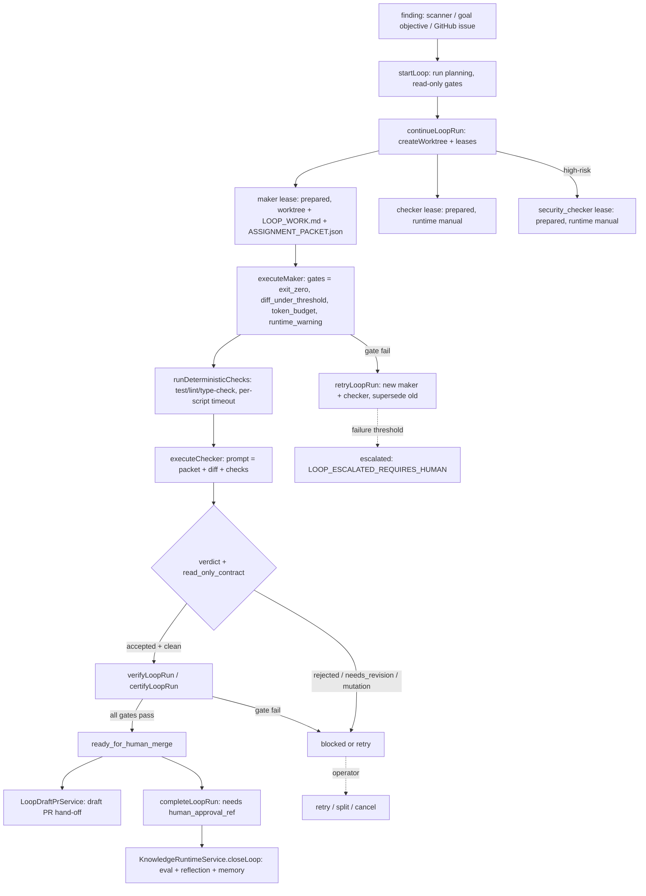

# Maker–Checker Loop Execution (Doc Drift / Self-Improvement / Issue Loops)

Every loop in DjimFlo runs the same closed-loop machinery regardless of what produced
the finding: a scanner, a goal's own objective, or a GitHub issue/PR webhook. A run
moves through `planning → running → verifying → ready_for_human_merge → completed`
(`LoopRunStatus`, packages/server/src/services/loop-types.ts#L15), with `blocked`,
`escalated`, `cancelled`, and `interrupted` as the failure/operator states. Nothing
ever merges or deploys; the loop only *prepares* reviewed work and hands it to a
human. The `no_automatic_merge` gate is hard-wired to pass in every phase and the
completion path throws `LOOP_HUMAN_APPROVAL_REQUIRED` without an operator ref
(loop-service.ts#L731-L754, loop-verification-service.ts#L119-L123).

LoopService is a facade; the real work lives in focused sub-services
(loop-service.ts#L245-L301):

| Sub-service | Owns |
|-------------|------|
| `LoopDiscoveryService` | Finding discovery per loop type |
| `LoopLifecycleService` | `continue` / `retry` / `split` — lease + worktree creation |
| `LoopWorkerExecutorService` | Maker and checker worker execution and gates |
| `LoopVerificationService` | Completion gates and certification |
| `LoopBudgetService` | Token/wall-clock budgets, failure-threshold escalation |
| `WorktreeManager` | Git worktree lifecycle |
| `KnowledgeRuntimeService` | Learning closure (`closeLoop`) |

The operator-facing API surface for all of this is `createLoopRoutes()`
(packages/server/src/routes/loops.ts#L121-L306): `POST /loops/start`,
`/runs/:id/continue|retry|split|verify|execute-maker|execute-worker|execute-checker|checker-verdict|security-verdict|run-checks|complete|stop`.

## The three named loops and their shared machinery

The README advertises three loops. They are not three implementations — they are
three *finding sources* feeding one pipeline (README.md L59-L63):

1. **Doc Drift Loop** — `startDocDriftAndSmallFixLoop()` scans markdown for
   TODO/FIXME markers, `npm run <script>` references missing from every collected
   `package.json`, and broken relative links, plus draft-skill markers
   (loop-discovery-service.ts#L58-L113). `startLoop()` records the run in
   `loop_runs` with read-only discovery gates and a `plan_ready` /
   `no_change_required` outcome (loop-service.ts#L421-L530).
2. **Self-Improvement Loop** — a goal whose own objective becomes the finding.
   `startObjectiveLoop()` synthesizes one bound `self_improvement_objective`
   finding from the goal (and any linked `self_improvements` proposal) instead of
   running a scanner (loop-service.ts#L1294-L1340). `FixLoopService` offers the
   same path targeted at a caller-supplied file (`target_finding`) and then drives
   continue → maker → checks → checker → verify synchronously
   (fix-loop-service.ts#L51-L81). The `LoopDaemon` dispatch below is what decides
   a self-improvement goal gets this *real* cycle rather than the doc-drift no-op.
3. **GitHub Issue Loop** — `createGitHubWebhookRoutes` (packages/server/src/routes/github-webhooks.ts).
   An `issues` event only *imports* a work item into the integration inbox wrapped
   in a `BEGIN_EXTERNAL_CONTENT trust=untrusted` envelope with
   `execution_started: false` — arbitrary issue text is treated as a prompt-injection
   vector and never reaches a maker directly (github-webhooks.ts#L130-L139).
   A `pull_request` event, by contrast, creates a goal and auto-starts a
   `repo-maintenance-loop` run with `target_finding` pointed at a stable anchor file,
   because PR review is the CI-shaped path (github-webhooks.ts#L154-L189).

Those sources converge on seven catalog contracts in `LOOP_CONTRACTS`
(loop-service.ts#L137-L243) — doc-drift, repo-maintenance, skill-quality,
mcp-connector-validation, security-regression, okf-synchronization,
overwatch-policy-drift — each declaring `actions_allowed`, `actions_forbidden`,
`stop_conditions`, `escalation`, and `verification`. The per-run plan stamps each
finding with `requires_human_approval_before_merge: true` and a named maker/checker
role pair (loop-service.ts#L1592-L1614).

## Finding → worktree → maker

One loop run, its roles, and its gates. `stop_conditions` and `escalation` are
declared per contract; the escalation path (failure threshold exceeded) and the
approval-wait path are shown.

### Worktree + lease creation (`continueLoopRun`)

`LoopLifecycleService.continueLoopRun()` is the single lease-creation path
(loop-lifecycle-service.ts#L27-L127). It refuses to continue a run that is
operator-paused, escalated, over token/wall-clock budget, or carrying a failed gate,
then for each selected finding (bounded by `max_assignments` and the maker budget):

- Creates an isolated git worktree under `.djimitflo-loop-worktrees/<runId>/<finding>`
  on branch `agent/loop/<runId>-<finding>` (`WorktreeManager.createWorktree`,
  worktree-manager.ts#L29-L75), snapshotting untracked source files with
  path-traversal guards and symlinking `node_modules`.
- Writes `.djimitflo/LOOP_WORK.md` and `.djimitflo/ASSIGNMENT_PACKET.json`
  (the packet declares `allowed_actions` / `forbidden_actions` /
  `expected_artifacts` / the contract's `stop_conditions` and `escalation`),
  then inserts a **maker** lease with the *requested* runtime and a **checker**
  lease that is *always* `runtime: 'manual'` (loop-lifecycle-service.ts#L91-L96).
  A high-risk run or finding additionally gets a **security_checker** lease, also
  manual (loop-lifecycle-service.ts#L97-L104).

Risk classification (`isHighRiskRun` / `highRiskReason`, loop-service.ts#L1552-L1585)
is itself multi-source: the run's `risk_class`, the linked goal's `risk_class`, a
finding marked `category: 'security'`, or sensitive keywords (auth/secret/token/
policy/infra…) in the finding text — so a doc-drift TODO about a password becomes
high-risk automatically.

## Maker execution and the diff cap

`LoopWorkerExecutorService.executeMaker()` (loop-worker-executor-service.ts#L59-L200)
asserts the operator isn't paused and wall-clock budget remains, resolves the
prepared maker lease, records a `start` worker manifest, marks the lease `running`,
then verifies the runtime contract (`RUNTIME_CONTRACT_DRIFTED` fail-closed if the
probed runtime is unavailable or drifted). After the runtime exits it enforces the
gates that actually bound a maker's blast radius:

- `maker_runtime_exit_zero` — exit 0 and not timed out.
- `diff_under_threshold` — the worktree diff line count against `diff_max_lines`
  (request-tunable, default 200, hard clamp 1–2000, loop-worker-executor-service.ts#L145).
- `token_budget` — per-worker / total / per-diff-line token budgets.
- `runtime_warning_gate` — blocking runtime warnings.
- `no_automatic_merge` — always pass; a structural invariant, not a measurement.

Before diffing, a maker that rewrote only `package-lock.json` without touching
`package.json` has the lockfile restored as install noise and a
`maker_lockfile_restored` event is recorded (loop-worker-executor-service.ts#L136-L142).
`skip_permissions` is gated by `RUNTIME_ALLOW_SKIP_PERMISSIONS` (default-deny —
loop-service.ts#L1779-L1782), and worker children receive only an allowlisted env
(loop-service.ts#L1791-L1821). Real runtimes dispatch through `ExecutionEngine`
(loop-worker-executor-service.ts#L375-L443), which can return
`LOOP_WORKER_APPROVAL_REQUIRED` — a *wait*, not a failure (see Approvals below).

## Checker (and security checker) verdicts

`executeChecker()` (loop-worker-executor-service.ts#L202-L345) dispatches the
reviewer. Key invariants enforced here:

- **Separation** — the checker lease must be `prepared`, must link to a *completed*
  maker, and gets its **own** worktree (branched from the maker's so the diff is
  present) which is compared by `realpath` against every other lease's worktree;
  sharing one throws `CHECKER_WORKTREE_NOT_INDEPENDENT`.
- **Explicit runtime** — a `manual` lease cannot be silently run as mock;
  `CHECKER_RUNTIME_REQUIRED` is thrown without an explicit runtime, and a
  continuation must reuse the originally dispatched runtime
  (`CHECKER_RUNTIME_MISMATCH`).
- **Read-only contract** — after the run, `git status` on the checker worktree must
  be clean; a checker lockfile rewrite is restored, and any other mutation flips
  `checker_read_only_contract` to fail.
- **Verdict extraction** — the runtime's stdout is parsed for
  `accepted | needs_revision | rejected | insufficient_evidence`
  (`extractCheckerVerdict`, loop-service.ts#L2327-L2376); anything unrecognized is
  `insufficient_evidence`, i.e. fail-closed. A TypeSafe "second opinion" judgment
  runs in shadow mode and never affects the gate.

The verdict gates are `<role>_runtime_exit_zero`, `<role>_verdict` (only `accepted`
passes), and `<role>_read_only_contract`. Manual review is a supported, explicit
path with its own integrity rule: `submitCheckerVerdict` / `submitSecurityVerdict`
require a `manual_attestation` of named reviewer + reason when the lease is manual,
and — critically — a manual verdict **cannot** relabel a rejected runtime verdict as
accepted (`hasAcceptedReviewEvidence`, loop-verification-service.ts#L204-L223 requires
`exit_status === 0`, `timed_out === false`, `runtime_verdict === 'accepted'`,
`read_only_contract_passed === true`, a valid runtime contract, and an existing
stdout log on disk). The security-checker prompt (loop-service.ts#L2291-L2295)
explicitly tells it its verdict is **not** human approval or permission to merge.

Reviewer timeouts are the production-calibrated knobs in loop-daemon.ts:L23-L27:
`daemonReviewerTimeoutMs()` honours `LOOP_REVIEWER_TIMEOUT_MS`, defaults to
300 000 ms (accepted reviews took 45–119 s in prod; 2/7 hit the old fixed 120 s)
and clamps to a 900 000 ms ceiling.

## Verification gates, deterministic checks, and stop conditions

`runDeterministicChecks()` (loop-service.ts#L978-L1090) runs `test`, `lint`,
`type-check` (or a caller `scripts` list) via `npm run` in the maker worktree with a
per-script `timeout_ms` (default 120 000, clamp 1 000–600 000), recording
pass/fail/skipped per script into lease metadata. `scripts` absent from
`package.json` are `skipped`, not failed. A failing check flips the maker lease and
feeds the stderr tail into the self-improvement pipeline as real, quotable evidence
(`generateFromBuildErrors`). Daemon runs scope the heavy repo-wide `test` script via
`LOOP_DAEMON_CHECK_SCRIPTS` (comma-separated) and `LOOP_DAEMON_CHECK_TIMEOUT_MS`,
both parsed by `daemonCheckOptions()` (loop-daemon.ts#L15-L21).

`LoopVerificationService.verifyLoopRun()` (loop-verification-service.ts#L37-L166)
then evaluates the completion gates — `run_not_cancelled`, `maker_completion`
(every non-superseded maker), `maker_checker_separation`, `worktree_isolation`,
`assignment_file_present`, `diff_threshold_all_makers`, `checker_verdict`,
`tests_lint_typecheck`, `security_checker_verdict` (skipped unless high-risk), and
`no_automatic_merge` — and computes `blocked` / `verifying` / `ready_for_human_merge`.
Superseded makers (and their reviewers) are excluded so a fully reviewed retry can
certify without the failed original blocking it. `certifyLoopRun()` emits a
`convergence` event; `completeLoopRun()` is the only terminal transition and
requires an explicit `human_approval_ref`.

Stop conditions come from two places: the contract-level `stop_conditions` /
`escalation` strings baked into each assignment packet, and the runtime stop
machinery — `escalateIfFailureThresholdExceeded()` (loop-budget-service.ts#L268-L295)
counts failed makers plus non-accepted checker verdicts against a per-run threshold
and sets status `escalated`, after which `continueLoopRun` fails closed with
`LOOP_ESCALATED_REQUIRES_HUMAN` until an operator retries, splits, or cancels.

## Run completion, draft PR hand-off, and learning closure

When all gates pass, two things happen at the boundary:

- **Draft PR (G4).** `LoopDraftPrService.openForRun()` (loop-draft-pr-service.ts)
  turns a `ready_for_human_merge` / `completed` run into a GitHub *draft* PR. It is
  default-off behind `LOOP_AUTO_DRAFT_PR_ENABLED`, requires
  `GITHUB_REPOSITORY` + `GITHUB_TOKEN`, pushes only the maker's real files (never
  `node_modules` symlinks or lockfile install noise) under a `djimitflo-loop` commit
  identity, opens at most one PR per run (idempotent on `metadata.pr_url`), passes
  the token only as a one-off `http.extraheader` (never persisted to git config),
  and records `draft_pr_failed` rather than throwing on any GitHub error. The merge
  stays human — the draft PR is only the hand-off.
- **Learning closure.** `KnowledgeRuntimeService.closeLoop()` (knowledge-runtime-service.ts#L194-L331)
  runs in a single DB transaction. It first re-validates the run's current evidence
  (terminal reviewed status, not operator-paused, all makers completed, accepted
  checker evidence per maker, accepted security checker evidence when high-risk, no
  unresolved gates, and non-empty trace spans / checkpoints / runner manifests).
  If any check fails it returns `status: 'blocked'` with reasons and creates
  nothing. Otherwise it: runs a `loop-learning` eval (`AgentAssuranceService.runEval`),
  diffs the score against the previous eval for the same run, writes a
  `ReflectionCandidate` and a `MemoryCandidate` (operational memory), creates a
  repair `WorkItem` on regression (`repo-maintenance-loop`) or a skill-promotion
  `WorkItem` on improvement (`skill-quality-loop`), persists one row in
  `loop_learning_closures`, and — via `bindImprovementEvaluation` — moves a linked
  verified `self_improvements` proposal to `evaluating` with the
  `loop:/eval:/reflection:` evidence refs. It explicitly never marks a proposal
  `applied` or merges anything. Replaying a stored closure re-validates first, so a
  cancelled run keeps its historical records but they are not re-certified current.

## The LoopDaemon: continuous autonomous execution

`LoopDaemon` (packages/server/src/services/loop-daemon.ts) wraps all of the above in
an always-on goal queue, polling at `GOAL_QUEUE_POLL_MS` (default 5 s) with bounded
concurrency (`GOAL_MAX_CONCURRENT`, default 4). Each tick loads pending goals
risk-first, applies the fail-closed `authorityGateForGoal`, then `executeGoal()`
runs the full chain: decompose → start loop → continue (lease) → execute maker →
run checks (with one retry on `blocked`) → (optionally) dispatch checker → verify →
learn → update goal/run.

The checker is the deliberate exception. Checker leases are always created manual —
code review requires a human by design — so the daemon **cannot** dispatch one unless
the operator arms `LOOP_DAEMON_AUTOMATED_CHECKER_ENABLED` (default off), an explicit
autonomy expansion. When armed, it reuses whichever maker lease actually ran and its
runtime with `daemonReviewerTimeoutMs()`. This was the root cause of the 2026-09-20/21
"near-empty `loop_learning_closures`" incident: the daemon created a checker lease but
never dispatched it, so `checker_verdict` could never pass and `closeLoop()` was never
reached. The security checker has its own flag,
`LOOP_DAEMON_AUTOMATED_SECURITY_CHECKER_ENABLED` (removes human *security* review).

Approval gating is handled as a wait, not a failure: a worker returning
`LOOP_WORKER_APPROVAL_REQUIRED` parks the goal `blocked` with an
`awaiting_approval` record (`blockForApproval`), and `resumeApprovalBlockedGoals()`
requeues it once the human decision lands and the task reaches a terminal state —
denied or expired approvals fail the goal. A reviewer still `running` defers
verification rather than recording a false "regressed".

## State, evidence, and observability

A loop run's durable state lives in `loop_runs` (status, `findings_json`,
`plan_json`, `gates_json`, `next_actions_json`, `metadata`) with worker leases in
`worker_leases`, an append-only event stream in `loop_events`, and on-disk evidence
under the evidence root (`LOOP_EVIDENCE_ROOT`, default
`.data/agent-evidence/agentic-control-loop-fleet`) — worker stdout/stderr logs,
check output logs, and a markdown `LOOP_STATE.md` state file per run. Worktree
pruning (`pruneOrphanedWorktrees`) removes terminal-lease worktrees past a grace
period (`LOOP_WORKTREE_MAX_AGE_HOURS`, 24 h), and `recoverInterruptedRuns()` marks
runs orphaned by a crash as `interrupted` and their leases `failed` so the fleet
stops reporting them active.

## Related pages

- [Loop Lifecycle](/openwiki/concepts/loop-lifecycle.md) — the contract catalog and run/lease state model this page executes.
- [GitHub Webhooks](/openwiki/integrations/github-webhooks.md) — signature, idempotency, and inbox intake for the issue/PR entry points.
- [Knowledge Runtime](/openwiki/operations/knowledge-runtime.md) — the OKF capability registry that loop discovery reads and loop closures learn into.
<!-- openwiki: broken internal link [/openwiki/workflows/swarm-goal-lifecycle.md] file "/openwiki/workflows/swarm-goal-lifecycle.md" does not exist. Fix the href or restore the target, then delete this comment. -->
- [Swarm Goal Lifecycle](/openwiki/workflows/swarm-goal-lifecycle.md) — the goal/daemon queue and decomposition feeding `executeGoal`.
