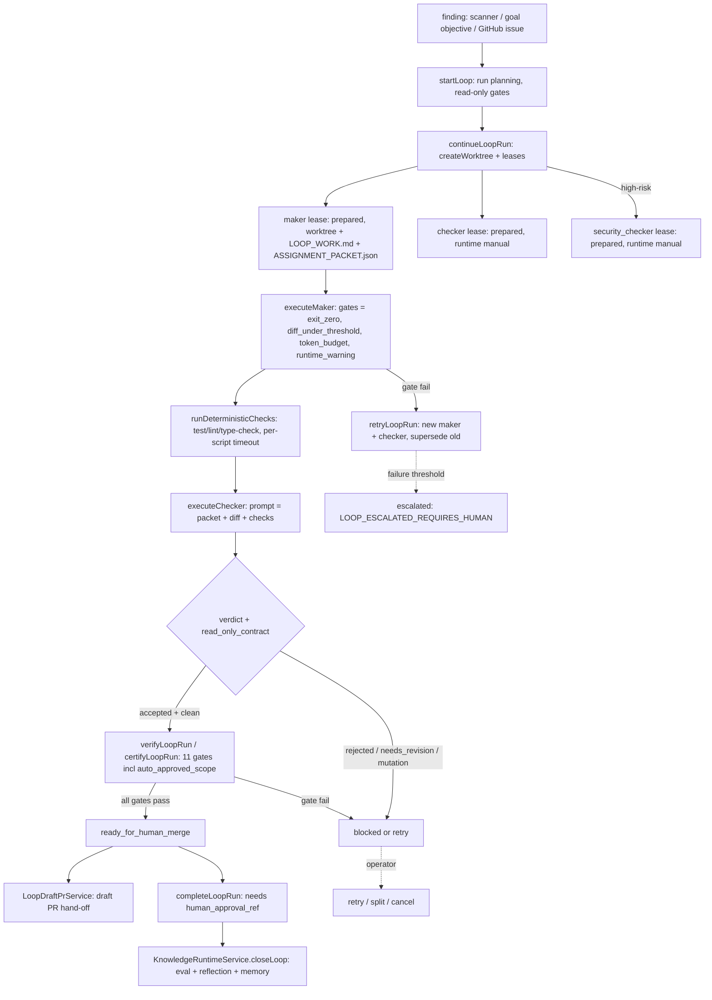

# Maker–Checker Loop Execution (Doc Drift / Self-Improvement / Issue Loops)

Every loop in DjimFlo runs the same closed-loop machinery regardless of what produced
the finding: a scanner, a goal's own objective, or a GitHub issue/PR webhook. A run
moves through `planning → running → verifying → ready_for_human_merge → completed`
(`LoopRunStatus`, packages/server/src/services/loop-types.ts#L15), with `blocked`,
`escalated`, `cancelled`, and `interrupted` as the failure/operator states. Nothing
ever merges or deploys; the loop only *prepares* reviewed work and hands it to a
human. The `no_automatic_merge` gate is hard-wired to pass in every phase and the
completion path throws `LOOP_HUMAN_APPROVAL_REQUIRED` without an operator ref
(loop-service.ts#L746-L776, loop-verification-service.ts#L125-L129).

LoopService is a facade; the real work lives in focused sub-services
(loop-service.ts#L255-L347):

| Sub-service | Owns |
|-------------|------|
| `LoopDiscoveryService` | Finding discovery per loop type |
| `LoopLifecycleService` | `continue` / `retry` / `split` — lease + worktree creation |
| `LoopWorkerExecutorService` | Maker and checker worker execution and gates |
| `LoopVerificationService` | Completion gates and certification |
| `LoopBudgetService` | Token/wall-clock budgets, failure-threshold escalation |
| `WorktreeManager` | Git worktree lifecycle |
| `KnowledgeRuntimeService` | Learning closure (`closeLoop`) |

The operator-facing API surface for all of this is `createLoopRoutes()`
(packages/server/src/routes/loops.ts#L121-L306): `POST /loops/start`,
`/runs/:id/continue|retry|split|verify|execute-maker|execute-worker|execute-checker|checker-verdict|security-verdict|run-checks|complete|stop`.

## The three named loops and their shared machinery

The README advertises three loops. They are not three implementations — they are
three *finding sources* feeding one pipeline (README.md L59-L63):

1. **Doc Drift Loop** — `startDocDriftAndSmallFixLoop()` scans markdown for
   TODO/FIXME markers, `npm run <script>` references missing from every collected
   `package.json`, and broken relative links, plus draft-skill markers
   (loop-discovery-service.ts#L58-L113). `startLoop()` records the run in
   `loop_runs` with read-only discovery gates and a `plan_ready` /
   `no_change_required` outcome (loop-service.ts#L431-L530).
2. **Self-Improvement Loop** — a goal whose own objective becomes the finding.
   `startObjectiveLoop()` synthesizes one bound `self_improvement_objective`
   finding from the goal (and any linked `self_improvements` proposal) instead of
   running a scanner (loop-service.ts#L427-L429, `#L1294-L1340`). `FixLoopService` offers the
   same path targeted at a caller-supplied file (`target_finding`) and then drives
   continue → maker → checks → checker → verify synchronously
   (fix-loop-service.ts#L51-L81). The `LoopDaemon` dispatch below is what decides
   a self-improvement goal gets this *real* cycle rather than the doc-drift no-op.
3. **GitHub Issue Loop** — `createGitHubWebhookRoutes` (packages/server/src/routes/github-webhooks.ts).
   An `issues` event only *imports* a work item into the integration inbox wrapped
   in a `BEGIN_EXTERNAL_CONTENT trust=untrusted` envelope with
   `execution_started: false` — arbitrary issue text is treated as a prompt-injection
   vector and never reaches a maker directly (github-webhooks.ts#L130-L139).
   A `pull_request` event, by contrast, creates a goal and auto-starts a
   `repo-maintenance-loop` run with `target_finding` pointed at a stable anchor file,
   because PR review is the CI-shaped path (github-webhooks.ts#L154-L189).

Those sources converge on seven catalog contracts in `LOOP_CONTRACTS`
(loop-service.ts#L147-L253) — doc-drift, repo-maintenance, skill-quality,
mcp-connector-validation, security-regression, okf-synchronization,
overwatch-policy-drift — each declaring `actions_allowed`, `actions_forbidden`,
`stop_conditions`, `escalation`, and `verification`. The per-run plan stamps each
finding with `requires_human_approval_before_merge: true` and a named maker/checker
role pair (loop-service.ts#L1592-L1614).

## Finding → worktree → maker

One loop run, its roles, and its gates. `stop_conditions` and `escalation` are
declared per contract; the escalation path (failure threshold exceeded) and the
approval-wait path are shown.

### Worktree + lease creation (`continueLoopRun`)

`LoopLifecycleService.continueLoopRun()` is the single lease-creation path
(loop-lifecycle-service.ts#L27-L127). It refuses to continue a run that is
operator-paused, escalated, over token/wall-clock budget, or carrying a failed gate,
then for each selected finding (bounded by `max_assignments` and the maker budget):

- Creates an isolated git worktree under `.djimitflo-loop-worktrees/<runId>/<finding>`
  on branch `agent/loop/<runId>-<finding>` (`WorktreeManager.createWorktree`,
  worktree-manager.ts#L29-L75), snapshotting untracked source files with
  path-traversal guards and symlinking `node_modules`.
- Writes `.djimitflo/LOOP_WORK.md` and `.djimitflo/ASSIGNMENT_PACKET.json`
  (the packet declares `allowed_actions` / `forbidden_actions` /
  `expected_artifacts` / the contract's `stop_conditions` and `escalation`),
  then inserts a **maker** lease with the *requested* runtime and a **checker**
  lease that is *always* `runtime: 'manual'` (loop-lifecycle-service.ts#L91-L96).
  A high-risk run or finding additionally gets a **security_checker** lease, also
  manual (loop-lifecycle-service.ts#L97-L103).

Risk classification (`isHighRiskRun` / `highRiskReason`, loop-service.ts#L1552-L1585)
is itself multi-source: the run's `risk_class`, the linked goal's `risk_class`, a
finding marked `category: 'security'`, or sensitive keywords (auth/secret/token/
policy/infra…) in the finding text — so a doc-drift TODO about a password becomes
high-risk automatically.

## Maker execution and the diff cap

`LoopWorkerExecutorService.executeMaker()` (loop-worker-executor-service.ts#L59-L208)
asserts the operator isn't paused and wall-clock budget remains, resolves the
prepared maker lease (failing closed with `MANUAL_MAKER_REQUIRES_HUMAN` for a
manual-runtime maker), records a `start` worker manifest carrying the probed
`RuntimeContract` plus capacity/budget snapshots, and marks the lease `running`.
Before a single token is spent it **fails closed on the runtime contract**: if the
probed runtime is unavailable or drifted, a `fail` manifest is recorded, the lease
is marked `failed` with `runtime_contract_unavailable_or_drifted`, and
`RUNTIME_CONTRACT_DRIFTED` is thrown (loop-worker-executor-service.ts#L114-L125).
Because a deploy between lease preparation and execution can unlink the worktree,
the maker's worktree is re-registered on its branch when needed and a
`worktree_repaired` warning event is recorded (#L127-L131). After the runtime exits
it captures stdout/stderr under the evidence root and enforces the gates that
actually bound a maker's blast radius:

- `maker_runtime_exit_zero` — exit 0 and not timed out.
- `diff_under_threshold` — the worktree diff line count against `diff_max_lines`
  (request-tunable, default 200, hard clamp 1–2000,
  loop-worker-executor-service.ts#L153).
- `token_budget` — per-worker / total / per-diff-line token budgets.
- `runtime_warning_gate` — blocking runtime warnings.
- `no_automatic_merge` — always pass; a structural invariant, not a measurement.

The diff being measured is computed carefully (#L141-L153): a maker that rewrote
`package-lock.json` without touching `package.json` has the lockfile **restored as
install noise** first and a `maker_lockfile_restored` event is recorded; the
`changed_files` recorded on the lease are the tracked `git diff --name-only` plus
untracked files from `git ls-files --others --exclude-standard`, *excluding*
`package-lock.json` and anything under `.djimitflo/` (so the control files like
`LOOP_WORK.md` never count as maker output). `diff_lines` and `changed_files` land
in lease metadata, where verification later reads them — including for the
`auto_approved_scope` gate below.

`skip_permissions` is gated by `RUNTIME_ALLOW_SKIP_PERMISSIONS` (default-deny —
loop-service.ts#L1810-L1813), and worker children receive only an allowlisted env
(loop-service.ts#L1822-L1840). Real runtimes dispatch through `ExecutionEngine`
(loop-worker-executor-service.ts#L388-L456), writing a durable `tasks` row keyed by
`execution_task_id` on the lease, which can return
`LOOP_WORKER_APPROVAL_REQUIRED` — a *wait*, not a failure (see Approvals below).

## Checker (and security checker) verdicts

`executeChecker()` (loop-worker-executor-service.ts#L210-L353) dispatches the
reviewer. Key invariants enforced here:

- **Separation** — the checker lease must be `prepared`, must link to a *completed*
  maker, and gets its **own** worktree (branched from the maker's so the diff is
  present) which is compared by `realpath` against every other lease's worktree;
  sharing one throws `CHECKER_WORKTREE_NOT_INDEPENDENT`.
- **Explicit runtime** — a `manual` lease cannot be silently run as mock;
  `CHECKER_RUNTIME_REQUIRED` is thrown without an explicit runtime, and a
  continuation must reuse the originally dispatched runtime
  (`CHECKER_RUNTIME_MISMATCH`).
- **Read-only contract** — after the run, `git status` on the checker worktree must
  be clean; a checker lockfile rewrite is restored (`checker_lockfile_restored`),
  and any other mutation flips `<role>_read_only_contract` to fail.
- **Verdict extraction** — the runtime's stdout is parsed for
  `accepted | needs_revision | rejected | insufficient_evidence`
  (`extractCheckerVerdict`); anything unrecognized is `insufficient_evidence`, i.e.
  fail-closed. A TypeSafe "second opinion" judgment runs in shadow mode and never
  affects the gate.

The verdict gates are `<role>_runtime_exit_zero`, `<role>_verdict` (only `accepted`
passes), and `<role>_read_only_contract`. Manual review is a supported, explicit
path with its own integrity rule: `submitCheckerVerdict` /
`submitSecurityVerdict` require a `manual_attestation` of named reviewer + reason
when the lease is manual (`MANUAL_VERDICT_ATTESTATION_REQUIRED`,
loop-service.ts#L907-L909, #L965-L967). For a *runtime*-produced verdict the
accepted evidence bar is strict (`hasAcceptedReviewEvidence`,
loop-verification-service.ts#L215-L234): lease `completed` with metadata verdict
`accepted`, `exit_status === 0`, `timed_out === false`,
`runtime_verdict === 'accepted'`, not cancelled, `read_only_contract_passed === true`,
`runtime_adapter` matching the lease runtime, a valid runtime contract
(`available && status === 'ok'`), and an existing stdout log on disk — so a manual
verdict string **cannot** relabel a rejected runtime review as accepted. The
security-checker prompt (loop-service.ts#L2331-L2332) explicitly tells it its
verdict is **not** human approval or permission to merge.

Submitting a checker/security verdict drives the run forward immediately
(loop-service.ts#L925-L927, #L983-L985): an `accepted` verdict re-runs
`verifyLoopRun()`, while any non-accepted verdict feeds
`escalateIfFailureThresholdExceeded()` with the reason
`checker_verdict:<verdict>` / `security_checker_verdict:<verdict>`.

Reviewer timeouts are the production-calibrated knobs in loop-daemon.ts#L46-L50:
`daemonReviewerTimeoutMs()` honours `LOOP_REVIEWER_TIMEOUT_MS`, defaults to
300 000 ms (accepted reviews took 45–119 s in prod on 2026-09-24; 2/7 hit the old
fixed 120 s) and clamps to a 900 000 ms ceiling.

## Verification gates, deterministic checks, and stop conditions

`runDeterministicChecks()` (loop-service.ts#L993-L1105) runs `test`, `lint`,
`type-check` (or a caller-supplied `scripts` list) via `npm run <script>` in the
maker worktree with a per-script `timeout_ms` (default 120 000, clamped
1 000–600 000). Per script it writes stdout/stderr logs (5 MB capture cap) under
the evidence root at `<evidenceRoot>/<runId>/checks/<leaseId>/<script>.{stdout,stderr}.log`
and records `pass` / `fail` / `skipped` per script into the lease's
`deterministic_checks` metadata. A script absent from `package.json` is `skipped`,
not failed — with empty stdout and a `script not present` stderr marker, so the
evidence trail still exists. A failing check flips the maker lease to `failed`,
moves the run to `blocked` with next action "Inspect deterministic check failure
before checker acceptance", and feeds the stderr tail (last 1 000 chars per failing
script) into the self-improvement pipeline via
`SelfImprovementService.generateFromBuildErrors()` — a deliberately best-effort
side effect wrapped so bookkeeping can never break the checks flow
(loop-service.ts#L1061-L1082).

`LoopVerificationService.verifyLoopRun()` (loop-verification-service.ts#L37-L172)
then evaluates the **eleven** completion gates:

1. `run_not_cancelled` — a cancelled run can never be certified.
2. `maker_completion` — every *non-superseded* maker lease completed.
3. `maker_checker_separation` — at least one active checker per active maker.
4. `worktree_isolation` — every maker lease has an existing worktree on disk.
5. `assignment_file_present` — every maker worktree still contains its
   `.djimitflo/LOOP_WORK.md` (or a readable historical one).
6. `diff_threshold_all_makers` — each completed maker stayed under its recorded
   `diff_max_lines`.
7. `checker_verdict` — every completed maker has an accepted checker verdict.
8. `tests_lint_typecheck` — each completed maker's deterministic checks all
   `pass` or `skipped`.
9. `security_checker_verdict` — `skipped` unless the run is high-risk; then every
   completed maker needs an accepted security verdict.
10. `auto_approved_scope` — a maker auto-approved under the J5 test-gap lane may
    have changed **only** its single approved file
    (loop-verification-service.ts#L119-L124, `#L192-L195`).
11. `no_automatic_merge` — structural constant.

Superseded makers (and their reviewers) are excluded from every gate so a fully
reviewed retry can certify without the failed original blocking it
(loop-verification-completion.test.ts#L100-L106). Gates are persisted to
`gates_json`, failures write `block_reason: 'gate_failed'` plus per-gate reasons
and recommendations into run metadata, and the status computes to `blocked` /
`verifying` / `ready_for_human_merge` (a cancelled or completed run keeps its
terminal status). `certifyLoopRun()` emits a `convergence` bus event;
`completeLoopRun()` (loop-service.ts#L746-L776) is the only terminal transition —
it re-verifies, refuses a cancelled run (`LOOP_COMPLETION_CANCELLED`), refuses any
failing gate (`LOOP_COMPLETION_BLOCKED:<gate>`, with `HIGH_RISK_SECURITY_CHECK_REQUIRED`
for the security gate), and requires an explicit `human_approval_ref`.

Stop conditions come from two places: the contract-level `stop_conditions` /
`escalation` strings baked into each assignment packet, and the runtime stop
machinery — `escalateIfFailureThresholdExceeded()` (loop-budget-service.ts#L268-L295)
counts failed makers plus non-accepted checker verdicts against a per-run threshold
and sets status `escalated`, after which `continueLoopRun` fails closed with
`LOOP_ESCALATED_REQUIRES_HUMAN` until an operator retries, splits, or cancels.

## Run completion, draft PR hand-off, and learning closure

When all gates pass, two things happen at the boundary:

- **Draft PR (G4).** `LoopDraftPrService.openForRun()` (loop-draft-pr-service.ts)
  turns a `ready_for_human_merge` / `completed` run into a GitHub *draft* PR. It is
  default-off behind `LOOP_AUTO_DRAFT_PR_ENABLED`, requires
  `GITHUB_REPOSITORY` + `GITHUB_TOKEN`, pushes only the maker's real files (never
  `node_modules` symlinks or lockfile install noise) under a `djimitflo-loop` commit
  identity, opens at most one PR per run (idempotent on `metadata.pr_url`), passes
  the token only as a one-off `http.extraheader` (never persisted to git config),
  and records `draft_pr_failed` rather than throwing on any GitHub error. The merge
  stays human — the draft PR is only the hand-off.
- **Learning closure.** `KnowledgeRuntimeService.closeLoop()` (knowledge-runtime-service.ts#L194-L331)
  runs in a single DB transaction. It first re-validates the run's current evidence
  (terminal reviewed status, not operator-paused, all makers completed, accepted
  checker evidence per maker, accepted security checker evidence when high-risk, no
  unresolved gates, and non-empty trace spans / checkpoints / runner manifests).
  If any check fails it returns `status: 'blocked'` with reasons and creates
  nothing. Otherwise it: runs a `loop-learning` eval (`AgentAssuranceService.runEval`),
  diffs the score against the previous eval for the same run, writes a
  `ReflectionCandidate` and a `MemoryCandidate` (operational memory), creates a
  repair `WorkItem` on regression (`repo-maintenance-loop`) or a skill-promotion
  `WorkItem` on improvement (`skill-quality-loop`), persists one row in
  `loop_learning_closures`, and — via `bindImprovementEvaluation` — moves a linked
  verified `self_improvements` proposal to `evaluating` with the
  `loop:/eval:/reflection:` evidence refs. It explicitly never marks a proposal
  `applied` or merges anything. Replaying a stored closure re-validates first, so a
  cancelled run keeps its historical records but they are not re-certified current.

## The LoopDaemon: continuous autonomous execution

`LoopDaemon` (packages/server/src/services/loop-daemon.ts) wraps all of the above in
an always-on goal queue, polling at `GOAL_QUEUE_POLL_MS` (default 5 s) with bounded
concurrency (`GOAL_MAX_CONCURRENT`, default 4). Each tick loads pending goals
risk-first, applies the fail-closed `authorityGateForGoal`, then `executeGoal()`
(loop-daemon.ts#L373-L735) runs the full chain: decompose → start loop →
continue (lease) → execute maker → run checks (with one retry on `blocked`) →
(optionally) dispatch checker → verify → learn → update goal/run.

Maker execution is daemon-tuned (`daemonMakerTimeoutMs`, loop-daemon.ts#L26-L34):
the *mutation lane* (a goal whose `mutationCheckEnv` is non-empty) gets the executor
maximum of 600 s — a `npm ci` plus two Stryker runs hit the old fixed 300 s in prod
— other makers honour `LOOP_MAKER_TIMEOUT_MS` (default 300 s, capped 600 s). The same
lane widens the diff cap from the default 200 to **400 lines**, because strengthening
a thin test to kill surviving mutants legitimately adds lines (prod: a 23-line test
grew to a 276-line diff). If the first `runDeterministicChecks` blocks the run, the
daemon performs **one** `retryLoopRun` (G3 feedback law) — new maker, execute,
re-check — and continues with the retry maker as the active one. An optional evolve
lane (`LOOP_EVOLVE_ENABLED` + `LOOP_EVOLVE_SPECIES`, test-gap goals only,
evolve-selection.ts#L15-L29) spawns up to two sibling makers of other runtime
species on the same objective, runs each through execute + checks, and
`selectEvolveWinner` keeps the fittest as the only non-superseded maker that goes on
to the reviewers.

The checker is the deliberate exception. Checker leases are always created manual —
code review requires a human by design — so the daemon **cannot** dispatch one unless
the operator arms `LOOP_DAEMON_AUTOMATED_CHECKER_ENABLED` (default off), an explicit
autonomy expansion. When armed, it dispatches the checker with whichever runtime the
maker attempt actually used and `daemonReviewerTimeoutMs()`; a
`checker_dispatch_failed` warning event is recorded on any other dispatch error —
never swallowed silently. This was the root cause of the 2026-09-20/21 "near-empty
`loop_learning_closures`" incident: the daemon created a checker lease but never
dispatched it, so `checker_verdict` could never pass and `closeLoop()` was never
reached. The security checker has its own flag,
`LOOP_DAEMON_AUTOMATED_SECURITY_CHECKER_ENABLED` (removes human *security* review),
and a reviewer that already completed is never dispatched twice (the `leaseDone`
guard, loop-daemon.ts#L565-L588).

Before verifying, the daemon checks whether any checker/security_checker lease is
still `running` — e.g. an approval-resumed pass — and if so records a
`verify_deferred` event and returns, letting the pass that owns the reviewer verify
when it finishes, rather than certifying now and recording a false `regressed`
(loop-daemon.ts#L591-L599).

Verification through learning is instrumented end to end: every executed run emits a
`loop_completed` bus event (the cognitive layer only learns from those; it used to
see them solely from the human-approval route, so it sat at 0 episodes) with the
all-gates-pass status, and on gate failure `runOutcomeOnFailure()`
(loop-daemon.ts#L36-L44) distinguishes an *evaluated* regression from
`infra_failed` — a maker timeout or `maker_runtime_exit_zero` / runtime-contract
failure is infrastructure, not a regression the guardrail should count. Linked
`self_improvements` proposals get `recordOutcome(verified | regressed |
infra_failed)`, and one `skill_outcomes` row per run (`loop-maker:<loop>:<runtime>`
keyed by run + lease, deduplicated so two daemon passes can't double-count) feeds
the skill-evolution engine and the runtime bandit — with the failing gates attached
as `gate:<name>:<status>` evidence refs (loop-daemon.ts#L601-L644). Only when all
gates pass does the daemon record the goal outcome `completed`, hand off the draft
PR, and call `KnowledgeRuntimeService.closeLoop()` — a blocked closure is recorded
as a `learning_closure_blocked` event (the one signal explaining near-empty
closures) rather than silently discarded.

Approval gating is handled as a wait, not a failure: a worker returning
`LOOP_WORKER_APPROVAL_REQUIRED` parks the goal `blocked` with an
`awaiting_approval` record (`blockForApproval`, loop-daemon.ts#L261-L293 — when a
shadow rule approves, an `auto_approved_scope` is stamped on the lease *first* so
verification can later hold the diff to that one file), and
`resumeApprovalBlockedGoals()` (loop-daemon.ts#L310-L335) requeues it as
`decomposed` with `resume_run_id` once the human decision lands **and** the engine
task reached a terminal state — so the maker isn't run twice, `executeViaEngine`
just returns the stored result. Denied or expired approvals fail the goal with a
`goal_failed` event, a proposal-outcome record, and a closing `loop_completed` bus
event. A resumed run continues the *same* run id and reuses its leases, skipping an
already-completed maker.

## State, evidence, and observability

A loop run's durable state lives in `loop_runs` (status, `findings_json`,
`plan_json`, `gates_json`, `next_actions_json`, `metadata`) with worker leases in
`worker_leases`, an append-only event stream in `loop_events`, and on-disk evidence
under the evidence root — worker stdout/stderr logs, per-check output logs, and a
markdown `LOOP_STATE.md` state file per run.

The evidence root is resolved by `resolveEvidenceRoot()` (loop-service.ts#L135-L139)
— deliberately durable:

1. `LOOP_EVIDENCE_ROOT` (resolved to an absolute path) wins when set — the explicit
   operator override.
2. Otherwise, when `DB_PATH` is absolute, the root is
   `<dirname(DB_PATH)>/agent-evidence/agentic-control-loop-fleet` — i.e. **next to
   the database**, because DB_PATH lives on the persistent volume in prod. Prod
   2026-09-24 wrote evidence into the image's `/app/.data` and lost it on every
   deploy; verification checks the evidence files exist, so they must outlive the
   container.
3. Otherwise (local dev) `<repo>/.data/agent-evidence/agentic-control-loop-fleet`
   (evidence-root.test.ts#L4-L8).

Worktree pruning (`pruneOrphanedWorktrees`) removes terminal-lease worktrees past a
grace period (`LOOP_WORKTREE_MAX_AGE_HOURS`, 24 h) while always keeping
prepared/running ones, and `recoverInterruptedRuns()` marks runs orphaned by a crash
as `interrupted` and their leases `failed` so the fleet stops reporting them active
(leases with a genuinely live child are left alone).

## Related pages

- [Loop Lifecycle](/openwiki/concepts/loop-lifecycle.md) — the contract catalog and run/lease state model this page executes.
- [GitHub Webhooks](/openwiki/integrations/github-webhooks.md) — signature, idempotency, and inbox intake for the issue/PR entry points.
- [Knowledge Runtime](/openwiki/operations/knowledge-runtime.md) — the OKF capability registry that loop discovery reads and loop closures learn into.
- [Autonomous Improvement Pipeline](/openwiki/workflows/autonomous-improvement-pipeline.md) — the goal/daemon queue, objective-mode dispatch, bandit/evolve selection, and approval parking that feed `executeGoal`.
eed `executeGoal`.
