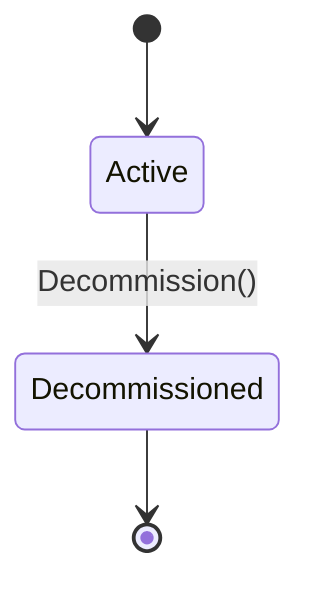

# Aggregate: Fleet

> Root aggregate of the Fleet Management Bounded Context.
> Manages agent membership, heartbeat tracking, and fleet-level invariants.
>
> **TLA+ Mapping:** tla/Recovery.tla (bounded, idempotent loop recovery)
> **Spec Compliance Gate:** L8 — every invariant MUST have code validation + test
> **Constitution**: Article VI.3 — mandatory for Core subdomain aggregates
> **HUMAN WRITTEN** — not AI-generated (Constitution Article VI.6)

---

## Description
The Fleet aggregate is the root entity that manages agent membership and enforces fleet-level business rules. It ensures that agents are uniquely registered, heartbeats are tracked, and fleet state transitions are valid.

## Aggregate Root
`Fleet` (entity)

## Member Entities and Value Objects

| Member | Type | Ownership | Notes |
|--------|------|-----------|-------|
| `Agent` | entity | owned | Cannot exist without parent Fleet |
| `FleetId` | value object | identity | Strongly-typed UUID |
| `FleetStatus` | enum | immutable after creation | Active, Draining, Decommissioned |
| `AgentCount` | value object | computed | Derived from active agents |

## Properties

| Field | Type | Mutability | Invariant |
|-------|------|------------|-----------|
| Id | FleetId | immutable after creation | Required, unique |
| Name | string | immutable after creation | Required, unique per org |
| Status | FleetStatus | mutable through commands | State machine enforced |
| Agents | List<Agent> | mutable via AddAgent/RemoveAgent | Max 1000 per fleet |
| CreatedAt | DateTime | immutable | Set on creation |

## Enforced Invariants (EARS)

| ID | Invariant | TLA+ | Test |
|----|-----------|------|------|
| INV-001 | WHEN RegisterAgent(name) IF name exists in Fleet THEN reject with DuplicateAgentError | Recovery.BoundedRetries | test-duplicate-agent |
| INV-002 | WHEN RegisterAgent(name) IF Agents.count >= 1000 THEN reject with FleetCapacityError | | test-fleet-capacity |
| INV-003 | THE Fleet.agentCount SHALL equal the number of agents with status != Disconnected | | test-agent-count |
| INV-004 | WHEN Fleet transitions to Decommissioned THEN no new agents SHALL be registered | | test-decommission |
| INV-005 | WHEN Heartbeat fails to transmit THEN the server SHALL NOT crash (catch+log) | Recovery.BoundedRetries | test-heartbeat-failure-isolation |

## Commands

| Command | Preconditions | Postconditions | Events Emitted |
|---------|---------------|----------------|----------------|
| `CreateFleet(name)` | name unique | Status=Active, Agents=[] | FleetCreated |
| `RegisterAgent(name)` | Status=Active, name unique, Agents<1000 | agent added | AgentJoined |
| `RemoveAgent(name)` | agent exists in Fleet | agent removed | AgentLeft |
| `RecordHeartbeat(agentId)` | agent exists | lastSeen updated | HeartbeatReceived |
| `Decommission()` | Status=Active | Status=Decommissioned | FleetDecommissioned |

## Domain Events Emitted

| Event | Schema | Consumers |
|-------|--------|-----------|
| `FleetCreated(FleetId, Name, CreatedAt)` | api/events.yaml | Orchestration, Analytics |
| `AgentJoined(FleetId, AgentId, AgentName)` | api/events.yaml | Orchestration, FleetMesh |
| `AgentLeft(FleetId, AgentId, Reason)` | api/events.yaml | Orchestration, FleetMesh |
| `HeartbeatReceived(FleetId, AgentId, Timestamp)` | api/events.yaml | Monitoring, Analytics |
| `FleetDecommissioned(FleetId, DecommissionedAt)` | api/events.yaml | Orchestration, Analytics |

## Corrective Policies (Eventual Consistency)
- IF an agent is removed while holding active Leases THEN those Leases SHALL be released within 5 seconds
- IF the server restarts THEN Fleet state SHALL be reconstructed from SQLite (WAL mode)

## Repository Interface

```typescript
interface IFleetRepository {
  findById(id: FleetId): Promise<Fleet | null>;
  findByName(name: string): Promise<Fleet | null>;
  findByAgent(agentId: AgentId): Promise<Fleet | null>;
  save(fleet: Fleet): Promise<void>;
}
```

## State Machine



## Compliance Verification

- [x] Every INV-### has corresponding if-throw validation in code
- [x] Every INV-### has >=1 test (red first, per Constitution Article I)
- [ ] No direct object reference to aggregates from other BCs (identity only)
- [x] All state transitions go through commands
- [x] Events emitted exactly as specified
- [ ] TLA+ spec updated for new invariants

**Version**: 1.0.0 | **BC**: Fleet Management | **Root**: Fleet
**Refs**: domain-terms.md, bc-fleet-management.md, ../context-map.md
