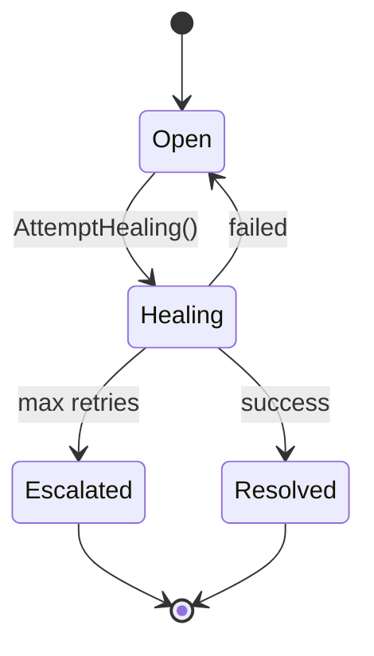

# Aggregate: Incident

> Root aggregate of the Self-Healing BC.
> Manages incident lifecycle from detection through resolution.

## Description
The Incident aggregate orchestrates the self-healing pipeline: detection via health checks, diagnosis, automated healing action, and resolution validation.

## Aggregate Root
`Incident` (entity)

## Member Entities and Value Objects

| Member | Type | Ownership | Notes |
|--------|------|-----------|-------|
| `HealthCheck` | entity | owned | Diagnostic probe |
| `HealingAction` | entity | owned | Remediation step |
| `Anomaly` | value object | computed | Detected deviation |
| `IncidentStatus` | enum | state machine | Open, Healing, Resolved, Escalated |
| `Severity` | value object | assigned | low/medium/high/critical |

## Enforced Invariants (EARS)

| ID | Invariant | Test |
|----|-----------|------|
| INV-001 | THE Incident SHALL have severity in {low, medium, high, critical} | test-severity-values |
| INV-002 | WHEN HealthCheck is critical THEN Incident SHALL be created | test-critical-creates-incident |
| INV-003 | THE HealingAction SHALL reference exactly one Incident | test-healing-action-single-incident |
| INV-004 | IF HealingAction fails THEN Incident SHALL remain open | test-failed-healing-keeps-open |
| INV-005 | WHEN Incident is resolved THEN resolvedAt SHALL be set | test-resolution-timestamp |

## Commands

| Command | Preconditions | Postconditions | Events Emitted |
|---------|---------------|----------------|----------------|
| `DetectAnomaly(metric)` | metric exceeds threshold | Anomaly recorded | AnomalyDetected |
| `CreateIncident(anomaly)` | Anomaly exists | Incident created | IncidentCreated |
| `AttemptHealing(incidentId)` | Incident is open | HealingAction attempted | HealingAttempted |
| `Resolve(incidentId)` | Healing succeeded | Incident.resolved = true | IncidentResolved |
| `Escalate(incidentId)` | Auto-heal failed | Incident.escalated = true | IncidentEscalated |

## State Machine

**Version**: 1.0.0 | **BC**: Self-Healing | **Root**: Incident
