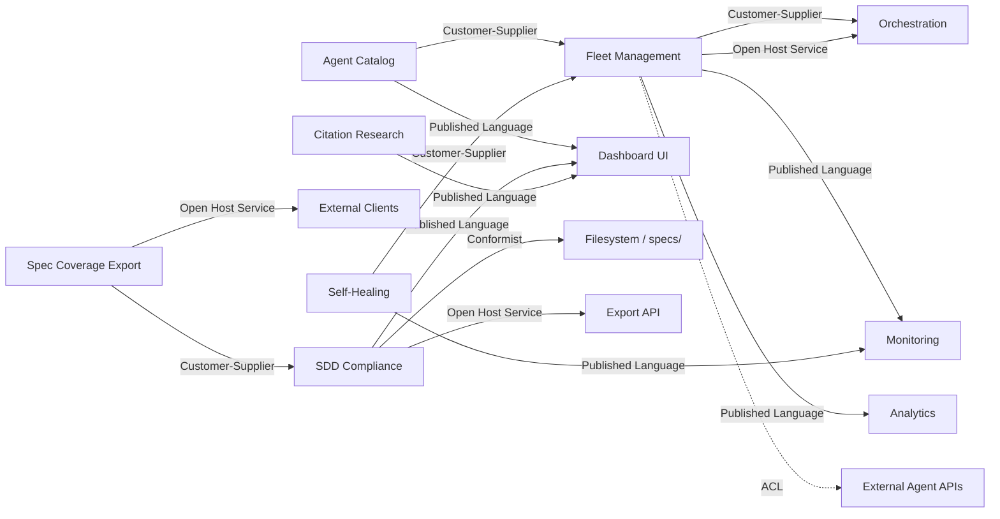

# Context Map

> Documents all Bounded Contexts in the system and the relationship patterns between them.
> One file per system, not per BC.

## Relationships

### Fleet Management -> Orchestration
- **Pattern:** Customer-Supplier + Open Host Service
- **Direction:** Orchestration depends on Fleet Management for agent lifecycle
- **Translation:** none (shared types via Published Language)
- **Justification:** Orchestration is the upstream consumer; Fleet Management owns the agent lifecycle contract
- **Spec file:** specs/bounded-contexts/fleet-management/api/events.yaml

### Fleet Management -> Monitoring
- **Pattern:** Published Language
- **Direction:** Monitoring consumes heartbeat and fleet status events
- **Translation:** none (events are versioned schemas)
- **Justification:** Multiple consumers need stable event contracts
- **Spec file:** specs/bounded-contexts/fleet-management/api/events.yaml

### Fleet Management -> Analytics
- **Pattern:** Published Language
- **Direction:** Analytics consumes fleet-level events for dashboards
- **Translation:** none
- **Justification:** Analytics is read-only consumer

### External Agent APIs -> Fleet Management
- **Pattern:** ACL (mandatory — external)
- **Reason:** External agent APIs may use different naming conventions; ACL translates to our UL
- **Spec file:** specs/bounded-contexts/fleet-management/acl-external.md

### Agent Catalog -> Fleet Management
- **Pattern:** Customer-Supplier
- **Direction:** Agent Catalog queries Fleet Management for agent status
- **Translation:** none
- **Justification:** Catalog is a read-only view of fleet state
- **Spec file:** specs/001-agent-catalog-page/bc-agent-catalog.md

### Agent Catalog -> Dashboard UI
- **Pattern:** Published Language
- **Direction:** Internal component communication
- **Translation:** none
- **Justification:** Same-process communication

### SDD Compliance -> Filesystem
- **Pattern:** Conformist
- **Direction:** SDD Compliance reads spec.md files from specs/ folder
- **Translation:** none (accepts the spec format as-is)
- **Justification:** Specs are written before compliance checking; we accept their structure
- **Spec file:** specs/002-sdd-compliance-dashboard/bc-sdd-compliance.md

### SDD Compliance -> Dashboard UI
- **Pattern:** Published Language
- **Direction:** Compliance data flows to dashboard
- **Translation:** none
- **Justification:** Dashboard is the primary consumer

### SDD Compliance -> Export API
- **Pattern:** Open Host Service
- **Direction:** Export endpoint serves JSON/CSV to external clients
- **Translation:** none
- **Justification:** Audit consumers need stable export format
- **Spec file:** specs/003-spec-coverage-export/bc-spec-coverage-export.md

### Spec Coverage Export -> SDD Compliance
- **Pattern:** Customer-Supplier
- **Direction:** Export uses compliance data from SDD Compliance BC
- **Translation:** none
- **Justification:** Export is a thin serialization layer over compliance data

### Citation Research -> Dashboard UI
- **Pattern:** Published Language
- **Direction:** Citation data flows to dashboard
- **Translation:** none
- **Justification:** Dashboard displays citation research results

### Self-Healing -> Monitoring
- **Pattern:** Published Language
- **Direction:** Self-healing events feed into monitoring
- **Translation:** none
- **Justification:** Monitoring consumes health check results

### Self-Healing -> Fleet Management
- **Pattern:** Customer-Supplier
- **Direction:** Self-healing triggers fleet state changes (e.g., restart agent)
- **Translation:** none
- **Justification:** Self-healing acts on fleet state

## BC Inventory

| BC | Type | Status | Domain Terms |
|----|------|--------|-------------|
| Fleet Management | Core | Active | domain-terms.md (5 terms) |
| Agent Catalog | Supporting | Active | domain-terms.md (4 terms) |
| SDD Compliance | Supporting | Active | domain-terms.md (3 terms) |
| Spec Coverage Export | Generic | Active | domain-terms.md (2 terms) |
| Citation Research | Supporting | Active | (pending) |
| Self-Healing | Supporting | Active | (pending) |
| Orchestration | Core | External | (external BC) |
| Monitoring | Supporting | External | (external BC) |
| Analytics | Generic | External | (external BC) |

## Compliance Verification

- [x] Every BC in the system appears in the diagram
- [x] Every relationship has a justified pattern choice
- [ ] ACL relationship has corresponding acl-{system}.md file (pending)
- [x] Every Open Host Service has versioned events.yaml
- [x] All active BCs have domain-terms.md

**Version**: 2.0.0 | **System**: Djimitflo | **BCs**: 9 (6 internal, 3 external)
**Refs:** bc-*.md per BC, bounded-contexts/*/domain-terms.md
